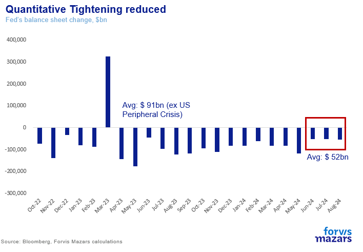
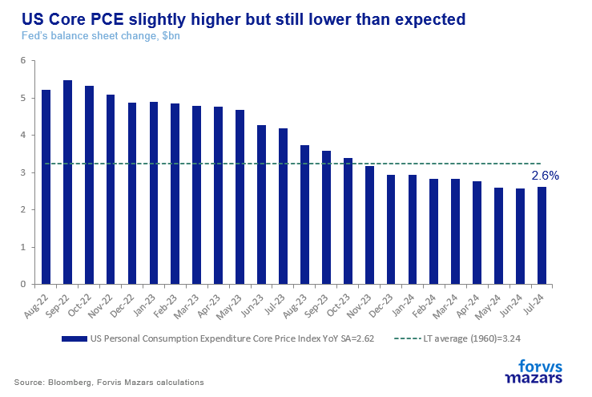
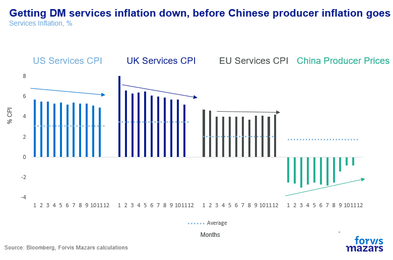
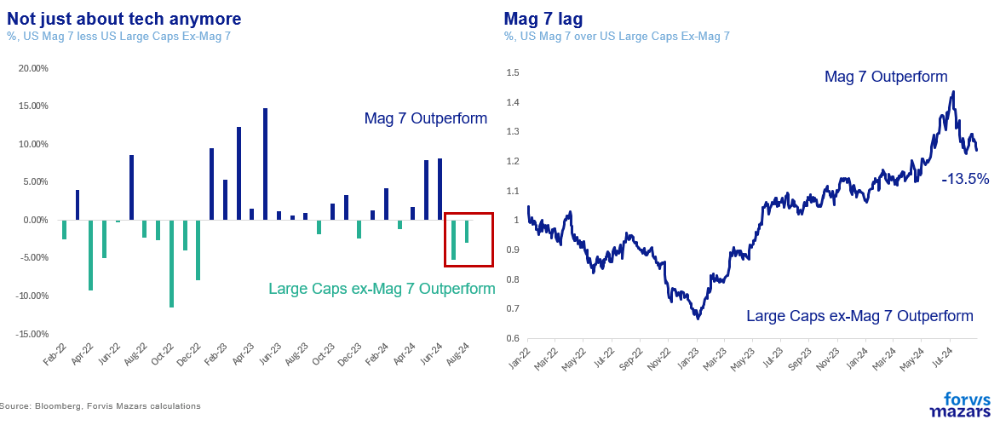
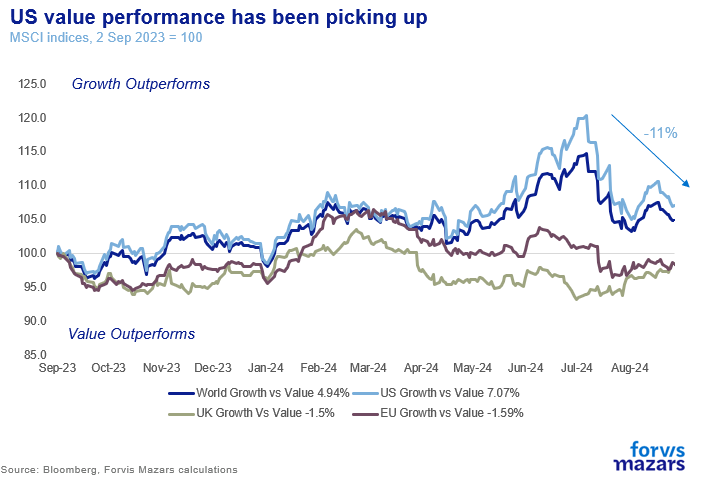
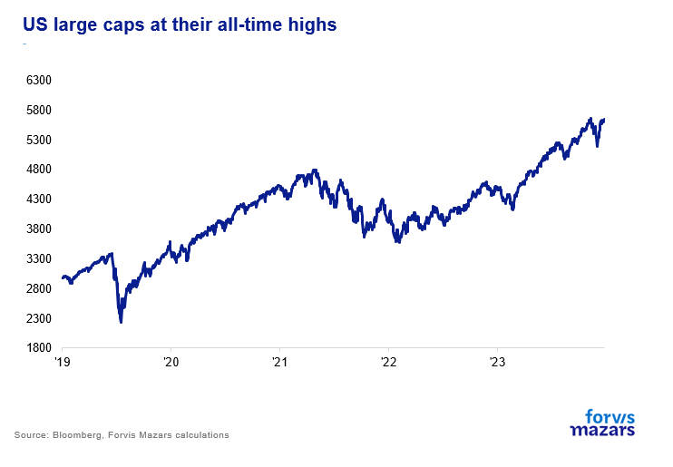
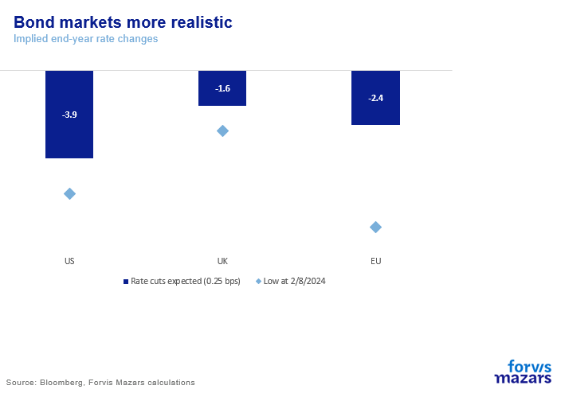
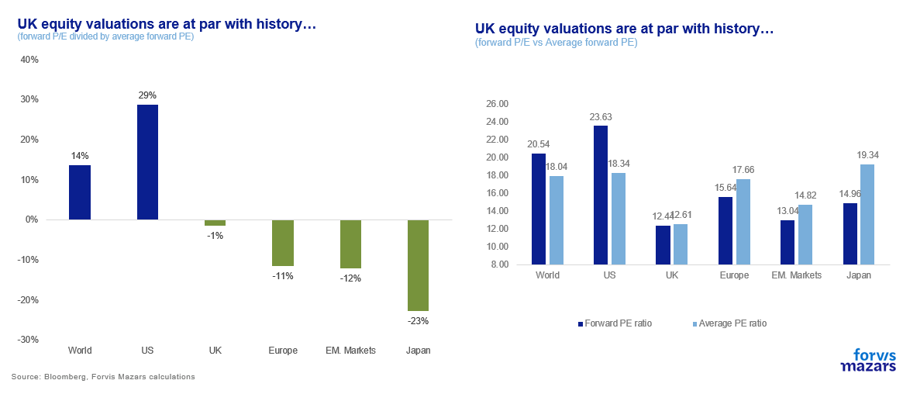
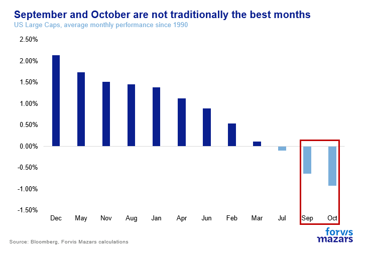

# The winter (?) of our discontent

**Date:** September 03, 2024  
**Publisher:** Breakwave Advisors | **Category:** Market Insights  
**Original URL:** [https://www.breakwaveadvisors.com/insights/2024/9/3/6zfnse2397al24kyxfv2jcrrq2d3bh](https://www.breakwaveadvisors.com/insights/2024/9/3/6zfnse2397al24kyxfv2jcrrq2d3bh)  

---

### The Three Things Investors Should Know This Week

1. **Surface risks are abating. Rates are on their way down, inflation remains cool, the equity market is still at an all-time high with a broad rally and the bond market is pricing in more realistic year-end rates.**
2. **At the same time, underlying risks, mostly linked to high debt and an exacerbating political climate, are rising. US elections, Chinese uncertainty and European nationalism can raise the stakes for investors.**
3. **This is an environment ostensibly friendly for investors to try their risk limits for a short time. But they should always keep in mind that underlying inherent event-driven risks are on the rise.**

*By*[*George Lagarias*](https://www.linkedin.com/in/george-lagarias-mba-3baa769/)

Money management is less about managing returns, which one can’t really control, and more about managing risks. The manager who underestimates risks can be caught off-guard when they spike. The manager who overestimates them can leave a lot of money on the table, to the dismay of their clients.

Risk assessment is, by and large, what we do. There are long and short-term risks, as there are apparent and non-apparent ones. While we are not ready to throw our hat to the ceiling just yet, a clear look at the market suggests that a cohort of surface risks appears to recede. We have often spent time thinking about the high cost of money and the risk of something breaking, inflation staging a rebound, the equity rally being too concentrated and the bond market pricing in too many cuts.

A quick look at the market justifies a modicum, at least, of buoyance, in at least five fronts.

### Why We Can Be More Positive

1**. Rates are finally coming down.**Last week the Federal Reserve confirmed that it’s on a growth rather than an inflation path, which means that it is not willing to sustain interest rates are 5.5%. While our base case has consistently been that the US central bank will not be off to a strong start, we see potential for more in 2025. Apollo Asset Management[calculated](https://www.apolloacademy.com/quantifying-what-fed-cuts-mean-for-gdp-and-inflation/)that bringing rates down to 3% would, all other things being equal, lead to a 2.2% bump in GDP (and 1% in inflation). More importantly for British and European consumers, US rates coming down will allow the EU and UK central banks who struggle with much lower growth to follow with more steep cuts.

The Fed has been preparing the ground for some time by reducing the pace at which it is withdrawing liquidity from the markets.**Quantitative Tightening has been averaging $52bn in the last three months, down from $91bn average since October 2022 (ex Peripheral bank crisis).**

> **Figure 1: Market Chart 1**  
> **Interactive Data & Source:** [Cfr](https://www.cfr.org/expert/zongyuan-zoe-liu) | [Local Asset](file:///C:/Users/Dell/Github/Shipping/corpus/03-breakwave/insights/2024/assets/2024-09-03_6zfnse2397al24kyxfv2jcrrq2d3bh_img_image001_62de751adecf.png)

**The important thing to note is that we are near (but not at) the end of this particular risk corridor: The Fed delivered steep rate hikes and quantitative tightening within target, without allowing anything of significance to break. US Peripheral banks failing was nipped in the bud with a highly targeted strategy.**

2**. Inflation continues to slow.**The key risk to rates coming down would be inflation rebounding. Yet data from last week in the US confirm that price cooling is on safe grounds. Core Personal Consumption Expenditure (PCE) rose slightly but fell short of market expectations which was ultimately good news.

> **Figure 2: Market Chart 2**  
> **Interactive Data & Source:** [Cfr](https://www.cfr.org/expert/zongyuan-zoe-liu) | [Local Asset](file:///C:/Users/Dell/Github/Shipping/corpus/03-breakwave/insights/2024/assets/2024-09-03_6zfnse2397al24kyxfv2jcrrq2d3bh_img_image002_872959a9cb7e.png)

So the Fed is probably right to focus on slowing growth at this particular juncture (more on that during this week with PMI and US unemployment data). The risk of course remains that prices may rebound. But the data is on the right track, with services inflation slowing across the board.

> **Figure 3: Market Chart 3**  
> **Interactive Data & Source:** [Cfr](https://www.cfr.org/expert/zongyuan-zoe-liu) | [Local Asset](file:///C:/Users/Dell/Github/Shipping/corpus/03-breakwave/insights/2024/assets/2024-09-03_6zfnse2397al24kyxfv2jcrrq2d3bh_img_image003_d618fc61de32.png)

I have often complained that headline inflation numbers depend on China continuing to deflate the world and that a spike in Chinese producer prices could cause major headaches to central bankers. But a great article by[Zongyuan Zoe Liu](https://www.cfr.org/expert/zongyuan-zoe-liu)([China’s Real Economic Crisis](assets/2024-09-03_6zfnse2397al24kyxfv2jcrrq2d3bh_content_4caca47a6ee5.html)) in Foreign Affairs Magazine, convinced me that the risk isn’t as great as I previously thought, for now at least. The Chinese economy, according to the brilliant Ms Liu, is a forceful deflation-generating mechanism. As long as its borders are open and trade wars don’t get too hot, developed markets can enjoy some deflation in goods, possibly even for long enough to see their own services inflation come down.

3.. For most of the year, the equity rally was extremely concentrated to the so-called Magnificent 7, and mostly Nvidia. Yet for the last two months, the rally has been mostly about the 493 or so US Large Caps who are not the Magnificent 7.

> **Figure 4: The Equity Rally Has Widened**  
> **Interactive Data & Source:** [Youtube](https://www.youtube.com/watch?v=c1jWMHjg4vw) | [Local Asset](file:///C:/Users/Dell/Github/Shipping/corpus/03-breakwave/insights/2024/assets/2024-09-03_6zfnse2397al24kyxfv2jcrrq2d3bh_img_image004_c1f23cd586b4.png)

That is not to say that Nvidia is crashing. The stock price fell when the company just matched (instead of blowing past) analyst expectations. Still, NVIDIA’s capitalisation is 141% higher than what it was at the beginning of the year and 716% higher than at the end of 2022 when Chat GPT introduced itself to the world.

The crocodile mouth between tech and the rest of the stocks is closing on the upside, which is a huge relief, especially for value investors. Equity markets are in normal operating mode. One sector might be outperforming, but it is now taking a breather allowing others to catch up.

> **Figure 5: Market Chart 5**  
> **Interactive Data & Source:** [Youtube](https://www.youtube.com/watch?v=c1jWMHjg4vw) | [Local Asset](file:///C:/Users/Dell/Github/Shipping/corpus/03-breakwave/insights/2024/assets/2024-09-03_6zfnse2397al24kyxfv2jcrrq2d3bh_img_image005_9a4e7e101dc6.png)

US large caps at their all-time highs, as the result of a wider rally, are cause for optimism.

> **Figure 6: Market Chart 6**  
> **Interactive Data & Source:** [Youtube](https://www.youtube.com/watch?v=c1jWMHjg4vw) | [Local Asset](file:///C:/Users/Dell/Github/Shipping/corpus/03-breakwave/insights/2024/assets/2024-09-03_6zfnse2397al24kyxfv2jcrrq2d3bh_img_image006_071ea81adbbd.png)

4**. The bond market is acting more sensibly.**Another big worry has perennially been that fixed-income traders were pricing in too many rate cuts. However last week, yields moved a bit higher. While we do believe that the slightly less than 3.9 cuts priced in is still a bit excessive, it is nowhere near the 5.5x exactly one month ago and certainly the 7x at the beginning of the year. Our House View for two rate cuts in 2024 still stands, but, given a very probable September start, there is room for a third, if unemployment gets much worse.

> **Figure 7: Market Chart 7**  
> **Interactive Data & Source:** [Youtube](https://www.youtube.com/watch?v=c1jWMHjg4vw) | [Local Asset](file:///C:/Users/Dell/Github/Shipping/corpus/03-breakwave/insights/2024/assets/2024-09-03_6zfnse2397al24kyxfv2jcrrq2d3bh_img_image007_cb0fb6baf763.png)

5**. The UK’s quiet re-approach with Europe.**The UK’s new Prime Minister has, quietly, set about smoothing things out with the country’s 2/3 of trade relations, i.e. the European Union. The timing of his charm campaign to Europe, exactly at the end of the Summer Holidays and close to his election, is immaculate and**sends a very clear message to markets that re-approaching the EU a priority**. Our House View has long been that, while[Brexit can’t really be undone](https://www.youtube.com/watch?v=c1jWMHjg4vw), some of its more controversial aspects can be mitigated. Investors have long been looking for cues of a more realistic approach with the country’s largest trade partner in order to re-evaluate the country’s equities (and even debt). At the very least, the move justifies UK equity valuations at par with their own history. Possibly, a positive rerating could be argued for UK stocks if the course remains positive.

> **Figure 8: Market Chart 8**  
> **Interactive Data & Source:** [Amazon](https://www.amazon.com/Decent-indecent-personal-political-behavior/dp/0841500010) | [Local Asset](file:///C:/Users/Dell/Github/Shipping/corpus/03-breakwave/insights/2024/assets/2024-09-03_6zfnse2397al24kyxfv2jcrrq2d3bh_img_image008_e505508fc50f.png)

Thus some short and medium risks are coming off the table. Does this mean clear skies from now on? History might say not immediately, as September and October are usually the worst months for equities.

> **Figure 9: When Globalisation Comes Under Fire**  
> *When globalisation comes under fire, the clear alternative is the reinforcement of the previous status quo, namely the nation-state. And when high debt increases fiscal constraints and hampers the ability of governments to address chronic social issues, uncertainty ensues. This feeling can cause people, Dr Benjamin Spock attested in his bookDecent And Indecent, to “hug the flag”.*  
> **Interactive Data & Source:** [Amazon](https://www.amazon.com/Decent-indecent-personal-political-behavior/dp/0841500010) | [Local Asset](file:///C:/Users/Dell/Github/Shipping/corpus/03-breakwave/insights/2024/assets/2024-09-03_6zfnse2397al24kyxfv2jcrrq2d3bh_img_image009_7cfe6843cd30.png)

But this is mostly a seasonal issue that doesn’t always play out.

### Risks Are Still There

What we are more worried about is not surface risks, which seem to abate, but the less obvious and definitely non-linear risks. Namely politics and debt, which add to inherent (not immediate or obvious) macroeconomic and market volatility.

Last weekend saw the victory of AfD, a German far-right party in the country’s regional elections, putting pressure on the weak coalition government. Not being ones to acknowledge the eery echoes of the past as anything more than journalistic sensationalism, we simply see Germany late joining a nationalistic trend observable in France, Hungary, Italy, the Netherlands and the UK before it.

While we don’t fear another war, we see the rise of nationalism in Europe does pose an additional and non-negligible threat to the shaky foundation of the currency union, presently sustained mostly by the efforts of the central bank. And whereas the Middle East has not so far caused a new wave of inflation, the longer the wound remains open, the higher the risk that oil-rich Sunni-majority countries, like Saudi Arabia or Qatar might decide to enter the fray. Meanwhile, the US elections are at a razor’s edge. The election of a Democrat or a Republican president might produce very different outcomes. More importantly, we see both the US and China, much like all empires of the past, struggling with the possibility of their own imperial (in modern form) future. The US and China are sleepwalking into a “[Thucydides Trap](https://foreignpolicy.com/2017/06/09/the-thucydides-trap/)”, where one country considers that a great future might only lie on the tatters of their competitor.

**A world indebted and more fragmented is not only more expensive (higher inflation than before), but more inherently (when not manifestly) volatile. This means that while we see less overt risks, as investors we can’t ignore the bigger picture when we make asset allocation decisions. This is an environment ostensibly friendly for investors to try their risk limits for a short time. But they should always keep in mind that underlying inherent event-driven risks are on the rise.**

---

**Tags:** Markets, Economy, Macro  
