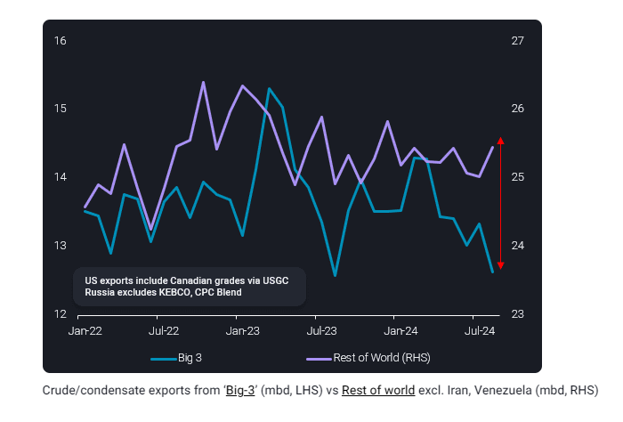
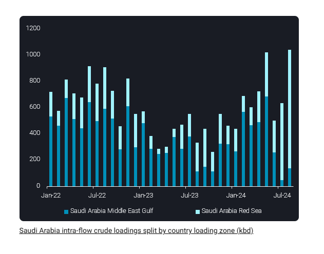
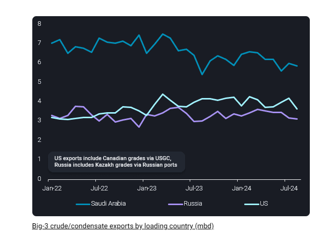

# ‘Big-3’ lose share of global crude exports in August

**Date:** September 04, 2024  
**Publisher:** Breakwave Advisors | **Category:** Market Insights  
**Original URL:** [https://www.breakwaveadvisors.com/insights/2024/9/4/big-3-lose-share-of-global-crude-exports-in-august](https://www.breakwaveadvisors.com/insights/2024/9/4/big-3-lose-share-of-global-crude-exports-in-august)  

---

Saudi Arabia, Russia and the US reduced crude/condensates exports in August (m-o-m), pushing their combined share of global seaborne exports to a multiyear low. In this insight we explore some of the drivers behind each producer’s loss of market share in August and key factors to consider for supply from these countries going forwards.

*By*[Jay Maroo](https://www.linkedin.com/in/jay-m-336a3633/)

Total combined crude/condensates exports from the ‘Big-3’ (Saudi Arabia, Russia and the US) stood at 12.7mbd in August, down almost 700kbd m-o-m. Amongst the big three, US exports fell the most sharply m-o-m, down by around 540kbd, while Saudi and Russian declines were more modest at 110kbd and 40kbd respectively.

But despite each of the ‘Big-3’ countries lowering exports in August, total global crude exports (excluding Iran and Venezuela) fell by only 260kbd m-o-m as other countries boosted exports. This is seen most prominently in August data, but in reality, this trend of diverging ‘Big 3’ vs rest of world’s exports can be traced back to Q1 this year.

> **Figure 1: Cea3cf84ceb9ceb3cebcceb9cf8ccf84cf85**  
> **Interactive Data & Source:** [Vortexa](https://www.vortexa.com//oil-gas-data-traders-analysts-data-scientists?gclid=Cj0KCQjw8_qRBhCXARIsAE2AtRZKOvMnbilZ_6_91d7huSFFy71pWLrnPwGwOHVzXsmsG-1a1mZnQw8aAt89EALw_wcB&hsa_acc=1782073842&hsa_ad=548425387665&hsa_cam=14746637662&hsa_grp=125038601902&hsa_kw=&hsa_mt=&hsa_net=adwords&hsa_src=g&hsa_tgt=dsa-1431852288425&hsa_ver=3&utm_campaign=%5BCD%5D%20-%20DSA%20-%20EMEA&utm_medium=cpc&utm_medium=ppc&utm_source=google&utm_source=adwords&utm_term=) | [Local Asset](file:///C:/Users/Dell/Github/Shipping/corpus/03-breakwave/insights/2024/assets/2024-09-04_big-3-lose-share-of-global-crude-exports-in-august_img_cea3cf84ceb9ceb3cebcceb9cf8ccf84cf85_b4c0dcce24f7.png)

### Us

- US exports (including Canadian grades via USGC) fell to their lowest monthly total since Jan 2023 in August at just 3.7mbd, with exports especially slow at the start of the month
- Tighter US crude supplies, as seen via sharp draws in Cushing inventories, have come partly as a result of struggling US production growth
- Looking ahead, August is likely to be a bottom for exports; flows to Europe are picking up and will be supported further if Libya’s supply woes continue

- WTI represents one of the most reliable, easily and quickly accessible crudes for European refiners seeking to replace (primarily light-sweet) Libyan grades

### Saudi Arabia

- Saudi exports fell somewhat predictably in August given that the month falls within the period of seasonally high domestic oil demand (crude and fuel oil direct burn for power gen)
- Though exports stood at 5.9mbd, total loadings (including intra-Saudi flows) were actually higher m-o-m at 6.9mbd

- Total monthly intra-flows crossed 1mbd for only the second time since Jan 2022 as record volumes of crude were loaded from Saudi’s Red Sea port of Yanbu
- Saudi exports may move higher in the coming weeks, as Saudi domestic power gen needs will wane, potentially freeing up supply for exports
- Another crucial factor to bear in mind is that from October, OPEC+ production cuts could begin to unwind

- Barring concerns over weak Chinese oil demand and macroeconomic performance, Saudi Arabia may add an extra 250kbd of production by the end of the year (versus September levels)

> **Figure 2: Στιγμιότυπο Οθόνης 2024 09 04 142340**  
> **Interactive Data & Source:** [Vortexa](https://www.vortexa.com//oil-gas-data-traders-analysts-data-scientists?gclid=Cj0KCQjw8_qRBhCXARIsAE2AtRZKOvMnbilZ_6_91d7huSFFy71pWLrnPwGwOHVzXsmsG-1a1mZnQw8aAt89EALw_wcB&hsa_acc=1782073842&hsa_ad=548425387665&hsa_cam=14746637662&hsa_grp=125038601902&hsa_kw=&hsa_mt=&hsa_net=adwords&hsa_src=g&hsa_tgt=dsa-1431852288425&hsa_ver=3&utm_campaign=%5BCD%5D%20-%20DSA%20-%20EMEA&utm_medium=cpc&utm_medium=ppc&utm_source=google&utm_source=adwords&utm_term=) | [Local Asset](file:///C:/Users/Dell/Github/Shipping/corpus/03-breakwave/insights/2024/assets/2024-09-04_big-3-lose-share-of-global-crude-exports-in-august_img_cea3cf84ceb9ceb3cebcceb9cf8ccf84cf85_3c64cb8357c9.png)

### Russia

- Russia’s exports (excluding Kazakh grades) marginally dropped to 3.1mbd, the lowest monthly total since November 2023
- Decline exports in August are largely a function of expected lower production and exports from Russia due to seasonal field maintenance

- Maintenance will tail off allowing for higher exports, and this is somewhat reflected a 7% m-o-m increase in scheduled Westbound Transneft Russian flows (Argus Media)
- Going forwards, one factor to be bear in mind is that, unlike Saudi Arabia, Russia does not have many other buyers of its crude if Chinese import demand falters – this could cap Russian exports to some extent
- In recent weeks, Vortexa data has shown tankers loading Urals from Russian Baltic ports and travelling via the Northern Sea route to China to cut voyage times

- Though exports have picked up along this route (180kbd in August), they will naturally subside again as Northern Hemisphere winter ice sets in

> **Figure 3: Στιγμιότυπο Οθόνης 2024 09 04 141722**  
> **Interactive Data & Source:** [Vortexa](https://www.vortexa.com//oil-gas-data-traders-analysts-data-scientists?gclid=Cj0KCQjw8_qRBhCXARIsAE2AtRZKOvMnbilZ_6_91d7huSFFy71pWLrnPwGwOHVzXsmsG-1a1mZnQw8aAt89EALw_wcB&hsa_acc=1782073842&hsa_ad=548425387665&hsa_cam=14746637662&hsa_grp=125038601902&hsa_kw=&hsa_mt=&hsa_net=adwords&hsa_src=g&hsa_tgt=dsa-1431852288425&hsa_ver=3&utm_campaign=%5BCD%5D%20-%20DSA%20-%20EMEA&utm_medium=cpc&utm_medium=ppc&utm_source=google&utm_source=adwords&utm_term=) | [Local Asset](file:///C:/Users/Dell/Github/Shipping/corpus/03-breakwave/insights/2024/assets/2024-09-04_big-3-lose-share-of-global-crude-exports-in-august_img_cea3cf84ceb9ceb3cebcceb9cf8ccf84cf85_648735b755e1.png)

Data Source:[Vortexa](https://www.vortexa.com//oil-gas-data-traders-analysts-data-scientists?gclid=Cj0KCQjw8_qRBhCXARIsAE2AtRZKOvMnbilZ_6_91d7huSFFy71pWLrnPwGwOHVzXsmsG-1a1mZnQw8aAt89EALw_wcB&hsa_acc=1782073842&hsa_ad=548425387665&hsa_cam=14746637662&hsa_grp=125038601902&hsa_kw=&hsa_mt=&hsa_net=adwords&hsa_src=g&hsa_tgt=dsa-1431852288425&hsa_ver=3&utm_campaign=%5BCD%5D%20-%20DSA%20-%20EMEA&utm_medium=cpc&utm_medium=ppc&utm_source=google&utm_source=adwords&utm_term=)

---

**Tags:** Tankers, Markets, Crude  
