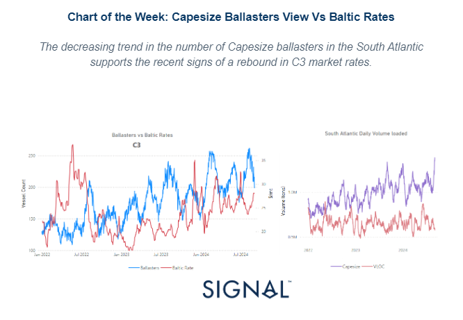
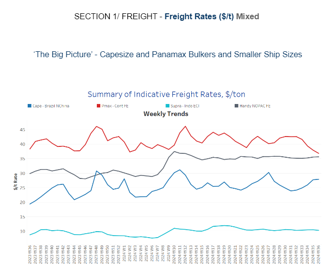
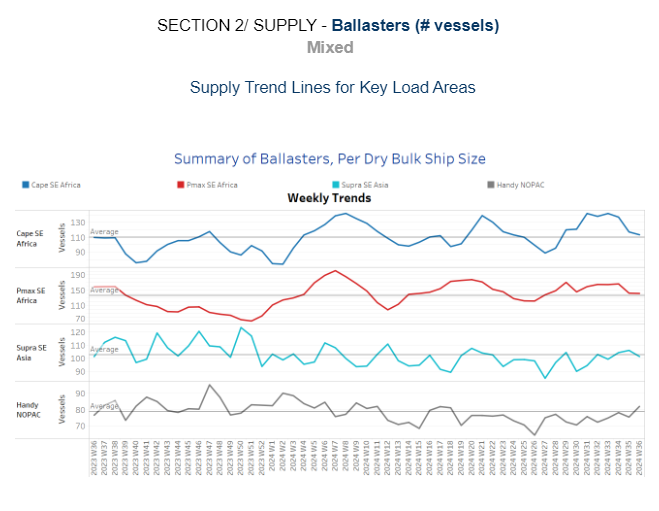
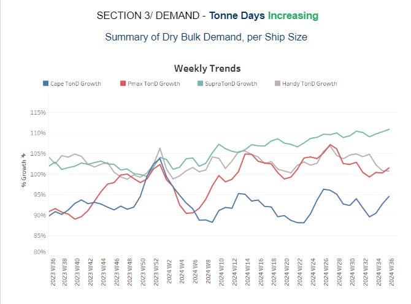
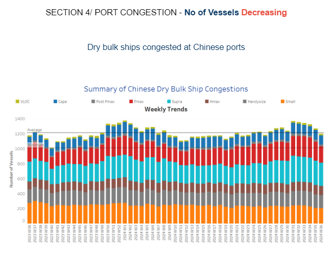

# Capesize Ballasters View Vs Baltic Rates

**Date:** September 05, 2024  
**Publisher:** Breakwave Advisors | **Category:** Market Insights  
**Original URL:** [https://www.breakwaveadvisors.com/insights/2024/9/5/capesize-ballasters-view-vs-baltic-rates](https://www.breakwaveadvisors.com/insights/2024/9/5/capesize-ballasters-view-vs-baltic-rates)  

---

**Dry Weekly Market Monitor - Week 36.2024**
Snapshot of Spot Freight Rates, Supply-Demand Trends, Port Congestions
September 04, 2024

> **Figure 1: Στιγμιότυπο Οθόνης 2024 09 05 105402**  
> **Interactive Data & Source:** [Signal Ocean Platform](https://go.signalocean.com/e/983831/arket-monitor-dry-week-26-2024/2qj7l9/433831241/h/ENxsPBOBXpAPqa8yQeqGe-7co9xr0UMiXN_rUoEmres) | [Local Asset](file:///C:/Users/Dell/Github/Shipping/corpus/03-breakwave/insights/2024/assets/2024-09-05_capesize-ballasters-view-vs-baltic-rates_img_cea3cf84ceb9ceb3cebcceb9cf8ccf84cf85_3784d5db4a43.png)

This week's charts reveal a notable surge in Capesize freight market rates for the Brazil to North China route (left chart), accompanied by a decline in the number of ballasters. This pattern is reminiscent of the trend observed at the[end of June](https://go.signalocean.com/e/983831/arket-monitor-dry-week-26-2024/2qj7l9/433831241/h/ENxsPBOBXpAPqa8yQeqGe-7co9xr0UMiXN_rUoEmres), where a similar relationship between ballasters and Baltic rates was highlighted. At that time, we remained cautious about the sustainability of the upward trend due to potential challenges, including the uncertain economic outlook for China and high port inventories of iron ore which could dampen the appetite for imports. On the South Atlantic route, the daily volume loaded (right chart) has shown a promising increase. This uptick in volume is encouraging, suggesting a potential boost in activity. However, it remains to be seen whether this accelerated pace will be sustained through the first half of September, or if it will face fluctuations due to underlying market conditions.

Meanwhile, in the iron ore market,[China's iron ore futures](https://go.signalocean.com/e/983831/et-volumes-russell-2024-09-03-/2qj7ld/433831241/h/ENxsPBOBXpAPqa8yQeqGe-7co9xr0UMiXN_rUoEmres)experienced their most significant one-day price drop in nearly two years on Monday. Contracts on the Dalian Commodity Exchange closed at 723.5 yuan ($101.83) per metric ton, marking a 4.83% decrease from the previous close—the steepest daily decline since October 31, 2022. This downturn was triggered by a series of economic data that revealed ongoing struggles within the world’s second-largest economy. The private Caixin/S&P Global Purchasing Managers' Index (PMI) showed a modest improvement, rising to 50.4 in August from 49.8 in July. This figure exceeded analysts' expectations, which had forecasted a reading of 50.0, and signalled a shift from contraction to expansion. Despite this positive shift in the PMI, the broader economic picture remains mixed. In the steel sector, further concerns arose as the average price for new homes across 100 cities increased by a mere 0.11% in August compared to July, down from the 0.13% gain recorded in the previous month. This slowdown reflects the ongoing challenges within the property sector, which has yet to show a significant response to recent stimulus measures from Beijing. The lack of robust recovery in the property market continues to weigh heavily on the overall economic momentum, impacting key industries like steel production and iron ore demand.

> **Figure 2: Στιγμιότυπο Οθόνης 2024 09 05 110750**  
> **Interactive Data & Source:** [Signal Ocean Platform](https://www.thesignalgroup.com/signal-ocean-platform) | [Local Asset](file:///C:/Users/Dell/Github/Shipping/corpus/03-breakwave/insights/2024/assets/2024-09-05_capesize-ballasters-view-vs-baltic-rates_img_cea3cf84ceb9ceb3cebcceb9cf8ccf84cf85_1ba46629bb68.png)

The dry bulk freight market has presented a mixed performance, with rates on the Cape Brazil to North China routes gradually improving since the end of week 30, while the Panamax Continent to Far East route continues to experience a persistent downward trend.

- **Capesize**vessel freight rates for shipments from Brazil to North China rose to $27 per ton, reflecting a significant 19% increase month-over-month.
- **Panamax**vessel freight rates from the Continent to the Far East have remained below $40 per ton since early August, recently approaching $37 per ton—a decline of 13% compared to the previous month.
- **Supramax**vessel freight rates on the Indo-ECI route have remained steady since mid-June, consistently hovering around $11 per ton. This week’s rates are 20% higher than those recorded during the same period last year.
- **Handysize**freight rates for the NOPAC Far East route held steady at approximately $36 per ton. This marks a notable 20% increase compared to rates observed one year ago.

> **Figure 3: Στιγμιότυπο Οθόνης 2024 09 05 110906**  
> **Interactive Data & Source:** [Signal Ocean Platform](https://www.thesignalgroup.com/signal-ocean-platform) | [Local Asset](file:///C:/Users/Dell/Github/Shipping/corpus/03-breakwave/insights/2024/assets/2024-09-05_capesize-ballasters-view-vs-baltic-rates_img_cea3cf84ceb9ceb3cebcceb9cf8ccf84cf85_e836df5dc94f.png)

In the first week of September, the number of ballasters in the large dry vessel size categories has shown a declining trend, while the Handysize NOPAC market is seeing signs of an increase.

- **Capesize SE Africa**: The number of ballast ships has decreased to 113, marking a drop of 29 vessels from the peak observed at the end of week 33.
- **Panamax SE Africa**: The current number hovers close to the annual average of 140, now down by over 20 vessels compared to levels observed just two weeks ago.
- **Supramax SE Asia**: The count of ballast ships has recently fallen below the annual average of 100, signalling a downward trend as September begins.
- **Handysize NOPAC**: Since the end of week 19, the number of ballast vessels has consistently stayed below the annual average. However, in the first week of September, there are signs of an increase, with figures approaching the annual average.

> **Figure 4: Στιγμιότυπο Οθόνης 2024 09 05 111021**  
> **Interactive Data & Source:** [Signal Ocean Platform](https://www.thesignalgroup.com/signal-ocean-platform) | [Local Asset](file:///C:/Users/Dell/Github/Shipping/corpus/03-breakwave/insights/2024/assets/2024-09-05_capesize-ballasters-view-vs-baltic-rates_img_cea3cf84ceb9ceb3cebcceb9cf8ccf84cf85_8bb7563910e2.png)

In the first week of September, the outlook for dry tonne days showed an upward trend across most segments, except for the Handysize segment, which has continued to experience a persistent decline over the past four weeks.

- **Capesize**: Recent estimates indicate a steady recovery in tonne-day growth, improving consistently since the low point observed at the end of week 32.
- **Panamax**: Weekly percentage growth is on an upward trend in early September, with the Panamax and Capesize segments showing particularly strong recovery from the lows recorded during the summer season.
- **Supramax**: The growth rate maintained its upward trajectory since the end of week 27, with continuous improvement seen from the first half of August.
- **Handysize**: The upward trend in the Handysize vessel segment reversed after the end of week 27, continuing to show a downward shift into the first week of September.

> **Figure 5: Στιγμιότυπο Οθόνης 2024 09 05 111129**  
> **Interactive Data & Source:** [Signal Ocean Platform](https://www.thesignalgroup.com/signal-ocean-platform) | [Local Asset](file:///C:/Users/Dell/Github/Shipping/corpus/03-breakwave/insights/2024/assets/2024-09-05_capesize-ballasters-view-vs-baltic-rates_img_cea3cf84ceb9ceb3cebcceb9cf8ccf84cf85_6f2826c6966f.png)

In the first week of September, Chinese dry bulk port congestion showed a decline from the heightened levels seen in August.

- **Capesize**: Capesize ship congestion dropped nearly 120 vessels, marking a decrease of nearly 20 from the peak at the end of week 30.
- **Panamax**: The number of Panamax vessels dropped to 224, a decrease of 45 compared to the end of week 32.
- **Supramax**: Congestion levels dropped by approximately 310, a reduction of nearly 15 vessels compared to week 34.
- **Handysize**: Congestion levels fell below 180 in the first week of September, marking a decrease of 24 vessels compared to levels observed three weeks earlier.

Data Source:[Signal Ocean Platform](https://www.thesignalgroup.com/signal-ocean-platform)

---

**Tags:** Drybulk, Capesize, Shipping  
