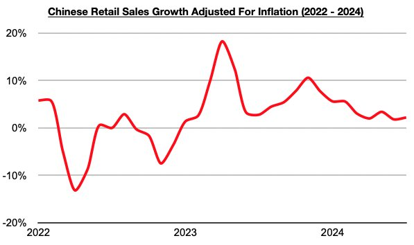
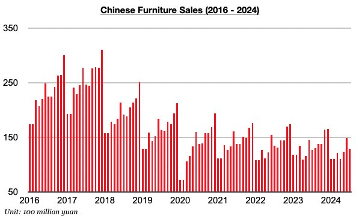
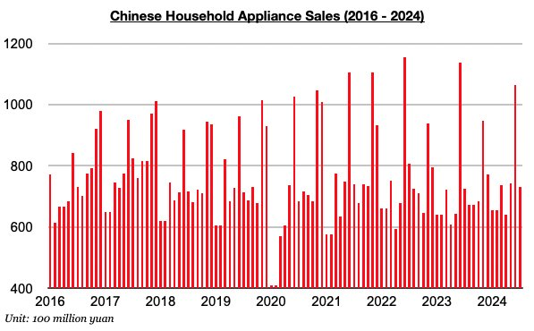

# Rebound in China's Consumer Spending Growth

**Date:** September 05, 2024  
**Publisher:** Breakwave Advisors | **Category:** Market Insights  
**Original URL:** [https://www.breakwaveadvisors.com/insights/2024/9/5/rebound-in-chinas-consumer-spending-growth](https://www.breakwaveadvisors.com/insights/2024/9/5/rebound-in-chinas-consumer-spending-growth)  

---

*By*[*Jeffrey Landsberg*](https://www.linkedin.com/in/jeffrey-landsberg-70ab957/)

As we discussed in Commodore Research's most recent Weekly China Report, China’s retail sales in July grew year-on-year by 2.7%. This marks a rebound from the 2% growth seen in June (that 2% growth was the lowest seen all year). Taking July’s 0.5% inflation into account, retail sales adjusted for inflation grew year-on-year by 2.2%.

> **Figure 1: Chart 1**  
> [Local Asset](file:///C:/Users/Dell/Github/Shipping/corpus/03-breakwave/insights/2024/assets/2024-09-05_rebound-in-chinas-consumer-spending-growth_img_chart1_32250fe7501c.jpg)

Retail sales growth has stayed low, but the growth at least continues to exceed inflation. During each of the last nineteen months, retail sales growth has come in higher than inflation. Prior to the last nineteen months, retail sales came in lower than inflation for four straight months. Of particular note regarding China’s inflation is July’s 0.5% inflation has marked the highest inflation seen since February.

Also of note on the consumer side is that furniture and household appliance sales (which includes consumer electronics) each experienced year-on-year growth. Furniture sales in China in July rose year-on-year by 2%. Furniture sales have now grown on a year-on-year basis for four straight months.

> **Figure 2: Chart 2**  
> [Local Asset](file:///C:/Users/Dell/Github/Shipping/corpus/03-breakwave/insights/2024/assets/2024-09-05_rebound-in-chinas-consumer-spending-growth_img_chart2_65c8fa3e25d4.jpg)

Household appliance sales (which includes consumer electronics) in China rose on a year-on-year basis by 1%. Sales have now increased on a year-on-year basis during six of the last seven months.

> **Figure 3: Chart 3**  
> [Local Asset](file:///C:/Users/Dell/Github/Shipping/corpus/03-breakwave/insights/2024/assets/2024-09-05_rebound-in-chinas-consumer-spending-growth_img_chart3_fdc4d822d16f.jpg)

---

**Tags:** Markets, China, Economy  
