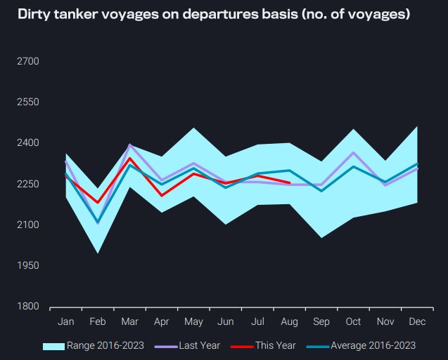
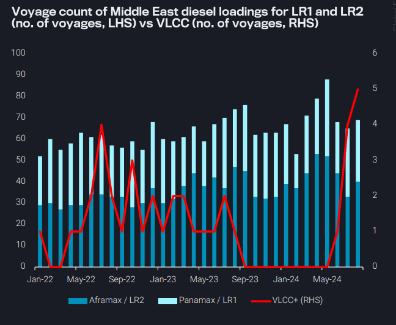
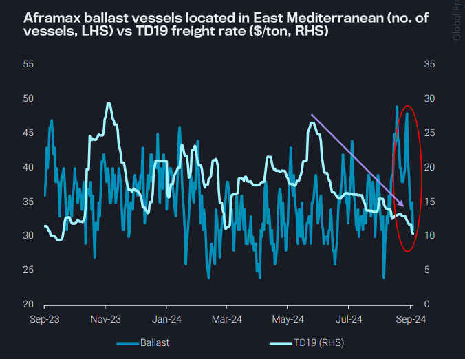
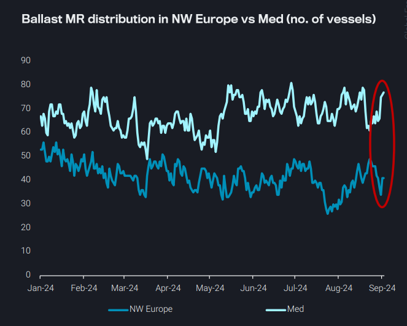

# VLCCs loading diesel from the Middle East cap demand for LRs

**Date:** September 05, 2024  
**Publisher:** Breakwave Advisors | **Category:** Market Insights  
**Original URL:** [https://www.breakwaveadvisors.com/insights/2024/9/5/vlccs-loading-diesel-from-the-middle-east-cap-demand-for-lrs](https://www.breakwaveadvisors.com/insights/2024/9/5/vlccs-loading-diesel-from-the-middle-east-cap-demand-for-lrs)  

---

- **Dirty – East of Suez:**Dirty tanker voyages below seasonal avg during summer lull; low VLCC utilisation and reduced Russian exports are drivers
- **Clean – East of Suez:**Record no. of VLCCs loading diesel from the Middle East cap demand for LRs
- **Dirty – West of Suez:**Aframax supply in East Med drops sharply as Libya outage continues; TD19 hits 12-month low
- **Clean – West of Suez:**NW Europe MR freight rate rally short-lived; cooling Med market will likely trigger repositioning

*By*[*Mary Melton*](https://www.linkedin.com/search/results/all/?fetchDeterministicClustersOnly=true&heroEntityKey=urn%3Ali%3Afsd_profile%3AACoAABXVyecBtg-pRnIrZe0BoWk0ygPiUfbvhsw&keywords=mary%20melton&origin=RICH_QUERY_SUGGESTION&position=0&searchId=40e8d7d2-c4d0-4022-81e7-176f6eba418b&sid=H_Y&spellCorrectionEnabled=false)

**Dirty – East of Suez: Voyages below seasonal avg during summer lull; low VLCC utilisation and reduced Russian exports are drivers**

Declines in dirty tanker voyage counts over the last two months can be attributed to more than just the seasonal summer lull

The main driver of declining voyage counts are fewer VLCC departures to Asia from both the Middle East and the Americas (US Gulf and South America East Coast)

- Reduced VLCC departures to Asia are predominantly due to weak demand from China
- In August, exports from Saudi Arabia and the US declined m-o-m, with US exports reaching their lowest volume since Jan-23 (read more here)

Average voyage mileage for dirty tankers has declined about 5.5% y-o-y, mostly because of reduced VLCC voyages to Asia

- Additionally, Russian crude exports (excl. Kazakh grades) were observed at their lowest levels in nine months, leading to reductions in Aframax voyages from Russia.

Though tonne-miles are slightly lower y-o-y, they are still exceptionally high compared to historical averages due to the Russian reshuffling effect

> **Figure 1: Στιγμιότυπο Οθόνης 2024 09 05 131537**  
> **Interactive Data & Source:** [Vortexa](https://www.vortexa.com//oil-gas-data-traders-analysts-data-scientists?gclid=Cj0KCQjw8_qRBhCXARIsAE2AtRZKOvMnbilZ_6_91d7huSFFy71pWLrnPwGwOHVzXsmsG-1a1mZnQw8aAt89EALw_wcB&hsa_acc=1782073842&hsa_ad=548425387665&hsa_cam=14746637662&hsa_grp=125038601902&hsa_kw=&hsa_mt=&hsa_net=adwords&hsa_src=g&hsa_tgt=dsa-1431852288425&hsa_ver=3&utm_campaign=%5BCD%5D%20-%20DSA%20-%20EMEA&utm_medium=cpc&utm_medium=ppc&utm_source=google&utm_source=adwords&utm_term=) | [Local Asset](file:///C:/Users/Dell/Github/Shipping/corpus/03-breakwave/insights/2024/assets/2024-09-05_vlccs-loading-diesel-from-the-middle-east-cap-demand-for-lrs_img_cea3cf84ceb9ceb3cebcceb9cf8ccf84cf85_927499d57e21.png)

**Clean – East of Suez: Record no. of VLCCs loading diesel from the Middle East cap demand for LRs**

Middle East VLCC loadings carrying middle distillates reached a record high in August with 5 loadings in total

- Overall, there were 6 VLCCs and 2 Suezmax tankers cleaning up for the month of August, down from the 15 vessels (4 VLCCs and 11 Suezmaxes) cleaned up in July

LR voyages remain at similar levels to the previous summer months because of this trend

- As a result, LR freight rates continue to hover around 2024-lows for East-to-West flows reaching around 45-50 $/t
- This provides a spread of around 20 $/t for Suezmax/LRs and 30$/t for VLCC/LRs

As a portion of tankers return to the dirty trade (especially for Suezmaxes) this could pave the way for more clean-ups

- 3 VLCC loadings are already expected in September
- Whether this trend will remain ultimately hinges on whether crude tanker rates can pick up after the summer lull

> **Figure 2: Στιγμιότυπο Οθόνης 2024 09 05 132317**  
> **Interactive Data & Source:** [Vortexa](https://www.vortexa.com//oil-gas-data-traders-analysts-data-scientists?gclid=Cj0KCQjw8_qRBhCXARIsAE2AtRZKOvMnbilZ_6_91d7huSFFy71pWLrnPwGwOHVzXsmsG-1a1mZnQw8aAt89EALw_wcB&hsa_acc=1782073842&hsa_ad=548425387665&hsa_cam=14746637662&hsa_grp=125038601902&hsa_kw=&hsa_mt=&hsa_net=adwords&hsa_src=g&hsa_tgt=dsa-1431852288425&hsa_ver=3&utm_campaign=%5BCD%5D%20-%20DSA%20-%20EMEA&utm_medium=cpc&utm_medium=ppc&utm_source=google&utm_source=adwords&utm_term=) | [Local Asset](file:///C:/Users/Dell/Github/Shipping/corpus/03-breakwave/insights/2024/assets/2024-09-05_vlccs-loading-diesel-from-the-middle-east-cap-demand-for-lrs_img_cea3cf84ceb9ceb3cebcceb9cf8ccf84cf85_c1e576d3eafe.png)

**Dirty – West of Suez: Aframax supply in East Med drops sharply as Libya outage continues; TD19 hits 12-month low**

Ballast Aframaxes flee the East Med as crude loadings decline nearly 300kbd w-o-w for the w/c 26th August 2024 due to an ongoing outage in Libya

- The sharp decline in loadings has resulted in 31 ballast Aframaxes in the East Med as of 3rd Sept; a 35% decline w-o-w
- Due to the outage, TD19, (cross-med) has declined to a 12- month low, observed at $10.46/ton as of 3rd September
- The decline is driven by the fall in in freight demand in the area, resulting in TD19 now 60% below the 2024 average

Due to decreasing optionality in Europe/Med, vessels discharging in NW Europe are increasingly ballasting towards PADD 3, where the number of ballast Aframaxes as of 3rd September has increased by 100% compared to two weeks earlier

- This increase could pressure already lacklustre TD25 rates

If the Libya dispute is resolved and crude loadings continue as normal, we could observe a rebound in TD19 rates, which could induce a rebound in ballasters to satisfy the upcoming requirements

> **Figure 3: Στιγμιότυπο Οθόνης 2024 09 05 132416**  
> **Interactive Data & Source:** [Vortexa](https://www.vortexa.com//oil-gas-data-traders-analysts-data-scientists?gclid=Cj0KCQjw8_qRBhCXARIsAE2AtRZKOvMnbilZ_6_91d7huSFFy71pWLrnPwGwOHVzXsmsG-1a1mZnQw8aAt89EALw_wcB&hsa_acc=1782073842&hsa_ad=548425387665&hsa_cam=14746637662&hsa_grp=125038601902&hsa_kw=&hsa_mt=&hsa_net=adwords&hsa_src=g&hsa_tgt=dsa-1431852288425&hsa_ver=3&utm_campaign=%5BCD%5D%20-%20DSA%20-%20EMEA&utm_medium=cpc&utm_medium=ppc&utm_source=google&utm_source=adwords&utm_term=) | [Local Asset](file:///C:/Users/Dell/Github/Shipping/corpus/03-breakwave/insights/2024/assets/2024-09-05_vlccs-loading-diesel-from-the-middle-east-cap-demand-for-lrs_img_cea3cf84ceb9ceb3cebcceb9cf8ccf84cf85_bb3896cfa220.png)

**Clean – West of Suez: NW Europe MR freight rate rally short-lived; cooling Med market will likely trigger repositioning**

NW Europe MR freight rates rallied last week from a combination of enquiries for early September cargoes and declining availability in the region

- This increase proved short-lived, as rates at the beginning of this week already showed a decline, likely from lack of demand
- At the same time, prompt availability is increasing rapidly

Decreased vessel availability in NWE during last week’s rally was likely due to a strong export market in the Med over the last few weeks

- Ballast MR fleet distribution shows this supply shift, as tonnage in the Med increased while declining in NW Europe
- However, as the Med export market cools off, some vessels will likely reposition to NW Europe
- The current rapidly increasing prompt availabilily in NW Europe attests that this shift is already underway

Expected cooling of PADD 1 gasoline demand post-Labor Day and weak refining margins in Europe in general will likely limit NWE tanker demand moving forward

> **Figure 4: Στιγμιότυπο Οθόνης 2024 09 05 132429**  
> **Interactive Data & Source:** [Vortexa](https://www.vortexa.com//oil-gas-data-traders-analysts-data-scientists?gclid=Cj0KCQjw8_qRBhCXARIsAE2AtRZKOvMnbilZ_6_91d7huSFFy71pWLrnPwGwOHVzXsmsG-1a1mZnQw8aAt89EALw_wcB&hsa_acc=1782073842&hsa_ad=548425387665&hsa_cam=14746637662&hsa_grp=125038601902&hsa_kw=&hsa_mt=&hsa_net=adwords&hsa_src=g&hsa_tgt=dsa-1431852288425&hsa_ver=3&utm_campaign=%5BCD%5D%20-%20DSA%20-%20EMEA&utm_medium=cpc&utm_medium=ppc&utm_source=google&utm_source=adwords&utm_term=) | [Local Asset](file:///C:/Users/Dell/Github/Shipping/corpus/03-breakwave/insights/2024/assets/2024-09-05_vlccs-loading-diesel-from-the-middle-east-cap-demand-for-lrs_img_cea3cf84ceb9ceb3cebcceb9cf8ccf84cf85_68810c51b9c1.png)

Data Source:[Vortexa](https://www.vortexa.com//oil-gas-data-traders-analysts-data-scientists?gclid=Cj0KCQjw8_qRBhCXARIsAE2AtRZKOvMnbilZ_6_91d7huSFFy71pWLrnPwGwOHVzXsmsG-1a1mZnQw8aAt89EALw_wcB&hsa_acc=1782073842&hsa_ad=548425387665&hsa_cam=14746637662&hsa_grp=125038601902&hsa_kw=&hsa_mt=&hsa_net=adwords&hsa_src=g&hsa_tgt=dsa-1431852288425&hsa_ver=3&utm_campaign=%5BCD%5D%20-%20DSA%20-%20EMEA&utm_medium=cpc&utm_medium=ppc&utm_source=google&utm_source=adwords&utm_term=)

---

**Tags:** Crude, Tankers, Shipping  
