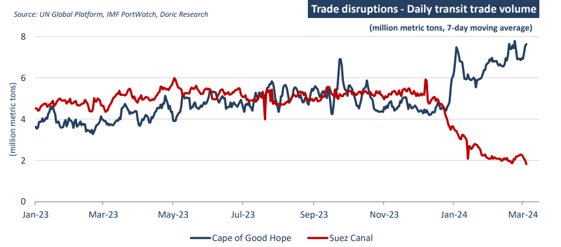

# Shipping since 2020 has been shaped by events more than we have been used to

**Date:** September 09, 2024  
**Publisher:** Breakwave Advisors | **Category:** Market Insights  
**Original URL:** [https://www.breakwaveadvisors.com/insights/2024/9/9/fzo0z0yzpgnomzr9pvbgqom50dmkli](https://www.breakwaveadvisors.com/insights/2024/9/9/fzo0z0yzpgnomzr9pvbgqom50dmkli)  

---

So called 'fundamentals' gave way to outside factors which have reshaped them in the process.

*By*[*Michalis Voutsinas*](https://www.linkedin.com/in/michalis-voutsinas-587544163/)

Shipping since 2020 has been shaped by events more than we have been used to . The Dry bulk market is no exception with Covid-19 , the Russian invasion of Ukraine and the Middle East conflict major waypoints on how the environment unfolded. So called 'fundamentals' gave way to outside factors which have reshaped them in the process.

Covid-19 set the pace with its logistical complications and the demand boost from a change in global consumption patterns. Unprepared for such a wild event, the dry bulk market felt the supply and demand squeeze to its core lifting rates sharply as from mid 2020 and for the next two years.

The Russian invasion of Ukraine in February 2022 was another 'Black Swan' event which brought about heightened war risks and change in Some trade patterns. Changes in commodity patterns by trade disruptions to and from Ukraine coupled with western sanctions on Russia, have had an increased tonne-mile demand effect for bulk carriers.

At about the same time though, the positive effects on rates from the pandemic started to unwind as consumption patterns normalized and global inflation took its toll on consumers. Logistical bottlenecks eased and the supply of bulkers regained it's former fluidity . The large buildup in inventories of commodities and manufactured goods from the earlier Covid-19 conditions started to be drawn down and this was a negative for international trade. As a consequence, from mid 2022 for the next 12 months the market slumped with charter rates for bulkers falling by 50-70% from earlier heights. As from mid 2023 the market started to improve as China's late re-opening from the pandemic restrictions finally started to bear on international trade.

In October of 2023, Hamas shocking attack on Israel was the third unforeseen event impacting the dry bulk market mostly from strikes on commercial shipping transiting the Red Sea by the Houthis of Yemen. With about 15% of global trade and about 20% of container trade passing through the Red Sea re-routing via the Cape of Good Hope has already taken place resulting in increased voyages on major trade lanes. With an estimated 66% drop in transits a 13.5% incremental tonne-mile effect for containers has accrued, whereas for bulkers a 50% drop in transits has yielded an estimated 4% incremental tonne-mile in the last 12 months.

In addition to these geo-economic events, weather conditions brought about disruption to international trade and the bulk carrier market. Most prominent was the effect of abnormally low rainfall in the May-Dec 2023 rain season in Central America reducing the water levels of the Panama Canal. The result was inadequate water to service the lock system required for lifting ships in their transit through the canal.

Now looking ahead, the supply side of the orderbook for bulk carriers has been fairly modest now at about 9% of the current fleet. On the demand side there are many factors which are being watched, not least of which whether the Red Sea and/or Ukrainian situation normalize, the outcome of the USA election and trade implications thereof, as potential swings of the pendulum.

This is the backdrop, but reliance on such insight needs to be measured against 'events' to occur, some of which will end up as 'black swan' , and how these affect the landscape as they have done so materially in the last years.

> **Figure 1: Στιγμιότυπο Οθόνης 2024 09 09 134544**  
> **Interactive Data & Source:** [Doric](https://www.doric.gr/) | [Local Asset](file:///C:/Users/Dell/Github/Shipping/corpus/03-breakwave/insights/2024/assets/2024-09-09_fzo0z0yzpgnomzr9pvbgqom50dmkli_img_cea3cf84ceb9ceb3cebcceb9cf8ccf84cf85_ebe51006654a.png)

Data source:[Doric](https://www.doric.gr/)

---

**Tags:** Shipping, Dry Bulk, Markets  
