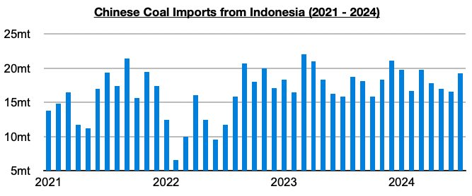
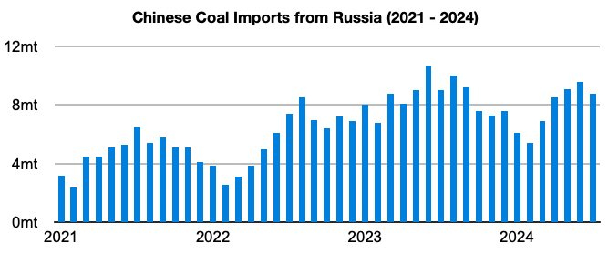
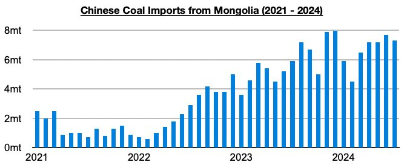
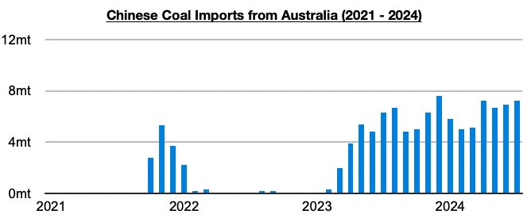

# Indonesia's Coal Dominance in China is Waning

**Date:** September 09, 2024  
**Publisher:** Breakwave Advisors | **Category:** Market Insights  
**Original URL:** [https://www.breakwaveadvisors.com/insights/2024/9/9/indonesias-coal-dominance-in-china-is-waning](https://www.breakwaveadvisors.com/insights/2024/9/9/indonesias-coal-dominance-in-china-is-waning)  

---

*By*[*Jeffrey Landsberg*](https://www.linkedin.com/in/jeffrey-landsberg-70ab957/)

Indonesia has remained China’s primary source of coal imports, and Russia its second largest source of coal imports, and of note is that Australia has finally come close to overtaking Mongolia as China’s third largest source. The most recently released data shows that China’s coal imports from Indonesia totaled 19.2 million tons in July, which is up month-on-month by 2.6 million tons (16%) and up year-on-year by 3.4 million tons (22%).

> **Figure 1: Chart 1 (1)**  
> [Local Asset](file:///C:/Users/Dell/Github/Shipping/corpus/03-breakwave/insights/2024/assets/2024-09-09_indonesias-coal-dominance-in-china-is-waning_img_chart128129_41786037f1cc.jpg)

Overall, Indonesia remains China’s primary source of coal imports, but its dominance has been waning as we have been discussing in Commodore Research's Weekly Dry Bulk Reports. The first seven months of this year has seen Indonesia account for 43% of China’s coal imports. In comparison, during the first seven months of last year, it accounted for 49%.

Imports from Russia totaled 8.8 million tons. This is down month-on-month by 500,000 tons (-8%) and down year-on-year by 200,000 tons (-2%). Remaining significant, though, is that in June coal imports from Russia set a 2024 record.

> **Figure 2: Chart 2 (1)**  
> [Local Asset](file:///C:/Users/Dell/Github/Shipping/corpus/03-breakwave/insights/2024/assets/2024-09-09_indonesias-coal-dominance-in-china-is-waning_img_chart228129_350b90797b14.jpg)

Imports from Mongolia totaled 7.3 million tons. This is down month-on-month by 400,000 tons (-5%) but up year-on-year by 1.4 million tons (24%).

> **Figure 3: Chart 3 (1)**  
> [Local Asset](file:///C:/Users/Dell/Github/Shipping/corpus/03-breakwave/insights/2024/assets/2024-09-09_indonesias-coal-dominance-in-china-is-waning_img_chart328129_9c9d1aea74da.jpg)

Imports from Australia totaled 7.2 million tons. This is up month-on-month by 300,000 tons (4%) and up year-on-year by 900,000 tons (14%).

> **Figure 4: Chart 4**  
> [Local Asset](file:///C:/Users/Dell/Github/Shipping/corpus/03-breakwave/insights/2024/assets/2024-09-09_indonesias-coal-dominance-in-china-is-waning_img_chart4_d98683d54aef.jpg)

---

**Tags:** Drybulk, China, Coal  
