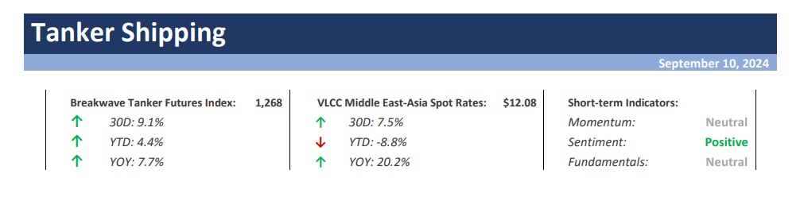
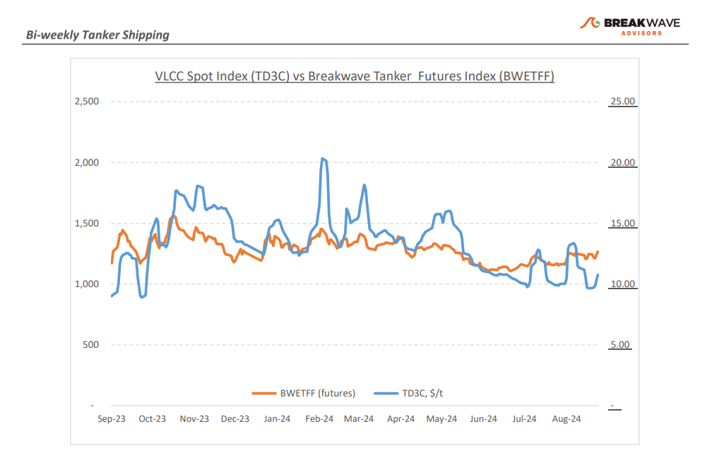
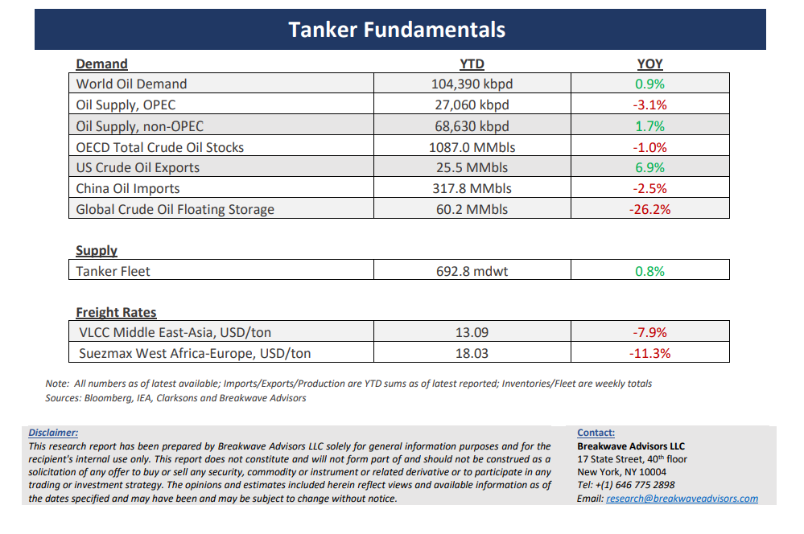

# Breakwave Bi-Weekly Tanker Report - September 10, 2024

**Date:** September 10, 2024  
**Publisher:** Breakwave Advisors | **Category:** Market Insights  
**Original URL:** [https://www.breakwaveadvisors.com/insights/2024910wet-87w385](https://www.breakwaveadvisors.com/insights/2024910wet-87w385)  

---

> **Figure 1: Cea3cf84ceb9ceb3cebcceb9cf8ccf84cf85**  
> [Local Asset](file:///C:/Users/Dell/Github/Shipping/corpus/03-breakwave/insights/2024/assets/2024-09-10_2024910wet-87w385_img_cea3cf84ceb9ceb3cebcceb9cf8ccf84cf85_6eb9ea689536.png)

•**Sentiment Improves as Signs of Early Recovery Develop**–**VLCC owners**have made**some progress**in the first week of September, buoyed by renewed market optimism and hints of recovery after a prolonged downturn. The AG VLCC market, which had experienced a sharp drop in rates to yearly lows, is now seeing**encouraging signs**of a turnaround. Owners demonstrated strong resistance after a sluggish start to the week, with several market-quoted cargoes receiving fewer offers than expected as rates appeared to bottom out. By the second half of the week, rates began to climb steadily, driven by heightened activity in the last decade and**a shift in sentiment**following positive forecasts from market analysts. This recovery signals a potential turning point, though the flow of dirty cargoes will play a critical role in shaping market dynamics in the days ahead, particularly with the upcoming release of October stems. If owners can maintain this upward trajectory, they may finally break free from the summer slump and set the stage for a stronger Q4. In the**Atlantic**market, the**outlook is similarly improving**. Rates for the West Africa/China route are also rising with signs of increasing activity late in the week. If the positive sentiment in the AG spills over, the Atlantic market could also experience a much-needed further resurgence, potentially marking the start of a broader recovery across global VLCC markets. However, with oil prices hitting multi-year lows, expectations for an**increase of OPEC oil exports**might be**premature**as weak**demand jitters**postponned the planned OPEC+ increase that was supposed to happen starting next month.

•**Oil Prices Drop Below $70/bbl, as Soft Demand And the Risk of Additional Supply Weigh on Sentiment**– Oil prices staged a**measurable decline**during the first week of September as nervous global financial markets provided the catalyst of prices to**drop below the $70/bbl**mark for WTI, hitting the lowest point in about two years. Suddenly**geopolitical uncertainty all but disappeared**and Chinese demand concerns combined with the expectation for more barrels out of OPEC+ weighted heavily on prices. As a result,**OPEC+ decided to postpone**the pre-announced gradual increase in production by two months with the expectation of stabilizing a nervous oil market. Yet,**higher oil production**out of the**Atlantic**basin (US, Brazil and Guyana) remains a significant**hurtle**for a tighter supply balance, while on the**demand**side,**China continues to post weak import**numbers reflecting the economic challenges the country has been dealing with for the last few years. We anticipate some stabilization in oil prices, as the market balance fundamentals have not really changed much and a return of the geopolitical premium should balance the negative fundamentals that oil markets are facing.**Winter restocking**demand should also prove a**tailwind**for prices as Asian demand for Atlantic barrels should begin to appear once October stems get underway. Overall,**a steadier oil market might be in the cards**with significant political and geopolitical risks for the next few months affecting traders’ risk sentiment when it comes to commodities.

•**Our Long-term View –**The tanker market is recovering from a long period of staggered rates as the growth in new vessel supply shrinks while oil demand is recovering in line with the global economy. A historically low orderbook combined with favorable demand fundamentals should continue to support increased spot rate volatility, which combined with the ongoing geopolitical turmoil, should support freight rates in the medium to long term.

> **Figure 2: Cea3cf84ceb9ceb3cebcceb9cf8ccf84cf85**  
> [Local Asset](file:///C:/Users/Dell/Github/Shipping/corpus/03-breakwave/insights/2024/assets/2024-09-10_2024910wet-87w385_img_cea3cf84ceb9ceb3cebcceb9cf8ccf84cf85_2b44138eabe6.png)

> **Figure 3: Cea3cf84ceb9ceb3cebcceb9cf8ccf84cf85**  
> [Local Asset](file:///C:/Users/Dell/Github/Shipping/corpus/03-breakwave/insights/2024/assets/2024-09-10_2024910wet-87w385_img_cea3cf84ceb9ceb3cebcceb9cf8ccf84cf85_c6938dedccb2.png)

### Subscribe:
