# The cuts are coming! But how many and how fast?

**Date:** September 10, 2024  
**Publisher:** Breakwave Advisors | **Category:** Market Insights  
**Original URL:** [https://www.breakwaveadvisors.com/insights/2024/9/10/the-cuts-are-coming-but-how-many-and-how-fast](https://www.breakwaveadvisors.com/insights/2024/9/10/the-cuts-are-coming-but-how-many-and-how-fast)  

---

### The Three Things Investors Should Know This Week:

1. **The Fed has confirmed it will be cutting rates soon. The question is now only how quickly.**
2. **Markets are pricing in 4-5 cuts this year with a possibility of a double (0.5%) cut in September.**
3. **Our House View is that the US economy might be slowing, but it is still performing well, so we see the Fed taking its time to lower rates. Currently, we expect one cut in September and one more by the end of the year.**

*By*[*George Lagarias*](https://www.linkedin.com/in/george-lagarias-mba-3baa769/)

In Business School, they tell you about accounting, business valuations, business strategy, interest rate theory, asset management, economics, currency parities, valuing options, alpha, beta, delta, theta and so, so much more. What they don’t tell you is that real portfolio management largely consists of following and dissecting the word of central bankers, with the same amount of scrutiny that priests of various denominations apply when they delve into ancient texts. “Don’t Fight The Fed” is a time-tested principle, one that places a divine status on the Fed’s word.

The Fed, thus, speaketh mid next week and it is widely expected to perform its first rate cut in this cycle. Last week, a host of US central Bankers ([**Williams**](https://www.youtube.com/watch?v=c_MFzQaVo3c),[**Bostic**](https://www.reuters.com/markets/rates-bonds/feds-bostic-warns-against-keeping-restrictive-policy-stance-too-long-2024-09-04/),[**Daly**](https://www.reuters.com/markets/rates-bonds/feds-daly-says-rate-cuts-needed-keep-labor-market-healthy-2024-09-05/),[**Waller**](https://www.youtube.com/watch?v=RE1jqXBfzPM)) all but confirmed that a September cut is imminent. Waller, a hawkish Republican, indicated that he would be willing to support more cuts if and when the data supported it This is very important for the US economy, the largest single consumer market in the world. Arguably, it is even more important to the Bank of England and the European Central Bank who have already started to cut rates and eagerly await the Fed to begin too, so that they can continue without risking fund outflows due to a wide rate differential.

But what is the Fed going to do? There are four possible outcomes out of the September meeting:

This is a low-probability event. At the time of writing, markets are pricing in one to two rate cuts, Fed officials have more or less confirmed that the Fed was ready to start reducing the cost of money. A decision to maintain rates could send risk markets into a tailspin, especially given the volatility of the last few weeks.

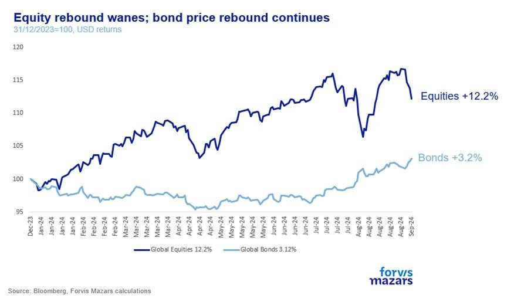

> **Figure 1: No Cut:**  
> **Interactive Data & Source:** [Ftadviser](https://www.ftadviser.com/opinion/2024/09/05/is-nvidia-in-an-ai-bubble/) | [Local Asset](file:///C:/Users/Dell/Github/Shipping/corpus/03-breakwave/insights/2024/assets/2024-09-10_the-cuts-are-coming-but-how-many-and-how-fast_img_image005_dde523289107.jpg)

**Hawkish Cut:**A hawkish cut is the next possible outcome. The Fed would perform one cut, but communicate firmly that this cut is not just the first of many, and it would be closely monitoring inflation data to determine the next one. Given the volatility of the past few days, with popular trades[Ftadviser](https://www.ftadviser.com/opinion/2024/09/05/is-nvidia-in-an-ai-bubble/)unravelling, this event too could be negative for risk assets. The combination of just one cut and hawkishness would probably go against the current dovish consensus.

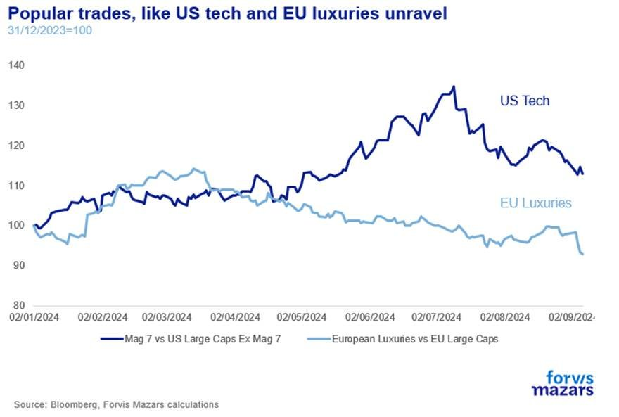

> **Figure 2: Such As Nvidia**  
> [Local Asset](file:///C:/Users/Dell/Github/Shipping/corpus/03-breakwave/insights/2024/assets/2024-09-10_the-cuts-are-coming-but-how-many-and-how-fast_img_image015_446102ef986d.jpg)

: A dovish cut is what is currently mostly priced in, The Fed would cut once but use a dovish language to signal that they worry about weakness in the labour market. This event will probably cause some short-term volatility, but we would expect prices to remain roughly where they are.

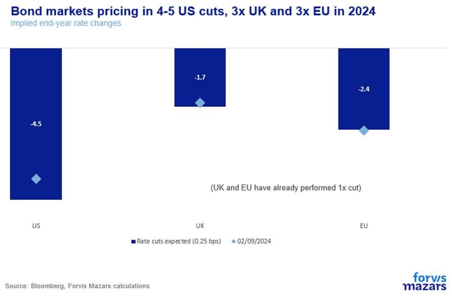

> **Figure 3: One Dovish Cut**  
> [Local Asset](file:///C:/Users/Dell/Github/Shipping/corpus/03-breakwave/insights/2024/assets/2024-09-10_the-cuts-are-coming-but-how-many-and-how-fast_img_image016_4fe8bdd896d5.jpg)

**Double Cut:**a 0.5% rate cut is what many traders have been positioning for. We don’t think this is a highly likely event, and can’t help but acknowledge that the double-cut narrative has been proliferated by market participants but not the Fed itself. A “big cut” would signal that the Fed is highly anxious about the labour market and that inflation is all but beat. Should it come to pass, we would expect some short-term positive reaction from markets. However, the long-term signal might be a negative one pushing stocks down. Equity markets are still near all-time highs. The Fed cutting expediently may give credence to the narrative of an impending recession. Markets don’t just trade on how expensive money is, but also on profitability prospects. As Wei Li, Chief Global Strategist at Blackrock put it, we are in a market where Bad news is Bad news.

Another dimension that should be added to the analysis is quantitative tightening. Already the Fed has quietly reduced average tightening from $91bn on average to $52bn on average.

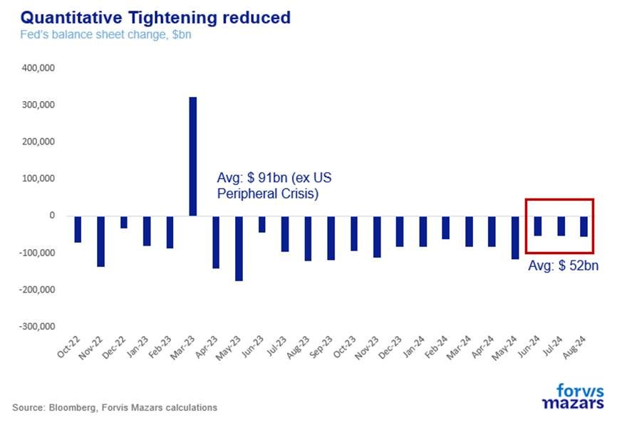

> **Figure 4: Market Chart 4**  
> [Local Asset](file:///C:/Users/Dell/Github/Shipping/corpus/03-breakwave/insights/2024/assets/2024-09-10_the-cuts-are-coming-but-how-many-and-how-fast_img_image017_a60137df6dc5.jpg)

Any specific mention of further cuts in quantitative tightening would add to the “dovish” narrative.

### Our House View – Slow-Paced Cuts

Our core assumption is that the Fed will likely cut once in September to get the ball rolling, which is also what markets are roughly positioning for. The question we have yet to answer is whether it will be a dovish or a hawkish cut. We were on the “hawkish camp”, but labour market data and recent Fed narrative are balancing the odds.

However, forward market positioning sees two more cuts in November, right after the election, and possibly one or two more cuts in December, for a total of eight cuts by April 2025 and ten cuts by December 2025. Historically, steep rate cuts at the end of the cycle has indeed been the case. This time, around, however,[**we think that there’s no need to cut quickly**](assets/2024-09-10_the-cuts-are-coming-but-how-many-and-how-fast_nobel-laureate-joseph-stiglitz-wants_e3e9fc3113a6.html). Currently, we are in the camp of 2x cuts in 2024.

As is often the case in this cycle, we think bond markets (from which expectations are implied) are probably getting ahead of themselves. To be sure, while we divine rate expectations from bond market positioning, we need to acknowledge that rates are not the only reason one buys fixed income. In fact, the market right now may be suffering from a case of Fear Of Missing Out (FOMO), with traders competing to lock in a yield now that they could find one.

The Fed, however, looks at the economy, which does not paint a distressing picture.

GDP growth is projected to be 2.5% by the end of 2024 and slow down to 1.7% next year.

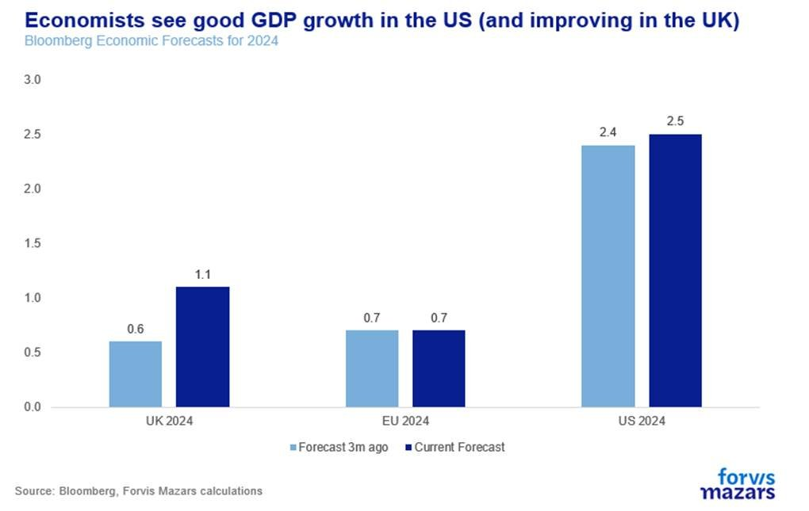

> **Figure 5: Market Chart 5**  
> **Interactive Data & Source:** [Stayathomemacro Substack](https://stayathomemacro.substack.com/p/the-labor-market-is-strong) | [Local Asset](file:///C:/Users/Dell/Github/Shipping/corpus/03-breakwave/insights/2024/assets/2024-09-10_the-cuts-are-coming-but-how-many-and-how-fast_img_image018_a87c655e29ae.jpg)

Personal spending for American consumers was at its long-term average of 2.7% for the year to July and above its long-term average for the last three months. If anything, numbers have improved since last Spring.

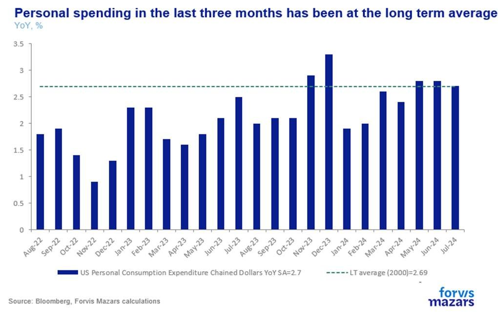

> **Figure 6: Market Chart 6**  
> **Interactive Data & Source:** [Stayathomemacro Substack](https://stayathomemacro.substack.com/p/the-labor-market-is-strong) | [Local Asset](file:///C:/Users/Dell/Github/Shipping/corpus/03-breakwave/insights/2024/assets/2024-09-10_the-cuts-are-coming-but-how-many-and-how-fast_img_image019_098cb763d6ea.jpg)

The US services sector, which accounts for more than 75% of the economy, was the second-best performing globally in August.

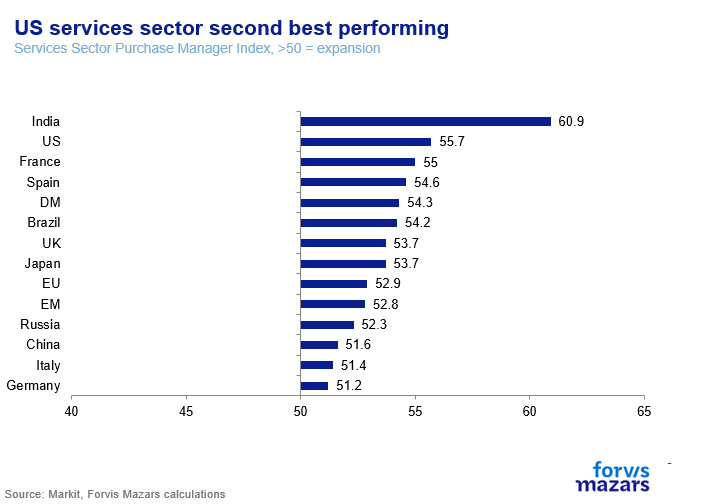

> **Figure 7: Market Chart 7**  
> **Interactive Data & Source:** [Stayathomemacro Substack](https://stayathomemacro.substack.com/p/the-labor-market-is-strong) | [Local Asset](file:///C:/Users/Dell/Github/Shipping/corpus/03-breakwave/insights/2024/assets/2024-09-10_the-cuts-are-coming-but-how-many-and-how-fast_img_image008_378f96fc131e.png)

Economists surveyed by Bloomberg see no more than one in three probability of recession

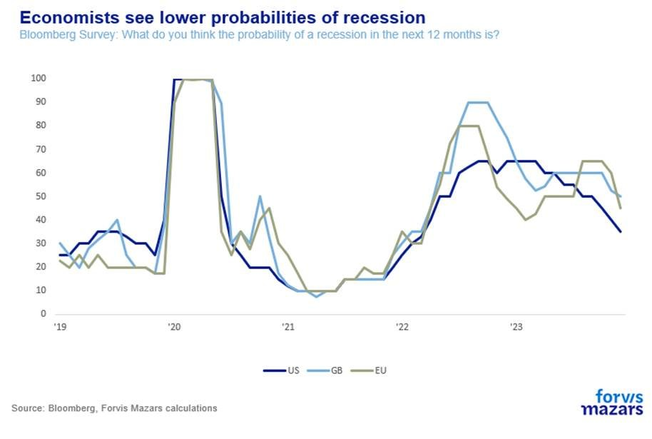

> **Figure 8: Market Chart 8**  
> **Interactive Data & Source:** [Stayathomemacro Substack](https://stayathomemacro.substack.com/p/the-labor-market-is-strong) | [Local Asset](file:///C:/Users/Dell/Github/Shipping/corpus/03-breakwave/insights/2024/assets/2024-09-10_the-cuts-are-coming-but-how-many-and-how-fast_img_image020_d21202196057.jpg)

The labour market is weakening to be sure, with non-farm payroll data for the past year revised significantly down. However, some of the rising unemployment can be attributed to[**higher immigration**](https://stayathomemacro.substack.com/p/the-labor-market-is-strong)(thus higher demand as opposed to lower supply).

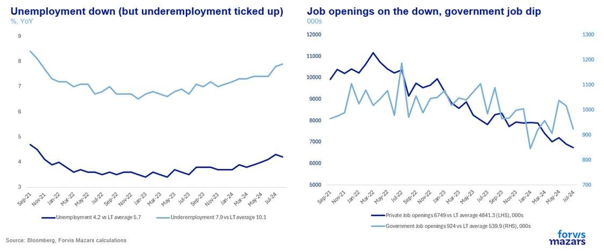

> **Figure 9: Market Chart 9**  
> [Local Asset](file:///C:/Users/Dell/Github/Shipping/corpus/03-breakwave/insights/2024/assets/2024-09-10_the-cuts-are-coming-but-how-many-and-how-fast_img_image021_7c586ef6f198.jpg)

Unemployment actually ticked down from 4.3% to 4.2% in August. The National Federation of Independent Business (NFIB) small business survey, suggests indeed that hiring plans have indeed weakened, but still remain slightly above their long-term average.

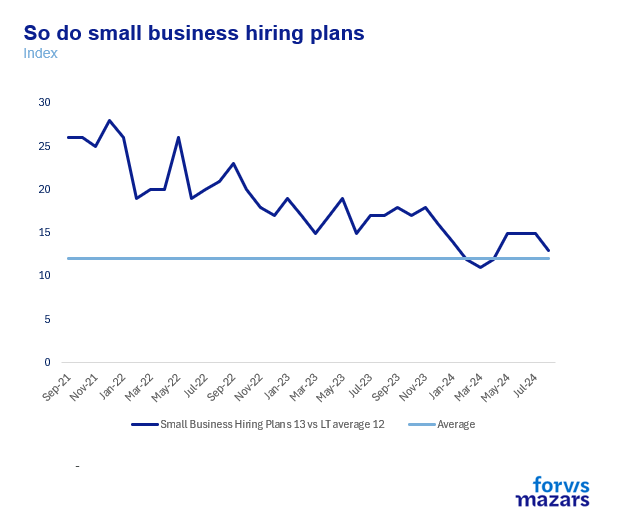

> **Figure 10: Market Chart 10**  
> [Local Asset](file:///C:/Users/Dell/Github/Shipping/corpus/03-breakwave/insights/2024/assets/2024-09-10_the-cuts-are-coming-but-how-many-and-how-fast_img_image011_b8b5500bf139.png)

On the one had we have two key measures, the Sahm Rule (a measure of the rate of change in unemployment) and yield curve dis-inversion (the difference between the 10 and the 2-year US Treasury) both suggest a possible recession…

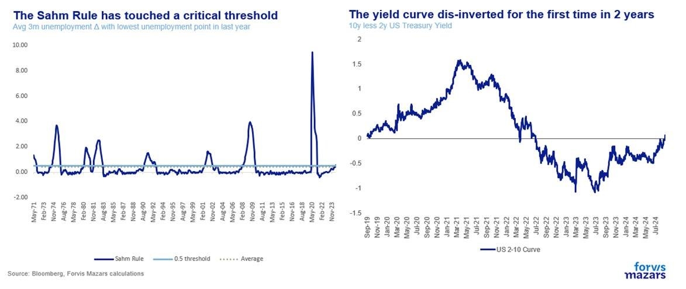

> **Figure 11: Market Chart 11**  
> [Local Asset](file:///C:/Users/Dell/Github/Shipping/corpus/03-breakwave/insights/2024/assets/2024-09-10_the-cuts-are-coming-but-how-many-and-how-fast_img_image022_37a864598b4e.jpg)

…it is good to be reminded that the Taylor Rule (a key Fed mathematical tool which computes optimal interest rates ) suggests that 5.5% interest rates might just be appropriate.

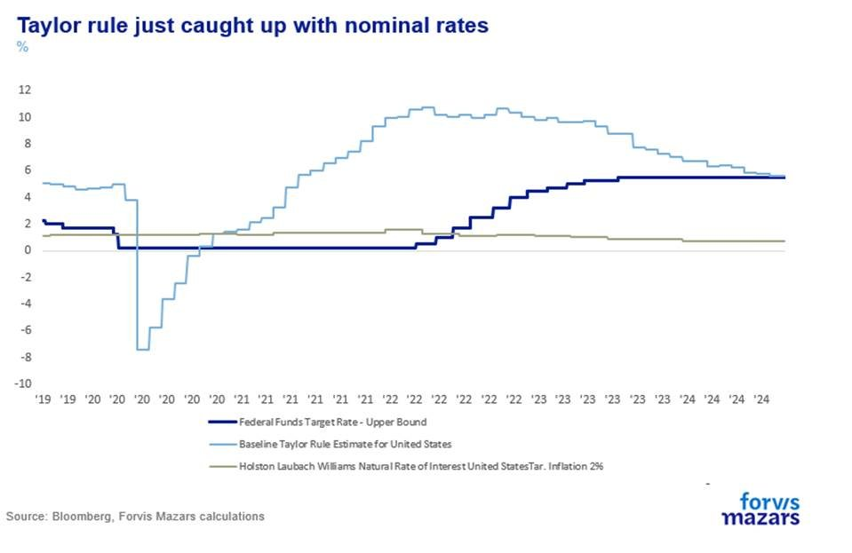

> **Figure 12: Market Chart 12**  
> [Local Asset](file:///C:/Users/Dell/Github/Shipping/corpus/03-breakwave/insights/2024/assets/2024-09-10_the-cuts-are-coming-but-how-many-and-how-fast_img_image023_f2220deb61d2.jpg)

It is also good to be reminded that service inflation remains too high for comfort and that the Fed has carefully avoided declaring victory on the price front.

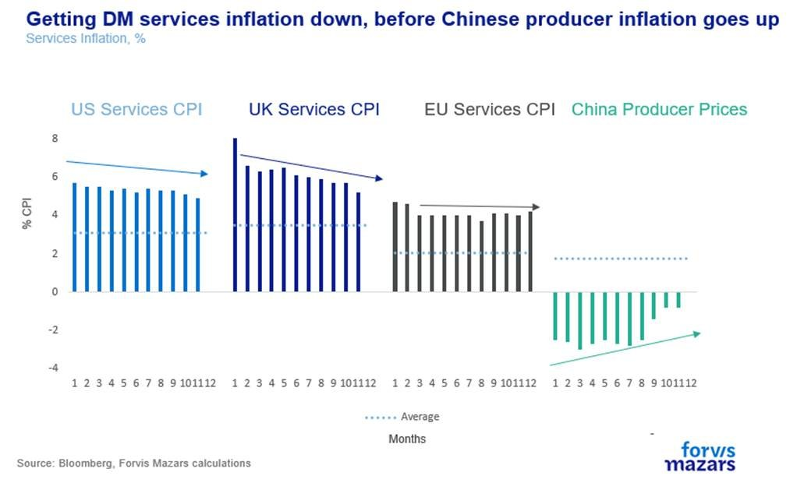

> **Figure 13: To Be Sure**  
> *To be sure, we do agree that US labour conditions are deteriorating and that growth is weakening. The Fedhas said soon many occasions in the past few weeks, Underemployment, a key measure for us, has ticked up to 7.9% from 7.4% in June (having said that, itisthe gig economy). But we do see this as a cyclical trend, the natural and, by and large, expected result of higher interest rates for a period of time. As rates come down, the economy should balance again.*  
> [Local Asset](file:///C:/Users/Dell/Github/Shipping/corpus/03-breakwave/insights/2024/assets/2024-09-10_the-cuts-are-coming-but-how-many-and-how-fast_img_image024_b2276f231dc4.jpg)

Where we differ with some wider market expectations is the level of expediency. At present, where others may see “rushed” cuts so that the Fed is able to get ahead of the curve, we see only a “paced” reduction.

**Ultimately, the Fed’s choices will make a big difference to the Bank of England and the ECB, both of which are keen to reduce rates earlier, as they have to content with similar inflation but much lower growth.**

---

**Tags:** Markets, Economy, Macro  
