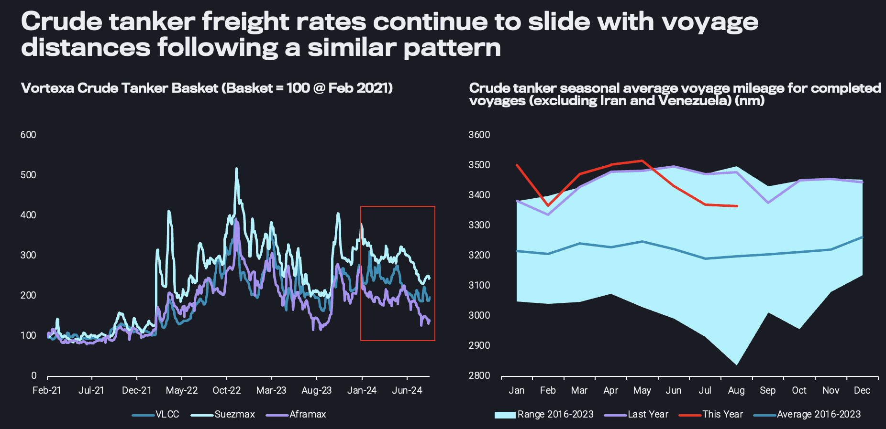
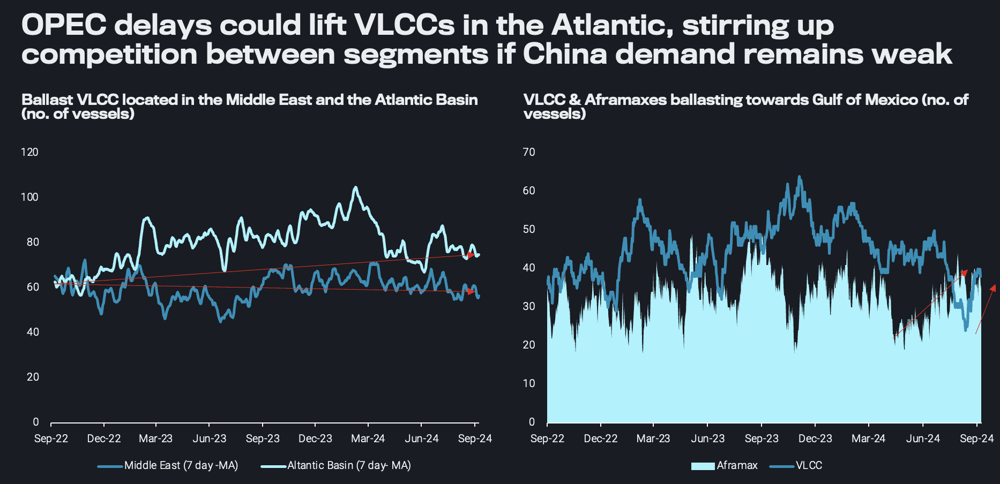
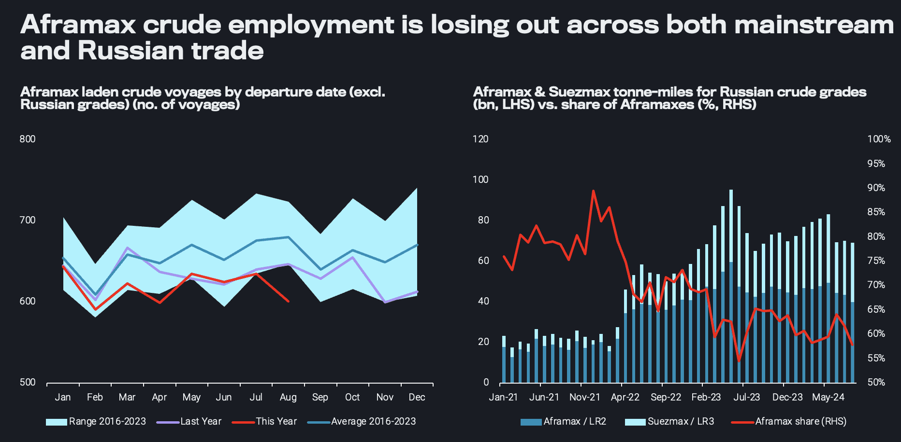
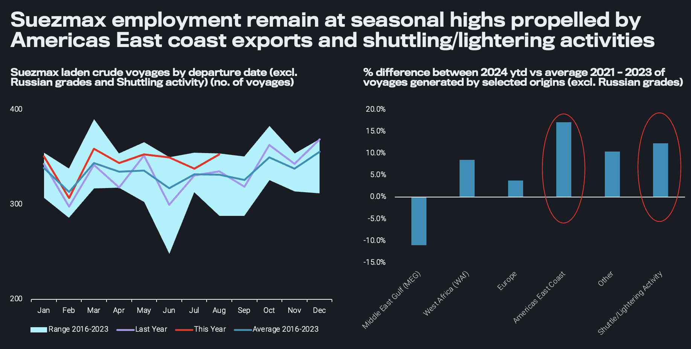

# All eyes on APPEC as crude tanker freight rates soften further

**Date:** September 11, 2024  
**Publisher:** Breakwave Advisors | **Category:** Market Insights  
**Original URL:** [https://www.breakwaveadvisors.com/insights/2024/9/11/92t0cgq880n6gc2sj42eoif5xn85yq](https://www.breakwaveadvisors.com/insights/2024/9/11/92t0cgq880n6gc2sj42eoif5xn85yq)  

---

In this piece we analyse the drivers of the current softening on the main crude tanker classes and look at what’s next for the remainder of the year

*By*[*Ioannis Papadimitriou*](https://www.linkedin.com/in/ipapadimitriou/)

As APPEC kicks off there have been various reports and thought pieces expressing a doubtful tomorrow for the world’s oil markets as crude prices continue to falter. A similar picture is reflected on crude tanker freight rates, which continue to drop throughout the summer months, begging the question of whether a pick up is on the cards following the seasonal summer lull or whether this lull is here to stay?

Splitting crude tanker demand into voyage volumes and voyage distances, it seems that while the number of voyages dropped toward last year’s figures, the persistent drop in freight rates is influenced more by the persistent drop in mileage. Nevertheless, distances remain above average historical figures due to the effect of Russia tradeflow reshuffling. Having said that, part of the drop in mileage is linked to the drop in[Russian crude exports (excl. Kazakh grades)](https://analytics.vortexa.com/Flows?dateRange=2022-01-01T00%3A00%3A00.000Z__2024-08-31T23%3A59%3A59.999Z&filtersEnabled=%5B%22p%22%2C%22o%22%2C%22d%22%2C%22d_r%22%2C%22v%22%2C%22intra_d%22%2C%22sts_o%22%2C%22c_o%22%2C%22w%22%2C%22sts%22%5D&fromExcluded=%5B%22d308ddc557e774187ad6c7da81b39db990def9a39e6c88e79cb163b6bdd6e8e5%22%2C%22a1acb291bb339d07faa0d9c7b62ea292aa0ea1a01813b26c890aeeb4e2334b09%22%5D&geoBreakdownDestinationGlobal=region&metric=bpd&originGlobalXFilter=%5B%22b996521be9c996db3560ca234a56286ac38f798d34be229437555fab4f12a6a5%22%5D&page=Flows&products=%5B%2254af755a090118dcf9b0724c9a4e9f14745c26165385ffa7f1445bc768f06f11%22%5D&productsExcluded=%5B%22bb70cf56200f5b72ba69a90bda2c6b47ba29da23945c6f1994cfd4c2ef2fe0ff%22%2C%22578b0722570521d64e6a1527e1fb88ddb1a064cc15afe1d6023d2a0b6d66be6b%22%5D&tabId=d5d5a569-4ec6-48f8-be9f-0d96d865cb2e&timeSeriesProperty=origin_country&timeSeriesSeasonalToggle=0&v=3), which were observed at their lowest levels in nine months, leading to reductions in Aframax voyages from Russia.

> **Figure 1: 241**  
> **Interactive Data & Source:** [Analytics Vortexa](https://analytics.vortexa.com/VoyagesFlows?dateRange=2021-01-01T00%3A00%3A00.000Z__2024-08-31T23%3A59%3A59.999Z&filtersEnabled=%5B%22v_v_st%22%2C%22v%22%2C%22l_c%22%2C%22o%22%2C%22d%22%2C%22d_r%22%2C%22v_or%22%2C%22v_de%22%2C%22dwt%22%2C%22v_i%22%2C%22v_cg_st%22%2C%22v_l_st%22%2C%22v_co_st%22%2C%22v_m_st%22%2C%22v_wt%22%2C%22v_c%22%2C%22l%22%2C%22v_o%22%2C%22intra_d%22%2C%22v_t%22%2C%22v_a%22%5D&fromExcluded=%5B%22d308ddc557e774187ad6c7da81b39db990def9a39e6c88e79cb163b6bdd6e8e5%22%2C%22a1acb291bb339d07faa0d9c7b62ea292aa0ea1a01813b26c890aeeb4e2334b09%22%5D&latestProducts=%5B%2254af755a090118dcf9b0724c9a4e9f14745c26165385ffa7f1445bc768f06f11%22%5D&metric=t&page=VoyagesFlows&routeBreakdown=shipping_region_v2&routeBreakdownCrossFilter=%5B%228ad76c1c935d5a95-5600764fc92f8cce%22%2C%2237c8c4eeb730d1cd-5600764fc92f8cce%22%2C%2211b741e930163dde-5600764fc92f8cce%22%5D&tabId=712d3c9d-02f1-46f8-adb5-5cd9186b44cc&vesselClassBreakdownCrossFilter=%5B%22oil_vlcc%22%5D&vesselClasses=%5B%22oil_vlcc%22%2C%22oil_suezmax_lr3%22%2C%22oil_aframax_lr2%22%2C%22oil_panamax_lr1%22%5D&vesselTagsExcluded=%5B%22vessel_fso_tag%22%2C%22vessel_fsru_tag%22%5D&voyageDateRangeActivity=departures&voyageStatus=%5B%22laden%22%5D) | [Local Asset](file:///C:/Users/Dell/Github/Shipping/corpus/03-breakwave/insights/2024/assets/2024-09-11_92t0cgq880n6gc2sj42eoif5xn85yq_img_241_a582487b2abd.png)

Another factor of this drop in voyage mileage has stemmed from VLCCs due to a[significant drop in voyages](https://analytics.vortexa.com/VoyagesFlows?dateRange=2021-01-01T00%3A00%3A00.000Z__2024-08-31T23%3A59%3A59.999Z&filtersEnabled=%5B%22v_v_st%22%2C%22v%22%2C%22l_c%22%2C%22o%22%2C%22d%22%2C%22d_r%22%2C%22v_or%22%2C%22v_de%22%2C%22dwt%22%2C%22v_i%22%2C%22v_cg_st%22%2C%22v_l_st%22%2C%22v_co_st%22%2C%22v_m_st%22%2C%22v_wt%22%2C%22v_c%22%2C%22l%22%2C%22v_o%22%2C%22intra_d%22%2C%22v_t%22%2C%22v_a%22%5D&fromExcluded=%5B%22d308ddc557e774187ad6c7da81b39db990def9a39e6c88e79cb163b6bdd6e8e5%22%2C%22a1acb291bb339d07faa0d9c7b62ea292aa0ea1a01813b26c890aeeb4e2334b09%22%5D&latestProducts=%5B%2254af755a090118dcf9b0724c9a4e9f14745c26165385ffa7f1445bc768f06f11%22%5D&metric=t&page=VoyagesFlows&routeBreakdown=shipping_region_v2&routeBreakdownCrossFilter=%5B%228ad76c1c935d5a95-5600764fc92f8cce%22%2C%2237c8c4eeb730d1cd-5600764fc92f8cce%22%2C%2211b741e930163dde-5600764fc92f8cce%22%5D&tabId=712d3c9d-02f1-46f8-adb5-5cd9186b44cc&vesselClassBreakdownCrossFilter=%5B%22oil_vlcc%22%5D&vesselClasses=%5B%22oil_vlcc%22%2C%22oil_suezmax_lr3%22%2C%22oil_aframax_lr2%22%2C%22oil_panamax_lr1%22%5D&vesselTagsExcluded=%5B%22vessel_fso_tag%22%2C%22vessel_fsru_tag%22%5D&voyageDateRangeActivity=departures&voyageStatus=%5B%22laden%22%5D)from the Atlantic Basin towards Asia. The OPEC announcement of a delay in crude production uplifts will not help to absorb VLCC tonnage in the Middle East. Over the past couple of years, in line with the US surging production, more VLCCs are relocating in the AB, and the recent OPEC announcement seems to drive more VLCCs ballasters into the region, especially towards the GoM.

Whether this will be positive for VLCCs hinges on an Asia rebound in purchasing activity, especially from China. A rebound from the seasonal lull can trigger higher tonne-miles. In all likelihood, Chinese imports are to remain range-bound throughout Q4 with a seasonal uptick up until October before softening in November and December. Even in the case of an import spike, Chinese state companies tend to rely on their OPEC baseload, which can provide a cap on mileage.

However, the alternative scenario of muted demand from China is not unrealistic, especially considering the recent release of CPP export quotas, which are 44% down from expectations, adding to the woes of a weak Chinese outlook. In such a case, VLCC operators will have to continue entertaining the thought of cleaning-up, especially if the tanker is of young age. Otherwise VLCCs would have to compete in an oversupplied Atlantic Basin region against their smaller counterparts (such as Aframax tankers) for transatlantic voyages, at a time when the upcoming European refining maintenance is expected to bring additional dents in trade demand.

> **Figure 2: 242**  
> **Interactive Data & Source:** [Analytics Vortexa](https://analytics.vortexa.com/FleetUtilisation?dateRange=2021-01-01T00%3A00%3A00.000Z__2024-08-31T23%3A59%3A59.999Z&frequency1=month&frequency2=week&latestProducts=%5B%2254af755a090118dcf9b0724c9a4e9f14745c26165385ffa7f1445bc768f06f11%22%5D&page=FleetUtilisation&primaryChartView1=line&primarySplitProperty2=destination_basin&primaryTimeSeries1=utilisation&secondaryTimeSeries1=hide&tabId=4ab88c6c-d727-4c5a-9f74-e2f9c2ca16fd&v=4&vesselClasses=%5B%22oil_aframax_lr2%22%5D) | [Local Asset](file:///C:/Users/Dell/Github/Shipping/corpus/03-breakwave/insights/2024/assets/2024-09-11_92t0cgq880n6gc2sj42eoif5xn85yq_img_242_20613cffe065.png)

A potential dip in transatlantic flows could exert pressure on Aframax rates, which already saw the global laden utilisation for the crude trade[dropping below 50%](https://analytics.vortexa.com/FleetUtilisation?dateRange=2021-01-01T00%3A00%3A00.000Z__2024-08-31T23%3A59%3A59.999Z&frequency1=month&frequency2=week&latestProducts=%5B%2254af755a090118dcf9b0724c9a4e9f14745c26165385ffa7f1445bc768f06f11%22%5D&page=FleetUtilisation&primaryChartView1=line&primarySplitProperty2=destination_basin&primaryTimeSeries1=utilisation&secondaryTimeSeries1=hide&tabId=4ab88c6c-d727-4c5a-9f74-e2f9c2ca16fd&v=4&vesselClasses=%5B%22oil_aframax_lr2%22%5D)for the first time this year. Zooming in on employment, it looks like Aframaxes are not only losing steam in the mainstream trade where voyages lie below seasonal ranges, but also in the Russian trade due to increased sanctioning activity. Instead, on the latter, Suezmaxes have gained ground. This is especially concerning considering the boost from[the TMX expansion](https://analytics.vortexa.com/VoyagesFlows?dateRange=last-24-months&filtersEnabled=%5B%22v_v_st%22%2C%22v%22%2C%22l_c%22%2C%22o%22%2C%22d%22%2C%22d_r%22%2C%22v_or%22%2C%22v_de%22%2C%22dwt%22%2C%22v_i%22%2C%22v_cg_st%22%2C%22v_l_st%22%2C%22v_co_st%22%2C%22v_m_st%22%2C%22v_wt%22%2C%22v_c%22%2C%22l%22%2C%22v_o%22%2C%22intra_d%22%2C%22v_t%22%2C%22v_a%22%5D&from=%5B%22d7288ead9a9003976837009b74d99750fe259a9118062889f689d401014a0733%22%5D&latestProducts=%5B%2254af755a090118dcf9b0724c9a4e9f14745c26165385ffa7f1445bc768f06f11%22%5D&metric=t&page=VoyagesFlows&tabId=712d3c9d-02f1-46f8-adb5-5cd9186b44cc&timeSeriesBreakdown=vessel-class-coarse&timeSeriesHiddenSeries=%5B%22seasonal_comparison_12%22%2C%22seasonal_comparison_24%22%5D&voyageDateRangeActivity=departures)has already been in full effect. The possible ramp-up of Dos Bocas refinery could even further soften intra-Gulf of Mexico utilisation, with the US likely turning to Canada for pipeline flows to replenish the lost barrels from Mexico, leaving seaborne demand at a net loss.

> **Figure 3: 243**  
> **Interactive Data & Source:** [Analytics Vortexa](https://analytics.vortexa.com/VoyagesFlows?dateRange=2021-01-01T00%3A00%3A00.000Z__2024-08-31T23%3A59%3A59.999Z&filtersEnabled=%5B%22v_v_st%22%2C%22v%22%2C%22l_c%22%2C%22o%22%2C%22d%22%2C%22d_r%22%2C%22v_or%22%2C%22v_de%22%2C%22dwt%22%2C%22v_i%22%2C%22v_cg_st%22%2C%22v_l_st%22%2C%22v_co_st%22%2C%22v_m_st%22%2C%22v_wt%22%2C%22v_c%22%2C%22l%22%2C%22v_o%22%2C%22intra_d%22%2C%22v_t%22%2C%22v_a%22%5D&latestProducts=%5B%2254af755a090118dcf9b0724c9a4e9f14745c26165385ffa7f1445bc768f06f11%22%5D&latestProductsExcluded=%5B%2204c4ea46fc6fccfe8388717f399b40e5e348f9a98c451d99e7366caa998191a7%22%2C%22c8803c073c2980d9849784c16bcd41d7f7b7561d2c8c1799a16166527b120242%22%2C%2274a8bc823d4742318d38072f81068fac1ac02ac66e0d491ea4366007bb95c602%22%2C%22a6c0a31f361b480bddfb93b1b93f38f4989013ae54b2b147ab18116fdfbebdb7%22%2C%227cab5376bbb441feabdafc7b9f6272c2f9cbd10deb604bed8fa7f9986b2a39a9%22%2C%220c703e0e14d99572c62f15a26fdf2c9f0c00e111e625cd40b8b337154e81d46d%22%2C%2220c87d7477f8cfe103904d9af911668c9a69bd03690e74e52e4386ad34e054ee%22%2C%224ff810b966104a658d22e7155596c11bedcd1e3e81594e6187ab88ec816d95d6%22%2C%22fef83ff1194c77d969693ee17c08e1112878e184e3449400e5904bc47b0119fe%22%2C%22054b79baa9a54171be2582c9b4f8fa82d0386d41c1914700a498dc5b95e8daba%22%2C%220fff12441aa3bf28aa568134ef527d09f741c543a49c0db8c03a195a0bbc481e%22%2C%221dfa78c965d56ab9d7b953e424d9160e9f79d0275e460c74994193a328f51537%22%2C%224aebc156649b4c9691cdf3a9c81758426d10ffc944ba441f907f9fbe0964e879%22%5D&metric=t&page=VoyagesFlows&tabId=712d3c9d-02f1-46f8-adb5-5cd9186b44cc&timeSeriesBreakdown=destination-basin&timeSeriesHiddenSeries=%5B%22seasonal_comparison_12%22%2C%22seasonal_comparison_24%22%5D&vesselClasses=%5B%22oil_suezmax_lr3%22%5D&voyageDateRangeActivity=departures&voyageStatus=%5B%22laden%22%5D) | [Local Asset](file:///C:/Users/Dell/Github/Shipping/corpus/03-breakwave/insights/2024/assets/2024-09-11_92t0cgq880n6gc2sj42eoif5xn85yq_img_243_64f4cf9765b7.png)

A strengthening point in the current freight market has to do with Suezmax tankers, as mainstream voyages are found at the top bound of the seasonal range. Nevertheless, the[structural shift of voyages heading towards Europe instead of Asia](https://analytics.vortexa.com/VoyagesFlows?dateRange=2021-01-01T00%3A00%3A00.000Z__2024-08-31T23%3A59%3A59.999Z&filtersEnabled=%5B%22v_v_st%22%2C%22v%22%2C%22l_c%22%2C%22o%22%2C%22d%22%2C%22d_r%22%2C%22v_or%22%2C%22v_de%22%2C%22dwt%22%2C%22v_i%22%2C%22v_cg_st%22%2C%22v_l_st%22%2C%22v_co_st%22%2C%22v_m_st%22%2C%22v_wt%22%2C%22v_c%22%2C%22l%22%2C%22v_o%22%2C%22intra_d%22%2C%22v_t%22%2C%22v_a%22%5D&latestProducts=%5B%2254af755a090118dcf9b0724c9a4e9f14745c26165385ffa7f1445bc768f06f11%22%5D&latestProductsExcluded=%5B%2204c4ea46fc6fccfe8388717f399b40e5e348f9a98c451d99e7366caa998191a7%22%2C%22c8803c073c2980d9849784c16bcd41d7f7b7561d2c8c1799a16166527b120242%22%2C%2274a8bc823d4742318d38072f81068fac1ac02ac66e0d491ea4366007bb95c602%22%2C%22a6c0a31f361b480bddfb93b1b93f38f4989013ae54b2b147ab18116fdfbebdb7%22%2C%227cab5376bbb441feabdafc7b9f6272c2f9cbd10deb604bed8fa7f9986b2a39a9%22%2C%220c703e0e14d99572c62f15a26fdf2c9f0c00e111e625cd40b8b337154e81d46d%22%2C%2220c87d7477f8cfe103904d9af911668c9a69bd03690e74e52e4386ad34e054ee%22%2C%224ff810b966104a658d22e7155596c11bedcd1e3e81594e6187ab88ec816d95d6%22%2C%22fef83ff1194c77d969693ee17c08e1112878e184e3449400e5904bc47b0119fe%22%2C%22054b79baa9a54171be2582c9b4f8fa82d0386d41c1914700a498dc5b95e8daba%22%2C%220fff12441aa3bf28aa568134ef527d09f741c543a49c0db8c03a195a0bbc481e%22%2C%221dfa78c965d56ab9d7b953e424d9160e9f79d0275e460c74994193a328f51537%22%2C%224aebc156649b4c9691cdf3a9c81758426d10ffc944ba441f907f9fbe0964e879%22%5D&metric=t&page=VoyagesFlows&tabId=712d3c9d-02f1-46f8-adb5-5cd9186b44cc&timeSeriesBreakdown=destination-basin&timeSeriesHiddenSeries=%5B%22seasonal_comparison_12%22%2C%22seasonal_comparison_24%22%5D&vesselClasses=%5B%22oil_suezmax_lr3%22%5D&voyageDateRangeActivity=departures&voyageStatus=%5B%22laden%22%5D)(excluding Russian bbls) and the rise of[shuttling/lightering activities](https://analytics.vortexa.com/VoyagesFlows?dateRange=2021-01-01T00%3A00%3A00.000Z__2024-08-31T23%3A59%3A59.999Z&filtersEnabled=%5B%22v_v_st%22%2C%22v%22%2C%22l_c%22%2C%22o%22%2C%22d%22%2C%22d_r%22%2C%22v_or%22%2C%22v_de%22%2C%22dwt%22%2C%22v_i%22%2C%22v_cg_st%22%2C%22v_l_st%22%2C%22v_co_st%22%2C%22v_m_st%22%2C%22v_wt%22%2C%22v_c%22%2C%22l%22%2C%22v_o%22%2C%22intra_d%22%2C%22v_t%22%2C%22v_a%22%5D&latestProducts=%5B%2254af755a090118dcf9b0724c9a4e9f14745c26165385ffa7f1445bc768f06f11%22%5D&latestProductsExcluded=%5B%2204c4ea46fc6fccfe8388717f399b40e5e348f9a98c451d99e7366caa998191a7%22%2C%22c8803c073c2980d9849784c16bcd41d7f7b7561d2c8c1799a16166527b120242%22%2C%2274a8bc823d4742318d38072f81068fac1ac02ac66e0d491ea4366007bb95c602%22%2C%22a6c0a31f361b480bddfb93b1b93f38f4989013ae54b2b147ab18116fdfbebdb7%22%2C%227cab5376bbb441feabdafc7b9f6272c2f9cbd10deb604bed8fa7f9986b2a39a9%22%2C%220c703e0e14d99572c62f15a26fdf2c9f0c00e111e625cd40b8b337154e81d46d%22%2C%2220c87d7477f8cfe103904d9af911668c9a69bd03690e74e52e4386ad34e054ee%22%2C%224ff810b966104a658d22e7155596c11bedcd1e3e81594e6187ab88ec816d95d6%22%2C%22fef83ff1194c77d969693ee17c08e1112878e184e3449400e5904bc47b0119fe%22%2C%22054b79baa9a54171be2582c9b4f8fa82d0386d41c1914700a498dc5b95e8daba%22%2C%220fff12441aa3bf28aa568134ef527d09f741c543a49c0db8c03a195a0bbc481e%22%2C%221dfa78c965d56ab9d7b953e424d9160e9f79d0275e460c74994193a328f51537%22%2C%224aebc156649b4c9691cdf3a9c81758426d10ffc944ba441f907f9fbe0964e879%22%5D&metric=t&page=VoyagesFlows&routeBreakdownCrossFilter=%5B%226ac49669e238276d-6ac49669e238276d%22%2C%222d92cc08f22524db-2d92cc08f22524db%22%5D&tabId=712d3c9d-02f1-46f8-adb5-5cd9186b44cc&timeSeriesHiddenSeries=%5B%22seasonal_comparison_12%22%2C%22seasonal_comparison_24%22%5D&vesselClasses=%5B%22oil_suezmax_lr3%22%5D&voyageDateRangeActivity=departures&voyageStatus=%5B%22laden%22%5D)have resulted in a drop in mileage, in turn putting a cap on rates.

> **Figure 4: 244**  
> **Interactive Data & Source:** [Analytics Vortexa](https://analytics.vortexa.com/VoyagesFlows?dateRange=2021-01-01T00%3A00%3A00.000Z__2024-09-08T23%3A59%3A59.999Z&filtersEnabled=%5B%22v_v_st%22%2C%22v%22%2C%22l_c%22%2C%22o%22%2C%22d%22%2C%22d_r%22%2C%22v_or%22%2C%22v_de%22%2C%22dwt%22%2C%22v_i%22%2C%22v_cg_st%22%2C%22v_l_st%22%2C%22v_co_st%22%2C%22v_m_st%22%2C%22v_wt%22%2C%22v_c%22%2C%22l%22%2C%22v_o%22%2C%22intra_d%22%2C%22v_t%22%5D&latestProducts=%5B%2254af755a090118dcf9b0724c9a4e9f14745c26165385ffa7f1445bc768f06f11%22%5D&page=VoyagesFlows&tabId=1ffffe07-a884-4283-bd7c-382528095211&timeSeriesBreakdown=vessel-class-coarse&timeSeriesHiddenSeries=%5B%22seasonal_comparison_12%22%2C%22seasonal_comparison_24%22%5D&vesselClassBreakdownCrossFilter=%5B%22oil_vlcc%22%2C%22oil_suezmax_lr3%22%5D&vesselClasses=%5B%22oil_suezmax_lr3%22%2C%22oil_vlcc%22%5D&vesselTagsExcluded=%5B%22vessel_fso_tag%22%2C%22vessel_fsru_tag%22%5D&voyageDateRangeActivity=departures&voyageFrom=%5B%22b903eceaae4690fafdc2fd76c23d1e44faf31bf0d1398078b967dcba01a11e6a%22%5D&voyageStatus=%5B%22laden%22%5D) | [Local Asset](file:///C:/Users/Dell/Github/Shipping/corpus/03-breakwave/insights/2024/assets/2024-09-11_92t0cgq880n6gc2sj42eoif5xn85yq_img_244_8cf62b5bbe2e.png)

Yet the increased participation of tonne-mileage on the Russian side has tightened the mainstream fleet, whereas pockets of strength from the[seasonal ban of VLCCs out of Guyana](https://analytics.vortexa.com/VoyagesFlows?dateRange=2021-01-01T00%3A00%3A00.000Z__2024-09-08T23%3A59%3A59.999Z&filtersEnabled=%5B%22v_v_st%22%2C%22v%22%2C%22l_c%22%2C%22o%22%2C%22d%22%2C%22d_r%22%2C%22v_or%22%2C%22v_de%22%2C%22dwt%22%2C%22v_i%22%2C%22v_cg_st%22%2C%22v_l_st%22%2C%22v_co_st%22%2C%22v_m_st%22%2C%22v_wt%22%2C%22v_c%22%2C%22l%22%2C%22v_o%22%2C%22intra_d%22%2C%22v_t%22%5D&latestProducts=%5B%2254af755a090118dcf9b0724c9a4e9f14745c26165385ffa7f1445bc768f06f11%22%5D&page=VoyagesFlows&tabId=1ffffe07-a884-4283-bd7c-382528095211&timeSeriesBreakdown=vessel-class-coarse&timeSeriesHiddenSeries=%5B%22seasonal_comparison_12%22%2C%22seasonal_comparison_24%22%5D&vesselClassBreakdownCrossFilter=%5B%22oil_vlcc%22%2C%22oil_suezmax_lr3%22%5D&vesselClasses=%5B%22oil_suezmax_lr3%22%2C%22oil_vlcc%22%5D&vesselTagsExcluded=%5B%22vessel_fso_tag%22%2C%22vessel_fsru_tag%22%5D&voyageDateRangeActivity=departures&voyageFrom=%5B%22b903eceaae4690fafdc2fd76c23d1e44faf31bf0d1398078b967dcba01a11e6a%22%5D&voyageStatus=%5B%22laden%22%5D)from September to at least January can provide support in the short-term. Nevertheless, as mentioned earlier, increased competition from other vessel classes within the bedrock of Suezmax employment, the Atlantic Basin, can put brakes on a sustainable surge on Suezmax freight rates.

Despite coming out of the summer lull, the doubts of a Q4 strong comeback in demand seem well-founded. Falling prices during outages and supply cuts and weak refining margins globally despite lower refining utilisation rates all point towards a soft demand picture. Asia and specifically China could play a pivotal role in sparking a sustainable freight rate rally by driving VLCC long-haul mileage, relieving competition to smaller segments, supporting Aframax utilisation on TMX and attracting higher employment on the Russian trades. Finally, it needs to be stressed that the effect of Russian reshuffling and the repercussions on fleet tightness will continue to provide a floor on rates. Hence, while experiencing a drop to 2021 levels is rather unlikely in Q4, it seems also unlikely to experience a rebound to 2023 levels.

Data Source:[Vortexa](https://www.vortexa.com//oil-gas-data-traders-analysts-data-scientists?gclid=Cj0KCQjw8_qRBhCXARIsAE2AtRZKOvMnbilZ_6_91d7huSFFy71pWLrnPwGwOHVzXsmsG-1a1mZnQw8aAt89EALw_wcB&hsa_acc=1782073842&hsa_ad=548425387665&hsa_cam=14746637662&hsa_grp=125038601902&hsa_kw=&hsa_mt=&hsa_net=adwords&hsa_src=g&hsa_tgt=dsa-1431852288425&hsa_ver=3&utm_campaign=%5BCD%5D%20-%20DSA%20-%20EMEA&utm_medium=cpc&utm_medium=ppc&utm_source=google&utm_source=adwords&utm_term=)

---

**Tags:** Shipping, Crude Oil, Tankers  
