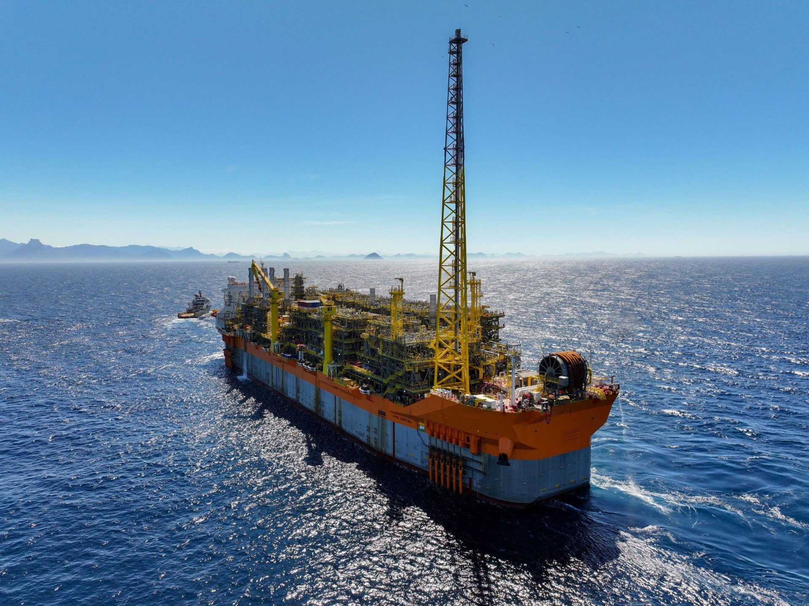
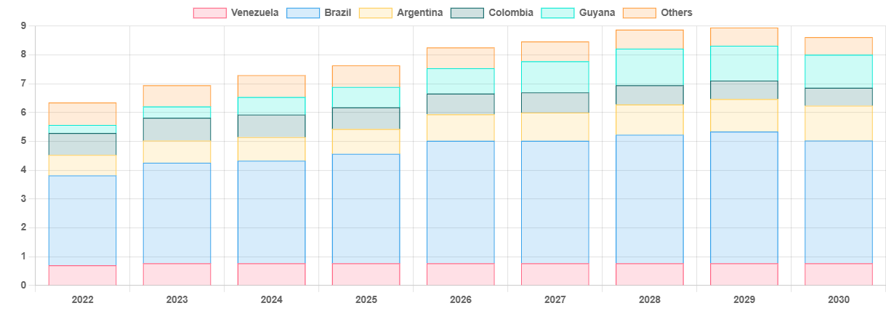

# South American Supply

**Date:** September 11, 2024  
**Publisher:** Breakwave Advisors | **Category:** Market Insights  
**Original URL:** [https://www.breakwaveadvisors.com/insights/2024/9/11/south-american-supply](https://www.breakwaveadvisors.com/insights/2024/9/11/south-american-supply)  

---

> **Figure 1: 241**  
> **Interactive Data & Source:** [Gibsons Co](https://www.gibsons.co.uk/report/cash-cow/) | [Local Asset](file:///C:/Users/Dell/Github/Shipping/corpus/03-breakwave/insights/2024/assets/2024-09-11_south-american-supply_img_241_4a326a3ee8bd.jpeg)

South America has been a major source of oil supply for decades. Traditional producers Colombia, Venezuela and Ecuador have all faced challenges in recent years, with Brazil and now Guyana being the leading sources of growth over the past decade.[**Argentina is set to join the VLCC exporters club**](https://www.gibsons.co.uk/report/cash-cow/), whilst Suriname aspires to replicate Guyana’s success story. On the refining side, however, the region has struggled to make any meaningful progress in recent years. South America is also a major producer of biofuel feedstocks and could increasingly use its agricultural prowess to meet future domestic fuel demand. Geopolitical forces also shape the region’s oil trade. Venezuela remains under sanctions, while Russia has increased its share in the continent’s oil market to the detriment of US refiners. So, what does all this mean for tankers?

Demand growth has been rocky. Prior to the pandemic, the economy struggled. Brazil’s GDP contracted during 2014-16, whilst Argentina has spent 6 out of the last 10 years in recession and also experienced hyperinflation. Venezuela has continued to decline under the weight of sanctions and authoritarian rule. By contrast, Guyana is in the midst of an oil-funded transformation but is too small to make any meaningful contribution to demand growth.

All of this combined means that despite the size of the continent, demand growth is likely to remain slow and steady in the years ahead. Aside from the pandemic, growth has typically been around 100kbd/year and is forecast to increase by just 400kbd by 2030 vs. 2024 levels. Little progress is being made in expanding refining capacity, which despite the limited growth in oil consumption, is modestly positive for the product tanker market. However, domestically produced biofuels and blending mandates will limit the gains in hydrocarbon imports. It also remains to be seen whether Russia will continue to grow its market share in the region to the expense of US refiners, who from next year may need to divert barrels away from Mexico as the Olmeca refinery ramps up.

Crude tankers are set to be the primary beneficiaries. Oil supply is forecast to grow by 1.3mbd by the end of the decade, with almost all of this growth heading for export given that refining throughput will grow by just 100kbd over the same period. Argentina plans to be begin VLCC exports by 2026, whilst Brazil and Guyana grow to the end of the decade, subject to additional upstream investment. Further upside potential could be seen if Venezuela is able to emerge from sanctions and reintegrate into the mainstream oil markets. Overall, the region remains a driver of tanker demand largely due to its export potential, with crude tankers likely to benefit to a greater extent than clean tankers.

### South American Crude Production (Kbd)

> **Figure 2: 245**  
> **Interactive Data & Source:** [Gibsons Co](https://www.gibsons.co.uk/market-reports) | [Local Asset](file:///C:/Users/Dell/Github/Shipping/corpus/03-breakwave/insights/2024/assets/2024-09-11_south-american-supply_img_245_6eecd786e83d.png)

Data source:[Gibson Shipbrokers](https://www.gibsons.co.uk/market-reports)

---

**Tags:** Tankers, Crude, Shipping  
