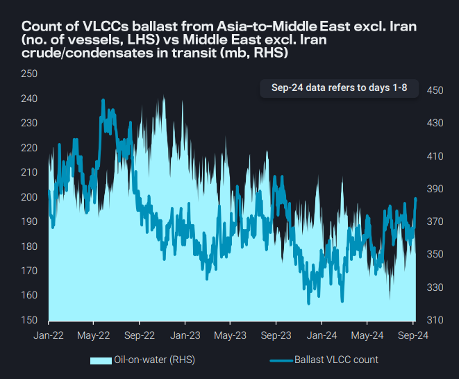
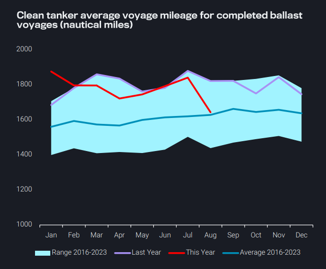
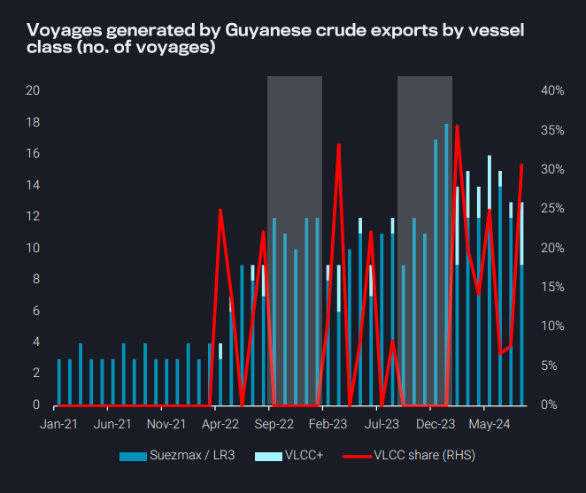
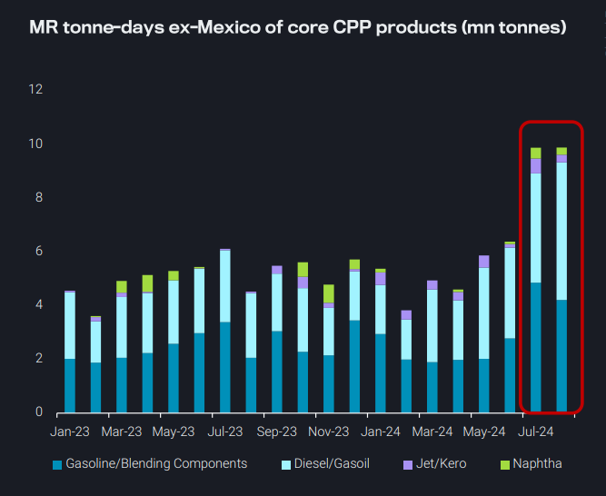

# Clean tanker mileage declines due to shorter ballast voyages

**Date:** September 12, 2024  
**Publisher:** Breakwave Advisors | **Category:** Market Insights  
**Original URL:** [https://www.breakwaveadvisors.com/insights/2024/9/12/clean-tanker-mileage-declines-due-to-shorter-ballast-voyages](https://www.breakwaveadvisors.com/insights/2024/9/12/clean-tanker-mileage-declines-due-to-shorter-ballast-voyages)  

---

- **Dirty – East of Suez:**VLCCs ballasting from Asia to MEG recover from record lows
- **Clean – East of Suez:**CPP voyage mileage declines 10% m-o-m as ballast LRs stay short-haul after long-haul laden voyages
- **Dirty – West of Suez:**VLCC seasonal ban in Guyana could generate up to 10 Suezmax voyages
- **Clean – West of Suez:**Robust refinery run rates increase intra-Mexico clean voyage counts, keeping MRs intra-regional

*By*[*Mary Melton*](https://www.linkedin.com/search/results/all/?fetchDeterministicClustersOnly=true&heroEntityKey=urn%3Ali%3Afsd_profile%3AACoAABXVyecBtg-pRnIrZe0BoWk0ygPiUfbvhsw&keywords=mary%20melton&origin=RICH_QUERY_SUGGESTION&position=0&searchId=40e8d7d2-c4d0-4022-81e7-176f6eba418b&sid=H_Y&spellCorrectionEnabled=false)

### Dirty – East of Suez: Vlccs Ballasting From Asia to MEG Recover From Record Lows

The number of VLCCs ballasting from Asia to the Middle East Gulf are on the rise, potentially bearish for VLCC rates given no expectations of any rise in bookings from the Middle East

This rise in ballast counts comes partly because of a seasonal uptick in China’s crude imports from the Middle East the previous month, and the corresponding rise in TD3C freight rates

➔ Voyages data show 82 crude/condensate-laden VLCCs departed in August from the Middle East for China, the total highest since April

➔ Nevertheless, total Middle East crude/condensate on water remains at historically low levels

Middle East VLCC rates could come under more pressure

➔ Recent announcements by OPEC+ to delay any lifting of production cuts to December limits the prospect of any increase in cargo availability

➔ Additionally, the recent narrowing in the Brent-Dubai spread could create opportunities for some VLCCs to load their next crude cargo from the Atlantic Basin

> **Figure 1: Screenshot 2024 09 12 12.46.49**  
> **Interactive Data & Source:** [Vortexa](https://www.vortexa.com//oil-gas-data-traders-analysts-data-scientists?gclid=Cj0KCQjw8_qRBhCXARIsAE2AtRZKOvMnbilZ_6_91d7huSFFy71pWLrnPwGwOHVzXsmsG-1a1mZnQw8aAt89EALw_wcB&hsa_acc=1782073842&hsa_ad=548425387665&hsa_cam=14746637662&hsa_grp=125038601902&hsa_kw=&hsa_mt=&hsa_net=adwords&hsa_src=g&hsa_tgt=dsa-1431852288425&hsa_ver=3&utm_campaign=%5BCD%5D%20-%20DSA%20-%20EMEA&utm_medium=cpc&utm_medium=ppc&utm_source=google&utm_source=adwords&utm_term=) | [Local Asset](file:///C:/Users/Dell/Github/Shipping/corpus/03-breakwave/insights/2024/assets/2024-09-12_clean-tanker-mileage-declines-due-to-shorter-ballast-voyages_img_screenshot2024-09-12124649_ede019ec7d47.png)

**Clean – East of Suez: CPP voyage mileage declines 10% m-o-m as ballast LRs stay short-haul after long-haul laden voyages**

Global clean tanker average voyage milage declined 10% m-o-m, because of declining LR voyages East-to-West, as well as a higher rate of short-haul intra-Northeast Asia MR voyages and fewer LR arrivals in East Asia

However, sharp declines in average voyage mileage for ballast vessels (see chart) have contributed the most to the decline in clean tanker voyage mileage

➔ This is mostly due to declines in ballast LR voyages Europe-toMiddle East, and to a lesser extent LRs discharging in NE Asia and staying in the region instead of returning to the Middle East

➔ Additionally, fewer MRs have ballasted from Brazil-to-Russia as Russian diesel arrivals have declined

The decline in ballast LRs from Europe to the Middle East stems from lower arrivals of middle distillates in July and August due to weak European demand, and therefore less vessels ballasting to the MEG

➔ However, we are also seeing early signs that some LRs are choosing to remain in Europe after discharge, likely due to vessel oversupply in the Middle East

> **Figure 2: Screenshot 2024 09 12 12.47.12**  
> **Interactive Data & Source:** [Vortexa](https://www.vortexa.com//oil-gas-data-traders-analysts-data-scientists?gclid=Cj0KCQjw8_qRBhCXARIsAE2AtRZKOvMnbilZ_6_91d7huSFFy71pWLrnPwGwOHVzXsmsG-1a1mZnQw8aAt89EALw_wcB&hsa_acc=1782073842&hsa_ad=548425387665&hsa_cam=14746637662&hsa_grp=125038601902&hsa_kw=&hsa_mt=&hsa_net=adwords&hsa_src=g&hsa_tgt=dsa-1431852288425&hsa_ver=3&utm_campaign=%5BCD%5D%20-%20DSA%20-%20EMEA&utm_medium=cpc&utm_medium=ppc&utm_source=google&utm_source=adwords&utm_term=) | [Local Asset](file:///C:/Users/Dell/Github/Shipping/corpus/03-breakwave/insights/2024/assets/2024-09-12_clean-tanker-mileage-declines-due-to-shorter-ballast-voyages_img_screenshot2024-09-12124712_1a7e50660f66.png)

### Dirty – West of Suez: VLCC Seasonal Ban in Guyana Could Generate Up to 10 Suezmax Voyages

A bright spot in the current freight market can be found in Suezmax tankers, where mainstream voyages (excluding Russian bbls) are at the top bound of the seasonal range

However, the structural shift of voyages heading towards Europe instead of Asia (excluding Russian bbls) and the rise of shuttling/lightering activities have resulted in a drop in mileage, in turn putting a cap on rates

Pockets of strength from the seasonal ban of VLCCs out of Guyana from September to at least January can provide support in the shortterm

➔ Up to 5 VLCCs/month have loaded from Guyana, primarily heading to Europe

➔ This could potentially be replaced by Suezmax tankers, adding up to an additional 10 voyages and increasing the segment’s utilisation out of the Atlantic Basin

> **Figure 3: Screenshot 2024 09 12 12.47.30**  
> **Interactive Data & Source:** [Vortexa](https://www.vortexa.com//oil-gas-data-traders-analysts-data-scientists?gclid=Cj0KCQjw8_qRBhCXARIsAE2AtRZKOvMnbilZ_6_91d7huSFFy71pWLrnPwGwOHVzXsmsG-1a1mZnQw8aAt89EALw_wcB&hsa_acc=1782073842&hsa_ad=548425387665&hsa_cam=14746637662&hsa_grp=125038601902&hsa_kw=&hsa_mt=&hsa_net=adwords&hsa_src=g&hsa_tgt=dsa-1431852288425&hsa_ver=3&utm_campaign=%5BCD%5D%20-%20DSA%20-%20EMEA&utm_medium=cpc&utm_medium=ppc&utm_source=google&utm_source=adwords&utm_term=) | [Local Asset](file:///C:/Users/Dell/Github/Shipping/corpus/03-breakwave/insights/2024/assets/2024-09-12_clean-tanker-mileage-declines-due-to-shorter-ballast-voyages_img_screenshot2024-09-12124730_0306adbc9892.png)

**Clean – West of Suez: Robust refinery run rates increase intra-Mexico clean voyage counts, keeping MRs intra-regional**

Relatively robust refinery runs in some of Mexico’s refineries in July have translated to higher intra-Mexico MR demand

➔ In addition to notable increases in tonne-days in Jul-Aug, intraMexico MR voyage counts increased by 50% in August compared to June

This is most pronounced in Mexico West Coast, where a decline in road fuel arrivals from PADD 3 this summer meant the region sourced cargoes from Asia

➔ PADD 3 refiners were incentivised to send cargoes short-haul, explaining why Mexico West Coast has turned to Asia

➔ At the same, time the market share of intra-West Coast Mexico voyages has risen steadily, especially as Asian arrivals experienced a temporary decline in August

Overall, Mexico’s MR demand has become more intra-regional and short-haul (with intra-Gulf of Mexico trade vs intra-West Coast trade)

➔ This is in line with the overall shift in the Americas MR market this summer, which has become more short-haul and fragmented of late

> **Figure 4: Screenshot 2024 09 12 12.47.43**  
> **Interactive Data & Source:** [Vortexa](https://www.vortexa.com//oil-gas-data-traders-analysts-data-scientists?gclid=Cj0KCQjw8_qRBhCXARIsAE2AtRZKOvMnbilZ_6_91d7huSFFy71pWLrnPwGwOHVzXsmsG-1a1mZnQw8aAt89EALw_wcB&hsa_acc=1782073842&hsa_ad=548425387665&hsa_cam=14746637662&hsa_grp=125038601902&hsa_kw=&hsa_mt=&hsa_net=adwords&hsa_src=g&hsa_tgt=dsa-1431852288425&hsa_ver=3&utm_campaign=%5BCD%5D%20-%20DSA%20-%20EMEA&utm_medium=cpc&utm_medium=ppc&utm_source=google&utm_source=adwords&utm_term=) | [Local Asset](file:///C:/Users/Dell/Github/Shipping/corpus/03-breakwave/insights/2024/assets/2024-09-12_clean-tanker-mileage-declines-due-to-shorter-ballast-voyages_img_screenshot2024-09-12124743_7308b04e8880.png)

Data Source:[Vortexa](https://www.vortexa.com//oil-gas-data-traders-analysts-data-scientists?gclid=Cj0KCQjw8_qRBhCXARIsAE2AtRZKOvMnbilZ_6_91d7huSFFy71pWLrnPwGwOHVzXsmsG-1a1mZnQw8aAt89EALw_wcB&hsa_acc=1782073842&hsa_ad=548425387665&hsa_cam=14746637662&hsa_grp=125038601902&hsa_kw=&hsa_mt=&hsa_net=adwords&hsa_src=g&hsa_tgt=dsa-1431852288425&hsa_ver=3&utm_campaign=%5BCD%5D%20-%20DSA%20-%20EMEA&utm_medium=cpc&utm_medium=ppc&utm_source=google&utm_source=adwords&utm_term=)

---

**Tags:** Crude, Tankers, Shipping  
