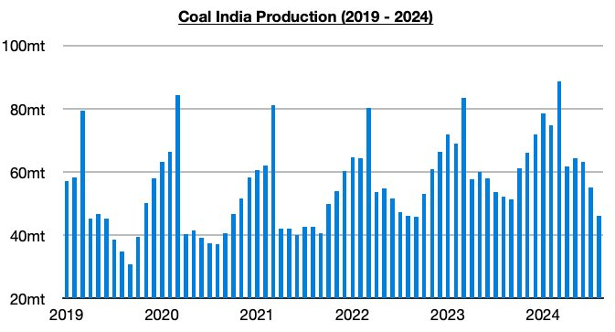
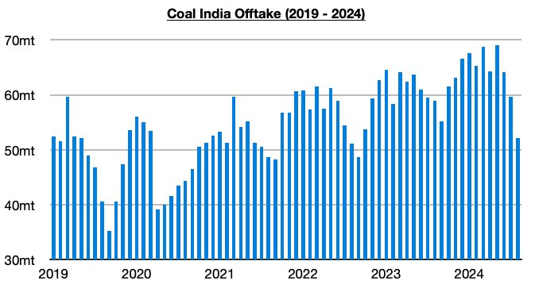

# Very Rare Contraction in Coal India's Production

**Date:** September 12, 2024  
**Publisher:** Breakwave Advisors | **Category:** Market Insights  
**Original URL:** [https://www.breakwaveadvisors.com/insights/2024/9/12/very-rare-contraction-in-coal-indias-production](https://www.breakwaveadvisors.com/insights/2024/9/12/very-rare-contraction-in-coal-indias-production)  

---

*By*[*Jeffrey Landsberg*](https://www.linkedin.com/in/jeffrey-landsberg-70ab957/)

Coal India produced approximately 46.1 million tons of coal last month, which marks a month-on-month decline of 8.9 million tons (-16%) and a year-on-year increase of 6.2 million tons (-12%). The year-on-year contraction is very rare. Previously, Coal India’s production had increased on a year-on-year basis during thirty-nine of the prior forty months. Also of note is that last month’s total has marked the lowest amount produced since September 2022. Very heavy rainfall at mines was a large factor behind last month’s weak production.

> **Figure 1: $1.jpeg**  
> [Local Asset](file:///C:/Users/Dell/Github/Shipping/corpus/03-breakwave/insights/2024/assets/2024-09-12_very-rare-contraction-in-coal-indias-production_img_241jpeg_4d1fb8c9b30e.jpg)

Offtake (amount sent to customers) totaled 52.1 million tons last month, which marks a month-on-month decline of 7.5 million tons (-13%) and a year-on-year decrease of 6.9 million tons (-12%). Previously, offtake had increased on a year-on-year basis during forty of the prior forty-one months. Very significant, though, is that offtake again exceeded production. Prior to the last five months, offtake came in less than production for five straight months, which caused Coal India’s stockpiles to rise during each of those months. With offtake again exceeding production last month, however, stockpiles have now fallen to approximately 72 million tons.

> **Figure 2: $2.jpeg**  
> [Local Asset](file:///C:/Users/Dell/Github/Shipping/corpus/03-breakwave/insights/2024/assets/2024-09-12_very-rare-contraction-in-coal-indias-production_img_242jpeg_fb78e941af77.jpg)

---

**Tags:** Drybulk, India, Coal  
