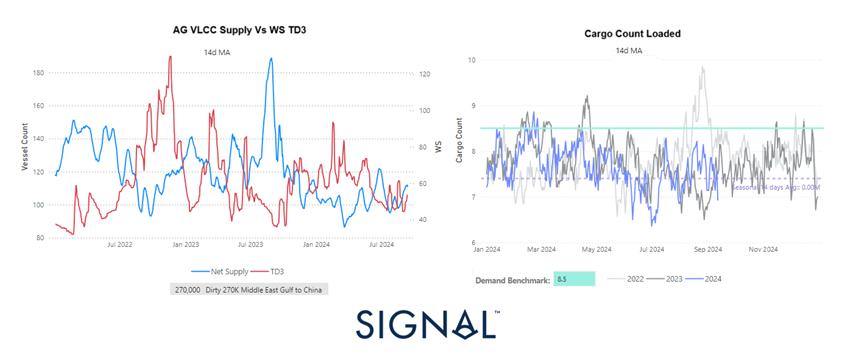
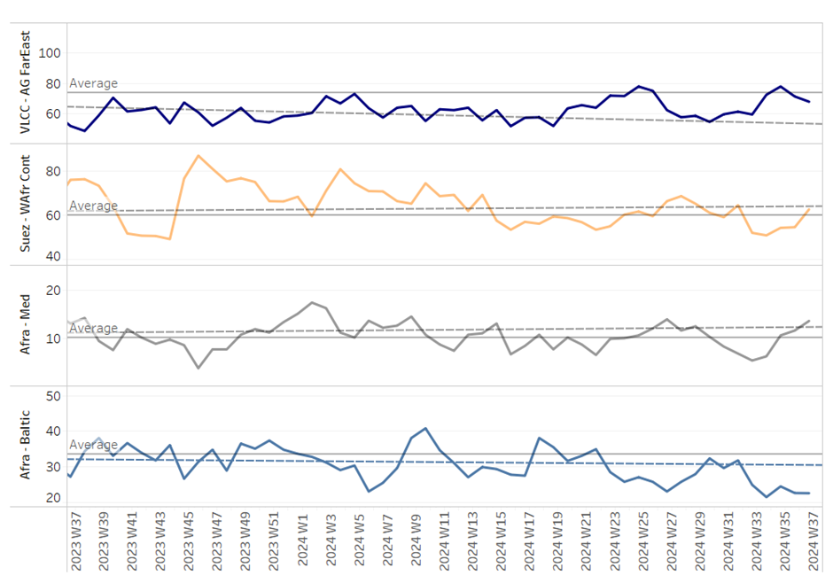
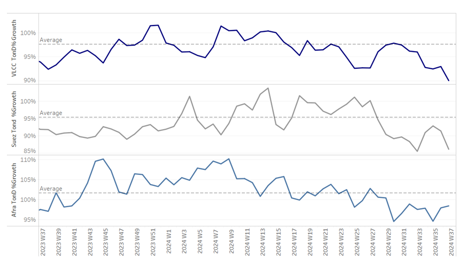

# Dirty Oil Shipments

**Date:** September 13, 2024  
**Publisher:** Breakwave Advisors | **Category:** Market Insights  
**Original URL:** [https://www.breakwaveadvisors.com/insights/2024/9/13/dirty-oil-shipments](https://www.breakwaveadvisors.com/insights/2024/9/13/dirty-oil-shipments)  

---

### Tanker - Weekly Market Monitor

Snapshot of Crude Freight Rates, Supply-Demand

Week 37, September 13, 2024

### Chart of the Week: Dirty Oil Shipments - Libya

*This week’s special focus is on the growth of VLCC AG supply for the first two weeks of September, as depicted in the left chart. The data shows promising signs of increasing supply, while WS rates are striving to establish firmer momentum. On the cargo side, illustrated in the right chart, the outlook appears more challenging. Recent activity continues to fall significantly below the demand benchmark, leading to uncertainty about the market's direction in the coming days of September.*

*The current imbalance between the supply of vessels and cargo demand raises concerns about the potential for a decreasing spread that could impact market firmness. As we approach the end of the third quarter, it remains to be seen whether this imbalance will correct itself or persist, influencing the stability and firmness of the freight market moving forward.*

### ​​​​​​

> **Figure 1: Screenshot 2024 09 13 14.34.06**  
> **Interactive Data & Source:** [Signal Ocean Platform](https://go.signalocean.com/e/983831/upply-to-China-in-October-html/2qjywd/435923930/h/C-bhrCSGJOIXwz21cP7KEJYmmQ5fu4NVnBP3AhlzbIw) | [Local Asset](file:///C:/Users/Dell/Github/Shipping/corpus/03-breakwave/insights/2024/assets/2024-09-13_dirty-oil-shipments_img_screenshot2024-09-13143406_ccb609323b7d.png)

This week, the oil market saw news of an increase in crude oil production from[Saudi Arabia.](https://go.signalocean.com/e/983831/upply-to-China-in-October-html/2qjywd/435923930/h/C-bhrCSGJOIXwz21cP7KEJYmmQ5fu4NVnBP3AhlzbIw)Saudi Arabia is anticipated to boost its crude oil supply to China in October, following a recent price cut for its oil sold in Asia. This move comes as the world's leading crude exporter seeks to strengthen its market share amid fluctuating global oil dynamics. According to trade sources cited by Reuters, the Kingdom plans to ship a total of 46 million barrels of crude to China next month, an increase from the estimated 43 million barrels expected to arrive in September.

This anticipated rise in supply reflects increased demand from China’s largest state-owned refiners, Sinopec and PetroChina. Both companies have reportedly requested additional volumes from Saudi Arabia to meet their refining needs for October. The adjustment in supply levels underscores the strategic role of Saudi Arabia in balancing global oil markets and responding to the evolving needs of major importers like China. As these developments unfold, they could have significant implications for regional oil trade and pricing dynamics.

### Section 1/ Freight

Market Rates (WS) ‘Dirty’ WS - Firmer​
VLCC - Suezmax - Aframax

Sentiment in the dirty freight market appears to be firming in the second week of September; however, current levels remain only marginally above the lows recorded during the summer season.

- The**VLCC**MEG-China freight rates rose to 50 WS, a weekly increase of 8%, and up 47% compared to the same week last September.
- Suezmax freight rates for shipments from**West Africa to continental Europe**climbed to 80 WS, reflecting an 8% increase compared to a month ago. On the Suezmax**Baltic-Mediterranean**route, rates have shown a relatively steady trend since the first week of September, also reaching 80 WS, marking a 3% increase on a weekly basis.
- Aframax**Mediterranean**freight rates are currently hovering around WS120, reflecting a 37% increase compared to the same week last year.

### Section 2/ Supply

### ‘Dirty’ (# Vessels) - Mixed

> **Figure 2: 241**  
> **Interactive Data & Source:** [Signal Ocean Platform](https://www.thesignalgroup.com/signal-ocean-platform) | [Local Asset](file:///C:/Users/Dell/Github/Shipping/corpus/03-breakwave/insights/2024/assets/2024-09-13_dirty-oil-shipments_img_241_ef9cbf9f34c0.png)

The supply of crude tankers showed an upward trend in the second week of September, exceeding the annual average on both the Suez West Africa and Aframax Mediterranean routes. In contrast, a downward trend was observed for VLCC activity on the Ras Tanura route.

- **VLCC Ras Tanura**: The number of ships has now dropped to 66, falling below the annual average and marking a decline of nearly 12 compared to levels observed two weeks ago.
- **Suezmax Waf**r: The current ship count stands at 62, confirming signs of an increase above the annual average of 60. This week's levels are 12 ships higher than three weeks ago.
- **Aframax Med**: The number of ships has increased to 13, surpassing the annual average and representing nearly a 50% rise compared to four weeks ago.
- **Aframax Baltic**: Since the end of week 32, there has been a downward trend, with current levels at around 23, 10 below the annual average.

### Section 3/ Demand (Tonne Days)

### ​​‘Dirty’ Decreasing

> **Figure 3: 242**  
> **Interactive Data & Source:** [Signal Ocean Platform](https://www.thesignalgroup.com/signal-ocean-platform) | [Local Asset](file:///C:/Users/Dell/Github/Shipping/corpus/03-breakwave/insights/2024/assets/2024-09-13_dirty-oil-shipments_img_242_83dbcab5a47c.png)

**Dirty**tonne days: The decrease in VLCC tonne-days growth has persisted through the first half of September, raising uncertainties about the long-term stability of firmness for dirty freight rates. This decline reflects a weakening demand for VLCCs, contributing to market volatility. Similarly, Suezmax tonne-days growth continues on a downward trajectory, amplifying concerns about sustained softness in this segment. In contrast, Aframax tonne-days growth is showing stronger signs of resilience, with potential for more stable or even rising freight rates in the near term. However, the overall market outlook remains uncertain as the contrasting trends across these tanker classes could signal a more complex supply-demand dynamic emerging in the weeks ahead.

Data Source:[Signal Ocean Platform](https://www.thesignalgroup.com/signal-ocean-platform)

---

**Tags:** Tankers, Shipping, Markets  
