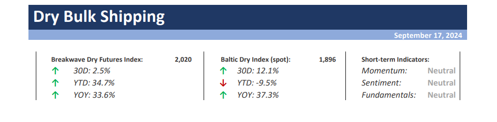
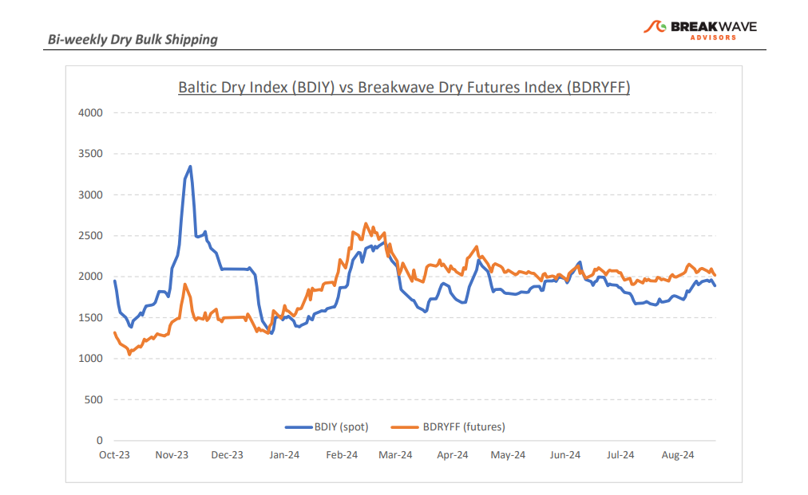
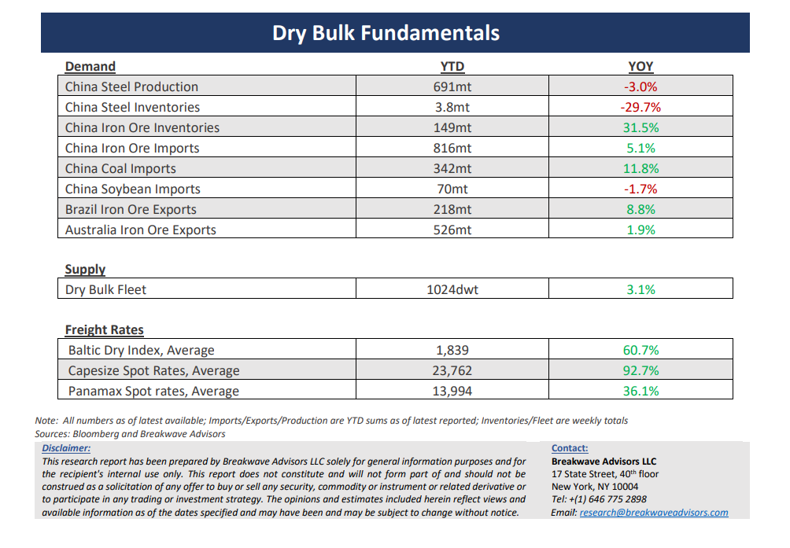

# Breakwave Bi-Weekly Dry Bulk Report - September 17, 2024

**Date:** September 17, 2024  
**Publisher:** Breakwave Advisors | **Category:** Market Insights  
**Original URL:** [https://www.breakwaveadvisors.com/insights/2024917dry-87w547](https://www.breakwaveadvisors.com/insights/2024917dry-87w547)  

---

> **Figure 1: Cea3cf84ceb9ceb3cebcceb9cf8ccf84cf85**  
> [Local Asset](file:///C:/Users/Dell/Github/Shipping/corpus/03-breakwave/insights/2024/assets/2024-09-17_2024917dry-87w547_img_cea3cf84ceb9ceb3cebcceb9cf8ccf84cf85_e60541f96391.png)

**· Capesize Rally Fizzles Out as Iron Ore Prices Drop**– Capesize rates eased after hitting**two-month highs**, as lower iron ore prices combined with recent soft Chinese economic data weighed on sentiment. A**cyclone**in the Pacific that directly hit Shanghai has led to some disruption in cargo flow and vessel positioning, but we expect any pricing impact to fade as the week progresses. Overall,**a stable market is to be expected**, with the futures curve in a slight contango and expectations for a strong winter market offsetting the bleak macro signals coming from China. The freight market**lacks catalysts**, and as a result, there is little for traders to focus on, other than the usual anticipated winter strength. With Capesize spot rates averaging in the mid-20,000 for the last six months, both owners and charterers have**adjusted their expectations**and thus an uncommonly stable market has emerged. It is difficult to see what will change the current balance, and although**history tells us**that such a**calm is unusual**for the otherwise volatile freight market, we also struggle to find a catalyst for a meaningful move either way. Will the relatively negative Chinese fundamentals constrain trade volumes and thus negatively affect rates or will the current geopolitical uncertainty and the Red Sea diversions continue to support a healthy market? The**next few months**involve several**major political events**that can shape future trade flows and indirectly affect the dry bulk market, and our feeling is that prior to the**upcoming US elections**little will happen to provide clarity on those important issues that will very likely shape the global shipping markets for the years to come.

**·****$90s is the New $100s, as Iron Ore Prices Find a New Support Level**– It usually takes a long period of time for fundamentals to progress to the point that prices react, and**iron ore has finally**come to**realization**that the**oversupplied market**will be an overhang for a long period of time during which a global rebalancing needs to take place. The high-cost junior miners in Brazil and Australia will need to reduce production, inventories in Chinese ports need to draw, and underlying steel production in China needs to find some support. All the above will take time, and thus we have a**hard time seeing any sustained recovery**in prices prior to such a rebalancing. Furthermore, we**suspect**that**iron ore prices**need to drop**even lower**as hope remains high that China will somehow manage to see a recovery in steel demand, something that unfortunately seems an unlikely scenario, in our view. Although new high-quality iron ore out of**West Africa**should**enter**then market in the**next 12-18 months**, thus aiding tonne-miles and dry bulk due to the distance factor,**volumes elsewhere**need to be significantly**reduced**to make room for the additional tonnes, with Australia being the preferred region for dry bulk owners due to the country’s proximity to China

**· Our Long-term View –**The last few years have been characterized by increased geopolitical uncertainty. Going forward, we expect such events to continue to affect global trade and have a meaningful impact on effective vessel supply. Combined with the potential for a multi-year cyclical rebound in China’s economic activity following the recent economic turmoil, dry bulk shipping should experience higher volatility on top of a secular tightness driven by increasing bulk commodity demand and a slower fleet growth owing to a relatively low orderbook.

> **Figure 2: Cea3cf84ceb9ceb3cebcceb9cf8ccf84cf85**  
> [Local Asset](file:///C:/Users/Dell/Github/Shipping/corpus/03-breakwave/insights/2024/assets/2024-09-17_2024917dry-87w547_img_cea3cf84ceb9ceb3cebcceb9cf8ccf84cf85_6dc270a3a739.png)

> **Figure 3: Cea3cf84ceb9ceb3cebcceb9cf8ccf84cf85**  
> [Local Asset](file:///C:/Users/Dell/Github/Shipping/corpus/03-breakwave/insights/2024/assets/2024-09-17_2024917dry-87w547_img_cea3cf84ceb9ceb3cebcceb9cf8ccf84cf85_8f001c00597b.png)

### Subscribe:
