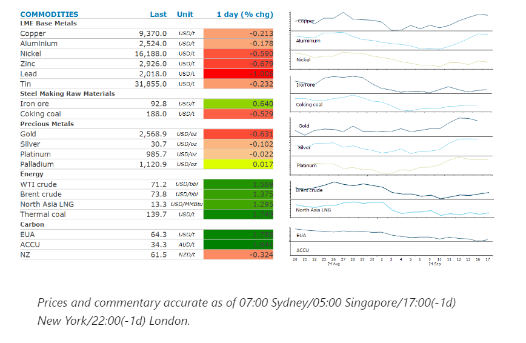
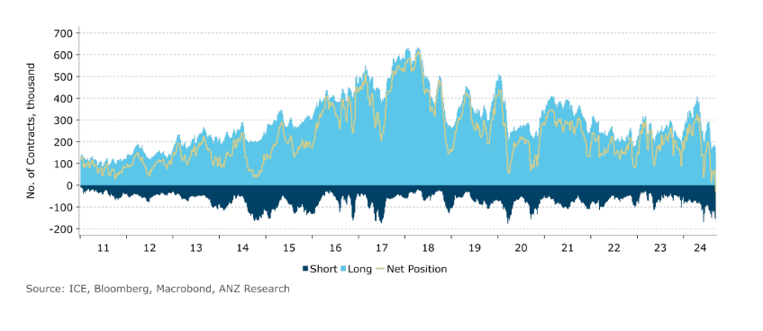

# Oil gains amid renewed tensions in the Middle East

**Date:** September 18, 2024  
**Publisher:** Breakwave Advisors | **Category:** Market Insights  
**Original URL:** [https://www.breakwaveadvisors.com/insights/2024/9/18/oil-gains-amid-renewed-tensions-in-the-middle-east](https://www.breakwaveadvisors.com/insights/2024/9/18/oil-gains-amid-renewed-tensions-in-the-middle-east)  

---

Markets were subdued as they look ahead to the FOMC meeting later this week. This was exacerbated by Chinese markets remaining closed.

*By*[*Daniel Hynes*](https://www.linkedin.com/in/dahynes/)

> **Figure 1: Στιγμιότυπο Οθόνης 2024 09 18 143408**  
> [Local Asset](file:///C:/Users/Dell/Github/Shipping/corpus/03-breakwave/insights/2024/assets/2024-09-18_oil-gains-amid-renewed-tensions-in-the-middle-east_img_cea3cf84ceb9ceb3cebcceb9cf8ccf84cf85_d52ea5683794.png)

### Market Commentary

**Crude oil**gained as prospects of easing monetary policy were exacerbated by ongoing supply-side issues. The prospect of oil demand being stimulated by a Fed rate cut helped boost sentiment. However, renewed tensions in the Middle East were also supportive on prices. Iran-backed Hezbollah accused Israel of orchestrating an attack that killed several people and left more than 2,700 wounded across Lebanon. This raised fears of an all-out war in the region. The gains occurred despite an increasingly bearish investors base. Bond markets are pricing in an aggressive 250bp of cuts to the federal funds rate, which only a full-scale recession would necessitate. This appears to be weighing on sentiment across the commodity complex, with markets such as crude oil tracking bond yields lower. This has seen speculative net long positions in Brent futures turn bearish for the first time. This extreme positioning is at odds with the current economic data. If recession fears diminish, cyclical asset classes such as oil would[**likely attract investor interest**](../pdfs/2024-09-18_oil-gains-amid-renewed-tensions-in-the-middle-east_commodity-call-bonded-to-bearishness_fa3c1c62894c.pdf).

Geopolitical risks were also in focus on global gas markets.**European gas**futures rebounded in Tuesday’s session as fighting between Russia and Ukraine intensifies in the Kursk area, home to a key cross-border gas transit point. An agreement to transit Russian fuel via Ukraine to Europe is also set to expire at the end of the year. This is raising concerns about supplies over the Northern Hemisphere winter. Even though storage facilities in the region are 93% full on average, the market remain susceptible to supply disruptions.**North Asia LNG**prices edge higher, despite supply risks easing. LNG exports from Malaysia appear to be recovering, after recent issues at Petronas’ Bintulu plant. Stronger demand was supportive, with high temperatures in Japan increasing electricity demand and putting pressure on the power grid.

**Copper**was little changed as the prospect of large rate cut by the US Federal Reserve was tempered by stronger than expected economic data. Industrial metals gained last week as the market increased its bets on a 50bp interest rate cut. However, retail sales in August managed to rise against expectations of a fall. Industrial production was also much stronger than expected. This lessens the need for an aggressive rate cut by the Fed. The market is also on edge as it awaits a response from Beijing following another month of poor economic data. Speculation remains rife that officials will announce further support measures once the country return to work following the Mid-Autumn Festival. Aluminium was higher in early trade as traders ponder further supply disruptions in the alumina market. A water storage pond at an alumina refinery in India collapsed, potentially removing more supply of the crucial raw material. Alumina prices have also surged higher.

**Gold**pulled back from its record high as traders digested the stronger than expected economic data. Investor demand was also crimped by a stronger USD and higher US Treasury yields. This was offset by some safe haven buying as tensions in the Middle East ratcheted up following the attack in Lebanon.

### Chart of the Day

Speculative net long positions in Brent futures hit all-time record low.

> **Figure 2: Στιγμιότυπο Οθόνης 2024 09 18 143453**  
> **Interactive Data & Source:** [Linkedin](https://www.linkedin.com/newsletters/commodities-wrap-6692196755876012032/?fbclid=IwAR3kiXJqZdxmp9ZcRwBNI7FsBySI-XSC0pfPur1qzjt7OZp7PTE59Tsl1QI) | [Local Asset](file:///C:/Users/Dell/Github/Shipping/corpus/03-breakwave/insights/2024/assets/2024-09-18_oil-gains-amid-renewed-tensions-in-the-middle-east_img_cea3cf84ceb9ceb3cebcceb9cf8ccf84cf85_d8633879d593.png)

Data source:[Commodities Wrap](https://www.linkedin.com/newsletters/commodities-wrap-6692196755876012032/?fbclid=IwAR3kiXJqZdxmp9ZcRwBNI7FsBySI-XSC0pfPur1qzjt7OZp7PTE59Tsl1QI)

---

**Tags:** Markets, Commodities, Shipping  
