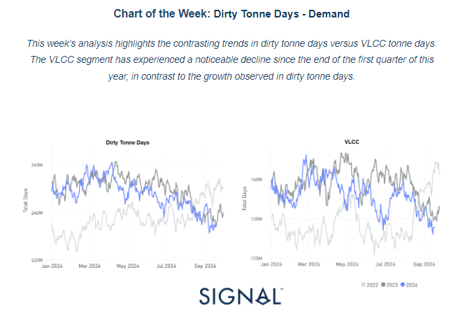
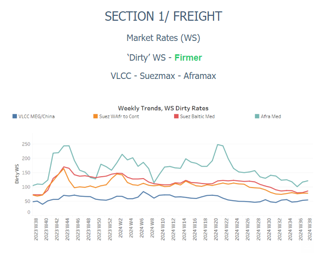
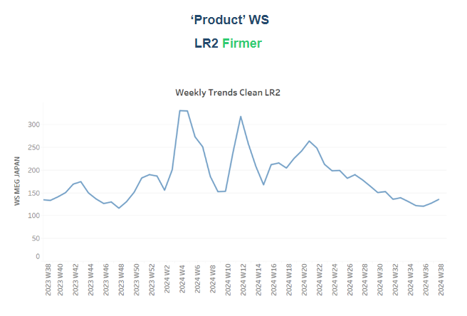
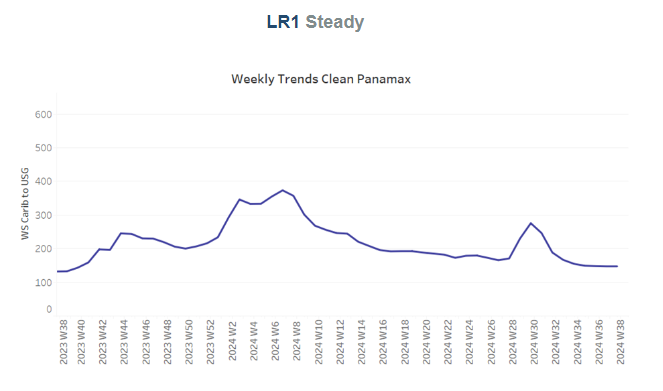
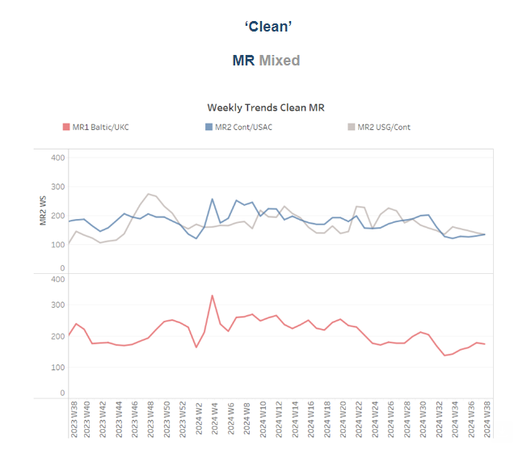
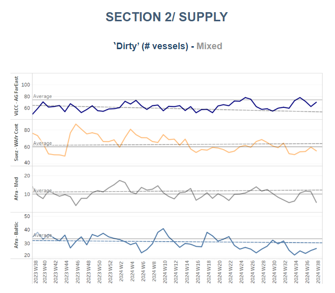
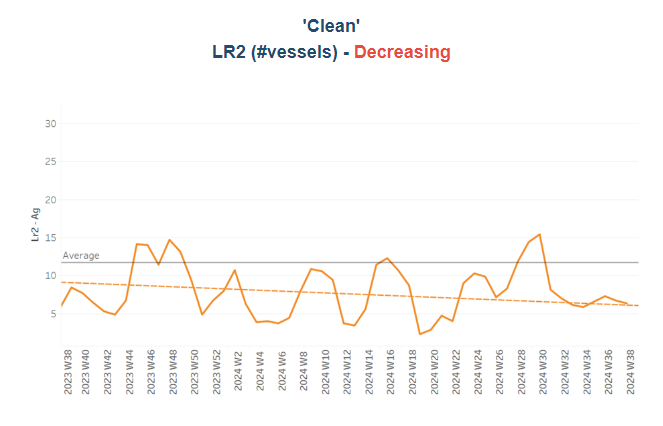
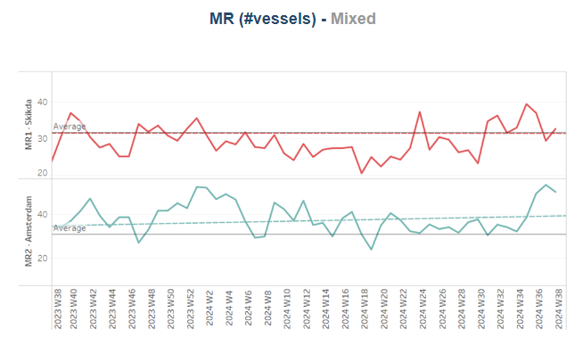
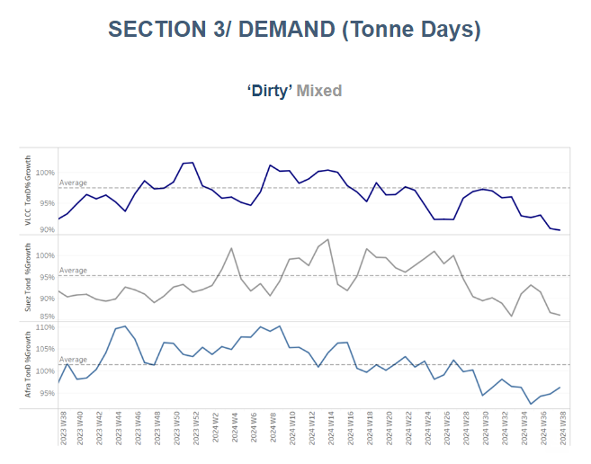
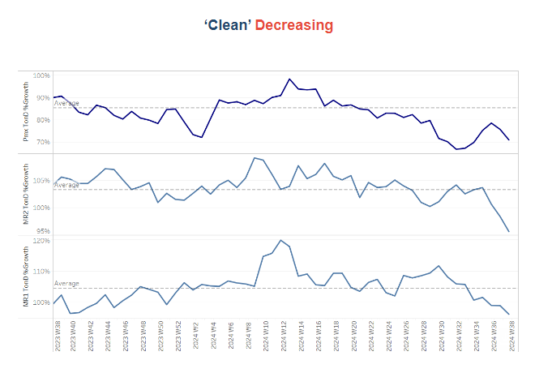

# Dirty Tonne Days - Demand

**Date:** September 20, 2024  
**Publisher:** Breakwave Advisors | **Category:** Market Insights  
**Original URL:** [https://www.breakwaveadvisors.com/insights/2024/9/20/dirty-tonne-days-demand](https://www.breakwaveadvisors.com/insights/2024/9/20/dirty-tonne-days-demand)  

---

### Tanker - Weekly Market Monitor

Snapshot of Crude and Product Freight Rates, Supply-Demand

Week 38, September 19, 2024

> **Figure 1: Στιγμιότυπο Οθόνης 2024 09 20 134802**  
> **Interactive Data & Source:** [Signal Ocean Platform](https://go.signalocean.com/e/983831/et-monitor-tanker-week-37-2024/2qkpcp/437595359/h/WQRn3cnabnE_EWFStdVpTuJi2CuBMihchgKQg2JIIsM) | [Local Asset](file:///C:/Users/Dell/Github/Shipping/corpus/03-breakwave/insights/2024/assets/2024-09-20_dirty-tonne-days-demand_img_cea3cf84ceb9ceb3cebcceb9cf8ccf84cf85_ec62102ee3dd.png)

This week’s special focus dives into the dynamics between dirty tonne days and VLCC tonne days. The data reveals a distinct downward trend in VLCC tonne days, particularly noticeable from the end of the first quarter of this year. This trend suggests a weakening in the VLCC segment, reflecting broader market challenges.

In contrast, the dirty tonne days experienced signs of recovery in early September. However, this increase was short-lived, as recent estimates indicate a renewed downward trend. The decline in VLCC tonne days is contributing to a generally bearish sentiment in the market.

On a more positive note, August concluded with a significant upward trend in seaborne crude oil shipments to China, a trend expected to continue as winter demand approaches. This uptick in shipments may provide some support to the market.[Last week](https://go.signalocean.com/e/983831/et-monitor-tanker-week-37-2024/2qkpcp/437595359/h/WQRn3cnabnE_EWFStdVpTuJi2CuBMihchgKQg2JIIsM), we analyzed the correlation between vessel supply and market rates in the VLCC AG sector. Our findings highlighted the ongoing challenge of meeting demand, as cargo activity for VLCC AG remains well below the desired benchmark. Despite some positive indicators, the overall outlook for the VLCC market remains cautious as we approach the last quarter of the year. The persistent imbalance between supply and demand suggests that market conditions may remain challenging.

In the oil market,[prices](https://go.signalocean.com/e/983831/t-market-sentiment-2024-09-19-/2qkpcs/437595359/h/WQRn3cnabnE_EWFStdVpTuJi2CuBMihchgKQg2JIIsM)have resumed an upward trajectory following a significant interest rate cut by the U.S. Federal Reserve. Last week, Brent crude dipped below $69—a year-low—but has since rebounded to above $74. At 1303 GMT, Brent crude futures were up 90 cents, or 1.2%, reaching $74.55 per barrel. Similarly, WTI crude futures for October rose by 88 cents, or 1.2%, to $71.79 per barrel. The U.S. central bank's decision to cut interest rates by half a percentage point on Wednesday has been a key driver behind this recovery. Typically, lower interest rates stimulate economic activity and boost energy demand. However, this move also signals potential concerns about a weakening U.S. labor market, which could slow economic growth. In contrast, persistent weak demand from China continues to exert downward pressure on oil prices. Data from the Chinese statistics bureau revealed that refinery output in China slowed for the fifth consecutive month in August. Additionally, China's industrial output growth fell to a five-month low last month, with further declines in retail sales and new home prices.

> **Figure 2: Στιγμιότυπο Οθόνης 2024 09 20 134928**  
> **Interactive Data & Source:** [Signal Ocean Platform](https://www.thesignalgroup.com/signal-ocean-platform) | [Local Asset](file:///C:/Users/Dell/Github/Shipping/corpus/03-breakwave/insights/2024/assets/2024-09-20_dirty-tonne-days-demand_img_cea3cf84ceb9ceb3cebcceb9cf8ccf84cf85_9a8c4090d58b.png)

​​​​​Sentiment in the dirty freight market remained strong in the third week of September, with current levels fueling optimism for a stronger fourth quarter.

- The**VLCC**MEG-China freight rates rose to 55 WS, a weekly increase of 3%, and up 30% compared to the same week last September.
- Suezmax freight rates for shipments from**West Africa**to**continental Europe**remained steady at 78 WS, reflecting similar market momentum compared to the same period last year. On the Suezmax**Baltic-Mediterranean**route, rates showed stronger momentum, reaching 88 WS, a 20% increase year-over-year.
- Aframax**Mediterranean**freight rates held steady around WS120 from mid-September, reflecting a 37% increase compared to the same week last year.

> **Figure 3: Στιγμιότυπο Οθόνης 2024 09 20 135028**  
> **Interactive Data & Source:** [Signal Ocean Platform](https://www.thesignalgroup.com/signal-ocean-platform) | [Local Asset](file:///C:/Users/Dell/Github/Shipping/corpus/03-breakwave/insights/2024/assets/2024-09-20_dirty-tonne-days-demand_img_cea3cf84ceb9ceb3cebcceb9cf8ccf84cf85_a8712a44832b.png)

- **LR2**AG freight rates are currently hovering around WS138, reflecting a 10% increase from the previous week and aligning with levels seen during the same week last year.

> **Figure 4: Στιγμιότυπο Οθόνης 2024 09 20 135121**  
> **Interactive Data & Source:** [Signal Ocean Platform](https://www.thesignalgroup.com/signal-ocean-platform) | [Local Asset](file:///C:/Users/Dell/Github/Shipping/corpus/03-breakwave/insights/2024/assets/2024-09-20_dirty-tonne-days-demand_img_cea3cf84ceb9ceb3cebcceb9cf8ccf84cf85_62920820c40c.png)

- **Panamax**Carib-to-USG rates held steady at WS148, representing an 11% increase compared to the same week last year.

> **Figure 5: Στιγμιότυπο Οθόνης 2024 09 20 135304**  
> **Interactive Data & Source:** [Signal Ocean Platform](https://www.thesignalgroup.com/signal-ocean-platform) | [Local Asset](file:///C:/Users/Dell/Github/Shipping/corpus/03-breakwave/insights/2024/assets/2024-09-20_dirty-tonne-days-demand_img_cea3cf84ceb9ceb3cebcceb9cf8ccf84cf85_8472fa9c4efb.png)

- **MR1**rates for shipments from the Baltic to the continent remained steady at WS180, reflecting a 24% increase over the past month and a 30% rise compared to the same week last year. Meanwhile,**MR2**rates for shipments from the Continent to the USAC rose to WS135, indicating a 4% increase over the past month, though they are now 20% lower compared to the same period last year. On the USG-Continent route,**MR2**rates have fallen to the same level as those from the**Continent to the USAC**, reflecting a 60% increase compared to the same period last year.

> **Figure 6: Στιγμιότυπο Οθόνης 2024 09 20 135409**  
> **Interactive Data & Source:** [Signal Ocean Platform](https://www.thesignalgroup.com/signal-ocean-platform) | [Local Asset](file:///C:/Users/Dell/Github/Shipping/corpus/03-breakwave/insights/2024/assets/2024-09-20_dirty-tonne-days-demand_img_cea3cf84ceb9ceb3cebcceb9cf8ccf84cf85_1ecf506681ee.png)

​​​​​​The supply of crude tankers declined during the third week of September on the Suez West Africa and Aframax Mediterranean routes, while a slight upward trend was observed in VLCC activity on the Ras Tanura route.

- **VLCC Ras Tanura**: The number of ships increased to 70, though it remains below the annual average. This marks a rise of nearly 10 compared to the levels observed the previous week.
- **Suezmax Wafr**: The current ship count stands at 55, confirming a decline below the annual average for the second half of the month.
- **Aframax Med**: The number of ships dropped to 5, representing nearly a 50% decrease compared to two weeks ago.
- **Aframax Baltic**: There has been an upward trend from the levels of two weeks ago, with current levels at around 26, 7 below the annual average.

> **Figure 7: Στιγμιότυπο Οθόνης 2024 09 20 135457**  
> **Interactive Data & Source:** [Signal Ocean Platform](https://www.thesignalgroup.com/signal-ocean-platform) | [Local Asset](file:///C:/Users/Dell/Github/Shipping/corpus/03-breakwave/insights/2024/assets/2024-09-20_dirty-tonne-days-demand_img_cea3cf84ceb9ceb3cebcceb9cf8ccf84cf85_4e42fca35fb0.png)

> **Figure 8: Στιγμιότυπο Οθόνης 2024 09 20 135511**  
> **Interactive Data & Source:** [Signal Ocean Platform](https://www.thesignalgroup.com/signal-ocean-platform) | [Local Asset](file:///C:/Users/Dell/Github/Shipping/corpus/03-breakwave/insights/2024/assets/2024-09-20_dirty-tonne-days-demand_img_cea3cf84ceb9ceb3cebcceb9cf8ccf84cf85_ed1643eb1c4f.png)

- **Clean LR2 AG Jubail**: The downward trend continued into the third week of September, with vessel numbers dropping to 6. This confirms indications of activity falling below the annual average for the month.

- **Clean MR**: At Algeria's Skikda port, vessel numbers slightly surpassed the annual average of 32 in the third week of September, though this is nearly 7 fewer than the total recorded at the end of week 34. Meanwhile, in Amsterdam, MR2 activity continued its significant rise since the end of week 34, recently reaching 50 vessels—approximately 20 above the annual average.

> **Figure 9: Στιγμιότυπο Οθόνης 2024 09 20 135638**  
> **Interactive Data & Source:** [Signal Ocean Platform](https://www.thesignalgroup.com/signal-ocean-platform) | [Local Asset](file:///C:/Users/Dell/Github/Shipping/corpus/03-breakwave/insights/2024/assets/2024-09-20_dirty-tonne-days-demand_img_cea3cf84ceb9ceb3cebcceb9cf8ccf84cf85_443175b13823.png)

- **Dirty**tonne days: The decrease in VLCC tonne-days growth has persisted through the first half of September extending the weakening trend for the second half of the month, and strengthening uncertainties about the recovery for dirty freight rates in the fourth quarter of the year with the winter season. Similarly, Suezmax tonne-days growth continued on a downward trajectory, whereas signs for a higher growth of tonne days emerged in the Aframax segment lately, but still recent estimates are below the annual trend.

> **Figure 10: Στιγμιότυπο Οθόνης 2024 09 20 135731**  
> **Interactive Data & Source:** [Signal Ocean Platform](https://www.thesignalgroup.com/signal-ocean-platform) | [Local Asset](file:///C:/Users/Dell/Github/Shipping/corpus/03-breakwave/insights/2024/assets/2024-09-20_dirty-tonne-days-demand_img_cea3cf84ceb9ceb3cebcceb9cf8ccf84cf85_b9f9bc3d40f9.png)

- **Panamax**tonne days: The growth rate continues to fall below the annual average, with a downward trend observed in the second half of September. In terms of clean MR tonne-days, the growth rate for both MR1 and MR2 vessel sizes has further declined, remaining under the annual average and hitting one of the lowest levels in the past twelve months. It appears that September will close with an overall weakening trend in clean tonne-day growth.

Data Source:[Signal Ocean Platform](https://www.thesignalgroup.com/signal-ocean-platform)

---

**Tags:** Tankers, Shipping, Markets  
