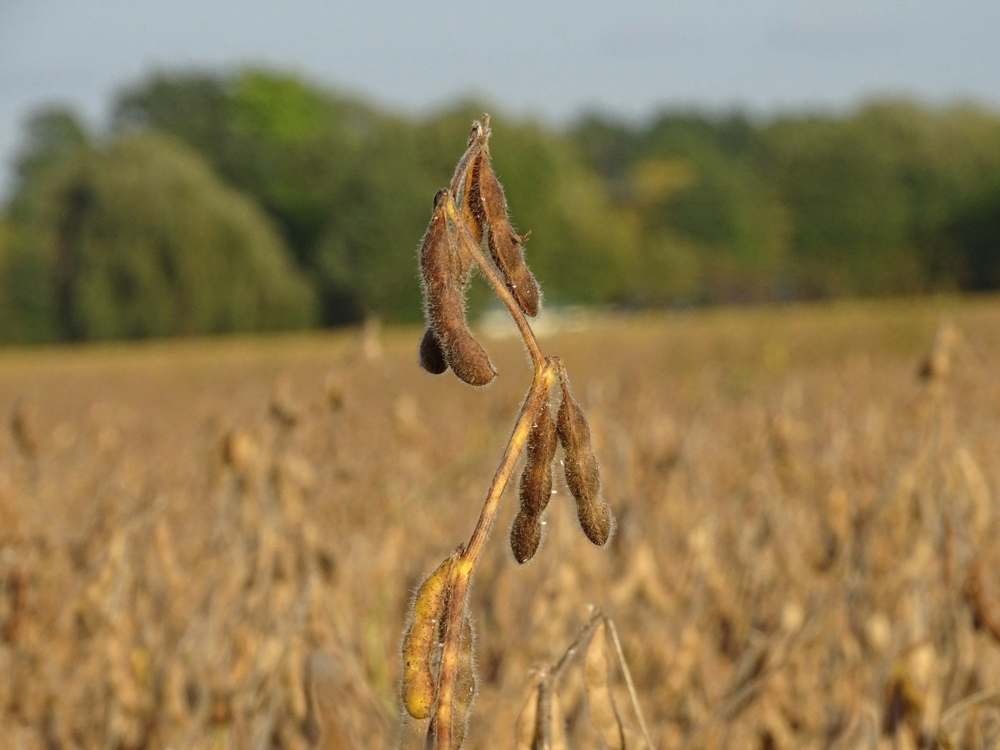
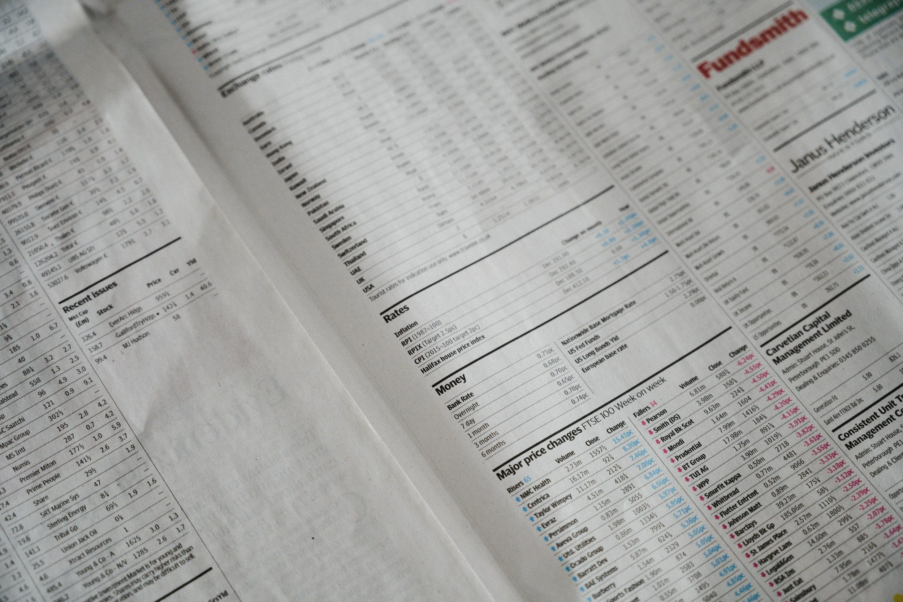

# Breakwave Weekend Read

**Date:** September 21, 2024  
**Publisher:** Breakwave Advisors | **Category:** Market Insights  
**Original URL:** [https://www.breakwaveadvisors.com/insights/2024/9/20/breakwave-weekend-read](https://www.breakwaveadvisors.com/insights/2024/9/20/breakwave-weekend-read)  

---

## Welcome Tobreakwave Advisorsweekend Read

As we conclude the workweek and head into the weekend, take a moment to review the key articles from this week, including those you've highlighted.[The dry bulk market enters a more cautious phase](https://www.breakwaveadvisors.com/insights/2024/9/16/the-dry-bulk-market-enters-a-more-cautious-phase),[Grain dry bulk flows to China](https://www.breakwaveadvisors.com/insights/2024/9/19/grain-dry-bulk-flows-to-china),[Small impact on VLCCs from OPEC+ production cuts phase-out delay](https://www.breakwaveadvisors.com/insights/2024/9/19/small-impact-on-vlccs-from-opec-production-cuts-phase-out-delay)and more.

## Breakwave Dry Bulk Report

**Capesize Rally Fizzles Out as Iron Ore Prices Drop**– Capesize rates**eased**after hitting**two-month highs**, as lower iron ore prices combined with recent soft Chinese economic data weighed on sentiment.

[Read More](https://www.breakwaveadvisors.com/insights/2024917dry-87w547)

> **Figure 1: Στιγμιότυπο Οθόνης 2024 09 17 133649**  
> **Interactive Data & Source:** [Breakwave Advisors Market Insights](https://www.breakwaveadvisors.com/insights/2024/9/16/the-dry-bulk-market-enters-a-more-cautious-phase) | [Local Asset](file:///C:/Users/Dell/Github/Shipping/corpus/03-breakwave/insights/2024/assets/2024-09-21_breakwave-weekend-read_img_cea3cf84ceb9ceb3cebcceb9cf8ccf84cf85_e60541f96391.png)

## The Dry Bulk Market Enters a More Cautious Phase

> **Figure 2: Unsplash Image Ta2jr08b5ru**  
> **Interactive Data & Source:** [Breakwave Advisors Market Insights](https://www.breakwaveadvisors.com/insights/2024/9/16/the-dry-bulk-market-enters-a-more-cautious-phase) | [Local Asset](file:///C:/Users/Dell/Github/Shipping/corpus/03-breakwave/insights/2024/assets/2024-09-21_breakwave-weekend-read_img_unsplash-image-ta2jr08b5ru_d0be48933dd5.jpg)

So far, it’s certainly been a ‘year of the Dragon’ for sale and purchase,

Doric Weekly Market Insight

## Signs of Improving Demand Boosts Sentiment

> **Figure 3: Unsplash Image Tuvf65kivpi**  
> **Interactive Data & Source:** [Breakwave Advisors Market Insights](https://www.breakwaveadvisors.com/insights/2024/9/16/signs-of-improving-demand-boosts-sentiment) | [Local Asset](file:///C:/Users/Dell/Github/Shipping/corpus/03-breakwave/insights/2024/assets/2024-09-21_breakwave-weekend-read_img_unsplash-image-tuvf65kivpi_db543297db4d.jpg)

Metal markets gained amid signs of improving demand.

Commodities Wrap

## Grains and Metals Among the Winners

> **Figure 4: Market Chart 4**  
> **Interactive Data & Source:** [Breakwave Advisors Market Insights](https://www.breakwaveadvisors.com/insights/2024/9/17/efgm01vh0bpgozwqelqzk06yx1wcyo) | [Local Asset](file:///C:/Users/Dell/Github/Shipping/corpus/03-breakwave/insights/2024/assets/2024-09-21_breakwave-weekend-read_img_image-asset_18117eccf045.jpeg)

Despite robust gains for the panamax freight indicator, the Baltic Dry Index ended a run of weekly gains

[Read More](https://www.breakwaveadvisors.com/insights/2024/9/17/efgm01vh0bpgozwqelqzk06yx1wcyo)

The Fix - Global Market Update

## The United States Is Forecasted to Achieve a Record Soybean Production

> **Figure 5: Unsplash Image Ebpgdyockiq**  
> **Interactive Data & Source:** [Breakwave Advisors Market Insights](https://www.breakwaveadvisors.com/insights/2024/9/18/wwh003pdfy7cdnp3lt9xbzmdu9cd9y) | [Local Asset](file:///C:/Users/Dell/Github/Shipping/corpus/03-breakwave/insights/2024/assets/2024-09-21_breakwave-weekend-read_img_unsplash-image-ebpgdyockiq_b2e0be94e9af.jpg)

According to the latest USDA report, released on September 12th, the United States is forecasted to achieve a record soybean production of 124.90 million tonnes..

[Read More](https://www.breakwaveadvisors.com/insights/2024/9/18/wwh003pdfy7cdnp3lt9xbzmdu9cd9y)

Intermodal Weekly Market Report

## Oil Gains Amid Renewed Tensions in the Middle East

> **Figure 6: Unsplash Image Ybh79nojwuo**  
> **Interactive Data & Source:** [Breakwave Advisors Market Insights](https://www.breakwaveadvisors.com/insights/2024/9/18/oil-gains-amid-renewed-tensions-in-the-middle-east) | [Local Asset](file:///C:/Users/Dell/Github/Shipping/corpus/03-breakwave/insights/2024/assets/2024-09-21_breakwave-weekend-read_img_unsplash-image-ybh79nojwuo_872d1b2c4554.jpg)

Markets were subdued as they look ahead to the FOMC meeting later this week.

[Read More](https://www.breakwaveadvisors.com/insights/2024/9/18/oil-gains-amid-renewed-tensions-in-the-middle-east)

Commodities Wrap

## Solid Week for Dry Bulk Market Last Week, But Fleet Continues to Grow

> **Figure 7: Panamax+united+maritime**  
> **Interactive Data & Source:** [Breakwave Advisors Market Insights](https://www.breakwaveadvisors.com/insights/2024/9/19/solid-week-for-dry-bulk-market-last-week-but-fleet-continues-to-grow) | [Local Asset](file:///C:/Users/Dell/Github/Shipping/corpus/03-breakwave/insights/2024/assets/2024-09-21_breakwave-weekend-read_img_panamax2bunited2bmaritime_16bd3431859c.jpeg)

Dry bulk rates were mixed last week, with panamax and supramax rates rising while capesize and handysize rates declined.

From Commodore's Weekly Dry Bulk Reports

## Grain Dry Bulk Flows to China

> **Figure 8: Unsplash Image Zhcztgbmy2w**  
> **Interactive Data & Source:** [Breakwave Advisors Market Insights](https://www.breakwaveadvisors.com/insights/2024/9/19/grain-dry-bulk-flows-to-china) | [Local Asset](file:///C:/Users/Dell/Github/Shipping/corpus/03-breakwave/insights/2024/assets/2024-09-21_breakwave-weekend-read_img_unsplash-image-zhcztgbmy2w_8db609159a14.jpg)

The special focus this week is on the monthly quantity of soybeans and corn exported to China..

[Read More](https://www.breakwaveadvisors.com/insights/2024/9/19/grain-dry-bulk-flows-to-china)

Signal Ocean - Dry Weekly Market Monitor

## Small Impact on Vlccs From OPEC+ Production Cuts Phase-Out Delay

> **Figure 9: Pexels Earl Andre Roca 530105282 16737194**  
> **Interactive Data & Source:** [Breakwave Advisors Market Insights](https://www.breakwaveadvisors.com/insights/2024/9/19/small-impact-on-vlccs-from-opec-production-cuts-phase-out-delay) | [Local Asset](file:///C:/Users/Dell/Github/Shipping/corpus/03-breakwave/insights/2024/assets/2024-09-21_breakwave-weekend-read_img_pexels-earl-andre-roca-530105282-167_1b1e4a1b171c.jpg)

Currently, VLCC utilisation from OPEC+ origins is below the 12-month average at a time when VLCC utilisation is lacklustre globally..

[Read More](https://www.breakwaveadvisors.com/insights/2024/9/19/small-impact-on-vlccs-from-opec-production-cuts-phase-out-delay)

Vortexa - Global Freight Snapshot

## The Fed Cut Rates Aggressively. Now What?

> **Figure 10: Unsplash Image Tuj3txsayco**  
> **Interactive Data & Source:** [Breakwave Advisors Market Insights](https://www.breakwaveadvisors.com/insights/2024/9/20/nb9rr2flr4gay47vhkljl8yz7g28i4) | [Local Asset](file:///C:/Users/Dell/Github/Shipping/corpus/03-breakwave/insights/2024/assets/2024-09-21_breakwave-weekend-read_img_unsplash-image-tuj3txsayco_a4dce21e0bdf.jpg)

The US Federal Reserve came under severe criticism in 2022, for underestimating inflation and allowing it to run off.

Forvis Mazars Weekly Note

## Dirty Tonne Days - Demand

> **Figure 11: Unsplash Image Zn Brvyessm**  
> **Interactive Data & Source:** [Breakwave Advisors Market Insights](https://www.breakwaveadvisors.com/insights/2024/9/20/dirty-tonne-days-demand) | [Local Asset](file:///C:/Users/Dell/Github/Shipping/corpus/03-breakwave/insights/2024/assets/2024-09-21_breakwave-weekend-read_img_unsplash-image-zn-brvyessm_75359e73e5d1.jpg)

This week’s special focus dives into the dynamics between dirty tonne days and VLCC tonne days.

Signal Ocean - Tanker Weekly Market Monitor

## Iron Ore: One of the Better Performers

> **Figure 12: Seanergy+hellasship**  
> **Interactive Data & Source:** [Breakwave Advisors Market Insights](https://www.breakwaveadvisors.com/insights/2024/9/20/iron-ore-one-of-the-better-performers) | [Local Asset](file:///C:/Users/Dell/Github/Shipping/corpus/03-breakwave/insights/2024/assets/2024-09-21_breakwave-weekend-read_img_seanergy2bhellasship_72198e916205.jpg)

The Baltic Dry Index delivered a solid gain on Thursday amid gains for all segments.

The Fix - Global Market Update

---

**Tags:** Shipping, Tankers, Drybulk  
