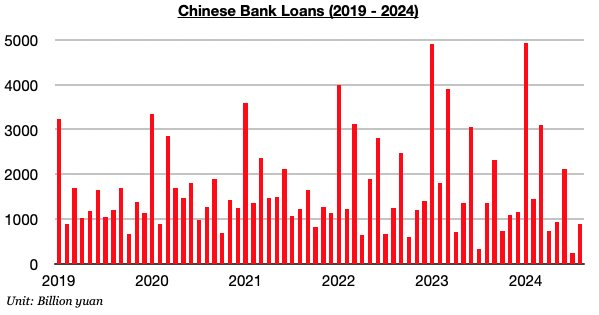
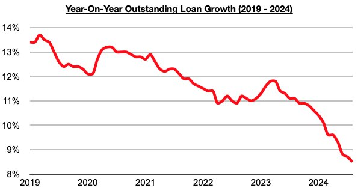

# China's Outstanding Loan Growth Has Set Another Record Low

**Date:** September 23, 2024  
**Publisher:** Breakwave Advisors | **Category:** Market Insights  
**Original URL:** [https://www.breakwaveadvisors.com/insights/2024/9/23/chinas-outstanding-loan-growth-has-set-another-record-low](https://www.breakwaveadvisors.com/insights/2024/9/23/chinas-outstanding-loan-growth-has-set-another-record-low)  

---

*By*[*Jeffrey Landsberg*](https://www.linkedin.com/in/jeffrey-landsberg-70ab957/)

As we discussed in Commodore Research's most recent Weekly China Report, Chinese banks issued 900 billion yuan in new loans in August. This has marked a month-on-month increase of 640 billion yuan (-246%) but is down year-on-year by 460 billion yuan (-34%. Through the first eight months of the year, new lending has declined year-on-year by 3.01 trillion yuan (-17%). In comparison, during all of last year new lending increased year-on-year by 1.43 trillion yuan (7%).

> **Figure 1: Chart 1 (1)**  
> [Local Asset](file:///C:/Users/Dell/Github/Shipping/corpus/03-breakwave/insights/2024/assets/2024-09-23_chinas-outstanding-loan-growth-has-set-another-record-low_img_chart128129_b38a4bd5cc5f.jpg)

With new loans again contracting on a year-on-year basis last month, outstanding loan growth has fallen to 8.5%.**This again marks the lowest outstanding loan growth seen since tracking began in 1998.**Overall, the central government this year is continuing to work on letting air out of the nation’s grossly inflated debt bubble. It is definitely still finding success here -- but at the expense of economic growth. As we have also stressed often in our work, there is no actual robust market for new housing and housing-related loans in China. SHIBOR lending rates remain low as we have continued to provide updates on in our Weekly China Reports, but there remain relatively few projects for new lending to actually go to.

> **Figure 2: Chart 2**  
> [Local Asset](file:///C:/Users/Dell/Github/Shipping/corpus/03-breakwave/insights/2024/assets/2024-09-23_chinas-outstanding-loan-growth-has-set-another-record-low_img_chart2_393761984317.jpg)

---

**Tags:** China, Economy, Markets  
