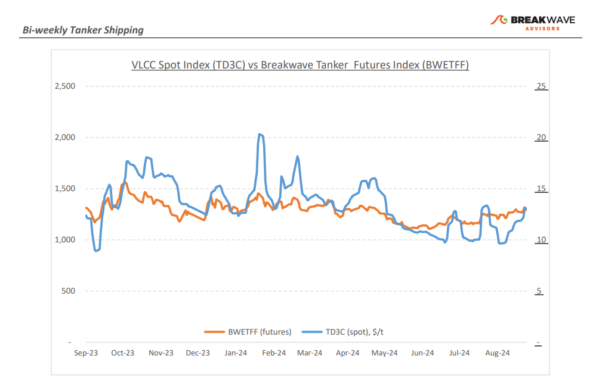
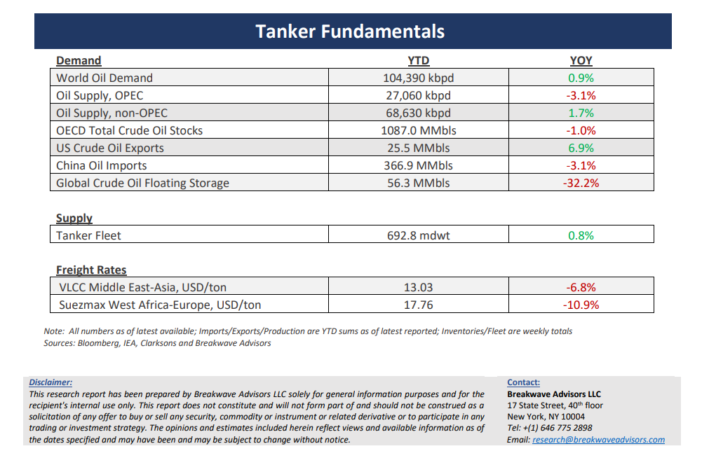

# Breakwave Bi-Weekly Tanker Report - September 24, 2024

**Date:** September 24, 2024  
**Publisher:** Breakwave Advisors | **Category:** Market Insights  
**Original URL:** [https://www.breakwaveadvisors.com/insights/2024924wet-87578j](https://www.breakwaveadvisors.com/insights/2024924wet-87578j)  

---

> **Figure 1: Cea3cf84ceb9ceb3cebcceb9cf8ccf84cf85**  
> [Local Asset](file:///C:/Users/Dell/Github/Shipping/corpus/03-breakwave/insights/2024/assets/2024-09-24_2024924wet-87578j_img_cea3cf84ceb9ceb3cebcceb9cf8ccf84cf85_5bc148f4cbbf.png)

•**VLCC Market Strengthens on the Back of Increasing Inquiry as Hopes for a Winter Recovery Resurface**– The recovery of the VLCC (Very Large Crude Carrier) market gained momentum starting in early September, with a notable firming by the end of the third week, driven by a surge in enquiries. The improvement in rates is largely due to vessel owners managing to finally push rates above previous levels, bolstered by a limited number of such owners controlling much of the available tonnage for early-month cargoes. Adverse weather in China and India, including terminal delays caused by monsoon conditions, further tightened vessel supply. On the other hand, a weak oil market is increasing charterers' concerns about balancing costs and availability, which could temper the current upward trajectory. Yet, market confidence remains high, particularly with rising vessel demand in the Atlantic expected to sustain upward pressure on freight rates through the remainder of September. In the West African market, a similar pattern of tightening vessel availability has driven up freight rates as some owners have shifted their ships to the stronger Arabian Gulf (AG) market, reducing tonnage in West Africa. Looking ahead to the winter season, sentiment remains bullish for further VLCC rate gains, with the AG market likely setting the stage for a robust fourth quarter and owners well positioned to push for improvement. The October fixing window will be an early indicator of the winter market’s strength, and while dramatic surges may be premature, current conditions suggest a potentially healthy outlook and increasing signs of some much-needed volatility.

•**The Time has Come for OPEC to Defend its Market Share as Global Crude Oil Demand Growth Stalls**– A slowdown in oil demand in China could have a ripple effect on the future structure of the oil market, something that we view as our base case scenario for the next several years. After decades of an expanding oil market due to China’s strong appetite, where both OPEC and non-OPEC producers had enjoyed significant production gains, an ongoing secular shift away from transportation fuels, which is now also touching China, is causing crude oil demand to come to standstill and possibly even start to decline in the near future. As a result, with sizable oil production growth expected in the next several years out of non-OPEC countries, the very oil-dependent OPEC might soon abandon its price defending strategy and instead aim at maintaining or expanding its market share of the “pie” of a global oil market that is steady and later might even begin to shrink. In order to achieve such a strategy, oil prices need to establish a new, lower range so the high-cost US shale industry starts to operate at a loss and thus is forced to reduce production rates. Such a fundamental shift in the global oil market should also see the futures curve turn into contango, much like it did in 2015, in the process incentivizing storage but also adding more oil in the water which in turn will lead to higher freight rates for crude oil tankers, mirroring the strong tanker market we experienced in the middle of the past decade.

•**Our Long-term View –**The tanker market is recovering from a long period of staggered rates as the growth in new vessel supply shrinks while oil demand is recovering in line with the global economy. A historically low orderbook combined with favorable demand fundamentals should continue to support increased spot rate volatility, which combined with the ongoing geopolitical turmoil, should support freight rates in the medium to long term.

> **Figure 2: Cea3cf84ceb9ceb3cebcceb9cf8ccf84cf85**  
> [Local Asset](file:///C:/Users/Dell/Github/Shipping/corpus/03-breakwave/insights/2024/assets/2024-09-24_2024924wet-87578j_img_cea3cf84ceb9ceb3cebcceb9cf8ccf84cf85_1bfe831116ec.png)

> **Figure 3: Cea3cf84ceb9ceb3cebcceb9cf8ccf84cf85**  
> [Local Asset](file:///C:/Users/Dell/Github/Shipping/corpus/03-breakwave/insights/2024/assets/2024-09-24_2024924wet-87578j_img_cea3cf84ceb9ceb3cebcceb9cf8ccf84cf85_dc025c7621f2.png)

### Subscribe:
