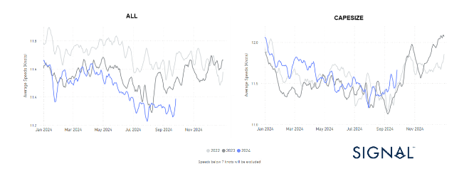
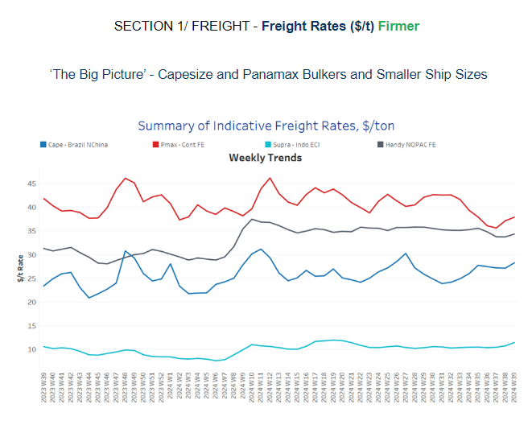
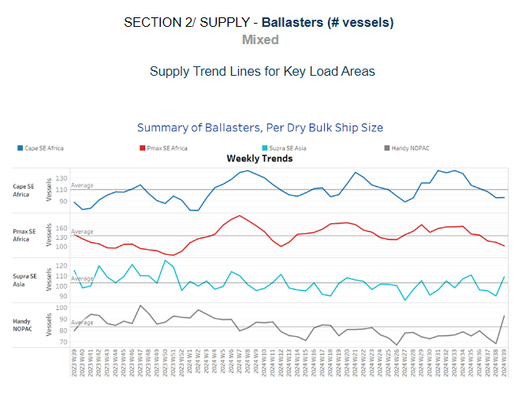
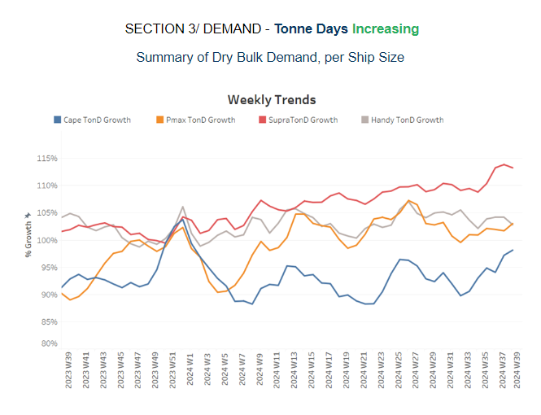
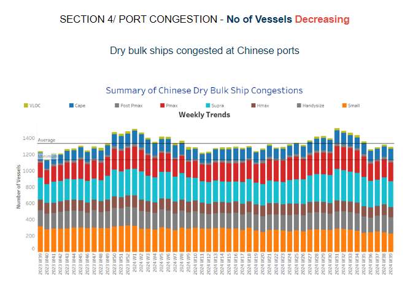

# Ballast speed Dry All vessel classes Vs Capesize

**Date:** September 26, 2024  
**Publisher:** Breakwave Advisors | **Category:** Market Insights  
**Original URL:** [https://www.breakwaveadvisors.com/insights/2024/9/26/ballast-speed-dry-all-vessel-classes-vs-capesize](https://www.breakwaveadvisors.com/insights/2024/9/26/ballast-speed-dry-all-vessel-classes-vs-capesize)  

---

**Dry Weekly Market Monitor - Week 39.2024**
Snapshot of Spot Freight Rates, Supply-Demand Trends, Port Congestions
September 26, 2024

## Chart of the Week: Ballast Speed Dry All Vessel Classes vs Capesize

*This week's focus is on the overall decreasing pace of ballast speeds across all dry vessel class categories for the year. Notably, the Capesize segment, which initially showed an upward trend at the beginning of the year, saw its ballast speed increase again in September, driven by the improvement in freight rates. In contrast, other vessel classes have maintained a more consistent downward trend in their ballast speeds throughout the year, reflecting a softer demand and operational adjustments to market conditions.*

> **Figure 1: Στιγμιότυπο Οθόνης 2024 09 26 153727**  
> **Interactive Data & Source:** [Signal Ocean Platform](https://go.signalocean.com/e/983831/-year-on-fresh-china-stimulus-/2ql7sz/438675515/h/AlkVBt9LSXvg7aDhxy77xOa_ADBcSygJdOTVJ_8iQOw) | [Local Asset](file:///C:/Users/Dell/Github/Shipping/corpus/03-breakwave/insights/2024/assets/2024-09-26_ballast-speed-dry-all-vessel-classes-vs-capesize_img_cea3cf84ceb9ceb3cebcceb9cf8ccf84cf85_329ff03c152a.png)

In the last week of September, we observed a sustained firmer market sentiment in the Capesize Brazil-to-China route, driven by tight vessel availability that continues to support this momentum. Weekly percentage growth of tonne days has now moved above the lows seen in August, indicating a renewed strength in demand. This uptick in tonne days signals increased activity, with vessel supply constraints playing a significant role in maintaining the upward trajectory. The recent tightening of vessel availability and positive market fundamentals suggest a firmer outlook for the end of the third quarter. Simultaneously, iron ore prices have surged, fueled by fresh stimulus measures from China aimed at stimulating its slowing economy. On Tuesday,[iron ore futures](https://go.signalocean.com/e/983831/-year-on-fresh-china-stimulus-/2ql7sz/438675515/h/AlkVBt9LSXvg7aDhxy77xOa_ADBcSygJdOTVJ_8iQOw)registered their largest intraday gain in over a year. The most-traded January contract on the Dalian Commodity Exchange rose by 4.64%, closing at 699.5 yuan ($99.38) per metric ton, marking the steepest daily increase since late May 2023.

The surge in iron ore prices can be attributed to several factors, primarily the Chinese government's introduction of significant monetary stimulus. The People's Bank of China has implemented its largest stimulus since the pandemic to revive the economy and curb deflationary pressures, though analysts have cautioned that further fiscal interventions are needed to reach growth targets. Additionally, restocking activities ahead of China's national holidays have contributed to heightened demand and bolstered market sentiment.

With the market experiencing renewed optimism, the combination of firm freight rates, restricted vessel availability, and rising iron ore prices presents a positive outlook for the Capesize segment, especially as the quarter draws to a close. However, much will depend on how sustained the Chinese stimulus efforts are and whether additional fiscal measures can further stabilise global demand, which will ultimately impact shipping and commodities markets in the months ahead.

> **Figure 2: Στιγμιότυπο Οθόνης 2024 09 26 154115**  
> **Interactive Data & Source:** [Signal Ocean Platform](https://www.thesignalgroup.com/signal-ocean-platform) | [Local Asset](file:///C:/Users/Dell/Github/Shipping/corpus/03-breakwave/insights/2024/assets/2024-09-26_ballast-speed-dry-all-vessel-classes-vs-capesize_img_cea3cf84ceb9ceb3cebcceb9cf8ccf84cf85_02add0a6aced.png)

The dry bulk freight market has exhibited stronger sentiment as the month draws to a close, with a notable recovery in the Capesize Brazil to North China route and the Panamax Far East route. These improvements reflect a more optimistic outlook across key shipping lanes, driven by tightening vessel availability and improving demand fundamentals.

- **Capesize**vessel freight rates for shipments from Brazil to North China have risen to $28 per ton, marking an 18% increase compared to the same period last year. This significant year-over-year growth reflects stronger demand and tighter vessel availability in the region.
- **Panamax**vessel freight rates from the Continent to the Far East have increased to $38 per ton, with an upward trend suggesting the possibility of reaching $40 per ton as early as August.
- **Supramax**vessel freight rates on the Indo-ECI route hovered slightly above $11 per ton for the current week, 8% higher than the previous month.
- **Handysize**freight rates for the NOPAC Far East route held steady at around $35 per ton, up 12% from rates a year ago.

> **Figure 3: Στιγμιότυπο Οθόνης 2024 09 26 154212**  
> **Interactive Data & Source:** [Signal Ocean Platform](https://www.thesignalgroup.com/signal-ocean-platform) | [Local Asset](file:///C:/Users/Dell/Github/Shipping/corpus/03-breakwave/insights/2024/assets/2024-09-26_ballast-speed-dry-all-vessel-classes-vs-capesize_img_cea3cf84ceb9ceb3cebcceb9cf8ccf84cf85_61ebfef5a807.png)

Since the end of August, the number of Capesize and Panamax ballast ships in Southeast Africa has fallen noticeably and remains below the annual average. In contrast, smaller vessel segments have seen an increase in ballasting activity, highlighting a shift in market dynamics across all vessel classes.

- **Capesize SE Africa**: The number of vessels has dropped below 100, which is 40 fewer than the peak observed at the end of week 31. This sharp decline underscores the tightening of available tonnage in recent weeks.
- **Panamax SE Africa**: By the final week of September, the current number of vessels fell to around 100, nearly 40 fewer than the levels observed just four weeks earlier. This significant drop highlights the tightening vessel supply over the past month.
- **Supramax SE Asia**: The number of ballast ships rose again amid signs for a potential decrease in the previous week. Current levels indicated an increase to more than 100, almost 10 higher than the previous week.
- **Handysize NOPAC**: The number of ballasters has risen to over 90, an increase of nearly 20 compared to the previous week.

> **Figure 4: Στιγμιότυπο Οθόνης 2024 09 26 154308**  
> **Interactive Data & Source:** [Signal Ocean Platform](https://www.thesignalgroup.com/signal-ocean-platform) | [Local Asset](file:///C:/Users/Dell/Github/Shipping/corpus/03-breakwave/insights/2024/assets/2024-09-26_ballast-speed-dry-all-vessel-classes-vs-capesize_img_cea3cf84ceb9ceb3cebcceb9cf8ccf84cf85_e70c89bec3ee.png)

In the final days of September, the outlook for dry tonne-days appears promising, with significant increases particularly in the Capesize and Supramax segments. These gains signal stronger market momentum and improving demand across these vessel classes.

- **Capesize**: Recent estimates indicate a robust upward adjustment in tonne-day growth, now exceeding the solid growth recorded at the end of week 25. This positive trend reflects strengthened demand and improved market conditions.
- **Panamax**: The weekly percentage growth has shifted to an upward trend, following a significant decline recorded at the end of July.
- **Supramax**: The growth rate has consistently risen since the end of week 27 and appears to have peaked at the end of the third week of September, maintaining its momentum into the current month.
- **Handysize**: The Handysize vessel segment has continued its downward trend as the month comes to a close, with the latest peak recorded at the end of week 31.

> **Figure 5: Στιγμιότυπο Οθόνης 2024 09 26 154354**  
> **Interactive Data & Source:** [Signal Ocean Platform](https://www.thesignalgroup.com/signal-ocean-platform) | [Local Asset](file:///C:/Users/Dell/Github/Shipping/corpus/03-breakwave/insights/2024/assets/2024-09-26_ballast-speed-dry-all-vessel-classes-vs-capesize_img_cea3cf84ceb9ceb3cebcceb9cf8ccf84cf85_715ba5726d7f.png)

Chinese dry bulk port congestion has remained consistent with the previous week; however, there are indications of a decrease, particularly reflecting the downward trend observed in the Supramax segment.

- **Capesize**: Capesize ship congestion held levels above 130 vessels, marking an increase of 7 from the previous week and nearly 20 fewer than the peak observed at the end of week 31.
- **Panamax**: The number of Panamax vessels has dropped to approximately 230, reflecting a decrease of 50 from the peak recorded in week 33.
- **Supramax**: Congestion levels remained elevated at more than 300 vessels, however 50 fewer than the end of week 33.
- **Handysize**: Congestion levels rose 200 vessels in the last week of September, about 10 more than the end of the previous week.

Data Source:[Signal Ocean Platform](https://www.thesignalgroup.com/signal-ocean-platform)

---

**Tags:** Drybulk, Capesize, Shipping  
