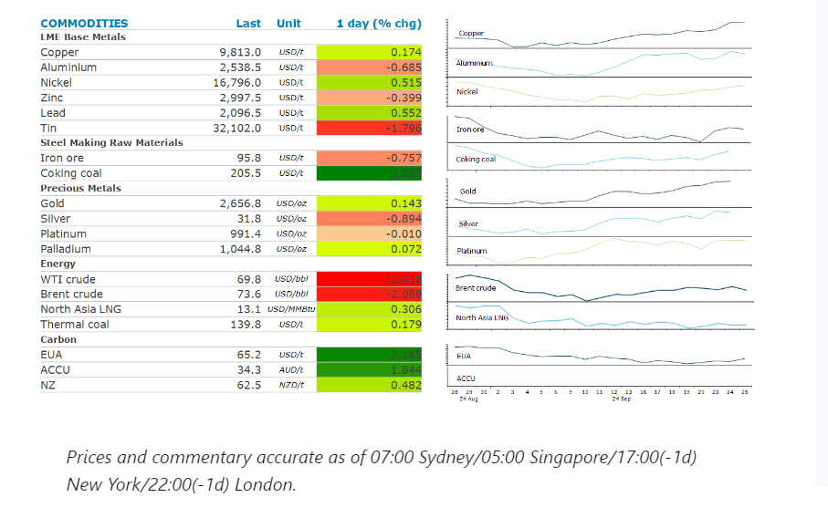
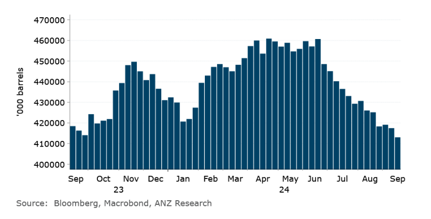

# Industrial metals extend gains as China announces further stimulus measures

**Date:** September 26, 2024  
**Publisher:** Breakwave Advisors | **Category:** Market Insights  
**Original URL:** [https://www.breakwaveadvisors.com/insights/2024/9/26/industrial-metals-extend-gains-as-china-announces-further-stimulus-measures](https://www.breakwaveadvisors.com/insights/2024/9/26/industrial-metals-extend-gains-as-china-announces-further-stimulus-measures)  

---

Further stimulus measures in China helped push industrial metals higher. Oil markets gave up earlier gains as supply disruptions eased.

*By*[*Daniel Hynes*](https://www.linkedin.com/in/dahynes/)

> **Figure 1: Στιγμιότυπο Οθόνης 2024 09 26 081836**  
> **Interactive Data & Source:** [Linkedin](https://www.linkedin.com/newsletters/commodities-wrap-6692196755876012032/?fbclid=IwAR3kiXJqZdxmp9ZcRwBNI7FsBySI-XSC0pfPur1qzjt7OZp7PTE59Tsl1QI) | [Local Asset](file:///C:/Users/Dell/Github/Shipping/corpus/03-breakwave/insights/2024/assets/2024-09-26_industrial-metals-extend-gains-as-china-announces-further-stimulus-measures_img_cea3cf84ceb9ceb3cebcceb9cf8ccf84cf85_43c949a5d3f1.png)

### Market Commentary

**Iron ore**extended its rally on hopes China’s huge stimulus package would elicit more demand. The steel making raw material threatened to break above USD100/t for the first time in a month after Beijing unveiled a broad suite of measures to support its economy. In addition to the RRR cut and lower minimum downpayment requirement for second homes announced on Monday, yesterday saw the PBOC cut its one-year interest rate by 30bps. The market will now be watching for signs that the measures are translating into a real pick‑up in demand for steel and iron ore. However, that may still be some way off with unsold inventory likely to delay any resumption in construction activity.

**Base metals**were also higher, although the gains were limited as debate raged about whether these measures are enough to revive the economy. However, the combination of a stabilisation in China’s housing sector and the prospect of a soft economic landing could still lead to a sustained pick-up in prices across the industrial metals complex. Gains triggered by easing monetary policy across the two biggest economies have been aided by a weaker USD. A stronger USD has been a headwind for the sector this year; however, it’s now on the verge of giving up all the gains this year. This should support further gains in investor appetite.

**Gold**edged higher as US data bolstered the case for another aggressive rate cut. US consumer confidence unexpectedly fell in August by the most in three years, raising concerns about the labour market. This saw swaps traders price in 75bp of cuts for the remainder of the year. That would translate to another 50bp at the next FOMC meeting. The precious metal has also been supported by heightened geopolitical tension driving haven demand.

**Crude oil**fell, on signs that Libyan supply disruptions could ease. Any revival in Libyan production would return to a market that is already beset by concerns of weak demand in the US and China. This also comes before OPEC’s Joint Ministerial Monitoring Committee meets next week to review the current production agreement and whether the market can handle production hikes from the oil producing group. The market shrugged off data that showed stronger demand in the US. Commercial crude oil inventories fell by 4.47mbbl last week to their lowest level since April 2022, according to EIA data.

**European gas**hit a two-week high as stockpiling slowed, adding to ongoing supply side risks. Countries such as Germany have even seen small net withdrawals recently. This comes as top supplier Norway is yet to complete its massive seasonal maintenance.**North Asian LNG**prices edged higher as hot weather in Japan drains LNG inventories.

### Chart of the Day

Another weekly drawdown in US oil inventories signals strong demand in the world's biggest consumer.

> **Figure 2: Στιγμιότυπο Οθόνης 2024 09 26 081929**  
> **Interactive Data & Source:** [Linkedin](https://www.linkedin.com/newsletters/commodities-wrap-6692196755876012032/?fbclid=IwAR3kiXJqZdxmp9ZcRwBNI7FsBySI-XSC0pfPur1qzjt7OZp7PTE59Tsl1QI) | [Local Asset](file:///C:/Users/Dell/Github/Shipping/corpus/03-breakwave/insights/2024/assets/2024-09-26_industrial-metals-extend-gains-as-china-announces-further-stimulus-measures_img_cea3cf84ceb9ceb3cebcceb9cf8ccf84cf85_12365cec35b4.png)

Data source:[Commodities Wrap](https://www.linkedin.com/newsletters/commodities-wrap-6692196755876012032/?fbclid=IwAR3kiXJqZdxmp9ZcRwBNI7FsBySI-XSC0pfPur1qzjt7OZp7PTE59Tsl1QI)

---

**Tags:** Markets, Commodities, Shipping  
