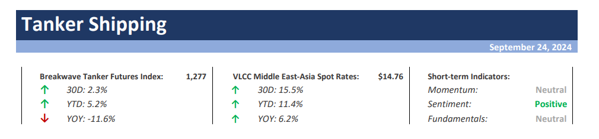

# Breakwave Weekend Read

**Date:** September 27, 2024  
**Publisher:** Breakwave Advisors | **Category:** Market Insights  
**Original URL:** [https://www.breakwaveadvisors.com/insights/2024/9/20/breakwave-weekend-read-7a7dc](https://www.breakwaveadvisors.com/insights/2024/9/20/breakwave-weekend-read-7a7dc)  

---

## Welcome Tobreakwave Advisorsweekend Read

As we conclude the workweek and head into the weekend, take a moment to review the key articles from this week, including those you've highlighted.[All segments stayed out of the red](https://www.breakwaveadvisors.com/insights/2024/9/23/h0tsg5eo09i2vaqeqz7bgonbrh4bhk),[We can’t fight the Fed. We can’t listen to it either. Welcome to the Old Normal](https://www.breakwaveadvisors.com/insights/2024/9/24/we-cant-fight-the-fed-we-cant-listen-to-it-either-welcome-to-the-old-normal),[Ballast speed Dry All vessel classes Vs Capesize](https://www.breakwaveadvisors.com/insights/2024/9/26/ballast-speed-dry-all-vessel-classes-vs-capesize)and more.

## Breakwave Tanker Report

**VLCC Market Strengthens on the Back of Increasing Inquiry as Hopes for a Winter Recovery Resurface**– The recovery of the VLCC (Very Large Crude Carrier) market gained momentum starting in early September, with a notable firming by the end of the third week, driven by a surge in enquiries.

[Read More](https://www.breakwaveadvisors.com/insights/2024924wet-87578j)

> **Figure 1: Στιγμιότυπο Οθόνης 2024 09 24 105116**  
> **Interactive Data & Source:** [Linkedin](https://www.linkedin.com/in/john-kartsonas/) | [Local Asset](file:///C:/Users/Dell/Github/Shipping/corpus/03-breakwave/insights/2024/assets/2024-09-27_breakwave-weekend-read-7a7dc_img_cea3cf84ceb9ceb3cebcceb9cf8ccf84cf85_5bc148f4cbbf.png)

## Highlight of This Week

[John Kartsonas](https://www.linkedin.com/in/john-kartsonas/), Managing Partner of Breakwave Advisors, participated in Maritime CEO Forum in Singapore with[Sam Chambers](https://www.linkedin.com/in/sam-chambers-b628714/), sharing valuable insights on the tanker market outlook.

> **Figure 2: 1727078675353**  
> **Interactive Data & Source:** [Breakwave Advisors Market Insights](https://www.breakwaveadvisors.com/insights/2024/9/22/1xxzscma06s3povgyful41rzktm04i) | [Local Asset](file:///C:/Users/Dell/Github/Shipping/corpus/03-breakwave/insights/2024/assets/2024-09-27_breakwave-weekend-read-7a7dc_img_1727078675353_211db0a68d3b.jpeg)

## Global Shipping and Financial Markets

> **Figure 3: Unsplash Image 7pxoaeogpbu**  
> **Interactive Data & Source:** [Breakwave Advisors Market Insights](https://www.breakwaveadvisors.com/insights/2024/9/22/1xxzscma06s3povgyful41rzktm04i) | [Local Asset](file:///C:/Users/Dell/Github/Shipping/corpus/03-breakwave/insights/2024/assets/2024-09-27_breakwave-weekend-read-7a7dc_img_unsplash-image-7pxoaeogpbu_4665496f1300.jpg)

Fed’s aggressive rate cut has provided the PBOC with some leeway to lower rates in the future..
[Read More](https://www.breakwaveadvisors.com/insights/2024/9/22/1xxzscma06s3povgyful41rzktm04i)

Doric Weekly Market Insight

## China's Outstanding Loan Growth Has Set Another Record Low

> **Figure 4: Unsplash Image Wv5ifuwyphw**  
> **Interactive Data & Source:** [Breakwave Advisors Market Insights](https://www.breakwaveadvisors.com/insights/2024/9/23/chinas-outstanding-loan-growth-has-set-another-record-low) | [Local Asset](file:///C:/Users/Dell/Github/Shipping/corpus/03-breakwave/insights/2024/assets/2024-09-27_breakwave-weekend-read-7a7dc_img_unsplash-image-wv5ifuwyphw_e67d43a7e578.jpg)

Chinese banks issued 900 billion yuan in new loans in August.

From Commodore's Weekly Dry Bulk Reports

## All Segments Stayed Out of the Red

> **Figure 5: Market Chart 5**  
> **Interactive Data & Source:** [Breakwave Advisors Market Insights](https://www.breakwaveadvisors.com/insights/2024/9/23/h0tsg5eo09i2vaqeqz7bgonbrh4bhk) | [Local Asset](file:///C:/Users/Dell/Github/Shipping/corpus/03-breakwave/insights/2024/assets/2024-09-27_breakwave-weekend-read-7a7dc_img_image-asset_e5a09ba26751.jpeg)

The Baltic Dry Index rebounded last week as all segments stayed out of the red.

[Read More](https://www.breakwaveadvisors.com/insights/2024/9/23/h0tsg5eo09i2vaqeqz7bgonbrh4bhk)

The Fix - Global Market Update

## Notable Changes in India's Crude Oil Import Landscape

> **Figure 6: Pexels Steve Mccaul 988600744 20259607**  
> **Interactive Data & Source:** [Breakwave Advisors Market Insights](https://www.breakwaveadvisors.com/insights/2024/9/25/notable-changes-in-indias-crude-oil-import-landscape) | [Local Asset](file:///C:/Users/Dell/Github/Shipping/corpus/03-breakwave/insights/2024/assets/2024-09-27_breakwave-weekend-read-7a7dc_img_pexels-steve-mccaul-988600744-202596_e23a4acaf8ed.jpg)

India's crude oil import landscape has been undergoing notable shifts..

[Read More](https://www.breakwaveadvisors.com/insights/2024/9/25/notable-changes-in-indias-crude-oil-import-landscape)

Intermodal Weekly Market Report

## Metals Gain Amid Speculation of Fresh Stimulus Measures in China

> **Figure 7: Unsplash Image 6nzhysk Ow**  
> **Interactive Data & Source:** [Breakwave Advisors Market Insights](https://www.breakwaveadvisors.com/insights/2024/9/24/metals-gain-amid-speculation-of-fresh-stimulus-measures-in-china) | [Local Asset](file:///C:/Users/Dell/Github/Shipping/corpus/03-breakwave/insights/2024/assets/2024-09-27_breakwave-weekend-read-7a7dc_img_unsplash-image-6nzhysk-ow_700b83887d44.jpg)

Industrial metals gained amid expectations of support measures in China.

[Read More](https://www.breakwaveadvisors.com/insights/2024/9/24/metals-gain-amid-speculation-of-fresh-stimulus-measures-in-china)

Commodities Wrap

## We Can’t Fight the Fed. We Can’t Listen to It Either. Welcome to the Old Normal

> **Figure 8: Unsplash Image S2mds Xzke8**  
> **Interactive Data & Source:** [Breakwave Advisors Market Insights](https://www.breakwaveadvisors.com/insights/2024/9/24/we-cant-fight-the-fed-we-cant-listen-to-it-either-welcome-to-the-old-normal) | [Local Asset](file:///C:/Users/Dell/Github/Shipping/corpus/03-breakwave/insights/2024/assets/2024-09-27_breakwave-weekend-read-7a7dc_img_unsplash-image-s2mds-xzke8_a4f280a64873.jpg)

The Fed surprised markets by performing a double cut while being optimistic about inflation**.**

[Read More](https://www.breakwaveadvisors.com/insights/2024/9/24/we-cant-fight-the-fed-we-cant-listen-to-it-either-welcome-to-the-old-normal)

Forvis Mazars Weekly Note

## Ballast Speed Dry All Vessel Classes vs Capesize

> **Figure 9: Pexels Vasu27 3478963**  
> **Interactive Data & Source:** [Breakwave Advisors Market Insights](https://www.breakwaveadvisors.com/insights/2024/9/26/ballast-speed-dry-all-vessel-classes-vs-capesize) | [Local Asset](file:///C:/Users/Dell/Github/Shipping/corpus/03-breakwave/insights/2024/assets/2024-09-27_breakwave-weekend-read-7a7dc_img_pexels-vasu27-3478963_29f31d4b43fe.jpg)

In the last week of September, we observed a sustained firmer market sentiment in the Capesize Brazil-to-China route..

[Read More](https://www.breakwaveadvisors.com/insights/2024/9/26/ballast-speed-dry-all-vessel-classes-vs-capesize)

Signal Ocean - Dry Weekly Market Monitor

## More Supertanker Clean-Ups in Store As Clean/dirty Rates Spread Widens?

> **Figure 10: Pexels Tomfisk 3114588 (1)**  
> **Interactive Data & Source:** [Breakwave Advisors Market Insights](https://www.breakwaveadvisors.com/insights/2024/9/26/more-supertanker-clean-ups-in-store-as-cleandirty-rates-spread-widens) | [Local Asset](file:///C:/Users/Dell/Github/Shipping/corpus/03-breakwave/insights/2024/assets/2024-09-27_breakwave-weekend-read-7a7dc_img_pexels-tomfisk-311458828129_9bf309879d48.jpg)

Aframax tankers may have found some solace in rising employment in the DPP trade to Asia amidst weakness in the wider market

[Read More](https://www.breakwaveadvisors.com/insights/2024/9/26/more-supertanker-clean-ups-in-store-as-cleandirty-rates-spread-widens)

Vortexa - Global Freight Snapshot

## Industrial Metals Extend Gains As China Announces Further Stimulus Measures

> **Figure 11: Unsplash Image Xgkzx7hsyd0**  
> **Interactive Data & Source:** [Breakwave Advisors Market Insights](https://www.breakwaveadvisors.com/insights/2024/9/26/industrial-metals-extend-gains-as-china-announces-further-stimulus-measures) | [Local Asset](file:///C:/Users/Dell/Github/Shipping/corpus/03-breakwave/insights/2024/assets/2024-09-27_breakwave-weekend-read-7a7dc_img_unsplash-image-xgkzx7hsyd0_de64fa942d4c.jpg)

Further stimulus measures in China helped push industrial metals higher.

Commodities Wrap

## Crude Oil Flows to China

> **Figure 12: Pexels George Bek 255210 18480403**  
> **Interactive Data & Source:** [Breakwave Advisors Market Insights](https://www.breakwaveadvisors.com/insights/2024/9/27/crude-oil-flows-to-china) | [Local Asset](file:///C:/Users/Dell/Github/Shipping/corpus/03-breakwave/insights/2024/assets/2024-09-27_breakwave-weekend-read-7a7dc_img_pexels-george-bek-255210-18480403_97772de5b1e4.jpg)

The last week of September is concluding with an upward trend in VLCC rates on the Arabian Gulf-China route..

Signal Ocean - Tanker Weekly Market Monitor

## China Faring Well for Dry Bulk Even Before Bazooka

> **Figure 13: Unsplash Image Zdyrjoujstg**  
> **Interactive Data & Source:** [Breakwave Advisors Market Insights](https://www.breakwaveadvisors.com/insights/2024/9/27/yyohoiqouts9djbnetmy8855aanuzp) | [Local Asset](file:///C:/Users/Dell/Github/Shipping/corpus/03-breakwave/insights/2024/assets/2024-09-27_breakwave-weekend-read-7a7dc_img_unsplash-image-zdyrjoujstg_2de8aa2d5f06.jpg)

Dry bulk spot rates were two dollars away from all increasing across the board last week..

From Commodore's Weekly Dry Bulk Reports

## The Big Picture: Economy “Turning the Corner”

> **Figure 14: Unsplash Image Tep6ti8pxw4**  
> **Interactive Data & Source:** [Breakwave Advisors Market Insights](https://www.breakwaveadvisors.com/insights/2024/9/27/the-big-picture-economy-turning-the-corner) | [Local Asset](file:///C:/Users/Dell/Github/Shipping/corpus/03-breakwave/insights/2024/assets/2024-09-27_breakwave-weekend-read-7a7dc_img_unsplash-image-tep6ti8pxw4_eff7c7273346.jpg)

A stable growth forecast of 3.2% for world GDP for this year and next masks some variations across economies..

Braemar Weekly Dry Market Report

---

**Tags:** Shipping, Tankers, Drybulk  
