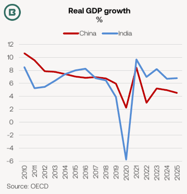
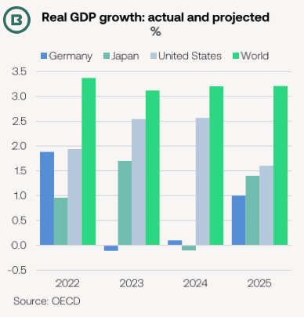
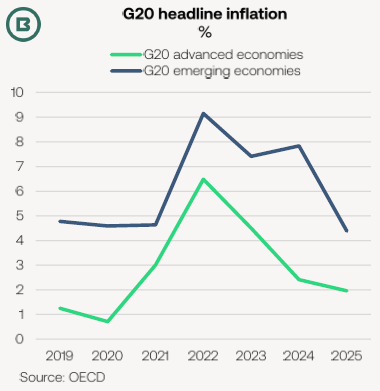

# The Big Picture: Economy “turning the corner”

**Date:** September 27, 2024  
**Publisher:** Breakwave Advisors | **Category:** Market Insights  
**Original URL:** [https://www.breakwaveadvisors.com/insights/2024/9/27/the-big-picture-economy-turning-the-corner](https://www.breakwaveadvisors.com/insights/2024/9/27/the-big-picture-economy-turning-the-corner)  

---

### Economy “Turning the Corner”: Oecd

- *Released yesterday, the Organisation of Economic Co-operation and Development (OECD)’s latest outlook has the title “turning the corner” and presents a distinctly more positive picture than some previous reports.*
- *The resilience in the 1H 2024, with moderating inflation, is set to continue into 2025, according to the OECD.*
- *Of course, analysis would not be complete without a list of near-term risks.*

A stable growth forecast of 3.2% for world GDP for this year and next masks some variations across economies.

The OECD projects broadlybut with variation within the group.

> **Figure 1: Stable Growth Across the Emerging Market G20 Economies**  
> [Local Asset](file:///C:/Users/Dell/Github/Shipping/corpus/03-breakwave/insights/2024/assets/2024-09-27_the-big-picture-economy-turning-the-corner_img_image0_28ca3ee22130.png)

**Chinese economic growth**is expected to decelerate from 5.2% last year to 4.9% this year and then to 4.5% next. Consumer demand is described by the OECD as “modest”, with the organisation highlighting the “ongoing deep correction in the property sector”.

is expected to continue, with GDP growth of 6.7% in 2024 and 6.8% in 2025.

> **Figure 2: Strong Indian Growth**  
> [Local Asset](file:///C:/Users/Dell/Github/Shipping/corpus/03-breakwave/insights/2024/assets/2024-09-27_the-big-picture-economy-turning-the-corner_img_image1_78dc368fd218.png)

In most advanced economies,**gradually moderating inflation**and easing labour market pressures are expected to support real incomes and should allow for monetary policy rate cuts, benefitting growth in the US, Canada, Europe, and Australia in 2024 and 2025.

**Germany is projected to see the weakest GDP growth of euro area G20 economies**this year, at just 0.1%, following a –0.1% contraction in 2023. 1.1% GDP growth is projected for 2025. The OECD highlight weak industrial activity, as well as poor sentiment weighing on consumption.

Temporary supply disruptions in the first quarter meant**the Japanese economy is expected to contract by –0.1% in 2024**, the weakest performance of the G20 advanced economies, before recovering to 1.4% growth in 2025, with “strong real wage gains offsetting the impact of tighter macroeconomic policies.”

**South Korea’s**growth is projected to be stable at 2.5% this year and 2.2% next, supported by strength in the semiconductor sector.

While the OECD expect, it will remain higher than in advanced economies, with double-digit rates in Argentina and Turkey projected to continue through 2024 and 2025.

> **Figure 3: Inflation to Ease in Emerging Markets**  
> [Local Asset](file:///C:/Users/Dell/Github/Shipping/corpus/03-breakwave/insights/2024/assets/2024-09-27_the-big-picture-economy-turning-the-corner_img_image2_8e80c8da496e.png)

The main**near-term risks**to the global economyinclude:

1. Persisting**geopolitical and trade tensions**.
2. Possibility of**slowing growth**as labour market pressures fade.If the trend of disinflation does not materialise as expected, then there could be**disruption in financial markets**.
3. Inflation is projected to be back on target in most G20 countries by end-2025.

The OECD also highlighted two potential**upside risks**to its forecasts:

1. **A stronger than anticipated rebound in consumer confidence**boosts private consumption, with households drawing down excess savings accumulated during the COVID-19 pandemic.
2. **A fall in global oil prices**leads to steeper than anticipated declines in headline inflation, allowing for a faster pace of monetary policy easing.

---

**Tags:** Economy, Markets, Shipping  
