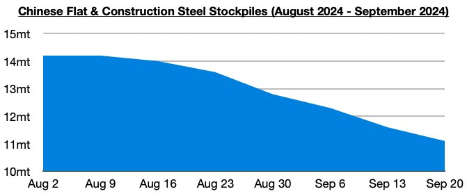
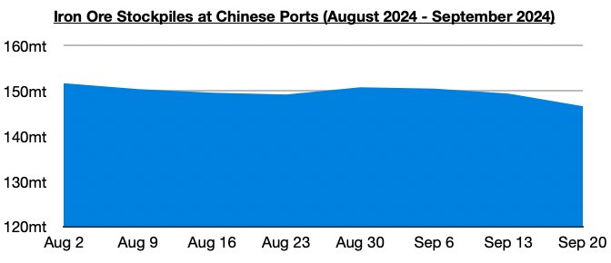
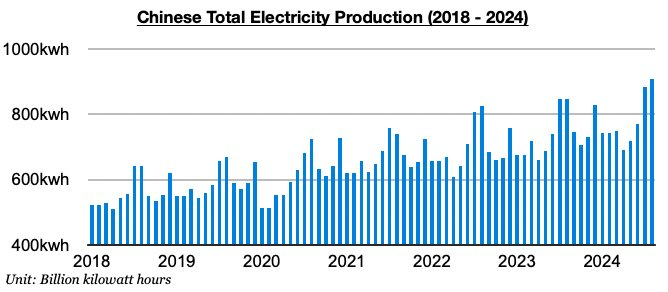

# China Faring Well For Dry Bulk Even Before Bazooka

**Date:** September 27, 2024  
**Publisher:** Breakwave Advisors | **Category:** Market Insights  
**Original URL:** [https://www.breakwaveadvisors.com/insights/2024/9/27/yyohoiqouts9djbnetmy8855aanuzp](https://www.breakwaveadvisors.com/insights/2024/9/27/yyohoiqouts9djbnetmy8855aanuzp)  

---

*By*[*Jeffrey Landsberg*](https://www.linkedin.com/in/jeffrey-landsberg-70ab957/)

Dry bulk spot rates were two dollars away from all increasing across the board last week, with only handysize rates not rising (they fell by $1). Last week would have marked the first time since mid-April that rates rose in all segments. Also of note is that last week again saw Chinese coastal coal freight rates rise by the largest amount seen since early July.

In China, steel prices remain low, but steel stockpiles have at least continued to fall. Stockpiles of flat and construction steel products at warehouses in major cities in China ended last week at approximately 11.1 million tons. This is down week-on-week by 500,000 tons (-4%), down year-on-year by 1.4 million tons (-11%), and the lowest level seen since January.

> **Figure 1: Chart 1**  
> [Local Asset](file:///C:/Users/Dell/Github/Shipping/corpus/03-breakwave/insights/2024/assets/2024-09-27_yyohoiqouts9djbnetmy8855aanuzp_img_chart1_9e17953a82ec.jpg)

Iron ore port stockpiles in China have also continued to fall and endED last week at their lowest seen since June.

> **Figure 2: Chart 2**  
> [Local Asset](file:///C:/Users/Dell/Github/Shipping/corpus/03-breakwave/insights/2024/assets/2024-09-27_yyohoiqouts9djbnetmy8855aanuzp_img_chart2_a09cfdf3bde5.jpg)

Overall, China’s industrial sector continues to fare much better than its consumer sector, and this continues to more directly affect the dry bulk market as we have been discussing in Commodore Research's Weekly Dry Bulk Reports and Weekly China Reports. China’s consumer spending adjusted for inflation grew year-on-year last month by just 1.5%, while China’s overall industrial output most recently grew year-on-year by 4.5%, manufacturing output most recently by 5.3%, and electricity output most recently by 7.5%. In fact, both China’s total electricity output and coal-derived electricity output have most recently set records, the fact of which has largely been ignored by major economic media.

> **Figure 3: Chart 3**  
> [Local Asset](file:///C:/Users/Dell/Github/Shipping/corpus/03-breakwave/insights/2024/assets/2024-09-27_yyohoiqouts9djbnetmy8855aanuzp_img_chart3_7ef97e54b7bc.jpg)

---

**Tags:** China, Economy, Markets  
