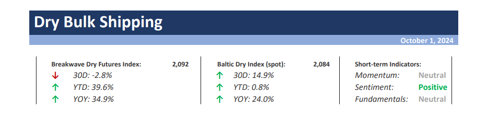
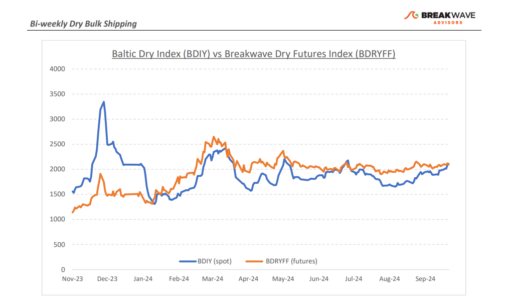
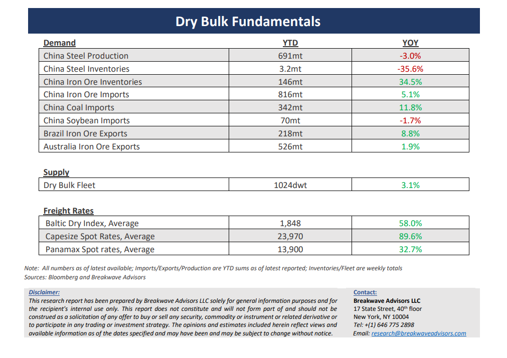

# Breakwave Bi-Weekly Dry Bulk Report - October 1, 2024

**Date:** October 01, 2024  
**Publisher:** Breakwave Advisors | **Category:** Market Insights  
**Original URL:** [https://www.breakwaveadvisors.com/insights/2024101dry-87w333](https://www.breakwaveadvisors.com/insights/2024101dry-87w333)  

---

> **Figure 1: Cea3cf84ceb9ceb3cebcceb9cf8ccf84cf85**  
> [Local Asset](file:///C:/Users/Dell/Github/Shipping/corpus/03-breakwave/insights/2024/assets/2024-10-01_2024101dry-87w333_img_cea3cf84ceb9ceb3cebcceb9cf8ccf84cf85_26c13844ad02.png)

**·****Capesize Rates Continue to Climb on the Back of Favorable Seasonality**– Although volatility**remains subdued**across the dry bulk sector,**Capesize**rates continue to show**decent upside momentum**, while we sense an**air of optimism**characteristic of periods preceding major rallies. At about 30,000, Capesize spot rates have clearly outperformed the smaller sizes, as cargo flow for the large bulkers remains remarkably strong. With the**North Atlantic**spot market finally**catching up**to the rest of the basins in terms of rates and with winter weather upon us, we see the risk/reward for such vessels balanced, despite the ongoing lag in associated demand for the sub-Cape sector. The**Atlantic market**is capable for substantial**volatility**during the fourth quarter, and**any spike**in rates will most likely be**initiated**from that part of the world. On the other hand,**Panamax rates**appear relatively**cheap**and the potential for**cargo splits**(i.e. instead of hiring a Capesize vessel, one can split the cargo into two Panamaxes) could provide some support but also**limit**any**Capesize upside**. Furthermore, the overall**commodity space**received a significant**psychological boost**from the recent**Chinese stimulus**announcements, although we see**little direct impact**on trade volumes for dry bulk shipping. Finally, Capesize owners are currently enjoying quite a profitable market with limited volatility, but the**risk-reward**from a trading perspective is**not as favorable**as in past years:**First quarter**futures are now priced at 18,000, which is well**above historical averages**(with the exception of last year) and although such an average is achievable, a lot of things need to happen in order for such strong rates to materialize during a typically weak quarter.

**·****Chinese Stimulus Tsunami Raises All Boats but Details Always Matter**– The**psychological impact**of**mostly expected**monetary changes from the PBOC led to a major rally in Chinese-related assets over the past week. Most of the announcements were generally expected (RRR cut, MLF reduction, mortgage downpayment relief) but some**new additions**(support for the stock market, direct checks for needing households) combined with a forceful presentation led to a major**shift in psychology,**causing a sizable amount of**short covering**but also**some optimism**for the future. Iron ore prices that have been particularly sluggish all year long,**jumped**almost 20% in days reflecting such renewed optimism. Yet, once we look at the details, we think**such positivity is premature**. The Politburo stated their preference for**limiting new construction**in order to help housing prices recover. Such a policy is clearly**not positive**for iron ore that relies on strong demand for steel, something that is directly linked to construction activity. We believe that**once the dust settles, iron ore**prices will**resume**their**decline**, especially given the very**high inventory**levels for this time of the year but also the persistent**negative margins**that continue to constrain steel mill profitability.

**· Our Long-term View –**The last few years have been characterized by increased geopolitical uncertainty. Going forward, we expect such events to continue to affect global trade and have a meaningful impact on effective vessel supply. Combined with the potential for a multi-year cyclical rebound in China’s economic activity following the recent economic turmoil, dry bulk shipping should experience higher volatility on top of a secular tightness driven by increasing bulk commodity demand and a slower fleet growth owing to a relatively low orderbook.

> **Figure 2: Cea3cf84ceb9ceb3cebcceb9cf8ccf84cf85**  
> [Local Asset](file:///C:/Users/Dell/Github/Shipping/corpus/03-breakwave/insights/2024/assets/2024-10-01_2024101dry-87w333_img_cea3cf84ceb9ceb3cebcceb9cf8ccf84cf85_813153929e22.png)

> **Figure 3: Cea3cf84ceb9ceb3cebcceb9cf8ccf84cf85**  
> [Local Asset](file:///C:/Users/Dell/Github/Shipping/corpus/03-breakwave/insights/2024/assets/2024-10-01_2024101dry-87w333_img_cea3cf84ceb9ceb3cebcceb9cf8ccf84cf85_9a5423599f83.png)

### Subscribe:
