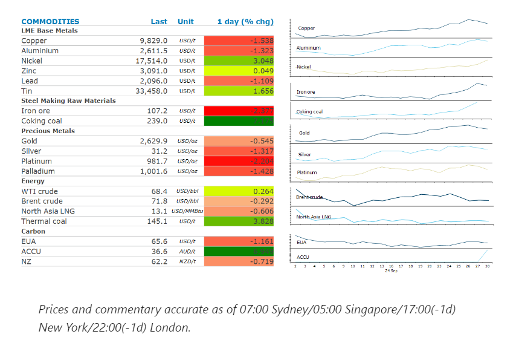
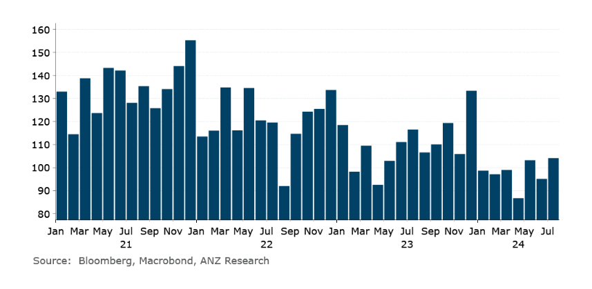

# Iron ore rallies as Chinese cities relax home-buying curbs

**Date:** October 01, 2024  
**Publisher:** Breakwave Advisors | **Category:** Market Insights  
**Original URL:** [https://www.breakwaveadvisors.com/insights/2024/10/1/iron-ore-rallies-as-chinese-cities-relax-home-buying-curbs](https://www.breakwaveadvisors.com/insights/2024/10/1/iron-ore-rallies-as-chinese-cities-relax-home-buying-curbs)  

---

Metals gained in early Asia trading as Chinese provinces implemented measures to support the real estate market. However, gains failed to stock as a stronger USD weighed on investor appetite.

*By*[*Daniel Hynes*](https://www.linkedin.com/in/dahynes/)

> **Figure 1: Στιγμιότυπο Οθόνης 2024 10 01 115744**  
> **Interactive Data & Source:** [Linkedin](https://www.linkedin.com/newsletters/commodities-wrap-6692196755876012032/?fbclid=IwAR3kiXJqZdxmp9ZcRwBNI7FsBySI-XSC0pfPur1qzjt7OZp7PTE59Tsl1QI) | [Local Asset](file:///C:/Users/Dell/Github/Shipping/corpus/03-breakwave/insights/2024/assets/2024-10-01_iron-ore-rallies-as-chinese-cities-relax-home-buying-curbs_img_cea3cf84ceb9ceb3cebcceb9cf8ccf84cf85_b93f2e286faf.png)

### Market Commentary

**Iron ore**futures rallied as top Chinese cities rushed to ease home buying curbs. Shanghai, Guangzhou and Shenzhen loosened rules following Beijing’s calls to prop up the property sector. They lowered the minimum down-payment ratio required for first and second homes to 15% and 20% respectively. In Guangzhou, officials said they would stop reviewing homebuyers’ eligibility and no longer limit the number of homes owned. Both Shanghai and Shenzhen said they will allow more people to purchase residences in suburban areas. The moves boosted sentiment across broader markets, with a gauge of Chinese property stocks rising as much as 14% on Monday morning. This was despite data showing that the property slump continues to worsen. The value of new homes sales from the 100 biggest real estate companies fell 37.7% y/y, faster than the 26.8% decline in August, according to data from the China Real Estate Information Corp. Markets are now closed until 8 October for the National Day holiday.

**Copper**and most other base metals were also up strongly in Asian trading, as the market reacted positively to the stimulus measures announced last week by Beijing. This was supported by data showing factory output beat expectations, with China’s official manufacturing purchasing managers index coming in at 49.8 in September. While this is still in contractionary territory, it’s the highest in four months. However, the sector failed to hold those gains as a stronger USD weakened investor appetite. This was triggered by comments from Fed Chair Powell that he expects two further 25bp cuts this year if the economy performs as expected. Sentiment wasn’t helped by data showing output from Chile, the world’s largest producer, rose 7.1% y/y in September. Production is starting to recover as state-owned producer, Codelco overcomes disruptions at mines and delays at development projects.

Powell’s comments also weighed on the**gold**price. Expectations have been building that the Fed would follow up last week’s easing with another 50bp rate cut. However, Powell appeared more hawkish.

**Crude oil**was little changed as traders took stock of the outlook amid rising tensions in the Middle East. Israel bombed the centre of Beirut for the first time in almost a year. This comes days after the killing of the leader of Iran-backed Hezbollah. However, the risk of supply disruptions in the Middle East are being offset by the prospect of production hikes from OPEC. Despite its efforts to stabilise the oil market, prices have remained under pressure. This has raised questions on whether the producer group will maintain its current production constraints.

**Global gas**prices extended last weeks’ gains as demand picks up ahead of the winter heating season.**European gas**prices gained after weather forecasts showed temperatures across large parts of northwest Europe will drop in coming days.**North Asian LNG**prices were also higher, with spot activity particularly strong from the region’s importers.

### Chart of the Day

Despite the recovery in Chile's copper output in September, it remains well below levels seen over the past three years.

> **Figure 2: Στιγμιότυπο Οθόνης 2024 10 01 115841**  
> **Interactive Data & Source:** [Linkedin](https://www.linkedin.com/newsletters/commodities-wrap-6692196755876012032/?fbclid=IwAR3kiXJqZdxmp9ZcRwBNI7FsBySI-XSC0pfPur1qzjt7OZp7PTE59Tsl1QI) | [Local Asset](file:///C:/Users/Dell/Github/Shipping/corpus/03-breakwave/insights/2024/assets/2024-10-01_iron-ore-rallies-as-chinese-cities-relax-home-buying-curbs_img_cea3cf84ceb9ceb3cebcceb9cf8ccf84cf85_97adbbc5cfd5.png)

Data source:[Commodities Wrap](https://www.linkedin.com/newsletters/commodities-wrap-6692196755876012032/?fbclid=IwAR3kiXJqZdxmp9ZcRwBNI7FsBySI-XSC0pfPur1qzjt7OZp7PTE59Tsl1QI)

---

**Tags:** Markets, Commodities, Shipping  
