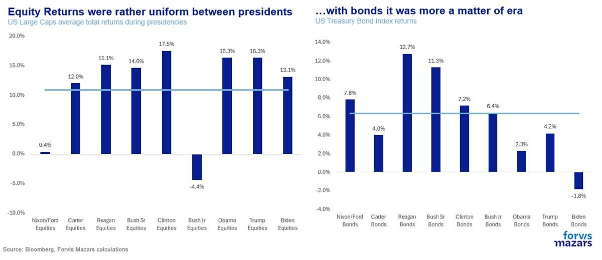
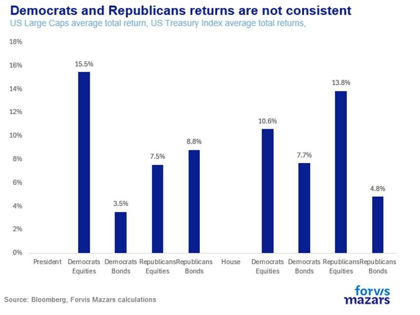
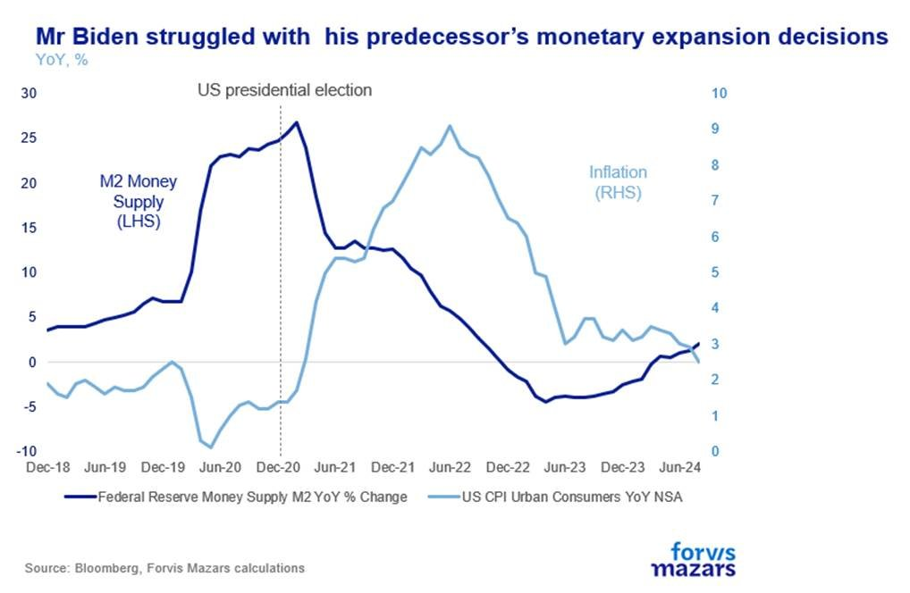
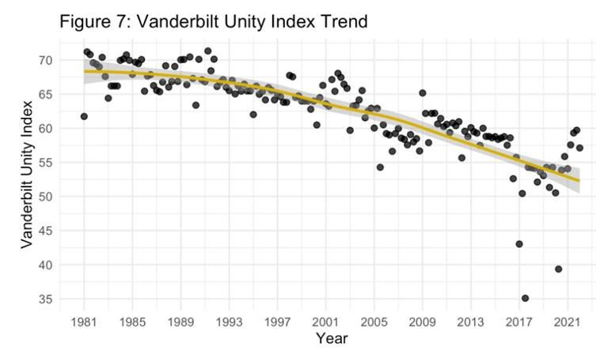
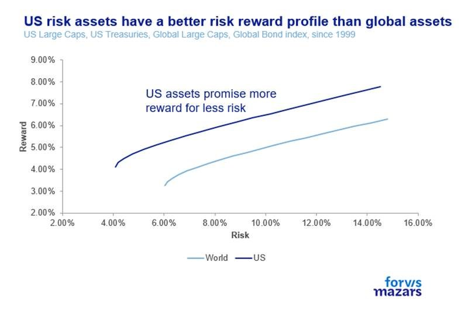
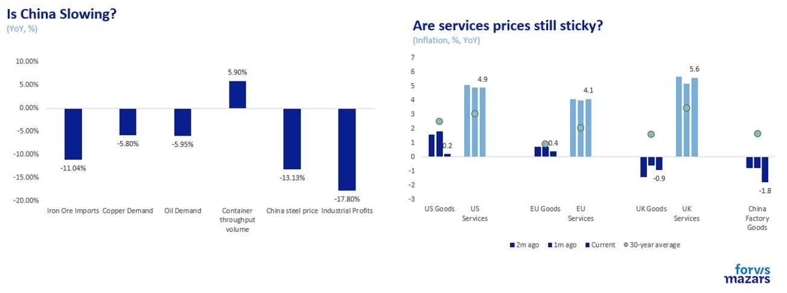

# The election: less analysis and more popcorn please

**Date:** October 01, 2024  
**Publisher:** Breakwave Advisors | **Category:** Market Insights  
**Original URL:** [https://www.breakwaveadvisors.com/insights/2024/10/1/the-election-less-analysis-and-more-popcorn-please](https://www.breakwaveadvisors.com/insights/2024/10/1/the-election-less-analysis-and-more-popcorn-please)  

---

### Three Things Investors Should Know

1. **The US is facing a tight election. Our analysis suggests that who is elected president, or which party controls the House does not have a significant bearing on asset returns.**
2. **Even with foreknowledge of the future, it would be difficult to successfully trade on the event, as consequences may be random.**
3. **Investors don’t make money by predicting future events. They make money when they trust the system enough to remain invested even during volatile and noisy times.**

*By*[*George Lagarias*](https://www.linkedin.com/in/george-lagarias-mba-3baa769/)

Last weekend was my Gary Oldman weekend. I finally caught up with “Slow Horses” (possibly one of the best spy thrillers ever on TV), and watched The Contender (2000), a movie about a female vice-presidential candidate (Joan Allen) trying to get confirmed against the machinations of her opponents, namely Gary Oldman. Watching these, I had an “aha” moment, on how to watch and enjoy, rather than try to analyse, the upcoming US election, one hailed by many as “the most important of our time”.

Let’s start with movie quotes. In Slow Horses, Dame Kristin Scott Thomas (MI5’s number two) confronts her politically appointed and naïve boss who complains about her lack of “Big Picture thinking”. She retorts “There’s no big picture… it’s just putting out fires every bloody day”. On a similar note, in The Contender, a vice-presidential front-runner (William Petersen), is asked who his favourite president was. He jokingly answers “William Henry Harrison (1773-1841), he died in a few days after taking office and didn’t have the chance to do much damage”.

The argument here is very simple: it may not matter who holds power today, over the longer term. We assign an era to a person (i.e. the “Obama Era”) but that person may not be as responsible as we think for economic outcomes. Presently, we are faced with a coin-toss election in the US. All major forecasters ([The Hill](https://elections2024.thehill.com/forecast/2024/president/),[Economist](https://www.economist.com/interactive/us-2024-election/prediction-model/president),[538](https://projects.fivethirtyeight.com/2024-election-forecast/),[Nate Silver](https://www.natesilver.net/p/nate-silver-2024-president-election-polls-model)) roughly agree on a 55%-45% probability, which is to say they don’t know. To be sure, a 10%-15% lead in polls is very significant. A 10%-15% lead in probabilities, much less so.

We decided to put the notion to the test. We run equity returns per president since 1973. US large caps delivered between 13% and 17% per annum for almost every president, but two, Bush Jr and Nixon/Ford. Both were unlucky. Mr Bush (Jr) started his tenure with two bad years, after the “.com crash” and ended it with the Global Financial Crisis. Arguably, none of the two were of his making, as the former was more an issue of bad accounting rules and the latter a product of the Clinton-Bush Sr-Reagan deregulation policies. Taking the two out, his equity returns were actually around the 13% mark. Mr Nixon also inherited an economic mess, a country overspent on Vietnam and “The Great Society” project, that had forced him to break the gold standard and enter an era of very high inflation. In terms of bonds, returns (nominal not real) were more a product of their era. The 1970s and 1980s were very inflationary, thus requiring a higher rate of return from bond issuers.

> **Figure 1: Market Chart 1**  
> **Interactive Data & Source:** [Vanderbilt](https://www.vanderbilt.edu/unity/vanderbilt-unity-index/) | [Local Asset](file:///C:/Users/Dell/Github/Shipping/corpus/03-breakwave/insights/2024/assets/2024-10-01_the-election-less-analysis-and-more-popcorn-please_img_image007_90c1a8c47bc4.jpg)

We went again to the drawing board. Maybe it wasn’t a matter of the President but of The House, the chamber which controls the budget. Democrats controlled The House for most of the 1970’s, 1980s and up to 1995. Republicans took over from 1995 (the Gingrich Revolution) to 2005, and then the House began to shift more often. No conclusive data came from studying those periods, in terms of judging whether a party was “better” for a particular risk asset. Equity returns were slightly worse for Democrats who were in charge during the 1970s and the 2007-8 Global Financial Crisis, but for similar reasons, they outperformed in bonds. The exact opposite picture we had of Presidents.

> **Figure 2: Market Chart 2**  
> **Interactive Data & Source:** [Vanderbilt](https://www.vanderbilt.edu/unity/vanderbilt-unity-index/) | [Local Asset](file:///C:/Users/Dell/Github/Shipping/corpus/03-breakwave/insights/2024/assets/2024-10-01_the-election-less-analysis-and-more-popcorn-please_img_image008_6387a137aec5.jpg)

The reality is, that politics matter but possibly over the longer term, and it is impossible to determine a time frame. As Mr Bush struggled with the consequences of bank deregulation 20-year period with consequences playing out 15 years later, Mr Biden struggled with the massive expansion of monetary policy during the reign of his predecessor and ensuing inflation only two years later.

> **Figure 3: Market Chart 3**  
> **Interactive Data & Source:** [Vanderbilt](https://www.vanderbilt.edu/unity/vanderbilt-unity-index/) | [Local Asset](file:///C:/Users/Dell/Github/Shipping/corpus/03-breakwave/insights/2024/assets/2024-10-01_the-election-less-analysis-and-more-popcorn-please_img_image009_553d4774e75d.jpg)

One way to possibly see the election is not to guess who will win (it’s currently very near a coin toss) but rather what the political picture as a whole looks like. And the picture is one of extreme division. Vanderbilt University[built](https://www.vanderbilt.edu/unity/vanderbilt-unity-index/)an index in 2021 to look at what political divisions looked like. As one would guess, these run very high.

> **Figure 4: Market Chart 4**  
> **Interactive Data & Source:** [Weforum](https://www.weforum.org/agenda/2024/07/global-democracy-charts-2024-trends-insights-election/) | [Local Asset](file:///C:/Users/Dell/Github/Shipping/corpus/03-breakwave/insights/2024/assets/2024-10-01_the-election-less-analysis-and-more-popcorn-please_img_image010_4f64cd3f6079.jpg)

This is why, over the short term, the World Economic Forum has[decreed](https://www.weforum.org/agenda/2024/07/global-democracy-charts-2024-trends-insights-election/)that misinformation and disinformation, along with social polarisation are two of the three biggest short-term risks (the other is climate change, which is no longer a long-term risk). Americans feel universally “[losing](https://www.pewresearch.org/short-reads/2024/02/12/most-americans-continue-to-say-their-side-in-politics-is-losing-more-often-than-it-is-winning/)” in politics, on either side of the aisle. The picture is one where the world’s biggest economy (and military) is risking its cohesion. So maybe the larger question is whether events will play out for US risk assets to lose their natural primacy over global risk assets.

> **Figure 5: Market Chart 5**  
> [Local Asset](file:///C:/Users/Dell/Github/Shipping/corpus/03-breakwave/insights/2024/assets/2024-10-01_the-election-less-analysis-and-more-popcorn-please_img_image011_35c721c4fde1.jpg)

Maybe it’s not the politics at all, but the central bank which determines the course of financial markets. Our textbooks certainly suggest as much. However, some experts argue back. Aswath Damodaran, author of many such a textbook,[suggests](assets/2024-10-01_the-election-less-analysis-and-more-popcorn-please_fed-up-with-fed-talk-central-banks_c7e8af43139b.html)that the correlation between bond prices and central bank decisions is very low. The Fed can influence things during a crisis, but outside of it, its power is limited. FT’s Martin Sandbu[authored](https://www.ft.com/content/5fdb1180-142e-4b0e-b4ae-b068f2b3cf00?emailId=92722ecf-df9e-4f10-90ee-3e3661377e27&segmentId=38af067e-f67a-09ef-7f9d-cb40b4153a58)a piece in a similar vein. With China slowing possibly precipitously, developed central banks can afford to ignore high service inflation and cut interest rates more aggressively.

> **Figure 6: Market Chart 6**  
> **Interactive Data & Source:** [Papers Ssrn](https://papers.ssrn.com/sol3/papers.cfm?abstract_id=4965616) | [Local Asset](file:///C:/Users/Dell/Github/Shipping/corpus/03-breakwave/insights/2024/assets/2024-10-01_the-election-less-analysis-and-more-popcorn-please_img_image012_bc3c68698fed.jpg)

But the problem remains: we see the risks, but don’t know the outcomes. What if we knew the future? Even then, a paper argues, there would be precious little we could do about it. A[paper](https://papers.ssrn.com/sol3/papers.cfm?abstract_id=4965616)by Victor Haghani and James White suggests that even when traders know exactly what will happen in the future (traders were given past newspapers, with all the events on particular dates, except actual market prices) it’s still extremely difficult to make any money, except if you are experienced enough and lucky enough to know in which events one should “bet big”. So not only would it require foreknowledge of the future, but also luck to assess its impact properly.

To be sure, all decisions have consequences, but it’s nearly impossible to predict when and how those consequences will play out. It is the confluence of decisions, unique at every time, that creates different and unpredictable outcomes.

How can investors make money by predicting a nation’s political future? The long and short answer is that it’s extremely difficult, and nearly random to do so. Politics needs to be followed, but for investors what matters is the long-term decisions, those that often fly under the radar. Bank de-regulation arguably shaped more than a decade of politics, economics and central banking, but during the 1980s and 1990s, it was mostly considered a run-of-the-mill regulatory issue.

Investors don’t make money by predicting future events. They make money by picking securities or picking managers who pick securities that are cheap versus their value, and at some point, within 5-10 years, the market realises that value. They may make shorter-term gains by predicting or more often following trends (an investing trend disproves market efficiency) or by anticipating changes in trends. Most importantly, they make money when they trust the system enough to remain invested even during volatile and noisy times. Such as ours.

Elections are very important for us as citizens. But for investors, it’s the longer game that matters.

---

**Tags:** Markets, Economy, Macro  
