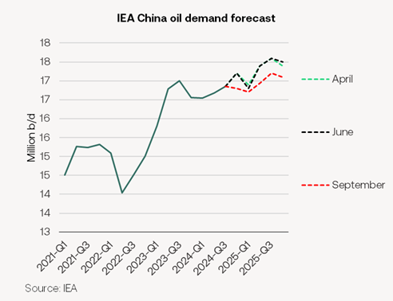
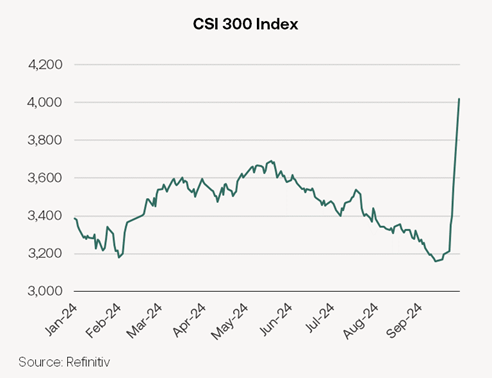
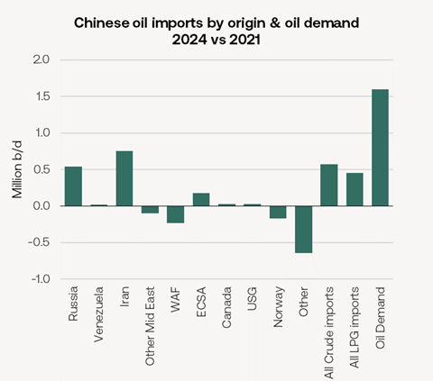
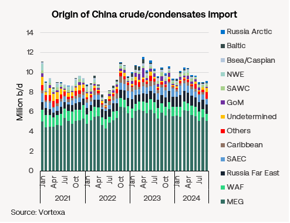

# China’s economic stimulus

**Date:** October 02, 2024  
**Publisher:** Breakwave Advisors | **Category:** Market Insights  
**Original URL:** [https://www.breakwaveadvisors.com/insights/2024/10/2/chinas-economic-stimulus](https://www.breakwaveadvisors.com/insights/2024/10/2/chinas-economic-stimulus)  

---

*By*[*Henry Curra*](https://www.linkedin.com/in/henry-curra-77253b/)*and*[*Yiling Lee*](https://www.linkedin.com/in/yiling-lee-77127317b/)

### Peak Oil Postponed?

*Recent efforts by the Chinese government to stimulate the nation’s economy could postpone peak Chinese oil demand, but not for long. Tankers, particularly VLCCs, will have to look elsewhere for demand growth.*

Before the stimulus package was unveiled last week, we were starting to suspect that decades of exceptional Chinese oil demand had come to an end. By mid-September, the IEA had downgraded its forecast for Chinese demand growth this year to just 180k b/d. Much of this was expected to support LPG carriers, not crude tankers. This represents a big drop from roughly 600k/year annual growth achieved in the decade to 2023 and was well down on the exceptional 1.5m b/d growth last year as China emerged from the COVID lockdown.

> **Figure 1: Market Chart 1**  
> [Local Asset](file:///C:/Users/Dell/Github/Shipping/corpus/03-breakwave/insights/2024/assets/2024-10-02_chinas-economic-stimulus_img_image0_147e7bb7be98.png)

A declining population (since 2022) has seemingly met a jump in the use of alternative fuels in road transport and a decline in construction investment. LNG trucks and EVs are expected to displace around 300k b/d of oil demand this year alone. Jet fuel-hungry domestic air travel is coming under pressure from a vast network of high-speed trains. The housing crisis has caused the number of new housing projects to fall sharply since 2021, impacting diesel demand. Diesel use was down almost 5% y-o-y in the second quarter of this year, according to the IEA. Even plastics production – responsible for three quarters of Chinese oil demand growth between 2009 and 2023 – fell slightly y-o-y in the first half of this year. Plastic demand was weakest in June and July, says China’s National Bureau of Statistics.

A boost to the nation’s economy could help reverse that decline.

China’s latest stimulus is the biggest since COVID. It represents a slew of monetary, fiscal and liquidity support for the economy. In particular, it targets the moribund housing sector by telling banks to lower mortgage rates for existing homes. It also includes a $100bn central bank fund for investors and companies to buy shares. Thus far the Chinese stock market has responded well, up 24% in the week to Monday.

> **Figure 2: Market Chart 2**  
> [Local Asset](file:///C:/Users/Dell/Github/Shipping/corpus/03-breakwave/insights/2024/assets/2024-10-02_chinas-economic-stimulus_img_image1_333bb31841a9.png)

The Chinese government hopes it will be enough to meet its 5% GDP growth target set for the country this year. Before the stimulus, 4.75% was looking more likely, according to China observers. As yet, too little is known of the stimulus measures for economists to fully digest its impact. However, a consensus is emerging that there is a need for greater fiscal support to revive the economy in the longer run. We should have more details in a week after Golden Week.

But even if it does succeed in lifting the economic mood, there is reason to remain cautious about its beneficial effect on the mainstream tanker fleet.

In the past few years, most of the gains in China’s oil demand have benefitted either LPG carriers or the shadow fleet. Since 2021 crude imports from Russia and Iran - much moved on older shadow tankers - have surged by 500k b/d and 800k b/d respectively (see chart below). Meanwhile, imports on international trading tankers from West Africa and Norway have shrunk. Even super long-haul imports from the US Gulf have barely grown over the period, dipping considerably in recent months. US exports were not helped by the growth in China’s shorter haul imports from Canada’s TMX pipeline since June.

> **Figure 3: Market Chart 3**  
> [Local Asset](file:///C:/Users/Dell/Github/Shipping/corpus/03-breakwave/insights/2024/assets/2024-10-02_chinas-economic-stimulus_img_image2_ae4bad3b1789.png)

> **Figure 4: Market Chart 4**  
> [Local Asset](file:///C:/Users/Dell/Github/Shipping/corpus/03-breakwave/insights/2024/assets/2024-10-02_chinas-economic-stimulus_img_image3_653131745e90.png)

With negative growth coming from OECD countries, slower Chinese economic growth will necessarily shift the focus of oil demand growth onto other ‘non-OECD Asia’ countries. We currently expect India’s 200k b/d growth to overtake Chinese oil demand growth this year. Oil demand in ‘other non-OECD Asia’ grew by roughly 250k/d annually in the decade to 2023. Thanks largely to strong Indian economic growth and today’s relatively low per capita oil consumption in the region, we were expecting non-OECD Asian oil demand growth (excl. China) to accelerate to roughly 430k b/d annually from now up to 2030.

While Beijing’s recent stimulus package may offer some support to China’s economy, it is unlikely to resolve the deeper structural issues facing its demand for oil. The global energy landscape is still adjusting to a future in which China plays a less dominant role in driving crude demand, with other emerging economies set to take on a larger share of global oil consumption growth.

---

**Tags:** Tankers, China, Shipping  
