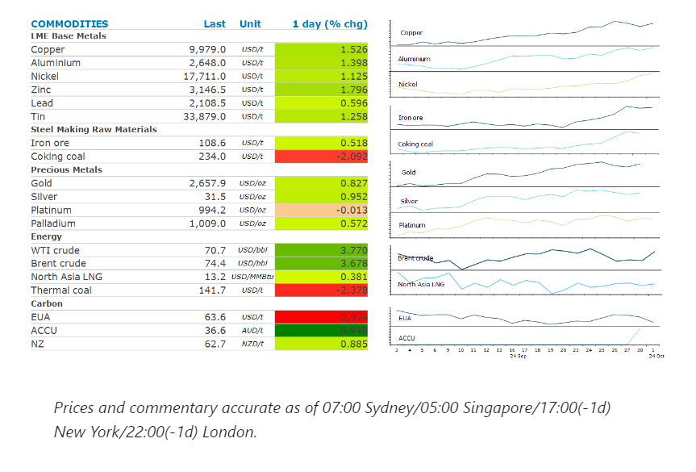
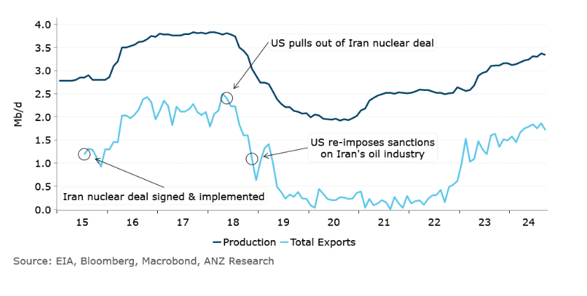

# Oil gains as Iran launches attack on Israel

**Date:** October 02, 2024  
**Publisher:** Breakwave Advisors | **Category:** Market Insights  
**Original URL:** [https://www.breakwaveadvisors.com/insights/2024/10/2/oil-gains-as-iran-launches-attack-on-israel](https://www.breakwaveadvisors.com/insights/2024/10/2/oil-gains-as-iran-launches-attack-on-israel)  

---

Rising geopolitical tensions pushed energy markets higher. Metals also gained amid renew optimism over demand in China.

*By*[*Daniel Hynes*](https://www.linkedin.com/in/dahynes/)

> **Figure 1: Στιγμιότυπο Οθόνης 2024 10 02 095022**  
> [Local Asset](file:///C:/Users/Dell/Github/Shipping/corpus/03-breakwave/insights/2024/assets/2024-10-02_oil-gains-as-iran-launches-attack-on-israel_img_cea3cf84ceb9ceb3cebcceb9cf8ccf84cf85_ea8d1c2875d9.png)

### Market Commentary

**Crude oil**prices surged higher after Iran launched a missile attack on Israel. More than 100 ballistic missiles were launched, although most of them were intercepted, according to Israel’s military. This was in retaliation to the recent attacks on Iranian-backed militant groups including Hezbollah and Houthi. That included the killing of Hezbollah’s leader, Hassan Nasrallah last week. The direct involvement of Iran, an OPEC member, raises the prospect of disruptions to oil supplies. Iran’s output rose to a six year high of 3.7mb/d in August. To date the market has been hesitant to price in a significant geopolitical risk premium given that both sides of the conflict appeared reluctant to escalate the conflict. Any sustained rally in oil prices will be determined by whether Israel responds to this latest move with its own direct attack on Iran's military, infrastructure or its oil industry. Earlier in the day, Israel confirmed that it had commenced a ground invasion against Hezbollah targets in the border region of southern Lebanon. This comes as OPEC’s Joint Ministerial Monitoring Committee meets to review the group’s supply strategy. The market was spooked by reports that Saudi Arabia is willing to forge ahead with production hikes in December, despite[**prices remaining well below levels**](../pdfs/2024-10-02_oil-gains-as-iran-launches-attack-on-israel_commodity-call-opec-s-fiscal-conundr_40020f332149.pdf)that would be comfortable with.

Rising geopolitical tension in the Middle East helped push**global gas**prices higher.**European gas**futures rallied late in the session amid concerns the escalation in the conflict could impact gas fields in the region. Israel supplies gas to southern neighbours Egypt and Jordan. In Ukraine, disruptions to supplies remain a possibility after reports that Russia is said to be planning strikes on nuclear facilities, according to reports from Ukraine’s foreign minister. The gains in the**North Asian LNG**market were more limited, with some buyers reluctant to pay above USD13/MMBtu.

Haven assets were also in demand amid the rising tensions in the Middle East.**Gold**traded as high as USD2670/oz as investors piled into the precious metal. Even so, the outlook for real interest rates is what is going to drive gold prices over the longer term. That outlook wasn’t made any clearer after conflicting signals on the health of the labour market. US manufacturing activity shrank in September, reflecting weak orders and declining employment. However, the JOLTS survey showed job openings rise in August to a three-month high.

**Copper**led the base metal sector higher on the back of optimism over demand in China. Sentiment was boosted following**a plethora of**stimulus measures announced last week by China’s PBoC and its Politburo. Beijing become the latest city in China to ease curbs on home buying, part of the governments renewed push to try and rejuvenate the property sector. Sentiment has also been supported by the prospect of further cuts to borrowing costs. In the US, Fed Chair Jerome Powell said that the central bank will continue to loosen monetary policy if the economy progresses as expected. A squeeze in the**aluminium**market appears to be building, with contracts for October delivery trading at a premium over November. This is being driven by a lengthy queue to withdraw inventories.

### Chart of the Day

Iran's oil output has been rising steadily over the past few years in spite US sanctions on the industry.

> **Figure 2: Στιγμιότυπο Οθόνης 2024 10 02 095038**  
> **Interactive Data & Source:** [Linkedin](https://www.linkedin.com/newsletters/commodities-wrap-6692196755876012032/?fbclid=IwAR3kiXJqZdxmp9ZcRwBNI7FsBySI-XSC0pfPur1qzjt7OZp7PTE59Tsl1QI) | [Local Asset](file:///C:/Users/Dell/Github/Shipping/corpus/03-breakwave/insights/2024/assets/2024-10-02_oil-gains-as-iran-launches-attack-on-israel_img_cea3cf84ceb9ceb3cebcceb9cf8ccf84cf85_f31f643cfbb9.png)

Data source:[Commodities Wrap](https://www.linkedin.com/newsletters/commodities-wrap-6692196755876012032/?fbclid=IwAR3kiXJqZdxmp9ZcRwBNI7FsBySI-XSC0pfPur1qzjt7OZp7PTE59Tsl1QI)

---

**Tags:** Markets, Commodities, Shipping  
