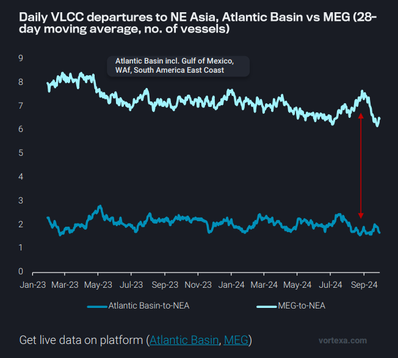
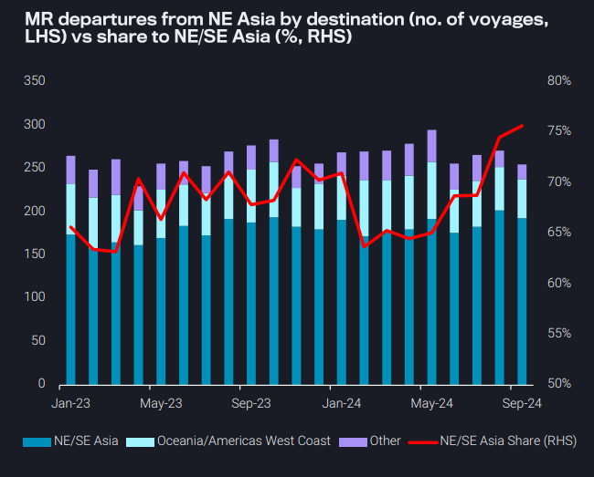
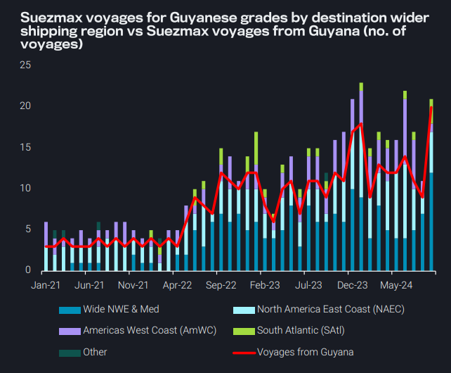
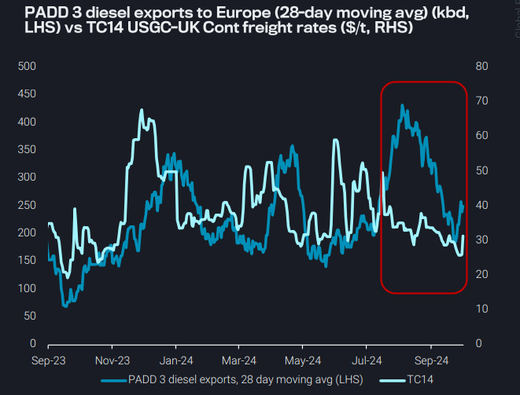

# Transatlantic diesel flows keep MR utilisation healthy

**Date:** October 03, 2024  
**Publisher:** Breakwave Advisors | **Category:** Market Insights  
**Original URL:** [https://www.breakwaveadvisors.com/insights/2024/10/3/transatlantic-diesel-flows-keep-mr-utilisation-healthy](https://www.breakwaveadvisors.com/insights/2024/10/3/transatlantic-diesel-flows-keep-mr-utilisation-healthy)  

---

- **Dirty – East of Suez:**Northeast Asia’s demand for Atlantic Basin crude remains weak, capping global VLCC mileage

- **Clean – East of Suez:**Northeast Asia MR market swings heavily to short-haul trade; pockets of strength likely short-lived
- **Dirty – West of Suez:**Suezmax find support on Guyana-to-Europe amidst VLCC ban, but increasing competition caps rates
- **Clean – West of Suez:**Transatlantic diesel flows keep MR utilisation healthy, but high availability provides a ceiling for rates

*By*[*Mary Melton*](https://www.linkedin.com/search/results/all/?fetchDeterministicClustersOnly=true&heroEntityKey=urn%3Ali%3Afsd_profile%3AACoAABXVyecBtg-pRnIrZe0BoWk0ygPiUfbvhsw&keywords=mary%20melton&origin=RICH_QUERY_SUGGESTION&position=0&searchId=40e8d7d2-c4d0-4022-81e7-176f6eba418b&sid=H_Y&spellCorrectionEnabled=false)

## Dirty – East of Suez: Northeast Asia’s Demand for Atlantic Basin Crude Remains Weak, Capping Global VLCC Mileage

Global VLCC mileage continues to hover near ytd lows as Northeast Asia’s crude imports from key Atlantic Basin VLCC hubs (Gulf of Mexico, WAf, South America East Coast) reached a 17-month low in September

➔ Mileage will likely continue to be suppressed, as VLCC departures to NE Asia from the Atlantic Basin also reached multi-year lows in September

The Middle East Gulf was preferred for increased loadings in August, which widened the divergence in VLCC demand between the MEG and the Atlantic Basin

Because of this increasing market-share of MEG-origin VLCCs for voyages to NE Asia and no clear signs of increased NE Asian demand for Atlantic Basin crudes, tonne-mile demand for the global VLCC segment is likely to remained capped

➔ This will likely continue to push VLCCs in the Atlantic Basin to compete on intra-Atlantic Basin routes usually undertaken by Suezmaxes and Aframaxes

➔ Even if China decides to rebuild inventories, this will likely occur with baseload volumes from the MEG instead of Atlantic Basin crude

> **Figure 1: Στιγμιότυπο Οθόνης 2024 10 03 094530**  
> **Interactive Data & Source:** [Vortexa](https://www.vortexa.com//oil-gas-data-traders-analysts-data-scientists?gclid=Cj0KCQjw8_qRBhCXARIsAE2AtRZKOvMnbilZ_6_91d7huSFFy71pWLrnPwGwOHVzXsmsG-1a1mZnQw8aAt89EALw_wcB&hsa_acc=1782073842&hsa_ad=548425387665&hsa_cam=14746637662&hsa_grp=125038601902&hsa_kw=&hsa_mt=&hsa_net=adwords&hsa_src=g&hsa_tgt=dsa-1431852288425&hsa_ver=3&utm_campaign=%5BCD%5D%20-%20DSA%20-%20EMEA&utm_medium=cpc&utm_medium=ppc&utm_source=google&utm_source=adwords&utm_term=) | [Local Asset](file:///C:/Users/Dell/Github/Shipping/corpus/03-breakwave/insights/2024/assets/2024-10-03_transatlantic-diesel-flows-keep-mr-utilisation-healthy_img_cea3cf84ceb9ceb3cebcceb9cf8ccf84cf85_0aedec4a0240.png)

## Clean – East of Suez: Northeast Asia MR Market Swings Heavily to Short-Haul Trade; Pockets of Strength Likely Short-Lived

APAC MR voyages continue to heavily skew towards the short-haul, with average voyage mileage out of NE Asia falling for the fourth consecutive month, and market share for voyages from NE Asia staying within NE/SE Asia climbing to 75%

Transpacific voyages to the Americas West Coast have increased m-om, but account for such a small market share that they fail to counteract high short-haul employment and offset the decrease in longer voyages from NE Asia-to-Oceania

➔ A softly opening arbitrage for jet cargoes on TC10 (Argus) could boost transpacific utilisation, but high jet stocks in PADD 5 (EIA) mean demand on this route will likely be fleeting

Generally, high short-haul employment in NE Asia points to product oversupply, as poor refining margins and lower domestic consumption push volumes to storage hubs

➔ The exception has been naphtha margins, which have been performing well recently as cracker demand has been robust

➔ This boosted voyage counts for naphtha cargoes originating in NE Asia, but it is unlikely this strength in demand will be maintained

> **Figure 2: Στιγμιότυπο Οθόνης 2024 10 03 094623**  
> **Interactive Data & Source:** [Vortexa](https://www.vortexa.com//oil-gas-data-traders-analysts-data-scientists?gclid=Cj0KCQjw8_qRBhCXARIsAE2AtRZKOvMnbilZ_6_91d7huSFFy71pWLrnPwGwOHVzXsmsG-1a1mZnQw8aAt89EALw_wcB&hsa_acc=1782073842&hsa_ad=548425387665&hsa_cam=14746637662&hsa_grp=125038601902&hsa_kw=&hsa_mt=&hsa_net=adwords&hsa_src=g&hsa_tgt=dsa-1431852288425&hsa_ver=3&utm_campaign=%5BCD%5D%20-%20DSA%20-%20EMEA&utm_medium=cpc&utm_medium=ppc&utm_source=google&utm_source=adwords&utm_term=) | [Local Asset](file:///C:/Users/Dell/Github/Shipping/corpus/03-breakwave/insights/2024/assets/2024-10-03_transatlantic-diesel-flows-keep-mr-utilisation-healthy_img_cea3cf84ceb9ceb3cebcceb9cf8ccf84cf85_75459b9515c5.png)

## Dirty – West of Suez: Suezmax Find Support on Guyana-to-Europe Amidst VLCC Ban, But Increasing Competition Caps Rates

The number of Suezmax voyages carrying Guyanese crude grades has more than doubled in September m-o-m

➔ This support comes from the VLCC seasonal ban on loadings from Guyanese FSOs, which took effect at the start of September and is expected to last up until January

➔ The number of Suezmax loadings from Guyanese FSOs has reached an all-time high, with the share of voyages to Europe (Wider NWE & Wider Med) remaining robust

➔ Conversely, less volumes head towards Americas West Coast, hence Suezmax voyages of Guyanese grades via the TransPanama pipeline softened

Due to the increase in demand for the Guyana-to-Europe route, Suezmax freight rates surged by around 25% on Monday (Argus)

➔ Nevertheless, there is an increasing trend of ballasters heading towards South America East Coast, putting upwards pressure on the vessel supply side

> **Figure 3: Στιγμιότυπο Οθόνης 2024 10 03 094810**  
> **Interactive Data & Source:** [Vortexa](https://www.vortexa.com//oil-gas-data-traders-analysts-data-scientists?gclid=Cj0KCQjw8_qRBhCXARIsAE2AtRZKOvMnbilZ_6_91d7huSFFy71pWLrnPwGwOHVzXsmsG-1a1mZnQw8aAt89EALw_wcB&hsa_acc=1782073842&hsa_ad=548425387665&hsa_cam=14746637662&hsa_grp=125038601902&hsa_kw=&hsa_mt=&hsa_net=adwords&hsa_src=g&hsa_tgt=dsa-1431852288425&hsa_ver=3&utm_campaign=%5BCD%5D%20-%20DSA%20-%20EMEA&utm_medium=cpc&utm_medium=ppc&utm_source=google&utm_source=adwords&utm_term=) | [Local Asset](file:///C:/Users/Dell/Github/Shipping/corpus/03-breakwave/insights/2024/assets/2024-10-03_transatlantic-diesel-flows-keep-mr-utilisation-healthy_img_cea3cf84ceb9ceb3cebcceb9cf8ccf84cf85_153ed8319128.png)

## Clean – West of Suez: Transatlantic Diesel Flows Keep MR Utilisation Healthy, But High Availability Provides a Ceiling for Rates

Europe’s imports of USGC diesel have doubled during Jan-Sept 2024 compared to the same period in 2023, largely due to low demand in the US markets and high MR availability in the region keeping TC14 rates low and enabling arbitrage opportunities

➔ Loadings in September have been observed at nearly 250kb, and already two vessels have loaded by October 02

➔ PADD 3 continues to produce high volumes of diesel for export despite refineries dropping to run rates below 95% since May

➔ Despite high volumes of diesel coming into Europe from East of Suez markets, the ramp up of the European turnaround season may continue to pull more barrels into the region

Although daily freight rates have strengthened slightly in the last few days due to the momentum of loadings, it is unlikely that the freight rate rise will close the arb in the near term

> **Figure 4: Στιγμιότυπο Οθόνης 2024 10 03 094955**  
> **Interactive Data & Source:** [Vortexa](https://www.vortexa.com//oil-gas-data-traders-analysts-data-scientists?gclid=Cj0KCQjw8_qRBhCXARIsAE2AtRZKOvMnbilZ_6_91d7huSFFy71pWLrnPwGwOHVzXsmsG-1a1mZnQw8aAt89EALw_wcB&hsa_acc=1782073842&hsa_ad=548425387665&hsa_cam=14746637662&hsa_grp=125038601902&hsa_kw=&hsa_mt=&hsa_net=adwords&hsa_src=g&hsa_tgt=dsa-1431852288425&hsa_ver=3&utm_campaign=%5BCD%5D%20-%20DSA%20-%20EMEA&utm_medium=cpc&utm_medium=ppc&utm_source=google&utm_source=adwords&utm_term=) | [Local Asset](file:///C:/Users/Dell/Github/Shipping/corpus/03-breakwave/insights/2024/assets/2024-10-03_transatlantic-diesel-flows-keep-mr-utilisation-healthy_img_cea3cf84ceb9ceb3cebcceb9cf8ccf84cf85_d1a16ea1153c.png)

Data Source:[Vortexa](https://www.vortexa.com//oil-gas-data-traders-analysts-data-scientists?gclid=Cj0KCQjw8_qRBhCXARIsAE2AtRZKOvMnbilZ_6_91d7huSFFy71pWLrnPwGwOHVzXsmsG-1a1mZnQw8aAt89EALw_wcB&hsa_acc=1782073842&hsa_ad=548425387665&hsa_cam=14746637662&hsa_grp=125038601902&hsa_kw=&hsa_mt=&hsa_net=adwords&hsa_src=g&hsa_tgt=dsa-1431852288425&hsa_ver=3&utm_campaign=%5BCD%5D%20-%20DSA%20-%20EMEA&utm_medium=cpc&utm_medium=ppc&utm_source=google&utm_source=adwords&utm_term=)

---

**Tags:** Tankers, Shipping, Crude  
