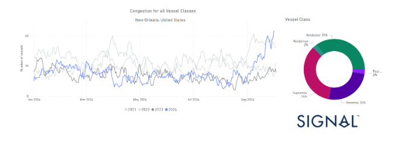
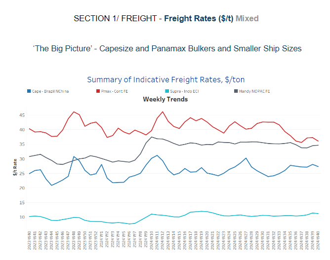
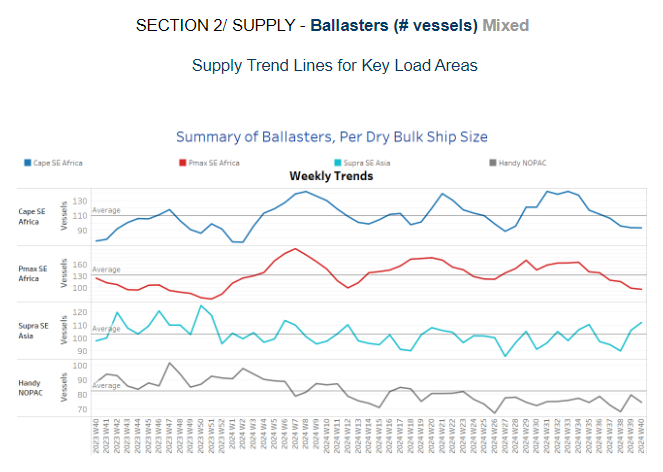
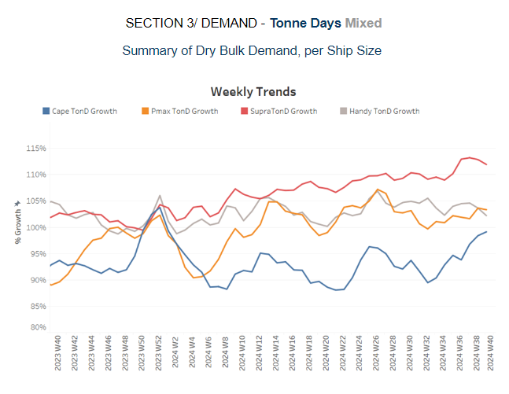
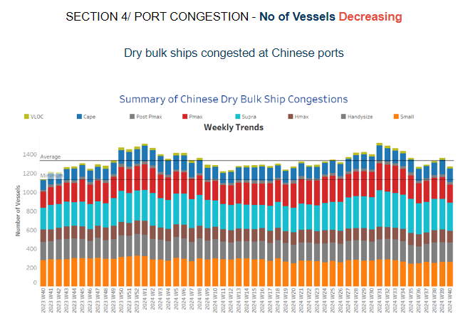

# US port strikes - New Orleans congestion

**Date:** October 03, 2024  
**Publisher:** Breakwave Advisors | **Category:** Market Insights  
**Original URL:** [https://www.breakwaveadvisors.com/insights/2024/10/3/us-port-strikes-new-orleans-congestion](https://www.breakwaveadvisors.com/insights/2024/10/3/us-port-strikes-new-orleans-congestion)  

---

**Dry Weekly Market Monitor - Week 40.2024**
Snapshot of Spot Freight Rates, Supply-Demand Trends, Port Congestions
October 03, 2024

## Chart of the Week: Us Port Strikes - New Orleans Congestion

*This week's focus is on the U.S. port congestion amid recent port strikes. The ongoing U.S. port strikes, particularly at the Port of New Orleans, are causing significant congestion and delays. As one of the key Gulf Coast ports, New Orleans handles a substantial amount of dry bulk commodities, including agricultural exports like grains. Ships are facing long wait times to unload and load cargo, leading to increased costs for shipping companies and potential shortages in supply chains. The longer the strike continues, the more severe the congestion and economic impacts on industries reliant on these critical trade flows.*

> **Figure 1: Στιγμιότυπο Οθόνης 2024 10 03 130730**  
> **Interactive Data & Source:** [Signal Ocean Platform](https://go.signalocean.com/e/983831/news-articles-c3vkdp3rx17o/2qltjp/440257829/h/rBPB-pHBpxIarT59sr2CXWqTSrTvEEQUd801gWRakqs) | [Local Asset](file:///C:/Users/Dell/Github/Shipping/corpus/03-breakwave/insights/2024/assets/2024-10-03_us-port-strikes-new-orleans-congestion_img_cea3cf84ceb9ceb3cebcceb9cf8ccf84cf85_05fc81527f9d.png)

The central focus in seaborne trade this week is the[ongoing strike at U.S. ports](https://go.signalocean.com/e/983831/news-articles-c3vkdp3rx17o/2qltjp/440257829/h/rBPB-pHBpxIarT59sr2CXWqTSrTvEEQUd801gWRakqs), which is causing widespread disruption across the industry. Dockworkers at 36 major ports along the East and Gulf Coasts, including critical hubs like Houston, New York, and Savannah, are on strike, resulting in significant delays in vessel loading and unloading. Experts estimate that the strike could cost the U.S. economy up to $4.5 billion per day. Since the strike began on October 1st, container traffic has already been heavily impacted, while the number of dry bulk vessels congested at the Port of New Orleans is hitting new highs. Vessel congestion there has surged by a staggering 190% monthly increase, with a 13% increase weekly. The Handysize and Supramax vessel categories are bearing the brunt of these disruptions, experiencing the highest levels of congestion. There is no clear resolution in sight for the strike. Although President Joe Biden has the authority to suspend the strike for up to 80 days to allow for further negotiations, the White House has stated that he does not currently plan to intervene.

In the dry bulk freight market, the Brazil-to-China route is showing signs of softening, with rates continuing the downward trend seen at the end of last week. However, optimism remains strong, supported by positive developments in the iron ore market and encouraging indicators of economic growth in China. On Monday, iron ore prices experienced another sharp increase, pushing the total gain beyond 20% since China started unveiling stimulus measures last Tuesday. The[price](https://go.signalocean.com/e/983831/s-surge-after-chinas-stimulus-/2qltjs/440257829/h/rBPB-pHBpxIarT59sr2CXWqTSrTvEEQUd801gWRakqs)of 62% Fe fines spiked to over $113.50 per tonne during the day, marking its highest level since May. However, by late afternoon, the price settled at $108.90 per tonne. As the strike continues, the industry will be closely monitoring how long these disruptions last and the far-reaching effects they may have on global supply chains.

> **Figure 2: Στιγμιότυπο Οθόνης 2024 10 03 130840**  
> **Interactive Data & Source:** [Signal Ocean Platform](https://www.thesignalgroup.com/signal-ocean-platform) | [Local Asset](file:///C:/Users/Dell/Github/Shipping/corpus/03-breakwave/insights/2024/assets/2024-10-03_us-port-strikes-new-orleans-congestion_img_cea3cf84ceb9ceb3cebcceb9cf8ccf84cf85_d2512e030098.png)

The dry bulk freight market has shown mixed sentiment in early October. A softening trend is evident in the Capesize Brazil–North China and Panamax Continent–Far East routes, while the Supramax Indo–ECI and Handysize NOPAC routes have maintained steady market conditions.

- **Capesize**vessel freight rates for shipments from Brazil to North China settled at $27 per ton, reflecting a 4% decline week-over-week. However, rates remain 14% higher compared to the same week last year.
- **Panamax**vessel freight rates from the Continent to the Far East have fallen to $36 per ton, with expectations of a continued downward trend in the coming days. Current rates are now 14% lower than the same period last year.
- **Supramax**vessel freight rates on the Indo-ECI route remain slightly above $11 per ton, reflecting an 8% increase compared to the previous month.
- **Handysize**freight rates for the NOPAC Far East route have remained steady at $35 per ton since April, marking a 12% increase compared to the same period last year.

> **Figure 3: Στιγμιότυπο Οθόνης 2024 10 03 131838**  
> **Interactive Data & Source:** [Signal Ocean Platform](https://www.thesignalgroup.com/signal-ocean-platform) | [Local Asset](file:///C:/Users/Dell/Github/Shipping/corpus/03-breakwave/insights/2024/assets/2024-10-03_us-port-strikes-new-orleans-congestion_img_cea3cf84ceb9ceb3cebcceb9cf8ccf84cf85_72ea9643e426.png)

The first week of October began with indications of a continued decline in the number of ballasters for Capesize and Panamax vessels in Southeast Asia, falling below the annual trend. In contrast, there has been an increase in the smaller vessel size categories.

- **Capesize SE Africa**: The number of vessels has dropped to 90, which is 50 fewer than the peak observed at the end of week 31.
- **Panamax SE Africa**: The current number of vessels has dropped to approximately 95, marking one of the lowest levels since the start of the year. Recent indications suggest that this figure will remain below the annual trend in the coming days of October.
- **Supramax SE Asia**: The number of ballast ships has maintained the elevated levels seen in the previous week. Current figures show an increase to over 100 vessels, continuing the upward trend observed at the end of September.
- **Handysize NOPAC**: The number of ballasters amid signs of an increase to over 90, the latest indications eventually signal a downward trend below the annual trend at around 75.

> **Figure 4: Στιγμιότυπο Οθόνης 2024 10 03 131947**  
> **Interactive Data & Source:** [Signal Ocean Platform](https://www.thesignalgroup.com/signal-ocean-platform) | [Local Asset](file:///C:/Users/Dell/Github/Shipping/corpus/03-breakwave/insights/2024/assets/2024-10-03_us-port-strikes-new-orleans-congestion_img_cea3cf84ceb9ceb3cebcceb9cf8ccf84cf85_7564fc344ed0.png)

In the first week of October, the outlook for dry tonne-days remains promising for the Capesize segment, while a downward trend is observed across other vessel size categories.

- **Capesize**: Recent estimates confirm a robust upward adjustment in tonne-day growth for early October. This positive trend continues to reflect strengthened demand and improved market conditions.
- **Panamax**: Weekly percentage growth has once again shifted to a downward trend in October, continuing the softening seen during the final week of the previous month. However, rates remain above the significant decline recorded at the end of July.
- **Supramax**: The growth rate seemed to have reached its peak before the end of September, while latest estimates show a downward trend for the autumn.
- **Handysize**: The Handysize vessel segment has continued its downward trend for over a month, with the latest peak recorded at the end of week 31.

> **Figure 5: Στιγμιότυπο Οθόνης 2024 10 03 132032**  
> **Interactive Data & Source:** [Signal Ocean Platform](https://www.thesignalgroup.com/signal-ocean-platform) | [Local Asset](file:///C:/Users/Dell/Github/Shipping/corpus/03-breakwave/insights/2024/assets/2024-10-03_us-port-strikes-new-orleans-congestion_img_cea3cf84ceb9ceb3cebcceb9cf8ccf84cf85_f87a5982896c.png)

The congestion at Chinese dry bulk ports showed signs of easing by the end of last week in September, and October began with a downward revision in the Panamax and Supramax segments.

- **Capesize**: Congestion for Capesize vessels remained below 150 ships, though recent activity indicates an increase of approximately 14 vessels compared to levels from two weeks ago.
- **Panamax**: The number of Panamax vessels has dropped to approximately 190, reflecting a decrease of 40 from the peak recorded in the end of September.
- **Supramax**: Congestion levels dropped below 300 vessels, marking one of the lowest points since the end of week 26.
- **Handysize**: Congestion levels remained steady at around 200 vessels, consistent with the previous week, while recent activity mirrors the trends seen throughout September.

Data Source:[Signal Ocean Platform](https://www.thesignalgroup.com/signal-ocean-platform)

---

**Tags:** Drybulk, Capesize, Shipping  
