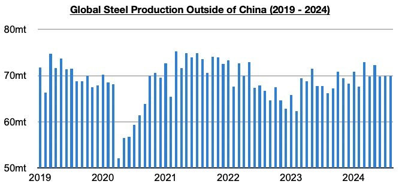
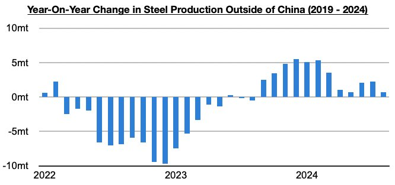
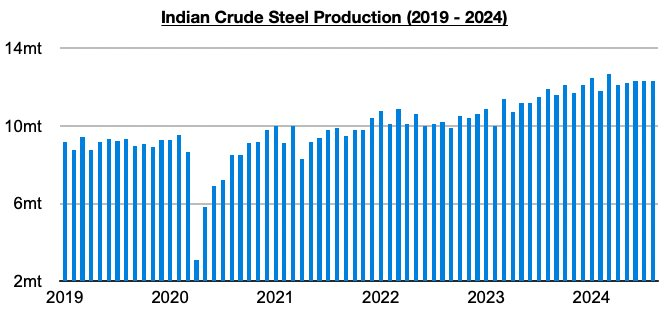
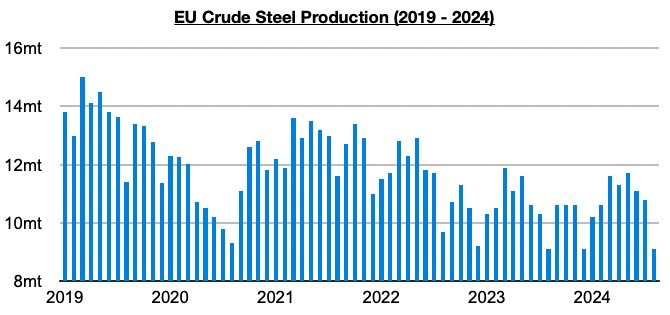

# Ongoing Growth in Steel Production Outside of China

**Date:** October 04, 2024  
**Publisher:** Breakwave Advisors | **Category:** Market Insights  
**Original URL:** [https://www.breakwaveadvisors.com/insights/2024/10/4/2na3l82jqweqt1n9cbck1gclhabqsl](https://www.breakwaveadvisors.com/insights/2024/10/4/2na3l82jqweqt1n9cbck1gclhabqsl)  

---

*By*[*Jeffrey Landsberg*](https://www.linkedin.com/in/jeffrey-landsberg-70ab957/)

As we discussed in Commodore Research's most recent Weekly Dry Bulk Report, global steel production totaled approximately 144.8 million tons in August. This is down month-on-month by 8 million tons (-5%) and is 7.8 million tons (-5%) less than was reported last year for August 2023’s production. Steel production outside of China totaled approximately 69.9 million tons last month. This is unchanged from July and is 700,000 tons (1%) more than was reported last year for August’s production.

> **Figure 1: Chart 1**  
> [Local Asset](file:///C:/Users/Dell/Github/Shipping/corpus/03-breakwave/insights/2024/assets/2024-10-04_2na3l82jqweqt1n9cbck1gclhabqsl_img_chart1_96e989adb43c.jpg)

Steel production outside of China has now grown on a year-on-year basis for twelve straight months. Still positive is that while it appeared that production would enter contraction earlier this year, growth has in fact continued. Prior to these last twelve months, steel production outside of China had contracted on a year-on-year basis during seventeen of the prior eighteen months. Overall, a shift back to growth has occurred in the European Union in recent months (although production was flat last month), and in India growth has remained robust.

> **Figure 2: Chart 2**  
> [Local Asset](file:///C:/Users/Dell/Github/Shipping/corpus/03-breakwave/insights/2024/assets/2024-10-04_2na3l82jqweqt1n9cbck1gclhabqsl_img_chart2_f6da7c54dedf.jpg)

Indian steel production totaled 12.3 million tons last month. This is unchanged from July and is 400,000 tons (3%) more than was reported last year for August 2023’s production. India’s production has now increased on a year-on-year basis for eighteen straight months.

> **Figure 3: Chart 3**  
> [Local Asset](file:///C:/Users/Dell/Github/Shipping/corpus/03-breakwave/insights/2024/assets/2024-10-04_2na3l82jqweqt1n9cbck1gclhabqsl_img_chart3_06f85403211a.jpg)

EU steel production totaled 9.1 million tons last month. This is 1.7 million tons (-16%) less than was produced in July but is the same as was reported last year for August 2023’s production. Production has now either grown or been flat for five straight months. Before the last five months, EU production had contracted on a year-on-year basis during twenty-six of the prior twenty-eight months.

> **Figure 4: Chart 4**  
> [Local Asset](file:///C:/Users/Dell/Github/Shipping/corpus/03-breakwave/insights/2024/assets/2024-10-04_2na3l82jqweqt1n9cbck1gclhabqsl_img_chart4_41cc400b5801.jpg)

---

**Tags:** China, Economy, Markets  
