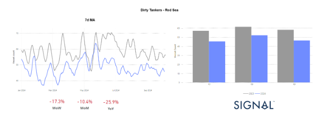
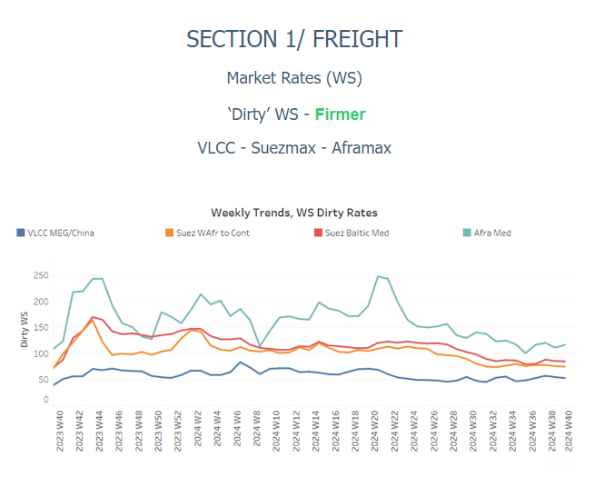
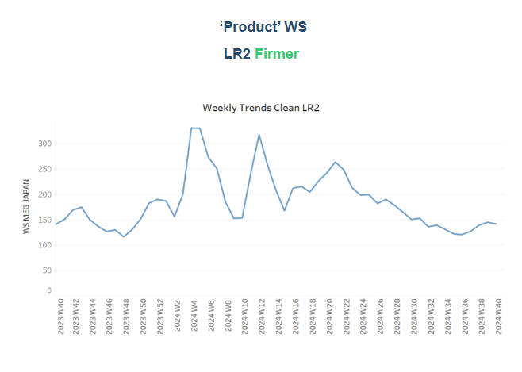
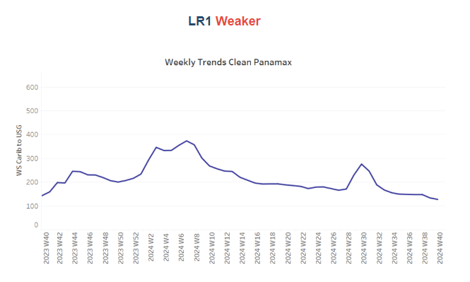
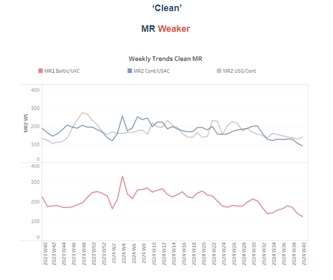
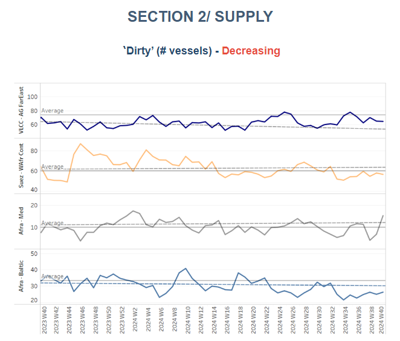
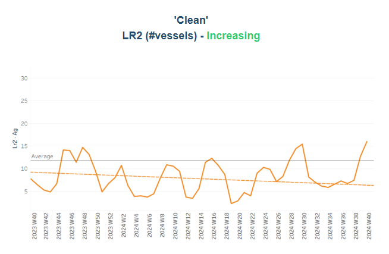
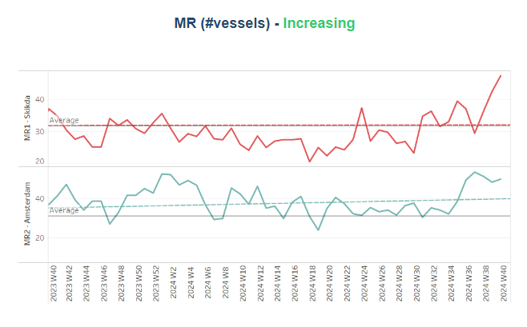
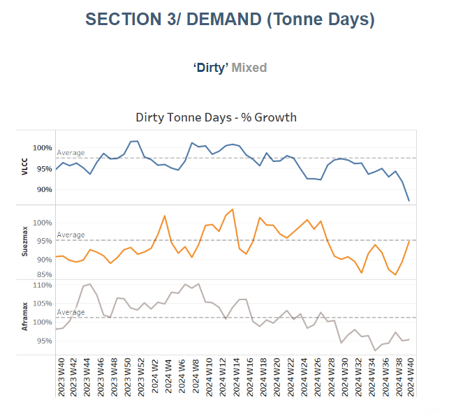
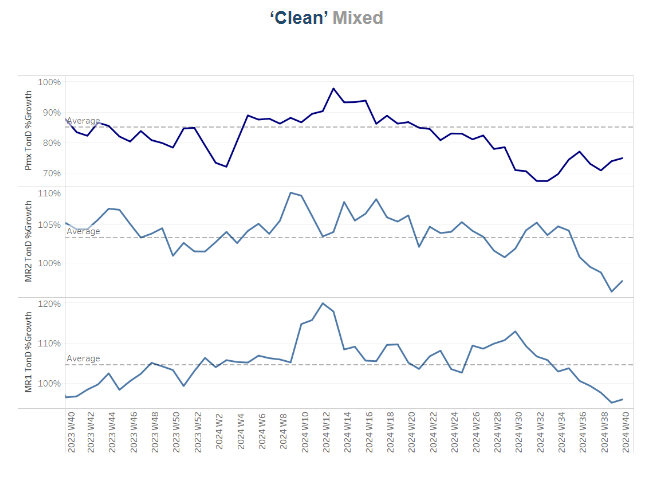

# Dirty Tankers - Red Sea

**Date:** October 04, 2024  
**Publisher:** Breakwave Advisors | **Category:** Market Insights  
**Original URL:** [https://www.breakwaveadvisors.com/insights/2024/10/4/dirty-tankers-red-sea](https://www.breakwaveadvisors.com/insights/2024/10/4/dirty-tankers-red-sea)  

---

## Tanker - Weekly Market Monitor

Snapshot of Crude and Product Freight Rates, Supply-Demand

Week 40, October 04, 2024

### Chart of the Week: Dirty Tankers - Red Sea

This week’s chart highlights a notable decline in the quarterly vessel count for dirty tanker transits through the Red Sea, underscoring growing concerns over the region’s shipping activity. The 7-day Moving Average (left chart) shows a clear downward trajectory in the vessel count throughout the year compared to the previous year’s daily transits for key dirty tanker categories such as Very Large Crude Carriers (VLCCs), Suezmax, and Aframax tankers. Notably, there has been a significant 26% annual decrease in vessel transits.

> **Figure 1: Στιγμιότυπο Οθόνης 2024 10 04 140923**  
> **Interactive Data & Source:** [Signal Ocean Platform](https://go.signalocean.com/e/983831/bal-supply-outlook-2024-10-03-/2qlxqd/440544554/h/A1advEfbuIfWpdrwK1jtqd6NH62oBW5cq3vrMkjSByY) | [Local Asset](file:///C:/Users/Dell/Github/Shipping/corpus/03-breakwave/insights/2024/assets/2024-10-04_dirty-tankers-red-sea_img_cea3cf84ceb9ceb3cebcceb9cf8ccf84cf85_9de8fd49ad0f.png)

The first days of October are marked by the latest wave of Middle Eastern geopolitical tensions, which have raised concerns over a potential increase in oil prices as the region edges toward a wider conflict. Market participants are increasingly anxious about the near-term outlook for oil prices, especially as risks in key maritime routes heighten. A particularly significant threat comes from Houthi attacks in the Red Sea, which continue to disrupt seaborne oil trading. The number of vessels transiting the Red Sea has noticeably declined, reflecting mounting apprehensions over the safety of shipments through this crucial waterway.

In the crude freight market, sentiment has remained firm, particularly on the AG-China route. This firmness is largely due to ongoing stimulus measures from the Chinese government aimed at revitalising its economy. These measures are expected to fuel a robust demand for energy in the coming months, providing some degree of optimism to market participants. The prospect of increased energy consumption in China, one of the world's largest oil importers, contrasts with the broader geopolitical uncertainty, creating a mixed but cautiously optimistic outlook for crude freight rates and oil trading dynamics.

However, the situation remains highly fluid. Any further escalation in geopolitical tensions could drastically alter the supply-demand balance, potentially sending oil prices soaring. The interplay between geopolitical risk, maritime security, and economic policy will be critical in shaping the trajectory of the oil market as October progresses.[Oil prices](https://go.signalocean.com/e/983831/bal-supply-outlook-2024-10-03-/2qlxqd/440544554/h/A1advEfbuIfWpdrwK1jtqd6NH62oBW5cq3vrMkjSByY)surged on Thursday as investor fears grew that escalating tensions in the Middle East could disrupt crude supplies from the region. By 11:36 a.m. EDT, Brent crude futures had risen by $2.82, or 3.82%, to $76.72 per barrel, while U.S. West Texas Intermediate (WTI) crude climbed $2.85, or 4.07%, to $72.95 per barrel. Both benchmarks saw gains of more than $3 per barrel during the trading session. Brent crude hit an intraday high of $77.65, the highest level since August 30, while WTI reached $73.95, marking a one-month peak.

> **Figure 2: Στιγμιότυπο Οθόνης 2024 10 04 141259**  
> **Interactive Data & Source:** [Signal Ocean Platform](https://www.thesignalgroup.com/signal-ocean-platform) | [Local Asset](file:///C:/Users/Dell/Github/Shipping/corpus/03-breakwave/insights/2024/assets/2024-10-04_dirty-tankers-red-sea_img_cea3cf84ceb9ceb3cebcceb9cf8ccf84cf85_a8d30dd03cb1.png)

​​​​​Sentiment in the dirty freight market remained robust in early October, particularly for the VLCC AG-China route, with signs of an upward correction for the Aframax Mediterranean market.

- The**VLCC**MEG-China freight rates reached 56 WS, reflecting a 24% increase month-on-month and a 33% rise compared to the same week in October last year.
- Suezmax freight rates for shipments from**West Africa to continental****Europe**surged to 90 WS, marking an 18% increase week-on-week. On the Suezmax**Baltic-Mediterranean**route, rates maintained a steady momentum from the previous two weeks, stabilising at 85 WS, which represents a 17% increase compared to the same period last year.
- Aframax**Mediterranean**freight rates experienced a significant uptick in early October, climbing well above WS100. This surge represents a substantial 40% increase compared to the same week last month.

> **Figure 3: Στιγμιότυπο Οθόνης 2024 10 04 141358**  
> **Interactive Data & Source:** [Signal Ocean Platform](https://www.thesignalgroup.com/signal-ocean-platform) | [Local Asset](file:///C:/Users/Dell/Github/Shipping/corpus/03-breakwave/insights/2024/assets/2024-10-04_dirty-tankers-red-sea_img_cea3cf84ceb9ceb3cebcceb9cf8ccf84cf85_febec7effa33.png)

- **LR2**AG freight rates are currently around WS125, reflecting a 9% increase over the past month. These rates are holding steady and appear to be firmer than the levels seen in the first half of the previous month.

> **Figure 4: Στιγμιότυπο Οθόνης 2024 10 04 141448**  
> **Interactive Data & Source:** [Signal Ocean Platform](https://www.thesignalgroup.com/signal-ocean-platform) | [Local Asset](file:///C:/Users/Dell/Github/Shipping/corpus/03-breakwave/insights/2024/assets/2024-10-04_dirty-tankers-red-sea_img_cea3cf84ceb9ceb3cebcceb9cf8ccf84cf85_c9ae71811e76.png)

- **Panamax**Carib-to-USG rates have shown signs of increasing towards levels above WS140; however, early October data confirmed a decline from the end of September, with rates now falling below WS130. This represents a 14% decrease month-on-month.

> **Figure 5: Στιγμιότυπο Οθόνης 2024 10 04 141626**  
> **Interactive Data & Source:** [Signal Ocean Platform](https://www.thesignalgroup.com/signal-ocean-platform) | [Local Asset](file:///C:/Users/Dell/Github/Shipping/corpus/03-breakwave/insights/2024/assets/2024-10-04_dirty-tankers-red-sea_img_cea3cf84ceb9ceb3cebcceb9cf8ccf84cf85_e70bbf3ffc5d.png)

- **MR1**rates for shipments from the Baltic to the continent experienced a significant downward revision in early October, dropping to nearly WS120. This marks a substantial 50% decrease compared to the previous month. Meanwhile,**MR2**rates for shipments from the Continent to the USAC fell WS90, indicating a 36% annual decrease. On the USG-Continent route,**MR2**rates rose to WS170, reflecting a 36% weekly decrease.

> **Figure 6: Στιγμιότυπο Οθόνης 2024 10 04 141724**  
> **Interactive Data & Source:** [Signal Ocean Platform](https://www.thesignalgroup.com/signal-ocean-platform) | [Local Asset](file:///C:/Users/Dell/Github/Shipping/corpus/03-breakwave/insights/2024/assets/2024-10-04_dirty-tankers-red-sea_img_cea3cf84ceb9ceb3cebcceb9cf8ccf84cf85_84967d745fa9.png)

​​​​​​The supply of crude tankers continued its downward trend in early October, although there was a notable upward movement for the Aframax Mediterranean route.

- **VLCC Ras Tanura**: The number of ships decreased to 65, down by 5 from the previous week, remaining below the annual average since the end of Week 34.
- **Suezmax Wafr**: The current ship count is at 56, reflecting a decline of 10 compared to the end of September. It appears that this downward trend will continue for the rest of the month, which may support a firmer market momentum.
- **Aframax Med**: The number of ships saw an unexpected increase of over 10, following a low at the end of September. However, we will need to confirm this recent spike in the coming days to determine its sustainability.
- **Aframax Baltic**: There has been a downward trend since the end of week 31, with current levels at around 26, 7 below the annual average.

> **Figure 7: Στιγμιότυπο Οθόνης 2024 10 04 141856**  
> **Interactive Data & Source:** [Signal Ocean Platform](https://www.thesignalgroup.com/signal-ocean-platform) | [Local Asset](file:///C:/Users/Dell/Github/Shipping/corpus/03-breakwave/insights/2024/assets/2024-10-04_dirty-tankers-red-sea_img_cea3cf84ceb9ceb3cebcceb9cf8ccf84cf85_ae98c89f4384.png)

> **Figure 8: Στιγμιότυπο Οθόνης 2024 10 04 141907**  
> **Interactive Data & Source:** [Signal Ocean Platform](https://www.thesignalgroup.com/signal-ocean-platform) | [Local Asset](file:///C:/Users/Dell/Github/Shipping/corpus/03-breakwave/insights/2024/assets/2024-10-04_dirty-tankers-red-sea_img_cea3cf84ceb9ceb3cebcceb9cf8ccf84cf85_38ae7b97e165.png)

- **Clean LR2 AG Jubail**: The upward trend observed in the final days of September has begun to surpass the annual average by 12, with an increase of 4 for the first week of October.

- **Clean MR**: At Algeria's Skikda port, the number of vessels has remained elevated since the end of September, nearing 50 and reflecting an increase of 16 compared to the annual average. Meanwhile, MR2 activity in Amsterdam has also been strong, with 50 vessels recorded for the second consecutive week—approximately 20 more than eight weeks ago.

> **Figure 9: Στιγμιότυπο Οθόνης 2024 10 04 142023**  
> **Interactive Data & Source:** [Signal Ocean Platform](https://www.thesignalgroup.com/signal-ocean-platform) | [Local Asset](file:///C:/Users/Dell/Github/Shipping/corpus/03-breakwave/insights/2024/assets/2024-10-04_dirty-tankers-red-sea_img_cea3cf84ceb9ceb3cebcceb9cf8ccf84cf85_fdcd1f8b884b.png)

- **Dirty**tonne days: The decline in VLCC tonne-days growth continued throughout September, extending the weakening trend into early October. In contrast, the Suezmax segment is showing steady signs of an upward trend. Despite the recent downturn in the VLCC segment, expectations remain bullish for the last quarter of the year, driven by anticipated winter seasonality.

> **Figure 10: Στιγμιότυπο Οθόνης 2024 10 04 142124**  
> **Interactive Data & Source:** [Signal Ocean Platform](https://www.thesignalgroup.com/signal-ocean-platform) | [Local Asset](file:///C:/Users/Dell/Github/Shipping/corpus/03-breakwave/insights/2024/assets/2024-10-04_dirty-tankers-red-sea_img_cea3cf84ceb9ceb3cebcceb9cf8ccf84cf85_a641a23eae73.png)

- **Panamax**tonne days: The growth rate has now established an upward trend compared to the lows recorded at the end of Week 36. However, the recent pace remains significantly below the annual average.

- **MR**tonne-days: The growth rate for both MR1 and MR2 vessel sizes has continued to decrease, staying below the annual average and reaching the lowest weekly percentage growth recorded this year since the end of Week 34.

Data Source:[Signal Ocean Platform](https://www.thesignalgroup.com/signal-ocean-platform)

---

**Tags:** Tankers, Shipping, Markets  
