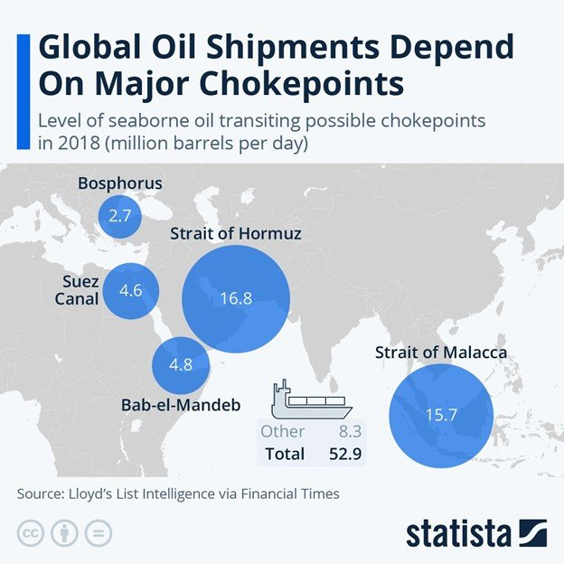
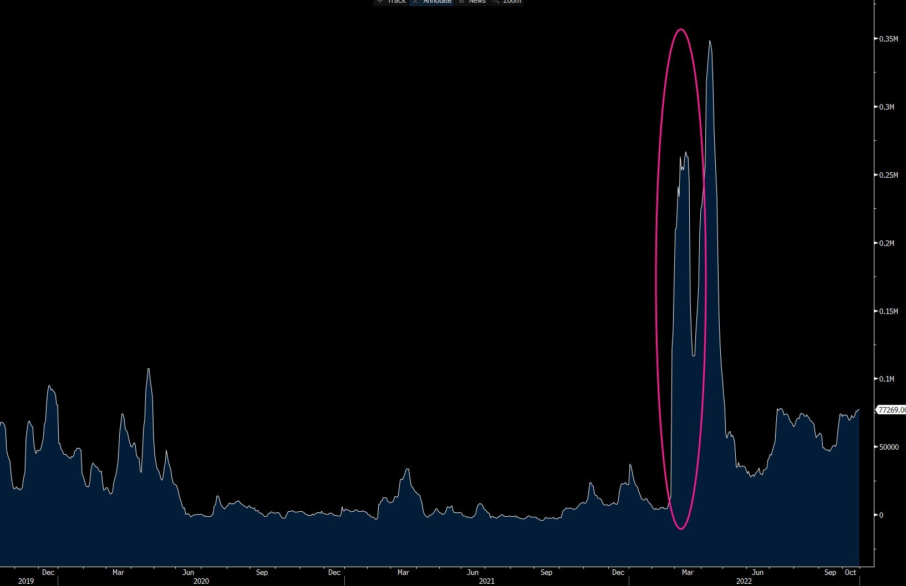

# Potential developments in the AG tanker market

**Date:** October 04, 2024  
**Publisher:** Breakwave Advisors | **Category:** Market Insights  
**Original URL:** [https://www.breakwaveadvisors.com/insights/2024/10/4/potential-developments-in-the-ag-tanker-market](https://www.breakwaveadvisors.com/insights/2024/10/4/potential-developments-in-the-ag-tanker-market)  

---

> **Figure 1: Gy 2lpxwcaa032a**  
> [Local Asset](file:///C:/Users/Dell/Github/Shipping/corpus/03-breakwave/insights/2024/assets/2024-10-04_potential-developments-in-the-ag-tanker-market_img_gy-2lpxwcaa032a_0c412cf00886.jpeg)

Although it is still too early to speculate on potential developments in the AG tanker market given the fluid situation btwn Israel & Iran, any disruption to ships passing through the Strait of Hormuz could have a significant impact on tanker rates out of the region. Here’s why:

We suspect a potential response from Iran to any major attacks to its oil infrastructure might include a similar response to what is currently happening in the Red Sea with the Houthis: Attacking western-owned tankers that sail through the straits.

However, we believe Iran will likely allow Chinese-owned ships to continue to trade through the Strait of Hormuz, maintaining oil flows to China. Naturally, such ships will demand a significant premium for such business.

As a playbook, looking back at spot rates for crude tankers carrying oil out of the Black Sea following the Russian invasion of Ukraine, rates paid to the few ships able to make the voyage skyrocketed while other routes were generally unaffected by the geopolitical developments.

> **Figure 2: Gy 2dm6xqaazp7e**  
> [Local Asset](file:///C:/Users/Dell/Github/Shipping/corpus/03-breakwave/insights/2024/assets/2024-10-04_potential-developments-in-the-ag-tanker-market_img_gy-2dm6xqaazp7e_2ffe4bc5e490.jpeg)

In this scenario where most western-owned ships would be unable transit the AG, such ships would be forced to divert elsewhere causing excess tonnage available to other routes, potentially pushing rates lower. Yet, ships able to sail through the strait could see rates skyrocket.

There will certainly be an initial rush to secure tankers, which will cause a spike in rates globally, but we believe such a spike will not last long.

The initial market reaction might be to buy tanker stocks, but in reality, revenues for those companies could drop sharply after an initial spike if the only routes available to them are oversupplied with the diverted ships.

Yet freight futures on VLCC rates out of the Middle East could see significant gains in such a scenario, in multiples of current spot levels. All the above represents potential developments and could be viewed as unlikely, but we don’t see them anymore as zero probability events.

---

**Tags:** Shipping, Tankers, Crude  
