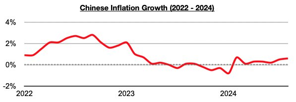
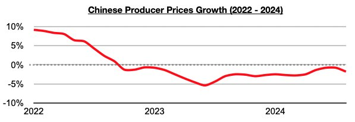

# China Uniquely Positioned to Carry Out Its Stimulus Bazooka

**Date:** October 07, 2024  
**Publisher:** Breakwave Advisors | **Category:** Market Insights  
**Original URL:** [https://www.breakwaveadvisors.com/insights/2024/10/7/oq7fgpnxhbtmii7q0fxw6ontvvqc6l](https://www.breakwaveadvisors.com/insights/2024/10/7/oq7fgpnxhbtmii7q0fxw6ontvvqc6l)  

---

*By*[*Jeffrey Landsberg*](https://www.linkedin.com/in/jeffrey-landsberg-70ab957/)

As we discussed in Commodore Research's most recent Weekly Dry Bulk Report, China’s “stimulus bazooka” was the biggest news in the market last week, but also important (and not receiving nearly as much coverage) is that the central government announced that it will be strictly limiting the construction of new housing. For the dry bulk market, a stimulus bazooka that includes strict restrictions on housing construction is not as helpful as a stimulus bazooka that does not have restrictions on housing. But that is OK. As we have often discussed in our Weekly Dry Bulk Reports and Weekly China Reports, China’s extremely weak housing market is not at all what drives China's dry bulk import demand. The availability of commodities in the export market is primarily what drives China’s dry bulk import demand.

China's stimulus bazooka includes cash handouts to those in extreme poverty, several rate cuts (including a 50 basis point cut to the reserve requirement ratio), and 500 billion yuan ($71 billion) to banks to buy equities. Plans also include a further cut to the reserve requirement ratio that will very likely come before the end of this year and that banks could easily receive a second and even third batch of additional 500 billion yuan ($71 billion) “if the plan is enforced well enough”. Overall, China's central government is suddenly going all in on quantitative easing/inflationary spending at basically the exact moment that the United States has re-entered its own quantitative easing cycle. In China, this marks a stark contrast to just a few years ago when significant efforts were made to reign in spending, drive down debt, and become much more comfortable with lower levels of growth.

For the dry bulk market, China suddenly embracing inflation again is a positive. Struggling global iron ore prices not surprisingly surged last week, and as we have continued to stress, a key issue for the dry bulk market has been if iron ore prices remain at levels high enough for**exporters**. China’s inflationary measures will be helpful here. Very significant to us is that China is uniquely positioned to carry out its bazooka. As we have often stressed in Commodore Research's Weekly China Reports, inflation has remained low in China and not at all has been a debilitating issue as it has been in much of the rest of the world. China’s inflation most recently came in at only 0.6% in August.

> **Figure 1: Chart 1 (1)**  
> [Local Asset](file:///C:/Users/Dell/Github/Shipping/corpus/03-breakwave/insights/2024/assets/2024-10-07_oq7fgpnxhbtmii7q0fxw6ontvvqc6l_img_chart128129_661a4d47a7e0.jpg)

Producer prices in China also remain in a year-on-year contraction. With inflation long being relatively low in China, the central government is being afforded a luxury of more safely being able to carry out inflationary measures. This contrasts greatly much of the rest of the world including the United States.

> **Figure 2: Chart 2 (1)**  
> [Local Asset](file:///C:/Users/Dell/Github/Shipping/corpus/03-breakwave/insights/2024/assets/2024-10-07_oq7fgpnxhbtmii7q0fxw6ontvvqc6l_img_chart228129_4c4e28d0a98c.jpg)

---

**Tags:** China, Shipping, Drybulk  
