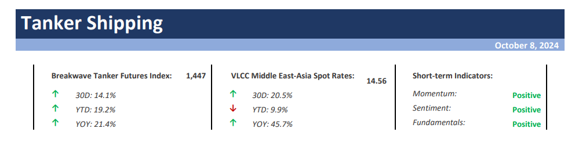
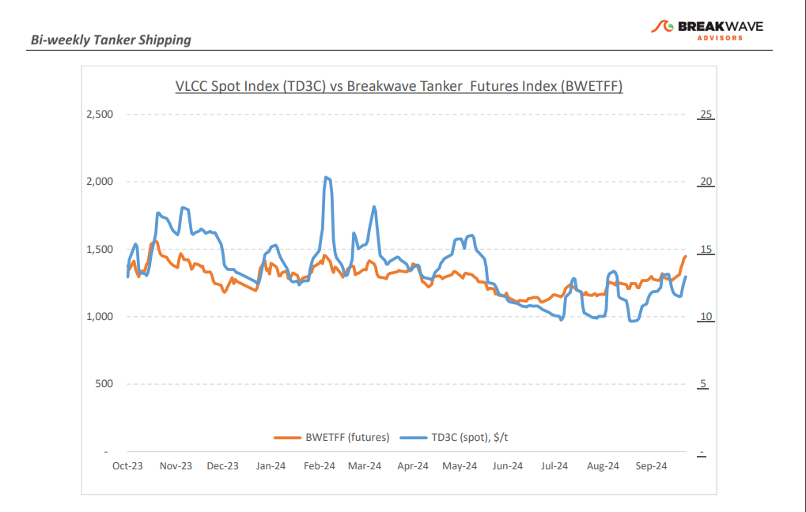
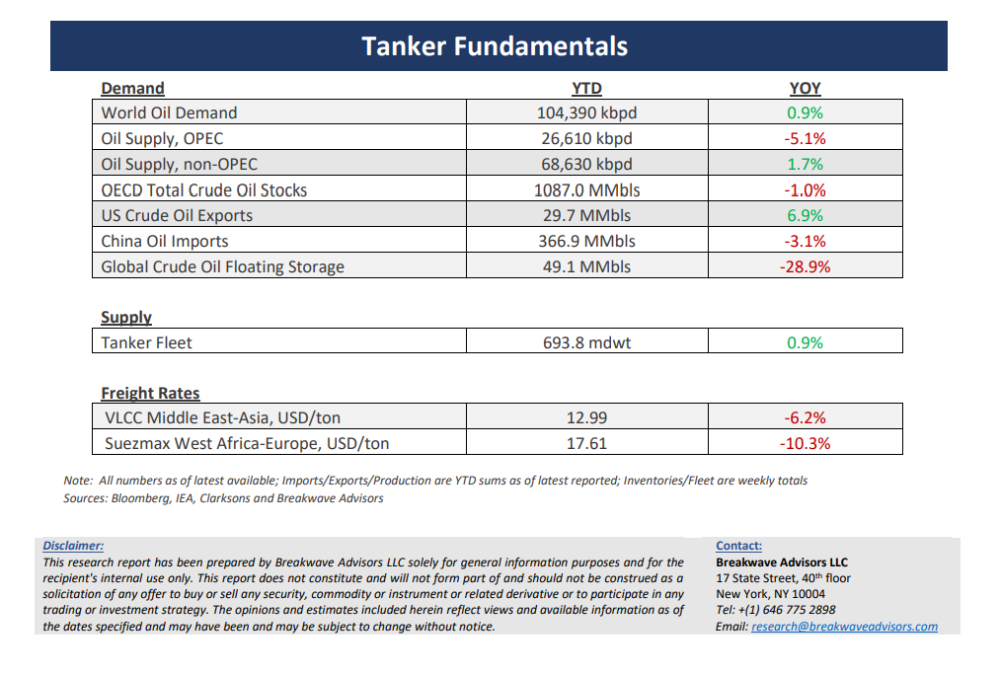

# Breakwave Bi-Weekly Tanker Report - october 8, 2024

**Date:** October 08, 2024  
**Publisher:** Breakwave Advisors | **Category:** Market Insights  
**Original URL:** [https://www.breakwaveadvisors.com/insights/2024924wet-87578j-sbtjm](https://www.breakwaveadvisors.com/insights/2024924wet-87578j-sbtjm)  

---

> **Figure 1: Cea3cf84ceb9ceb3cebcceb9cf8ccf84cf85**  
> [Local Asset](file:///C:/Users/Dell/Github/Shipping/corpus/03-breakwave/insights/2024/assets/2024-10-08_2024924wet-87578j-sbtjm_img_cea3cf84ceb9ceb3cebcceb9cf8ccf84cf85_b44716cc7714.png)

•**VLCC Rates Jump Amid Geopolitical Turmoil but Demand Risks Remain**– The VLCC market in the Arabian Gulf (AG) experienced**two distinct halves**at the beginning of October. An initially subdued freight market mainly due to lower activity during holidays in the Far East, with available cargoes attracting numerous offers, resulted in some fixed deals being concluded below previous levels and market sentiment begun to weaken. However, this slow momentum**changed**mid-week as renewed**geopolitical tensions**in the Middle East increased uncertainty. As a result, many shipowners were reluctant to offer AG cargoes, which led to a lower availability of tonnage. This shortage of supply allowed shipowners to**push spot rates up**in a matter of days. In West Africa (WAF), the VLCC market showed**signs of recovery**after the recent downturn. The return of Eastern charterers with numerous cargoes for late October and early November helped to clear out much of the early tonnage. This tightening of supply combined with the strength of the US Gulf market bolstered rates while a solid flow of inquiries for North Europe routes also contributed to the improved sentiment. Looking ahead, the crude**freight market faces continued complexity**as geopolitical tensions remain heightened amid concerns over stability in the Middle East. Such a climate of uncertainty**increases the likelihood**of freight**rates rising further**in the coming days/weeks, especially with signs of tightening tonnage availability. The current dynamics favor shipowners, who may push rates even higher especially during**a seasonally strong**period.

•**Numerous Scenarios for Oil Markets as Middle East are Reaching a Boling Point**– The complex relationships and possible scenarios on a**progressively tense situation**in the Middle East is causing considerable**nervousness**in the oil markets including tankers. The**future**developments are**difficult to predict**and range from mild price impact all the way to significant disruptions in oil flows that**could lead**to**major price dislocations**across the energy spectrum. Despite significant**excess production capacity**(some ~5mpbd), the**logistics**of getting such crude into the global markets is challenging and**would require**some cooperation from Iran that stands in the midst of the current turmoil, a development that is not a certainty. With the news flow changing by the hour, it is**quite difficult to make any predictions**with a reasonable degree of certainly. The reality is that**uncertainty has a cost**, which is reflected in both oil as well as**freight**prices. From one hand, the**bad scenarios**increasingly seem real and has now been**discussed more and more**. On the other hand, we see such scenarios as**extreme**when we include the economic incentives for each player. Given current oil and freight prices, the**risk-reward**of holding**long**exposure in those markets appears**reasonable**, as we believe recent escalation in the Middle East is the worst we have seen in**many decades**and warrant**more caution**that previous clashes.

•**Our Long-term View –**The tanker market is recovering from a long period of staggered rates as the growth in new vessel supply shrinks while oil demand is recovering in line with the global economy. A historically low orderbook combined with favorable demand fundamentals should continue to support increased spot rate volatility, which combined with the ongoing geopolitical turmoil, should support freight rates in the medium to long term.

> **Figure 2: Cea3cf84ceb9ceb3cebcceb9cf8ccf84cf85**  
> [Local Asset](file:///C:/Users/Dell/Github/Shipping/corpus/03-breakwave/insights/2024/assets/2024-10-08_2024924wet-87578j-sbtjm_img_cea3cf84ceb9ceb3cebcceb9cf8ccf84cf85_b06f4db0901b.png)

> **Figure 3: Cea3cf84ceb9ceb3cebcceb9cf8ccf84cf85**  
> [Local Asset](file:///C:/Users/Dell/Github/Shipping/corpus/03-breakwave/insights/2024/assets/2024-10-08_2024924wet-87578j-sbtjm_img_cea3cf84ceb9ceb3cebcceb9cf8ccf84cf85_05f9521e753e.png)

### Subscribe:
