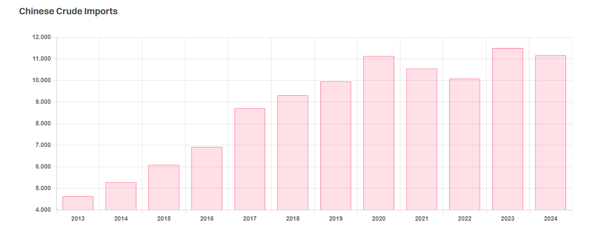

# Chinese Stimulus

**Date:** October 08, 2024  
**Publisher:** Breakwave Advisors | **Category:** Market Insights  
**Original URL:** [https://www.breakwaveadvisors.com/insights/2024/10/8/chinese-stimulus](https://www.breakwaveadvisors.com/insights/2024/10/8/chinese-stimulus)  

---

> **Figure 1: Hong Kong**  
> **Interactive Data & Source:** [Gibsons Co](https://www.gibsons.co.uk/market-reports) | [Local Asset](file:///C:/Users/Dell/Github/Shipping/corpus/03-breakwave/insights/2024/assets/2024-10-08_chinese-stimulus_img_hong-kong_468e0a00db08.jpg)

Chinese oil demand has been underwhelming this year. The IEA had to revise their full year forecast downwards, largely based on lacklustre figures coming out of the country. It now sees Chinese oil demand growth at 180 kbd this year, and an additional 260 kbd in 2025 will bring the total to 17 mbd. The reasons cited were primarily the weak consumer spending on the back of an ongoing housing crisis and low industrial activity, whilst the growing share of EVs in the Chinese car fleet and higher uptake of LNG trucks also played an important role. Recently crude imports into China rebounded, though according to Reuters 1.85 mbd went into stockpiles in August, indicating domestic demand and refinery throughput remained low.

Last week the Chinese government responded with fiscal measures to stimulate the economy, address concerns about deflationary pressure, and bolster the real estate market. The People’s Bank of China (PBOC) cut the reserve requirement ratio by 0.5%, allowing banks to lend more and buy more government bonds. Benchmark seven-day interest rates were cut by 0.2%, mortgage rates were cut by 0.5%, and the downpayment required for a second home was reduced by 10%. Lastly, the PBOC offered liquidity support for the stock market.

Whilst these measures initially led to an increase in oil prices signalling the expectation of improved demand, the bounce faded quickly as rumours of OPEC+ going ahead with their planned output hike in December circulated. The stimulus packages put more money into the pockets of Chinese consumers, which in theory should lead to an increase in consumption and industrial output, both key drivers of domestic fuel consumption. This in turn, could drive higher oil imports, providing support for the crude tanker market. However, the longer-term impact is uncertain. Two key trends behind slowing oil demand growth have been greater uptake of EVs and LNG trucks, and it is doubtful whether these trends will be affected by the stimulus measures.

Overall, the stimulus measures are unlikely to bring the Chinese economy back on to its previous growth path, and additional financial measures to boost the Chinese consumer are required as structural issues remain unaddressed, according to analysts. China’s property market has struggled for several years, and consumer confidence and spending remain low. Weak domestic demand as well as global trade barriers have weighed on industrial activity, which recently contracted for its fifth month in a row. All of this provides headwinds to oil markets. However, whilst demand growth is not forecast to be as high as in recent years, it continues to grow, and these new measures could provide an element of support in the short term, benefitting crude tanker markets. However, in the longer term we may have to look elsewhere for growth.

> **Figure 2: Στιγμιότυπο Οθόνης 2024 10 08 104507**  
> **Interactive Data & Source:** [Gibsons Co](https://www.gibsons.co.uk/market-reports) | [Local Asset](file:///C:/Users/Dell/Github/Shipping/corpus/03-breakwave/insights/2024/assets/2024-10-08_chinese-stimulus_img_cea3cf84ceb9ceb3cebcceb9cf8ccf84cf85_187e62a5fed0.png)

Data source:[Gibson Shipbrokers](https://www.gibsons.co.uk/market-reports)

---

**Tags:** Tankers, Crude, Shipping  
