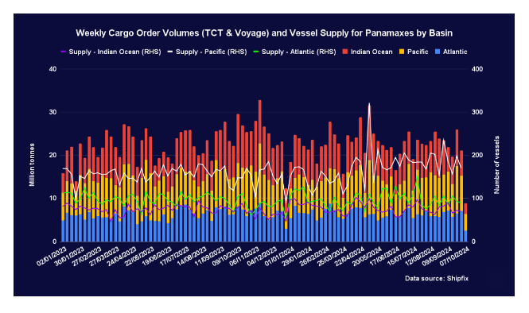

# Ηeadwinds for most commodities

**Date:** October 09, 2024  
**Publisher:** Breakwave Advisors | **Category:** Market Insights  
**Original URL:** [https://www.breakwaveadvisors.com/insights/2024/10/9/eadwinds-for-most-commodities](https://www.breakwaveadvisors.com/insights/2024/10/9/eadwinds-for-most-commodities)  

---

The Baltic Dry Index declined for a seventh consecutive session on Tuesday, but unlike recent days, only the capesizes contributed to the loss. A briefing by the Chinese economic planning agency, which many traders perceived as underwhelming, contributed to significant headwinds for most commodities on Tuesday. Iron ore, which has gained considerable ground in recent weeks, declined by more than five per cent.

*By*[*Ulf Bergman*](https://www.linkedin.com/in/ulf-bergman-81570425/)

### Macro/geopolitics

On Tuesday, China’s National Development and Reform Commission said it was confident that the country would meet its growth target of around five per cent for the year. However, the Chinese planning agency’s briefing proved underwhelming for many investors as no major stimulus initiatives for the world’s second-largest economy were presented. Still, the agency suggested that some public spending would be brought forward. The lack of new policies put pressure on many commodities as traders scaled back their bullish bets on the Chinese economy.

### Commodity Markets

Crude oil prices declined sharply yesterday as concerns over the Chinese demand outlook mounted amid a lack of new stimulus measures. The December Brent futures dropped by 4.6 per cent, ending the session at 77.18 dollars per barrel. The contracts initially recorded a modest rebound in today’s trading, but they have since given up the gains and dipped into the red.

European natural gas prices retreated for a second consecutive session on Tuesday as increased wind power production put pressure on demand. In addition, more scheduled LNG cargo arrivals improved the supply situation. The front-month TTF futures recorded a daily loss of 3.3 per cent, settling at 38.92 euros per MWh. The downward momentum has been maintained in today’s trading amid losses of approximately one per cent.

The benchmark futures for the Asian and European coal markets faced headwinds yesterday amid falling natural gas prices and renewed concerns over the Chinese economy. The November futures for delivery in Newcastle declined by 1.4 per cent, ending the session at 150.80 dollars per tonne. The front-month Rotterdam contracts shed 1.3 per cent, settling at 120.85 dollars per tonne.

NDRC’s briefing yesterday weighed heavily on iron ore as traders reassessed their demand projections. After gaining two per cent on Monday, the November futures listed on the SGX fell by 5.2 per cent yesterday, settling at 105 dollars per tonne. The contracts initially recovered some ground in today’s trading but have since retreated to the vicinity of yesterday’s close.

The base metals also faced significant headwinds during yesterday’s session as the NDRC announced no new Chinese stimulus measure during its briefing, putting pressure on the demand outlook. The three-month LME copper futures ended the session with a loss of 1.9 per cent, while the aluminium contracts dropped by 3.3 per cent. The zinc futures declined by 2.6 per cent, and the nickel contracts retreated by 1.5 per cent.

The CBOT wheat futures were among the minority of commodities advancing yesterday as data showed robust exports during August. The December contracts delivered a daily gain of 0.4 per cent. In contrast, the corn futures for delivery in December shed 1.2 per cent yesterday amid soft export data and an improving supply situation. The November soybean futures dropped by 1.7 per cent amid expectations of increasing supplies.

### Freight and Bunker Markets

The Baltic Dry Index declined for a seventh consecutive session yesterday. The capesizes were the sole culprits for the headline index’s 2.5 per cent decline. The gauge for the largest vessels dropped by 5.4 per cent amid low cargo order volumes across the major basins. The indicator for the panamaxes extended on recent gains with an increase of 1.8 per cent as demand shifted towards more imminent deliveries. The indices for the supramaxes and the handysizes recorded modest daily gains of 0.6 and 0.3 per cent, respectively.

Among the Baltic Exchange’s wet freight indices, only the gauge for the clean tankers recorded a gain yesterday. After significant gains last week, the dirty tanker index declined for a second session on Tuesday amid a loss of 1.7 per cent. In contrast, the gauge for the clean tankers ended a run of thirteen days in the red amid a gain of 3.5 per cent. The indicator for the LNG carriers shed 2.7 per cent, while the gauge for the LPG retreated by 2.4 per cent.

The trading in bunker fuels experienced diverging fortunes during yesterday’s session. The VLSFO ended the day broadly unchanged in Singapore and Houston while gaining 2.1 per cent in Rotterdam. The MGO ended the session unchanged in Houston but gained 0.7 per cent in Singapore and 1.9 per cent in Rotterdam.

### The View From the Shipfix Desk

Over the past month, the Baltic Exchange’s freight gauge for the panamaxes has been the best performer among the dry bulk vessel segments. Despite a week of losses at the end of September, the index was more than eleven per cent higher than a month ago at the end of yesterday’s session. Still, the gauge is more than eight per cent lower than at the same time last year.

Global cargo order volumes for the panamaxes faced pressure last week and were nearly nineteen per cent lower than during the preceding seven days. The decline was the result of weaker demand in the Pacific and Indian Oceans, partially due to the Golden Week celebrations in China. At the same time, cargo ordering activities in the Atlantic continued to recover after a dip in the middle of September. The new week has seen some tentative signs of a recovery, with demand in the Pacific basin picking up on Tuesday as China returned to work following the weeklong holiday period.

The tonnage supply situations in the major basins have been diverging recently. The number of available vessels in the Atlantic and the Indian Ocean remained below the weekly average for the past 21 months. On the other hand, the Pacific continued to be well supplied. The data for the past two days point towards rising vessel supply in the Pacific and Atlantic basins.

From a demand and supply perspective, the short-term outlook for the panamaxes looks uncertain. Recent depressed demand and rising tonnage supply could weigh on freight rates in the near future. Still, a likely rebound in cargo ordering activities after the Golden Week would offset such a development. However, other factors, such as market lead times, will also contribute to the evolution of panamax freight rates in the coming weeks.

> **Figure 1: Στιγμιότυπο Οθόνης 2024 10 09 143944**  
> **Interactive Data & Source:** [Shipfix](https://shipfix.com/) | [Local Asset](file:///C:/Users/Dell/Github/Shipping/corpus/03-breakwave/insights/2024/assets/2024-10-09_eadwinds-for-most-commodities_img_cea3cf84ceb9ceb3cebcceb9cf8ccf84cf85_cf0225de55bf.png)

Data Source:[Shipfix](https://shipfix.com/)

---

**Tags:** Shipping, Commodities, Markets  
