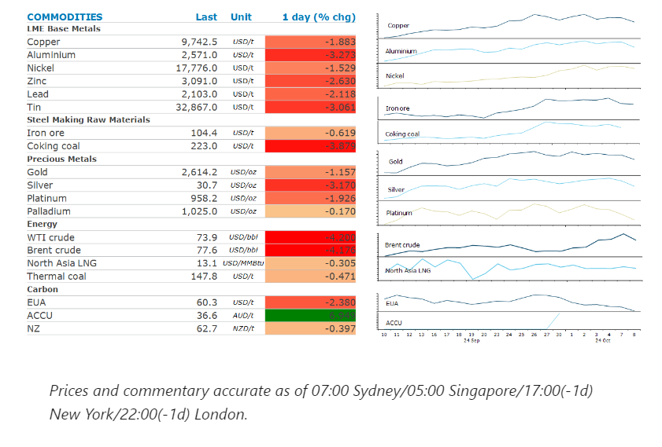
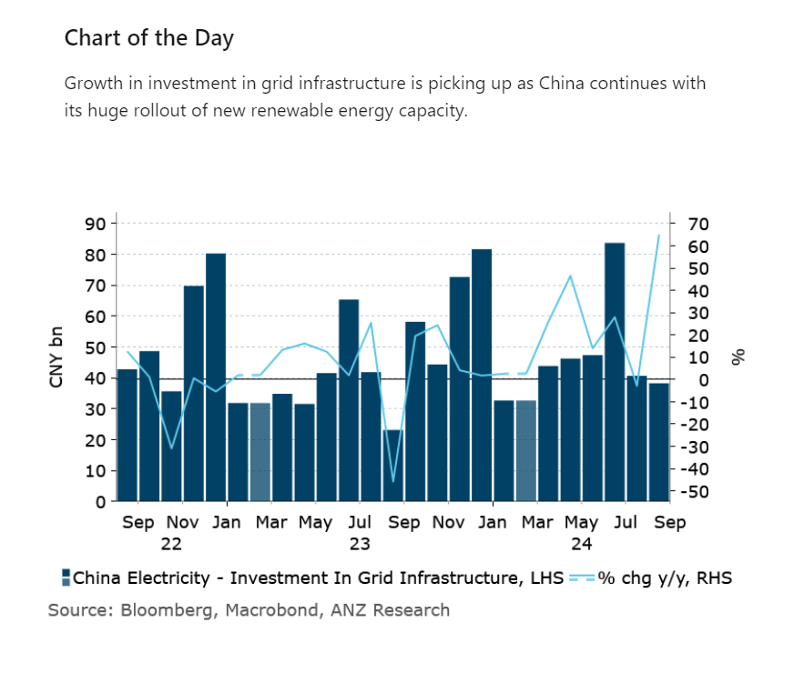

# Lack of new stimulus measures triggers selloff

**Date:** October 09, 2024  
**Publisher:** Breakwave Advisors | **Category:** Market Insights  
**Original URL:** [https://www.breakwaveadvisors.com/insights/2024/10/9/lack-of-new-stimulus-measures-triggers-selloff](https://www.breakwaveadvisors.com/insights/2024/10/9/lack-of-new-stimulus-measures-triggers-selloff)  

---

Metal and energy markets came under pressure after China failed to deliver fresh stimulus measures.

*By*[*Daniel Hynes*](https://www.linkedin.com/in/dahynes/)

> **Figure 1: Στιγμιότυπο Οθόνης 2024 10 09 114645**  
> **Interactive Data & Source:** [Linkedin](https://www.linkedin.com/newsletters/commodities-wrap-6692196755876012032/?fbclid=IwAR3kiXJqZdxmp9ZcRwBNI7FsBySI-XSC0pfPur1qzjt7OZp7PTE59Tsl1QI) | [Local Asset](file:///C:/Users/Dell/Github/Shipping/corpus/03-breakwave/insights/2024/assets/2024-10-09_lack-of-new-stimulus-measures-triggers-selloff_img_cea3cf84ceb9ceb3cebcceb9cf8ccf84cf85_e13acd17aeb6.png)

### Market Commentary

**Iron ore and base metal**futures slumped after Beijing failed to deliver any meaningful stimulus measures to help boost economic growth. A scheduled press briefing by officials from the National Development and Reform Commission was expected to provide details of the fiscal stimulus measure the country’s Politburo called for prior to the Golden Week holiday. Instead, they said it would speed up spending while largely reiterating plans to boost investment and increase direct support for low-income groups and new graduates. They added it would continue to issue long sovereign bonds next year to support major projects and bring forward a CNY100bn investment in strategic areas originally budgeted for 2025 to this year. Iron ore opened the session strongly, but then fell more than 5%, reflecting disappointment among investors and traders. Base metals came under pressure, with copper ending the session down nearly 2%. This was despite noticeable confidence in the outlook among Chinese attendees at last week’s LME Week in London. The improved outlook for demand was expected to be supported by better-than-expected economic conditions in developed markets. German industrial production rebounded 2.9% in August and a 2.9% drop a month earlier. Weakness in nickel was exacerbated by builds in inventory. LME warehouses are becoming the depository for excess high-grade nickel, with inventories up 10% over the past month and over 100% since the start of the year.

The risk-off tone triggered by the lack of new stimulus measures in China also weighed on energy markets.**Crude oil**plunged more than 4% as oil demand from the world’s top importer came back into focus. This has been a major cause for concern in recent months and contributed to the prices slump in the third quarter. Meanwhile rising tension in the Middle East is keeping the market on edge. Israel’s Defence Forces said it will deploy a fourth army division into Lebanon a week after the start of a ground invasion against Hezbollah. The Iran-back militant group fired about 135 projectiles at Israel, according to Bloomberg. However, concern remains as to whether Israel will attack Iran’s oil industry following the recent missile strikes. US President Biden has sought to discourage such a move, but there is growing concern that Israel’s allies have little influence on its strategy. Potential supply disruptions are emerging in the Gulf of Mexico. Hurricane Milton is shaping up to be the most destructive storm since 2022. More oil companies shut platforms and terminals ahead of its expected Wednesday night arrival.

**European gas**prices fell as mild and windy weather curbed demand. Weather forecasts suggest the start of the heating season will see higher-than-normal temperatures. The remnants of Hurricane Kirk is bringing strong winds that are boosting wind power.**North Asian LNG**prices lowered after China’s NDRC said it has enough stockpiled heating fuel to ensure safe supplies during the peak winter season.

**Gold**fell for a fifth day as a stronger USD weighed on investor demand. Some unwinding of long positions amid the risk-off tone also played its part.

> **Figure 2: Στιγμιότυπο Οθόνης 2024 10 09 114754**  
> **Interactive Data & Source:** [Linkedin](https://www.linkedin.com/newsletters/commodities-wrap-6692196755876012032/?fbclid=IwAR3kiXJqZdxmp9ZcRwBNI7FsBySI-XSC0pfPur1qzjt7OZp7PTE59Tsl1QI) | [Local Asset](file:///C:/Users/Dell/Github/Shipping/corpus/03-breakwave/insights/2024/assets/2024-10-09_lack-of-new-stimulus-measures-triggers-selloff_img_cea3cf84ceb9ceb3cebcceb9cf8ccf84cf85_dc24473a1516.png)

Data source:[Commodities Wrap](https://www.linkedin.com/newsletters/commodities-wrap-6692196755876012032/?fbclid=IwAR3kiXJqZdxmp9ZcRwBNI7FsBySI-XSC0pfPur1qzjt7OZp7PTE59Tsl1QI)

---

**Tags:** Markets, Commodities, Shipping  
