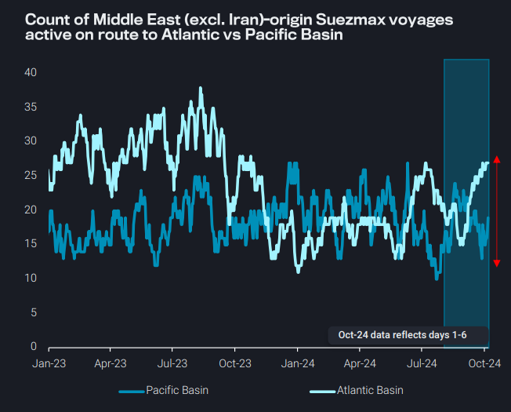
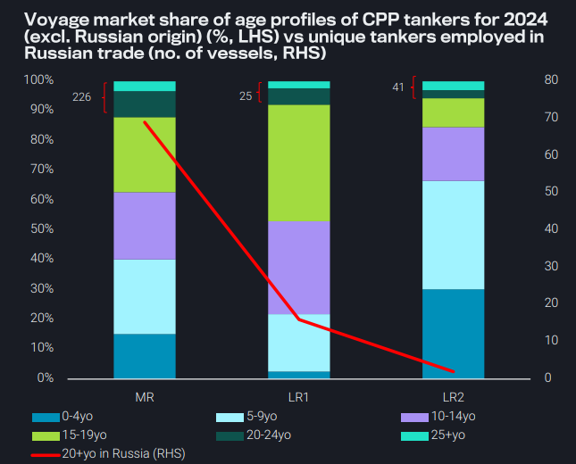
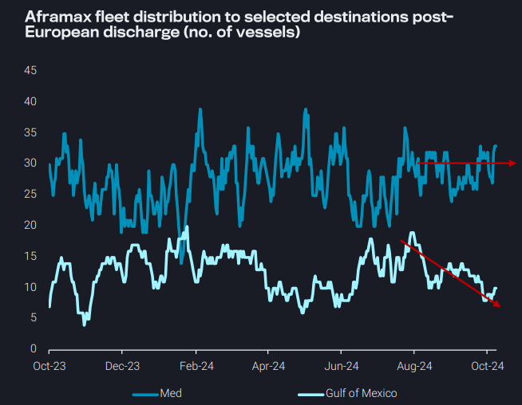
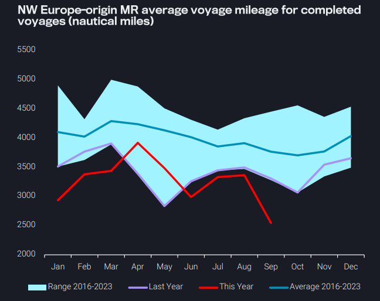

# NW Europe MR mileage at record lows as gasoline demand weakens

**Date:** October 10, 2024  
**Publisher:** Breakwave Advisors | **Category:** Market Insights  
**Original URL:** [https://www.breakwaveadvisors.com/insights/2024/10/9/nw-europe-mr-mileage-at-record-lows-as-gasoline-demand-weakens](https://www.breakwaveadvisors.com/insights/2024/10/9/nw-europe-mr-mileage-at-record-lows-as-gasoline-demand-weakens)  

---

- **Dirty – East of Suez:**Middle East-origin Suezmaxes shift to West of Suez destinations

- **Clean – East of Suez:**LR2 deliveries could trigger scrapping or drive vessels into the Russian trade
- **Dirty – West of Suez:**Libyan crude exports are still ramping up, pointing to further employment for Aframaxes
- **Clean – West of Suez:**NW Europe MR mileage at record lows due to high intra-European voyages, weak WAf and transatlantic gasoline demand

*By*[*Mary Melton*](https://www.linkedin.com/search/results/all/?fetchDeterministicClustersOnly=true&heroEntityKey=urn%3Ali%3Afsd_profile%3AACoAABXVyecBtg-pRnIrZe0BoWk0ygPiUfbvhsw&keywords=mary%20melton&origin=RICH_QUERY_SUGGESTION&position=0&searchId=40e8d7d2-c4d0-4022-81e7-176f6eba418b&sid=H_Y&spellCorrectionEnabled=false)

## Dirty – East of Suez: Middle East-Origin Suezmaxes Shift to West of Suez Destinations

Suezmaxes laden with Middle Eastern crude/condensates (excl. Iran) are increasingly heading towards the Atlantic, rather the Pacific Basin

Suezmaxes from the Middle East most often ply the route to India (from Iraq, Saudi Arabia and UAE) but since the start of last month, more tankers are currently active on the route to the Atlantic Basin

➔ Reduced voyage counts to India are due to seasonal refinery maintenance in September

The main drivers for the Atlantic Basin voyages are rising in-transit volumes from Iraq to the Mediterranean and Suezmaxes bringing Iraqi crude into the Black Sea– for discharge via STS into Burgas

➔ This latter route could be particularly efficient for charterers seeking to then lift Russian/Kazakh (or other) crude from the Black Sea for export to East of Suez

This pivot westwards is supportive for tonne-mile demand, especially with tankers more likely to sail around the Cape of Good Hope

➔ Longer voyages are also likely to tighten vessel supply and could support rates

> **Figure 1: Στιγμιότυπο Οθόνης 2024 10 09 193713**  
> **Interactive Data & Source:** [Vortexa](https://www.vortexa.com//oil-gas-data-traders-analysts-data-scientists?gclid=Cj0KCQjw8_qRBhCXARIsAE2AtRZKOvMnbilZ_6_91d7huSFFy71pWLrnPwGwOHVzXsmsG-1a1mZnQw8aAt89EALw_wcB&hsa_acc=1782073842&hsa_ad=548425387665&hsa_cam=14746637662&hsa_grp=125038601902&hsa_kw=&hsa_mt=&hsa_net=adwords&hsa_src=g&hsa_tgt=dsa-1431852288425&hsa_ver=3&utm_campaign=%5BCD%5D%20-%20DSA%20-%20EMEA&utm_medium=cpc&utm_medium=ppc&utm_source=google&utm_source=adwords&utm_term=) | [Local Asset](file:///C:/Users/Dell/Github/Shipping/corpus/03-breakwave/insights/2024/assets/2024-10-10_nw-europe-mr-mileage-at-record-lows-as-gasoline-demand-weakens_img_cea3cf84ceb9ceb3cebcceb9cf8ccf84cf85_2a8ffdc9b09b.png)

## Clean – East of Suez: LR2 Deliveries Could Trigger Scrapping or Drive Vessels Into the Russian Trade

Orderbook/fleet ratios across the main CPP tanker classes have bounced back in 2024 due to higher orders in the past two years resulting from the higher freight rate environment

➔ LR2 OB/fleet ratios have reached their highest levels since 2009 (Braemar)

➔ 78 MRs, 10 LR1s and 46 LR2s are expected to hit the water in 2025 (Braemar)

Looking at the age profile of the trading fleet, LR2s are the youngest, with over 60% of employment fulfilled by vessels 9 years old and below

➔ If all 46 newbuild LR2s enter the clean trade this could force scrapping or drive older vessels to the Russian trade

➔ There are only 18 20+ year old LRs operating in the Russia trade in 2024, which could be driven out of trade, but it remains unclear if scrapyards which accept Russian-related vessels could be subject to sanctions

➔ Some LR2s will likely join the Aframax trade, but a weak dirty tanker market relative to the clean market could make most owners reluctant to do so

> **Figure 2: Στιγμιότυπο Οθόνης 2024 10 09 194125**  
> **Interactive Data & Source:** [Vortexa](https://www.vortexa.com//oil-gas-data-traders-analysts-data-scientists?gclid=Cj0KCQjw8_qRBhCXARIsAE2AtRZKOvMnbilZ_6_91d7huSFFy71pWLrnPwGwOHVzXsmsG-1a1mZnQw8aAt89EALw_wcB&hsa_acc=1782073842&hsa_ad=548425387665&hsa_cam=14746637662&hsa_grp=125038601902&hsa_kw=&hsa_mt=&hsa_net=adwords&hsa_src=g&hsa_tgt=dsa-1431852288425&hsa_ver=3&utm_campaign=%5BCD%5D%20-%20DSA%20-%20EMEA&utm_medium=cpc&utm_medium=ppc&utm_source=google&utm_source=adwords&utm_term=) | [Local Asset](file:///C:/Users/Dell/Github/Shipping/corpus/03-breakwave/insights/2024/assets/2024-10-10_nw-europe-mr-mileage-at-record-lows-as-gasoline-demand-weakens_img_cea3cf84ceb9ceb3cebcceb9cf8ccf84cf85_66d1b4f18efc.png)

## Dirty – West of Suez: Libyan Crude Exports Are Still Ramping Up, Pointing to Further Employment for Aframaxes

Libya’s crude exports are ramping up after the lifting of the force majeure, with exports for the week ending 6 Oct around 750kbd, a sharp increase compared to the 95kbd observed for the week ending 8 Sep

➔ Cross-Med Aframax rates (TD19) have risen in response to this increased tanker demand

Last week’s export levels were still about 280kbd lower than the 2023 average, suggesting there is further upside for Aframax demand

However, freight rates may be capped by relatively high vessel supply in the Med

Throughout the period of reduced Libya supplies, the number of Aframaxes going to the Med after a European discharge remained fairly high

➔ Low earnings in the Gulf of Mexico kept vessels from ballasting to PADD 3 after a European discharge

> **Figure 3: Στιγμιότυπο Οθόνης 2024 10 09 194403**  
> **Interactive Data & Source:** [Vortexa](https://www.vortexa.com//oil-gas-data-traders-analysts-data-scientists?gclid=Cj0KCQjw8_qRBhCXARIsAE2AtRZKOvMnbilZ_6_91d7huSFFy71pWLrnPwGwOHVzXsmsG-1a1mZnQw8aAt89EALw_wcB&hsa_acc=1782073842&hsa_ad=548425387665&hsa_cam=14746637662&hsa_grp=125038601902&hsa_kw=&hsa_mt=&hsa_net=adwords&hsa_src=g&hsa_tgt=dsa-1431852288425&hsa_ver=3&utm_campaign=%5BCD%5D%20-%20DSA%20-%20EMEA&utm_medium=cpc&utm_medium=ppc&utm_source=google&utm_source=adwords&utm_term=) | [Local Asset](file:///C:/Users/Dell/Github/Shipping/corpus/03-breakwave/insights/2024/assets/2024-10-10_nw-europe-mr-mileage-at-record-lows-as-gasoline-demand-weakens_img_cea3cf84ceb9ceb3cebcceb9cf8ccf84cf85_f41a478dc2c3.png)

## Clean – West of Suez: Nw Europe MR Mileage at Record Lows Due to High Intra-European Voyages, Weak Waf and Transatlantic Gasoline Demand

Average MR voyage mileage out of Europe fell around 25% m-o-m in September

➔ This was due to a lack of demand for transatlantic gasoline cargoes, but also continued weak demand from WAf

As European refinery maintenance season ramps up, higher intraEuropean flows on MRs will offset lost CPP supplies, but drag down mileage – short voyages within Europe have already increased drastically

➔ The lack of long-haul mileage demand combined with higher intra-European voyages has kept vessel supply elevated and pressured freight rates

Although NW Europe’s MR mileage was at the bottom of the seasonal range for the majority of 2023, this year has seen new record-setting lows for 7 out of 9 months (see chart)

With Dangote gasoline production imminent, further erosion of WAf gasoline demand will further cap MR mileage in NW Europe

> **Figure 4: Στιγμιότυπο Οθόνης 2024 10 09 194613**  
> **Interactive Data & Source:** [Vortexa](https://www.vortexa.com//oil-gas-data-traders-analysts-data-scientists?gclid=Cj0KCQjw8_qRBhCXARIsAE2AtRZKOvMnbilZ_6_91d7huSFFy71pWLrnPwGwOHVzXsmsG-1a1mZnQw8aAt89EALw_wcB&hsa_acc=1782073842&hsa_ad=548425387665&hsa_cam=14746637662&hsa_grp=125038601902&hsa_kw=&hsa_mt=&hsa_net=adwords&hsa_src=g&hsa_tgt=dsa-1431852288425&hsa_ver=3&utm_campaign=%5BCD%5D%20-%20DSA%20-%20EMEA&utm_medium=cpc&utm_medium=ppc&utm_source=google&utm_source=adwords&utm_term=) | [Local Asset](file:///C:/Users/Dell/Github/Shipping/corpus/03-breakwave/insights/2024/assets/2024-10-10_nw-europe-mr-mileage-at-record-lows-as-gasoline-demand-weakens_img_cea3cf84ceb9ceb3cebcceb9cf8ccf84cf85_295386a1e6f5.png)

Data Source:[Vortexa](https://www.vortexa.com//oil-gas-data-traders-analysts-data-scientists?gclid=Cj0KCQjw8_qRBhCXARIsAE2AtRZKOvMnbilZ_6_91d7huSFFy71pWLrnPwGwOHVzXsmsG-1a1mZnQw8aAt89EALw_wcB&hsa_acc=1782073842&hsa_ad=548425387665&hsa_cam=14746637662&hsa_grp=125038601902&hsa_kw=&hsa_mt=&hsa_net=adwords&hsa_src=g&hsa_tgt=dsa-1431852288425&hsa_ver=3&utm_campaign=%5BCD%5D%20-%20DSA%20-%20EMEA&utm_medium=cpc&utm_medium=ppc&utm_source=google&utm_source=adwords&utm_term=)

---

**Tags:** Tankers, Shipping, Crude  
