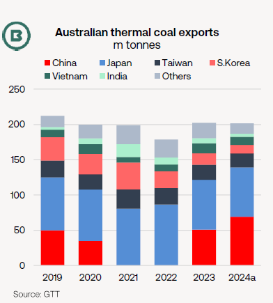
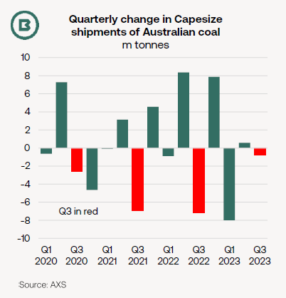
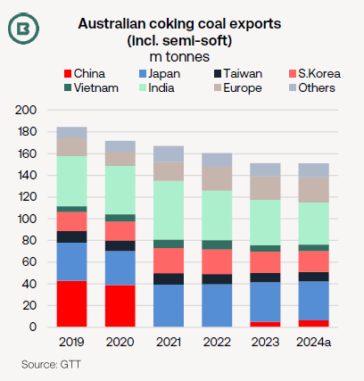

# The Big Picture: Australian coal exports

**Date:** October 11, 2024  
**Publisher:** Breakwave Advisors | **Category:** Market Insights  
**Original URL:** [https://www.breakwaveadvisors.com/insights/2024/10/11/5g6huiyoj4tv3nu87bh0muhzpbk4mo](https://www.breakwaveadvisors.com/insights/2024/10/11/5g6huiyoj4tv3nu87bh0muhzpbk4mo)  

---

### The Big Picture: Australian Coal Exports

- *August marked a conspicuous improvement in Australian coal exports at 32.7m tonnes from the year-to-date monthly average of 28.9m tonnes and also on August 2023.*

- *The majority of this year’s Australian coal export expansion features thermal coal.*

- *The Capesize/Panamax split on Australian coal trades has also influenced the market.*

### Thermal Coal

**Our first comment**is that it has been thermal coal behind most of August’s export improvement, rising 3.0m tonnes on July, with coking coal (including semi-soft grades) comprising the rest.

As the chart below shows, Australia’s supply of thermal coal to two main Asian markets has been on the rise since 2022.

**Japan’s heatwave led to another massive August intake of Australian thermal coal**, mainly benefitting Panamax tonnage, judging by vessel tracking. Official data confirmed August was a two-year high of 8.0m tonnes for thermal coal exports to Japan.

> **Figure 1: Market Chart 1**  
> [Local Asset](file:///C:/Users/Dell/Github/Shipping/corpus/03-breakwave/insights/2024/assets/2024-10-11_5g6huiyoj4tv3nu87bh0muhzpbk4mo_img_image0_803d72880b4a.png)

This was short-lived as AXS vessel tracking indicated a retreat below 30m tonnes in September as summer aircon demand faded.

After the hiatus of 2021-22,**Australian thermal coal has not simply returned to China, but has reached new highs**.

From zero shipments in both 2021 and 2022, Australian thermal coal exports to China surged to a record 50.9m tonnes in 2023, official data show. With January-August already at 45.1m tonnes, it is likely**2024 is already a new all-time high**for this trade.

Although Capesizes carried most coal (all types) between Australia and China in 2023 and the 1H 2024,**Panamaxes enjoyed a higher volume in both August and September**, according to vessel tracking.

At the same time, fewer Australian thermal coal cargoes have been shipped to India and South Korea.

### Capesize Q3 Impact

**Our second comment**is that while Panamax demand benefitted from demand for Australian thermal coal from China and Japan in the Q3, it is significant that**Capes avoided the slump in Australian coal trades involvement seen in each of the preceding two Q3s**(see chart below).

> **Figure 2: Market Chart 2**  
> [Local Asset](file:///C:/Users/Dell/Github/Shipping/corpus/03-breakwave/insights/2024/assets/2024-10-11_5g6huiyoj4tv3nu87bh0muhzpbk4mo_img_image1_3a8c06fed1e8.png)

In the past two years steep quarterly falls into the Q3 of around -7m tonnes have followed.

While this does not mean, however, that Q3 Capesize shipments of Australian coal rose YoY—on the contrary, tracking suggests the Q3 was the lowest quarter for 1.5 years—the**quarterly drop in Capesize was a fraction of that seen in 2022 and 2023**.

### Coking Coal

Following steady yearly declines, annualised Australian coking coal exports**are very close to 2023**.

In recent years some demand from two of key importers, China and India, appears to have been**diluted by alternative supplies**.

Although**India**has again enjoyed the biggest expansion story for steel production, coking coal the US has increased, as imports from Australia have decreased.

In, the overland inflow of Mongolian coking coal has increased since 2019-20 to the detriment of import demand.

> **Figure 3: China**  
> [Local Asset](file:///C:/Users/Dell/Github/Shipping/corpus/03-breakwave/insights/2024/assets/2024-10-11_5g6huiyoj4tv3nu87bh0muhzpbk4mo_img_image2_b2147cb85d26.png)

---

**Tags:** Coal, Drybulk, Markets  
