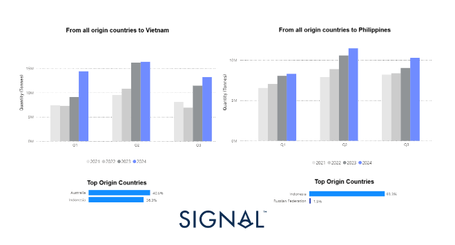
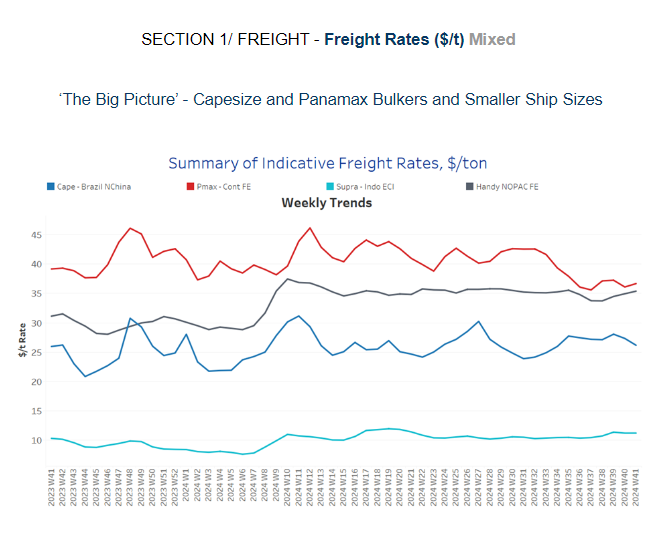
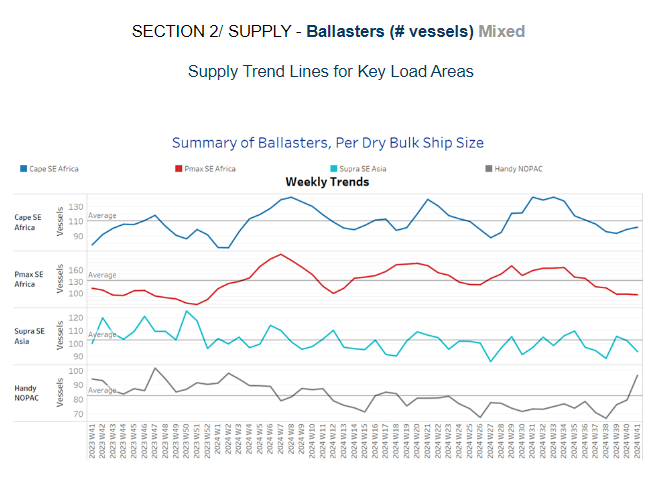
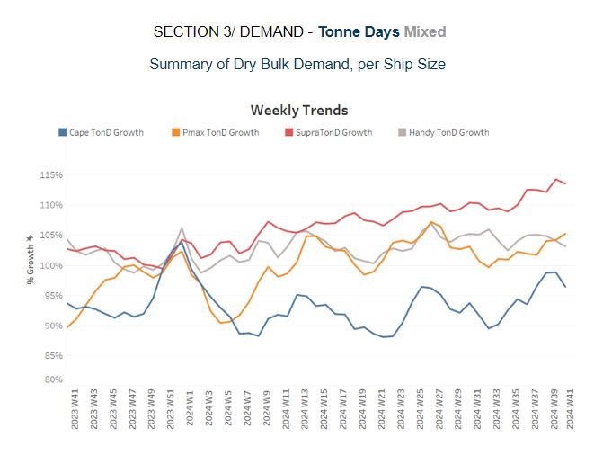
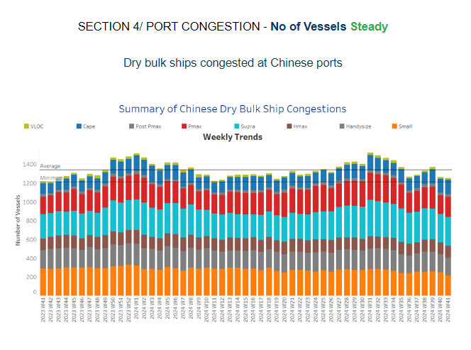

# Dry Bulk Coal Flows

**Date:** October 11, 2024  
**Publisher:** Breakwave Advisors | **Category:** Market Insights  
**Original URL:** [https://www.breakwaveadvisors.com/insights/2024/10/11/dry-bulk-coal-flows](https://www.breakwaveadvisors.com/insights/2024/10/11/dry-bulk-coal-flows)  

---

**Dry Weekly Market Monitor - Week 41.2024**
Snapshot of Spot Freight Rates, Supply-Demand Trends, Port Congestions
October 11, 2024

## Chart of the Week: Dry Bulk Coal Flows - Southeast Asian Countries

*This week's focus highlights the growing dependence of Southeast Asian countries, particularly Vietnam and the Philippines, on dry bulk coal imports. As these economies expand, their energy demands are rapidly increasing, and coal remains a crucial component of their energy mix, despite global efforts to transition toward cleaner energy sources. Data from 2023-2024 reveals a substantial surge in coal shipments to Vietnam and the Philippines compared to 2021-2022. Australia stands out as the top supplier of coal to Vietnam, commanding a 40% share of total shipments. Meanwhile, Indonesia dominates coal shipments to the Philippines, capturing a 90% share of the country's total coal imports. As the world's largest exporter of thermal coal, Indonesia plays a critical role in meeting the Philippines' energy needs. In*[*January*](https://go.signalocean.com/e/983831/arket-monitor-dry-week-04-2024/2qmg17/441394830/h/-bASq9Ae4r5LhCyicv8vSMBJbRpxVC5g7DE8giZCgBk)*, we highlighted the substantial decline in Russian coal shipments to China.*

> **Figure 1: Στιγμιότυπο Οθόνης 2024 10 11 154627**  
> **Interactive Data & Source:** [Signal Ocean Platform](https://www.thesignalgroup.com/signal-ocean-platform) | [Local Asset](file:///C:/Users/Dell/Github/Shipping/corpus/03-breakwave/insights/2024/assets/2024-10-11_dry-bulk-coal-flows_img_cea3cf84ceb9ceb3cebcceb9cf8ccf84cf85_a72b6bd9a3c9.png)

This week's focus is on the increasing dependence of Southeast Asian countries on dry bulk coal flows, particularly as China and India are expected to reduce their share in the coming months. Southeast Asia is becoming a critical growth region for coal demand, even as global efforts to transition to renewable energy intensify. The energy industry has already identified countries such as Vietnam and the Philippines as key players set to expand their coal trade and consumption throughout this decade.

While demand from top consumer China is projected to approach its peak, Southeast Asia is seen as the new frontier for coal growth. Power generation in Vietnam, in particular, stands out as the most promising growth market. With Vietnam being the fastest-growing economy in Southeast Asia, its reliance on coal to fuel its rapid industrialization and urbanisation is expected to rise. The Philippines, similarly, is ramping up its coal imports to meet the increasing energy demands of its population and economic expansion.

As shown in the graphs above, the quarterly quantity of coal tons sent from all origin countries to Vietnam and the Philippines has recorded significant growth during the 2023-2024 period compared to the volumes in 2021-2022. This trend indicates a notable shift in regional coal consumption patterns, driven by both the expanding energy needs of these developing economies and the relative affordability of coal compared to alternative energy sources.

Southeast Asia’s growing demand for coal has broader implications for global energy markets. With China and India scaling down their coal consumption in favour of cleaner energy sources, coal suppliers will increasingly turn to Southeast Asia to maintain trade volumes. The region's reliance on coal, however, raises concerns about its carbon footprint, potentially placing these countries at odds with global climate targets. Still, in the short to medium term, coal will remain a cornerstone of Southeast Asia's energy strategy, providing an affordable and reliable source of power as these countries seek to balance economic growth with energy security.

> **Figure 2: Στιγμιότυπο Οθόνης 2024 10 11 154741**  
> **Interactive Data & Source:** [Signal Ocean Platform](https://www.thesignalgroup.com/signal-ocean-platform) | [Local Asset](file:///C:/Users/Dell/Github/Shipping/corpus/03-breakwave/insights/2024/assets/2024-10-11_dry-bulk-coal-flows_img_cea3cf84ceb9ceb3cebcceb9cf8ccf84cf85_0b0278b7953d.png)

The dry bulk freight market has displayed mixed sentiment in the second week of October, with a softening trend observed in the Capesize Brazil–North China route, while signs of an upward trend are emerging in the Panamax Continent–Far East route.

- **Capesize**vessel freight rates for shipments from Brazil to North China settled at $26 per ton, reflecting a 6% decline week-over-week.
- **Panamax**vessel freight rates from the Continent to the Far East remained around $37 per ton, defying expectations of a downward trend from the previous week.
- **Supramax**vessel freight rates on the Indo-ECI route remain around $11 per ton, reflecting an 8% increase compared to the previous month.
- **Handysize**freight rates for the NOPAC Far East route have remained steady at $35 per ton since April, marking a 15% increase compared to the same period last year.

> **Figure 3: Στιγμιότυπο Οθόνης 2024 10 11 154837**  
> **Interactive Data & Source:** [Signal Ocean Platform](https://www.thesignalgroup.com/signal-ocean-platform) | [Local Asset](file:///C:/Users/Dell/Github/Shipping/corpus/03-breakwave/insights/2024/assets/2024-10-11_dry-bulk-coal-flows_img_cea3cf84ceb9ceb3cebcceb9cf8ccf84cf85_13113c500e6b.png)

The second week of October is characterised by a steady downward trend in the number of ballasters across all vessel size categories, with the exception of the Handysize NOPAC market. Meanwhile, the Capesize market in Southeast Africa has shown consistent signs of increase.

- **Capesize SE Africa**: The number of vessels has surpassed 100, now just 7 vessels below the annual average.
- **Panamax SE Africa**: The current number of vessels has remained steady at approximately 95, marking one of the lowest levels recorded since the beginning of the year and holding at the low point observed at the end of the previous week.
- **Supramax SE Asia**: The number of ballast ships declined further to below 95 vessels, continuing the downward trend that began at the end of week 40.
- **Handysize NOPAC**: The number of ballasters surged to its highest level of the year at 97, which is 17 above the annual trend.

> **Figure 4: Στιγμιότυπο Οθόνης 2024 10 11 154921**  
> **Interactive Data & Source:** [Signal Ocean Platform](https://www.thesignalgroup.com/signal-ocean-platform) | [Local Asset](file:///C:/Users/Dell/Github/Shipping/corpus/03-breakwave/insights/2024/assets/2024-10-11_dry-bulk-coal-flows_img_cea3cf84ceb9ceb3cebcceb9cf8ccf84cf85_3f645809ff6d.png)

In the second week of October, the outlook for dry tonne-days shows a decreasing trend for the Capesize segment, while signs of upward revisions are emerging in the Panamax and Supramax vessel segments.

- **Capesize**: A slower pace of growth has been observed following the increase from week 35 to the end of week 39. However, the current level remains significantly higher than the low recorded in week 33.
- **Panamax**: Weekly percentage growth has continued to rise since the end of week 37, approaching the peak levels last seen at the end of week 27.
- **Supramax**: Although the growth rate peaked before the end of September, it has maintained a similar momentum into the second week of October.
- **Handysize**: The Handysize vessel segment has continued its downward trend for October, with the latest peak recorded at the end of week 31.

> **Figure 5: Στιγμιότυπο Οθόνης 2024 10 11 155010**  
> **Interactive Data & Source:** [Signal Ocean Platform](https://www.thesignalgroup.com/signal-ocean-platform) | [Local Asset](file:///C:/Users/Dell/Github/Shipping/corpus/03-breakwave/insights/2024/assets/2024-10-11_dry-bulk-coal-flows_img_cea3cf84ceb9ceb3cebcceb9cf8ccf84cf85_ecb071aeab90.png)

Congestion at Chinese dry bulk ports maintained a steady pace during the first two weeks of October, following a peak observed at the end of week 39.

- **Capesize**: Capesize vessel congestion has fallen below 150 ships, showing a downward trend with current levels approximately 10 ships lower than the peak recorded at the end of week 31.
- **Panamax**: The number of Panamax vessels exceeded 200, marking an increase of 10 compared to the levels recorded the previous week.
- **Supramax**: Congestion levels have stabilised around 300 vessels, down by 20 compared to two weeks ago, marking a decreasing trend in contrast to the rising numbers seen in week 35.
- **Handysize**: Congestion levels fell below 190 vessels, nearly 10 fewer than two weeks prior, mirroring a similar trend observed at the end of week 36.

Data Source:[Signal Ocean Platform](https://www.thesignalgroup.com/signal-ocean-platform)

---

**Tags:** Drybulk, Capesize, Shipping  
