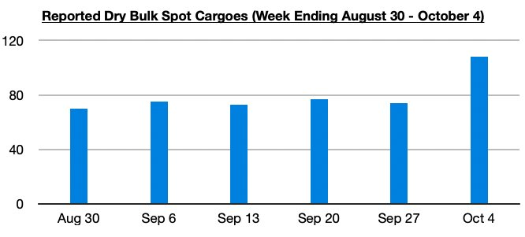
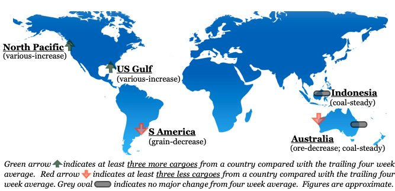

# Recent Jump in Reported Dry Bulk Spot Cargoes

**Date:** October 11, 2024  
**Publisher:** Breakwave Advisors | **Category:** Market Insights  
**Original URL:** [https://www.breakwaveadvisors.com/insights/2024/10/11/recent-jump-in-reported-dry-bulk-spot-cargoes](https://www.breakwaveadvisors.com/insights/2024/10/11/recent-jump-in-reported-dry-bulk-spot-cargoes)  

---

*By*[*Jeffrey Landsberg*](https://www.linkedin.com/in/jeffrey-landsberg-70ab957/)

Overall dry bulk spot freight rates decreased last week, with only handysize rates rising. However, with China on holiday last week, the decline in rates was not at all surprising. More surprising was that spot cargo volume was strong last week. Activity never just falls off a cliff during Golden Week, but very often a noticeable decline in spot cargo volume occurs. This year not only did not see a decline, but cargo volume actually increased. As we discussed in Commodore Research's most recent Weekly Dry Bulk Report, particularly significant strength was seen last week in various coal cargoes and assorted cargoes from the US Gulf and North Pacific.

> **Figure 1: Chart 1**  
> [Local Asset](file:///C:/Users/Dell/Github/Shipping/corpus/03-breakwave/insights/2024/assets/2024-10-11_recent-jump-in-reported-dry-bulk-spot-cargoes_img_chart1_38d600445472.jpg)

Of note is that 14 assorted US Gulf cargoes were reported in the spot market last week, 6 more than the previous week and up from the trailing four week average. The cargoes will be shipped to buyers around the world. 12 Indonesian coal cargoes were reported in the market, 4 less than the previous week but on par with the trailing four week average. All of the cargoes will be shipped to buyers in Asia. 11 assorted North Pacific cargoes were reported in the market, 2 more than the previous week and up from the trailing four week average. The cargoes will be shipped to buyers around the world. 9 Australian coal cargoes were reported in the market, 3 more than the previous week and on par with the trailing four week average. All of the cargoes will be shipped to buyers in Asia.

> **Figure 2: Chart 2**  
> [Local Asset](file:///C:/Users/Dell/Github/Shipping/corpus/03-breakwave/insights/2024/assets/2024-10-11_recent-jump-in-reported-dry-bulk-spot-cargoes_img_chart2_04d074973bf9.jpg)

---

**Tags:** Drybulk, Shipping, China  
