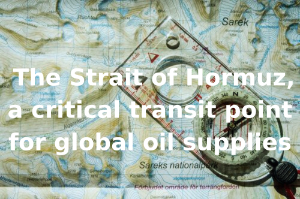

# Breakwave Weekend Read

**Date:** October 12, 2024  
**Publisher:** Breakwave Advisors | **Category:** Market Insights  
**Original URL:** [https://www.breakwaveadvisors.com/insights/2024/9/20/breakwave-weekend-read-4cn8n](https://www.breakwaveadvisors.com/insights/2024/9/20/breakwave-weekend-read-4cn8n)  

---

## Welcome Tobreakwave Advisorsweekend Read

As we conclude the workweek and head into the weekend, take a moment to review the key articles from this week, including those you've highlighted.[Ηeadwinds for most commodities](https://www.breakwaveadvisors.com/insights/2024/10/9/eadwinds-for-most-commodities),[The Strait of Hormuz, a critical transit point for global oil supplies](https://www.breakwaveadvisors.com/insights/2024/10/9/the-strait-of-hormuz-a-critical-transit-point-for-global-oil-supplies),[Chinese Stimulus](https://www.breakwaveadvisors.com/insights/2024/10/8/chinese-stimulus),[The Big Picture: Australian coal exports](https://www.breakwaveadvisors.com/insights/2024/10/11/5g6huiyoj4tv3nu87bh0muhzpbk4mo)
and more.

## Breakwave Tanker Report

**VLCC Rates Jump Amid Geopolitical Turmoil but Demand Risks Remain**– The VLCC market in the Arabian Gulf (AG) experienced**two distinct halves**at the beginning of October.

[Read More](https://www.breakwaveadvisors.com/insights/2024924wet-87578j-sbtjm)

> **Figure 1: Στιγμιότυπο Οθόνης 2024 10 08 090835**  
> **Interactive Data & Source:** [Breakwave Advisors Market Insights](https://www.breakwaveadvisors.com/insights/2024/10/7/huysi89fp9tej3tce5pcr40t476ex7) | [Local Asset](file:///C:/Users/Dell/Github/Shipping/corpus/03-breakwave/insights/2024/assets/2024-10-12_breakwave-weekend-read-4cn8n_img_cea3cf84ceb9ceb3cebcceb9cf8ccf84cf85_b44716cc7714.png)

## China's Property Sector Remains Sluggish

> **Figure 2: Ανώνυμο Σχέδιο**  
> **Interactive Data & Source:** [Breakwave Advisors Market Insights](https://www.breakwaveadvisors.com/insights/2024/10/7/huysi89fp9tej3tce5pcr40t476ex7) | [Local Asset](file:///C:/Users/Dell/Github/Shipping/corpus/03-breakwave/insights/2024/assets/2024-10-12_breakwave-weekend-read-4cn8n_img_ce91cebdcf8ecebdcf85cebccebfcf83cf87_4380bd5a3585.png)

Transport authorities project that 1.94 billion trips will be made during this year's holiday week, a slight increase from last year and nearly 20 percent higher than 2019 levels.
[Read More](https://www.breakwaveadvisors.com/insights/2024/10/7/huysi89fp9tej3tce5pcr40t476ex7)

Doric Weekly Market Insight

## Chinese Stimulus

> **Figure 3: Gibson Tanker Market Report**  
> **Interactive Data & Source:** [Breakwave Advisors Market Insights](https://www.breakwaveadvisors.com/insights/2024/10/8/chinese-stimulus) | [Local Asset](file:///C:/Users/Dell/Github/Shipping/corpus/03-breakwave/insights/2024/assets/2024-10-12_breakwave-weekend-read-4cn8n_img_gibsontankermarketreport_64e238ce6ead.png)

Chinese oil demand has been underwhelming this year.

Gibson Tanker Market Report

## China Uniquely Positioned to Carry Out Its Stimulus Bazooka

> **Figure 4: Ανώνυμο Σχέδιο (2)**  
> **Interactive Data & Source:** [Breakwave Advisors Market Insights](https://www.breakwaveadvisors.com/insights/2024/10/7/oq7fgpnxhbtmii7q0fxw6ontvvqc6l) | [Local Asset](file:///C:/Users/Dell/Github/Shipping/corpus/03-breakwave/insights/2024/assets/2024-10-12_breakwave-weekend-read-4cn8n_img_ce91cebdcf8ecebdcf85cebccebfcf83cf87_9d4e9c2fdeff.png)

China’s “stimulus bazooka” was the biggest news in the market last week, but also important is that the central government announced that it will be strictly limiting the construction of new housing.

[Read More](https://www.breakwaveadvisors.com/insights/2024/10/7/oq7fgpnxhbtmii7q0fxw6ontvvqc6l)

From Commodore's Weekly Dry Bulk Reports

## Lack of New Stimulus Measures Triggers Selloff

> **Figure 5: Προσθέστε Επικεφαλίδα (1)**  
> **Interactive Data & Source:** [Breakwave Advisors Market Insights](https://www.breakwaveadvisors.com/insights/2024/10/9/lack-of-new-stimulus-measures-triggers-selloff) | [Local Asset](file:///C:/Users/Dell/Github/Shipping/corpus/03-breakwave/insights/2024/assets/2024-10-12_breakwave-weekend-read-4cn8n_img_cea0cf81cebfcf83ceb8ceadcf83cf84ceb5_0c63b517b7fa.png)

Metal and energy markets came under pressure after China failed to deliver fresh stimulus measures.

[Read More](https://www.breakwaveadvisors.com/insights/2024/10/9/lack-of-new-stimulus-measures-triggers-selloff)

Commodities Wrap

## Central Bank Mission Creep Is Over. What Does “Normal” Now Look Like?

> **Figure 6: Central Bank Mission Creep Is Over. What Does “Normal” Now Look Like (1)**  
> **Interactive Data & Source:** [Breakwave Advisors Market Insights](https://www.breakwaveadvisors.com/insights/2024/10/8/j8wz4u6q3lzp1pv46y4l6tbri1ka12) | [Local Asset](file:///C:/Users/Dell/Github/Shipping/corpus/03-breakwave/insights/2024/assets/2024-10-12_breakwave-weekend-read-4cn8n_img_centralbankmissioncreepisoverwhatdoe_12b9a15a2d02.png)

The main objective of central banks is to curb inflation. But what is the mission in a world that deflates? Does one cease to care, or do they expand the job?

[Read More](https://www.breakwaveadvisors.com/insights/2024/10/8/j8wz4u6q3lzp1pv46y4l6tbri1ka12)

Forvis Mazars Weekly Note

## The Strait of Hormuz, a Critical Transit Point for Global Oil Supplies

> **Figure 7: Προσθέστε Επικεφαλίδα**  
> **Interactive Data & Source:** [Breakwave Advisors Market Insights](https://www.breakwaveadvisors.com/insights/2024/10/9/the-strait-of-hormuz-a-critical-transit-point-for-global-oil-supplies) | [Local Asset](file:///C:/Users/Dell/Github/Shipping/corpus/03-breakwave/insights/2024/assets/2024-10-12_breakwave-weekend-read-4cn8n_img_cea0cf81cebfcf83ceb8ceadcf83cf84ceb5_13c14ce13a0a.png)

Tensions between Israel and Iran have risen sharply after Iran fired over 200 missiles at sensitive Israeli sites in one of the most significant escalations in recent years.

[Read More](https://www.breakwaveadvisors.com/insights/2024/10/9/the-strait-of-hormuz-a-critical-transit-point-for-global-oil-supplies)

Intermodal Weekly Market Report

## Ηeadwinds for Most Commodities

> **Figure 8: Ανώνυμο Σχέδιο (1)**  
> **Interactive Data & Source:** [Breakwave Advisors Market Insights](https://www.breakwaveadvisors.com/insights/2024/10/9/eadwinds-for-most-commodities) | [Local Asset](file:///C:/Users/Dell/Github/Shipping/corpus/03-breakwave/insights/2024/assets/2024-10-12_breakwave-weekend-read-4cn8n_img_ce91cebdcf8ecebdcf85cebccebfcf83cf87_65a2f7f00f82.png)

The Baltic Dry Index declined for a seventh consecutive session on Tuesday, but unlike recent days, only the capesizes contributed to the loss.

The Fix - Global Market Update

## Global Crude Export Declines Pause in September, But Atlantic Basin Remains Constrained

> **Figure 9: Global Crude Export Declines Pause in September, But Atlantic Basin Remains Constrained**  
> **Interactive Data & Source:** [Breakwave Advisors Market Insights](https://www.breakwaveadvisors.com/insights/2024/10/9/global-crude-export-declines-pause-in-september-but-atlantic-basin-remains-constrained) | [Local Asset](file:///C:/Users/Dell/Github/Shipping/corpus/03-breakwave/insights/2024/assets/2024-10-12_breakwave-weekend-read-4cn8n_img_globalcrudeexportdeclinespauseinsept_af552d9da2bb.png)

Global crude/condensate exports from non-sanctioned suppliers stood almost unchanged in September, despite sharp reductions from some key producers during the month.

Vortexa Freight Weekly

## Nw Europe MR Mileage at Record Lows As Gasoline Demand Weakens

> **Figure 10: Προσθέστε Επικεφαλίδα (2)**  
> **Interactive Data & Source:** [Breakwave Advisors Market Insights](https://www.breakwaveadvisors.com/insights/2024/10/9/nw-europe-mr-mileage-at-record-lows-as-gasoline-demand-weakens) | [Local Asset](file:///C:/Users/Dell/Github/Shipping/corpus/03-breakwave/insights/2024/assets/2024-10-12_breakwave-weekend-read-4cn8n_img_cea0cf81cebfcf83ceb8ceadcf83cf84ceb5_bf922e5aa47b.png)

Suezmaxes laden with Middle Eastern crude/condensates (excl. Iran) are increasingly heading towards the Atlantic, rather the Pacific Basin

[Read More](https://www.breakwaveadvisors.com/insights/2024/10/9/nw-europe-mr-mileage-at-record-lows-as-gasoline-demand-weakens)

Vortexa - Global Freight Snapshot

## The Big Picture: Australian Coal Exports

> **Figure 11: Προσθέστε Επικεφαλίδα (4)**  
> **Interactive Data & Source:** [Breakwave Advisors Market Insights](https://www.breakwaveadvisors.com/insights/2024/10/11/5g6huiyoj4tv3nu87bh0muhzpbk4mo) | [Local Asset](file:///C:/Users/Dell/Github/Shipping/corpus/03-breakwave/insights/2024/assets/2024-10-12_breakwave-weekend-read-4cn8n_img_cea0cf81cebfcf83ceb8ceadcf83cf84ceb5_c2c8046889e6.png)

Our first commentis that it has been thermal coal behind most of August’s export improvement,

Braemar Weekly Dry Market Report

## Recent Jump in Reported Dry Bulk Spot Cargoes

> **Figure 12: Προσθέστε Επικεφαλίδα (5)**  
> **Interactive Data & Source:** [Breakwave Advisors Market Insights](https://www.breakwaveadvisors.com/insights/2024/10/11/recent-jump-in-reported-dry-bulk-spot-cargoes) | [Local Asset](file:///C:/Users/Dell/Github/Shipping/corpus/03-breakwave/insights/2024/assets/2024-10-12_breakwave-weekend-read-4cn8n_img_cea0cf81cebfcf83ceb8ceadcf83cf84ceb5_f098f3a94cf5.png)

Overall dry bulk spot freight rates decreased last week, with only handysize rates rising.

From Commodore's Weekly Dry Bulk Reports

## Dry Bulk Coal Flows

> **Figure 13: Ανώνυμο Σχέδιο (3)**  
> **Interactive Data & Source:** [Breakwave Advisors Market Insights](https://www.breakwaveadvisors.com/insights/2024/10/11/dry-bulk-coal-flows) | [Local Asset](file:///C:/Users/Dell/Github/Shipping/corpus/03-breakwave/insights/2024/assets/2024-10-12_breakwave-weekend-read-4cn8n_img_ce91cebdcf8ecebdcf85cebccebfcf83cf87_9b596871aac2.png)

This week's focus is on the increasing dependence of Southeast Asian countries on dry bulk coal flows, particularly as China and India are expected to reduce their share in the coming months.

Signal Ocean - Dry Weekly Market Monitor

---

**Tags:** Shipping, Tankers, Drybulk  
