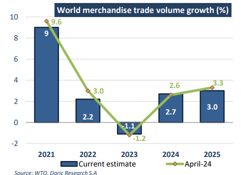
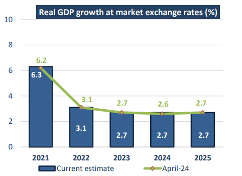

# "Golden Week," experienced a notable resurgence in tourism activity

**Date:** October 14, 2024  
**Publisher:** Breakwave Advisors | **Category:** Market Insights  
**Original URL:** [https://www.breakwaveadvisors.com/insights/2024/10/14/o67sbsngroi41qutut6agkmbks43ys](https://www.breakwaveadvisors.com/insights/2024/10/14/o67sbsngroi41qutut6agkmbks43ys)  

---

*By*[*Michalis Voutsinas*](https://www.linkedin.com/in/michalis-voutsinas-587544163/)

China's National Day holiday, commonly known as "Golden Week," experienced a notable resurgence in tourism activity, reflecting strong growth in passenger travel across the country. Official data and reports from major Chinese travel platforms highlighted significant increases in both domestic and international travel. Bolstered by rising consumer confidence, this year’s Golden Week witnessed a resurgence in spending across various sectors, including tourism, catering, and real estate, as mainland consumers responded positively to recent economic stimulus measures introduced in late September.

On the final day of the week-long National Day holiday, the Ministry of Transport (MOT) reported that over 278.76 million cross-regional passenger trips were made, marking a 5.2 percent increase compared to the same period in 2023. This figure also represented an impressive 24.8 percent rise compared to the same period in 2019, prior to the pandemic. Rail travel, in particular, saw a sharp uptick, with more than 18.52 million trips recorded, reflecting an 8.6 percent rise from 2023 and a 26.6 percent increase from 2019 levels. The MOT had earlier forecasted that total cross-regional travel during the Golden Week would reach 1.94 billion trips, with daily passenger volumes expected to reach 277 million, up 0.7 percent from 2023 and 19.4 percent from 2019. While official figures on total tourist trips and expenditure for the holiday were still pending, early indicators from Chinese tourism platforms underscored the substantial growth in activity.

This year's Golden Week came on the back of several policy initiatives aimed at revitalizing consumer confidence. China's consumer spending has been relatively sluggish since the pandemic, largely due to concerns over income stability and economic growth. Despite these challenges, domestic tourism spending during the holiday reached 700.82 billion yuan (US$99.30 billion), a 6.3 percent year-onyear increase, according to the Ministry of Culture and Tourism. However, per capita spending remained below pre-pandemic levels, coming in 2.09 percent lower than the same period in 2019. While total spending surged, the data pointed to a shift toward more cautious consumer behavior, with greater emphasis placed on experiences rather than material goods.

Meanwhile, global trade dynamics have shown signs of recovery, albeit with lingering uncertainties. According to the World Trade Organization (WTO), global merchandise trade experienced a 2.3 percent year-on-year increase in the first half of 2024, indicating a modest rebound after the downturn witnessed in 2023. This recovery is expected to continue into 2025, with the WTO forecasting global trade volumes to rise by 2.7 percent in 2024 and 3.0 percent in 2025.

> **Figure 1: Στιγμιότυπο Οθόνης 2024 10 14 105029**  
> **Interactive Data & Source:** [Doric](https://www.doric.gr/) | [Local Asset](file:///C:/Users/Dell/Github/Shipping/corpus/03-breakwave/insights/2024/assets/2024-10-14_o67sbsngroi41qutut6agkmbks43ys_img_cea3cf84ceb9ceb3cebcceb9cf8ccf84cf85_b3002054ce66.png)

The easing of inflationary pressures has allowed central banks in advanced economies to reduce interest rates, which in turn is expected to stimulate consumer spending, drive investment, and support the gradual recovery of global trade.

Nevertheless, the outlook for global goods trade remains cautious, with the WTO revising its forecast for 2025 downwards. The organization now anticipates a growth rate of 3.0 percent for global trade for the following year, down from the 3.3 percent projected earlier this year. The revision reflects growing concerns over geopolitical tensions, regional conflicts, and policy uncertainty, which pose significant downside risks to global economic activity. The WTO's latest report highlighted the potential disruption to shipping and energy markets should the conflict in the Middle East escalate, given the region’s critical role in global oil production.

In terms of trade value, the US dollar value of global merchandise trade remained flat in the first half of 2024, registering a modest 0.1 percent increase compared to the same period in 2023. This marks an improvement from the previous six months, which saw a 5 percent year-on-year decline. The overall trend in merchandise trade has shifted in a positive direction, with year-on-year growth improving from negative 8 percent in the third quarter of 2023 to positive 2 percent in the second quarter of 2024. This turnaround is partly attributable to the stabilization of global commodity prices, which had surged in the aftermath of the Ukraine conflict. According to the World Bank, global commodity prices were down 1 percent year-on-year in the first half of 2024, following a 23 percent decline in the second half of 2023.

Trade in agricultural products fell by 1 percent year-on-year in the first half of 2024, while trade in manufactured goods rose by 2 percent. However, trade in fuels and mining products continued to decline, falling by 7 percent during the same period. Within the manufactured goods category, most sectors experienced slight contractions, except for a few notable exceptions such as office and telecom equipment, which saw a 6 percent increase, and iron and steel, which recorded a 9 percent decline.

In the spot market for the forty-first trading week, the dry bulk market exhibited a similarly cautious tone, reflecting the broader global economic environment. Geared vessels saw minimal price movement, with rates largely drifting sideways. The Capesize sector, however, suffered significant declines, with rates dropping by double digits, a stark contrast to the Panamax segment, which managed a modest recovery. These developments suggest a cautious sentiment across the global dry bulk shipping sector, as market participants continue to navigate the broader economic uncertainties.

> **Figure 2: Στιγμιότυπο Οθόνης 2024 10 14 105229**  
> **Interactive Data & Source:** [Doric](https://www.doric.gr/) | [Local Asset](file:///C:/Users/Dell/Github/Shipping/corpus/03-breakwave/insights/2024/assets/2024-10-14_o67sbsngroi41qutut6agkmbks43ys_img_cea3cf84ceb9ceb3cebcceb9cf8ccf84cf85_6c8d96aba44f.png)

Data source:[Doric](https://www.doric.gr/)

---

**Tags:** China, Drybulk, Economy  
