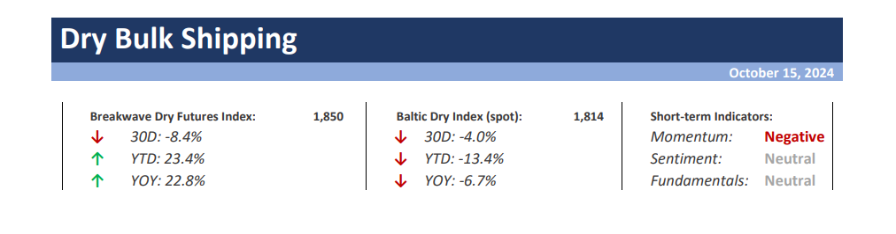
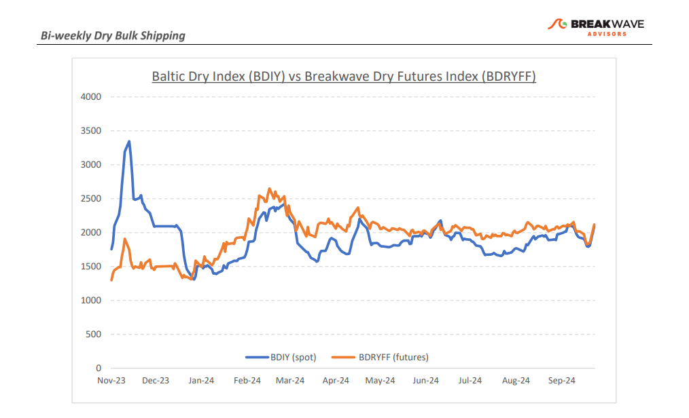
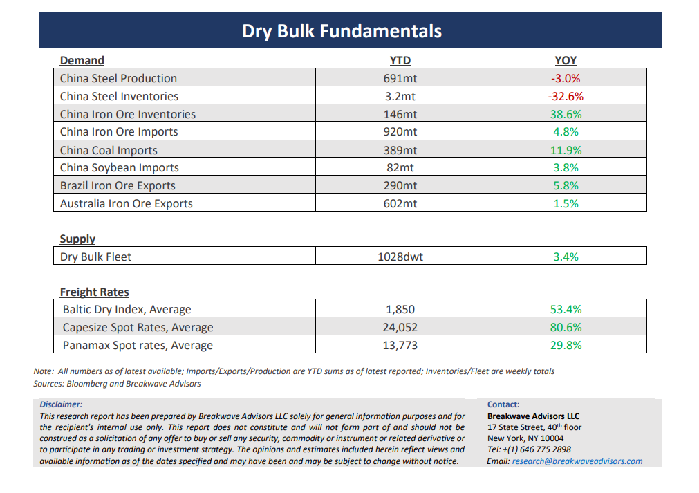

# Breakwave Bi-Weekly Dry Bulk Report - October 15, 2024

**Date:** October 15, 2024  
**Publisher:** Breakwave Advisors | **Category:** Market Insights  
**Original URL:** [https://www.breakwaveadvisors.com/insights/20241015dry-87w325](https://www.breakwaveadvisors.com/insights/20241015dry-87w325)  

---

> **Figure 1: Cea3cf84ceb9ceb3cebcceb9cf8ccf84cf85**  
> [Local Asset](file:///C:/Users/Dell/Github/Shipping/corpus/03-breakwave/insights/2024/assets/2024-10-15_20241015dry-87w325_img_cea3cf84ceb9ceb3cebcceb9cf8ccf84cf85_0e5eab9272ea.png)

**· Sentiment Turns Sour as Capesize Futures Drop**– Following a long period of stability,**volatility**in the dry bulk market**jumped**last week as freight futures dropped to**eight-month lows**, a rather unexpected development succeeding a long period of rangebound pricing. A gradual decline in spot pricing and**a lack of immediate catalysts**to propel spot rates higher led to some**significant liquidation**in the freight futures market, which in turn led to a decline in confidence for the development of spot rates for the rest of the year. Although current spot rates remain**profitable**and relatively high versus historical averages, there is an**air of disappointment**among market participants for the lack of a major push in spot rates during what is considered a seasonally strong period for dry bulk. In a market as volatile as Capesize freight that rarely stands still, the rangebound environment of the past several months has been unusual, and although the recent downside move in prices seemed surprising, a**slowdown in activity**might be in the works given the record-high volumes of bulk commodities that have been shipped in the last 12 months. From here, any**further deterioration**in spot rates will come as a**major surprise**for the market and would lead to a lot of participants reassessing their optimistic outlook for the medium term, especially with the first quarter futures sitting at the second highest level (2021 being the exception) in history. We believe a**balanced outlook**is in the cards for the near term, however the first quarter**optimism**needs to be**tempered**a bit, as the risks remain high given the cyclicality of cargo flows and the record high pace we have experienced in the past year.

**· Iron Ore Bulls Return with a Vengeance Following China Stimulus Announcements –**A streak of optimistic announcements from China has led to considerable volatility in the commodities markets, and the ever-speculative nature of iron ore futures has been in the forefront of the recent China-focused mania. Commodities are primarily driven by fund flows and although**fundamentals matter**over the long term, for now, it is the daily news that are shaping prices in the iron ore market. The potential for a**psychological boost**for the Chinese consumer and the resulting possible stabilization of the housing market has pushed prices of the steelmaking material back above the $100/ton level, with considerable volatility in the process. Fundamentally,**we believe little has changed,**as any support in housing prices will be accompanied by**restrictive policies**around new projects and diversion of funds from infrastructure to social spending, both**negative developments**for steel demand. However, one must respect price, and with the resurrection of volatility,**fundamentals will matter little**, as price can take a life of its own in an environment of constant stimulus talk and various announcements that might or might not relate to the steel market.

**· Our Long-term View –**The last few years have been characterized by increased geopolitical uncertainty. Going forward, we expect such events to continue to affect global trade and have a meaningful impact on effective vessel supply. Combined with the potential for a multi-year cyclical rebound in China’s economic activity following the recent economic turmoil, dry bulk shipping should experience higher volatility on top of a secular tightness driven by stable bulk commodity demand and a slower fleet growth owing to a relatively low orderbook.

> **Figure 2: Cea3cf84ceb9ceb3cebcceb9cf8ccf84cf85**  
> [Local Asset](file:///C:/Users/Dell/Github/Shipping/corpus/03-breakwave/insights/2024/assets/2024-10-15_20241015dry-87w325_img_cea3cf84ceb9ceb3cebcceb9cf8ccf84cf85_4e23177e6e41.png)

> **Figure 3: Cea3cf84ceb9ceb3cebcceb9cf8ccf84cf85**  
> [Local Asset](file:///C:/Users/Dell/Github/Shipping/corpus/03-breakwave/insights/2024/assets/2024-10-15_20241015dry-87w325_img_cea3cf84ceb9ceb3cebcceb9cf8ccf84cf85_46625670aeb9.png)

### Subscribe:
