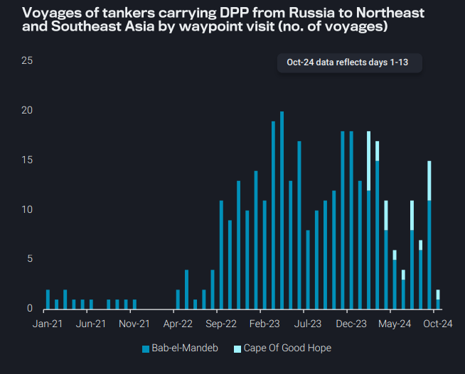
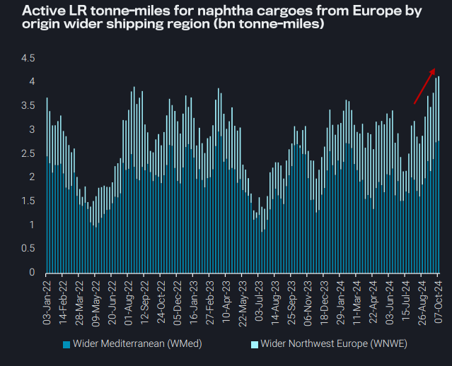
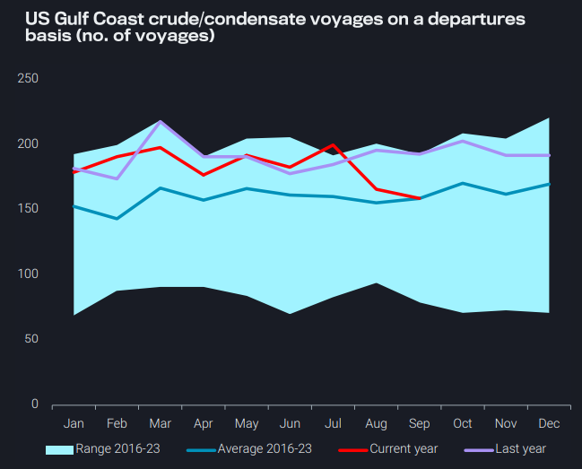
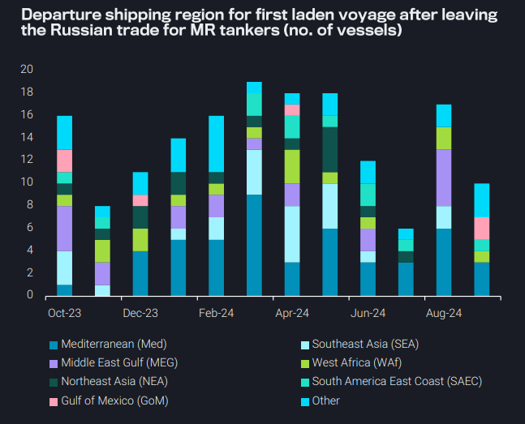

# As middle distillate growth wanes, LRs find support in naphtha trade

**Date:** October 17, 2024  
**Publisher:** Breakwave Advisors | **Category:** Market Insights  
**Original URL:** [https://www.breakwaveadvisors.com/insights/2024/10/17/as-middle-distillate-growth-wanes-lrs-find-support-in-naphtha-trade](https://www.breakwaveadvisors.com/insights/2024/10/17/as-middle-distillate-growth-wanes-lrs-find-support-in-naphtha-trade)  

---

### Key Takeaways From This Report:

- **Dirty – East of Suez:**Russian DPP tonne-miles rise on increasing Cape of Good Hope transits
- **Clean – East of Suez:**Naphtha trade to Asia (especially from Europe) currently the only bright spot for LR demand
- **Dirty – West of Suez:**Lower demand from EoS markets takes its toll on US Gulf Coast crude/condensate departures
- **Clean – West of Suez:**Lower Russian diesel employment adds vessel supply pressure to the Atlantic MR market

*By*[*Mary Melton*](https://www.linkedin.com/search/results/all/?fetchDeterministicClustersOnly=true&heroEntityKey=urn%3Ali%3Afsd_profile%3AACoAABXVyecBtg-pRnIrZe0BoWk0ygPiUfbvhsw&keywords=mary%20melton&origin=RICH_QUERY_SUGGESTION&position=0&searchId=40e8d7d2-c4d0-4022-81e7-176f6eba418b&sid=H_Y&spellCorrectionEnabled=false)

## Dirty – East of Suez: Russian Dpp Tonne-Miles Rise on Increasing Cape of Good Hope Transits

Tonne-miles for tankers carrying DPP out of Russia, reached a 6 – month high in September, supporting both Aframax and Suezmax demand

Whilst the number of voyages has increased m-o-m in September, the main reason for this rise is average voyage distance, especially for Suezmax tankers

➔ An increasing number of voyages transited via the Cape of Good Hope in September in fear of Houthi attacks

➔ This is mostly occurring for voyages towards Southeast and Northeast Asia, as voyages towards the Red Sea or the Middle East Gulf prefer to use the Bab el-Mandeb/Suez canal as waypoints

➔ The same trend is not observed on the Urals trade with COGH runs remaining practically non-existent

On the return leg, DPP tankers prefer the shorter route via Bab-el Mandeb/Suez Canal, reducing turnaround times

➔ However, there was a single vessel in September which diverted before crossing the BEM strait and navigated via COGH

> **Figure 1: Στιγμιότυπο Οθόνης 2024 10 17 100544**  
> **Interactive Data & Source:** [Vortexa](https://www.vortexa.com//oil-gas-data-traders-analysts-data-scientists?gclid=Cj0KCQjw8_qRBhCXARIsAE2AtRZKOvMnbilZ_6_91d7huSFFy71pWLrnPwGwOHVzXsmsG-1a1mZnQw8aAt89EALw_wcB&hsa_acc=1782073842&hsa_ad=548425387665&hsa_cam=14746637662&hsa_grp=125038601902&hsa_kw=&hsa_mt=&hsa_net=adwords&hsa_src=g&hsa_tgt=dsa-1431852288425&hsa_ver=3&utm_campaign=%5BCD%5D%20-%20DSA%20-%20EMEA&utm_medium=cpc&utm_medium=ppc&utm_source=google&utm_source=adwords&utm_term=) | [Local Asset](file:///C:/Users/Dell/Github/Shipping/corpus/03-breakwave/insights/2024/assets/2024-10-17_as-middle-distillate-growth-wanes-lrs-find-support-in-naphtha-trade_img_cea3cf84ceb9ceb3cebcceb9cf8ccf84cf85_46fd6d55a51d.png)

## Clean – East of Suez: Naphtha Trade to Asia (Especially From Europe) Currently the Only Bright Spot for Lr Demand

Global tonne-miles for LRs carrying naphtha climbed higher since August due to an increase in tonne-mile demand from Europe, likely helped by an open arbitrage (Argus)

➔ Additionally, LR tonne-miles for naphtha cargoes from the Middle East are robust

The LPG vs naphtha spread is at parity (Argus), which will likely lead Asian ethylene cracker operators to prefer naphtha to LPG, given the former’s higher ethylene yield

➔ This should keep demand from the East supported, and continue to offer employment for LRs

Currently, high LR supply in the Med and MEG and a lack of demand for employment carrying cargoes other than naphtha are keeping LR freight rates at ytd lows (TC1, TC5, TC15) despite healthy demand

➔ Global LR tonne-miles for all other CPP excluding naphtha currently have not recovered to Q2 levels

> **Figure 2: Στιγμιότυπο Οθόνης 2024 10 17 101255**  
> **Interactive Data & Source:** [Vortexa](https://www.vortexa.com//oil-gas-data-traders-analysts-data-scientists?gclid=Cj0KCQjw8_qRBhCXARIsAE2AtRZKOvMnbilZ_6_91d7huSFFy71pWLrnPwGwOHVzXsmsG-1a1mZnQw8aAt89EALw_wcB&hsa_acc=1782073842&hsa_ad=548425387665&hsa_cam=14746637662&hsa_grp=125038601902&hsa_kw=&hsa_mt=&hsa_net=adwords&hsa_src=g&hsa_tgt=dsa-1431852288425&hsa_ver=3&utm_campaign=%5BCD%5D%20-%20DSA%20-%20EMEA&utm_medium=cpc&utm_medium=ppc&utm_source=google&utm_source=adwords&utm_term=) | [Local Asset](file:///C:/Users/Dell/Github/Shipping/corpus/03-breakwave/insights/2024/assets/2024-10-17_as-middle-distillate-growth-wanes-lrs-find-support-in-naphtha-trade_img_cea3cf84ceb9ceb3cebcceb9cf8ccf84cf85_553924e0b69c.png)

## Dirty – West of Suez: Lower Demand From Eos Markets Takes Its Toll on Us Gulf Coast Crude/condensate Departures

US Gulf Coast crude/condensate voyages have declined for the second month in row falling to under 160 voyages in September

This is well below last year’s levels and comes after setting seasonal highs in July, which was also a month of strong exports at 4.1mbd

Lower demand due to poor refining margins was a key factor

➔ In East of Suez markets, Asian refiners grappling with poor margins showed a lack of interest in buying long haul cargoes from the US, with VLCC enquiries remaining currently muted

➔ Chinese refiners relied on cheaper ESPO barrels from Russia

➔ In Europe, the autumnal maintenance season added further pressure on departures from the US Gulf

Additionally, the return of Libyan barrels might create further dents on US Gulf Coast departures to Europe alongside elevated Aframax freight rates

Nevertheless, refinery maintenance season in the US Gulf Coast should help increase departures, as some barrels will be placed for export instead

> **Figure 3: Στιγμιότυπο Οθόνης 2024 10 17 101307**  
> **Interactive Data & Source:** [Vortexa](https://www.vortexa.com//oil-gas-data-traders-analysts-data-scientists?gclid=Cj0KCQjw8_qRBhCXARIsAE2AtRZKOvMnbilZ_6_91d7huSFFy71pWLrnPwGwOHVzXsmsG-1a1mZnQw8aAt89EALw_wcB&hsa_acc=1782073842&hsa_ad=548425387665&hsa_cam=14746637662&hsa_grp=125038601902&hsa_kw=&hsa_mt=&hsa_net=adwords&hsa_src=g&hsa_tgt=dsa-1431852288425&hsa_ver=3&utm_campaign=%5BCD%5D%20-%20DSA%20-%20EMEA&utm_medium=cpc&utm_medium=ppc&utm_source=google&utm_source=adwords&utm_term=) | [Local Asset](file:///C:/Users/Dell/Github/Shipping/corpus/03-breakwave/insights/2024/assets/2024-10-17_as-middle-distillate-growth-wanes-lrs-find-support-in-naphtha-trade_img_cea3cf84ceb9ceb3cebcceb9cf8ccf84cf85_845de13b4a7c.png)

## Clean – West of Suez: Lower Russian Diesel Employment Adds Vessel Supply Pressure to the Atlantic MR Market

Russia’s refinery maintenance combined with seasonal domestic diesel demand reduced Russian diesel exports, especially in August, where export volumes reached almost a 3-year low

This summer’s lack of demand for employment in the seaborne diesel export market has pushed MRs into other markets, most commonly in the Atlantic Basin

➔ The Med remains the most common market for MRs to load in after leaving Russian trade, especially as discharging diesel in Turkey then loading in the Med avoids a lengthy ballast leg

September saw more MRs load in the Gulf of Mexico and Brazil after discharging Russian diesel in Brazil

➔ This emphasises the low demand environment in the Russian market: operators chose to stay in the Americas instead of ballasting back to Russia, as has been common in the past

Russian diesel exports have now increased from August lows, but ongoing outages at key refineries may limit the extent of export demand recovery and likely keep extra MR tonnage pressure on the European market, where rates are already under pressure

> **Figure 4: Στιγμιότυπο Οθόνης 2024 10 17 101319**  
> **Interactive Data & Source:** [Vortexa](https://www.vortexa.com//oil-gas-data-traders-analysts-data-scientists?gclid=Cj0KCQjw8_qRBhCXARIsAE2AtRZKOvMnbilZ_6_91d7huSFFy71pWLrnPwGwOHVzXsmsG-1a1mZnQw8aAt89EALw_wcB&hsa_acc=1782073842&hsa_ad=548425387665&hsa_cam=14746637662&hsa_grp=125038601902&hsa_kw=&hsa_mt=&hsa_net=adwords&hsa_src=g&hsa_tgt=dsa-1431852288425&hsa_ver=3&utm_campaign=%5BCD%5D%20-%20DSA%20-%20EMEA&utm_medium=cpc&utm_medium=ppc&utm_source=google&utm_source=adwords&utm_term=) | [Local Asset](file:///C:/Users/Dell/Github/Shipping/corpus/03-breakwave/insights/2024/assets/2024-10-17_as-middle-distillate-growth-wanes-lrs-find-support-in-naphtha-trade_img_cea3cf84ceb9ceb3cebcceb9cf8ccf84cf85_be0daf1ade09.png)

Data Source:[Vortexa](https://www.vortexa.com//oil-gas-data-traders-analysts-data-scientists?gclid=Cj0KCQjw8_qRBhCXARIsAE2AtRZKOvMnbilZ_6_91d7huSFFy71pWLrnPwGwOHVzXsmsG-1a1mZnQw8aAt89EALw_wcB&hsa_acc=1782073842&hsa_ad=548425387665&hsa_cam=14746637662&hsa_grp=125038601902&hsa_kw=&hsa_mt=&hsa_net=adwords&hsa_src=g&hsa_tgt=dsa-1431852288425&hsa_ver=3&utm_campaign=%5BCD%5D%20-%20DSA%20-%20EMEA&utm_medium=cpc&utm_medium=ppc&utm_source=google&utm_source=adwords&utm_term=)

---

**Tags:** Tankers, Shipping, Markets  
