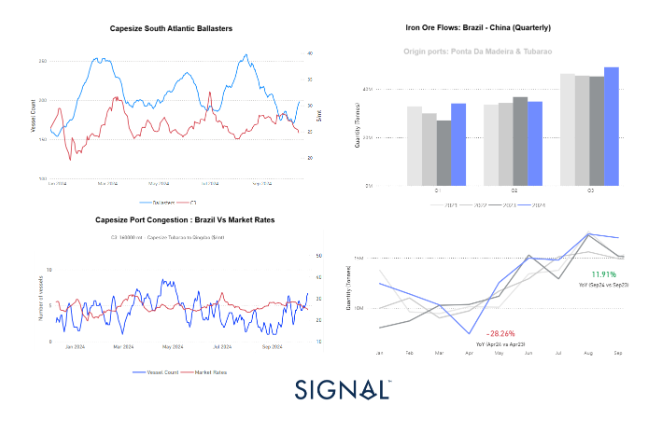
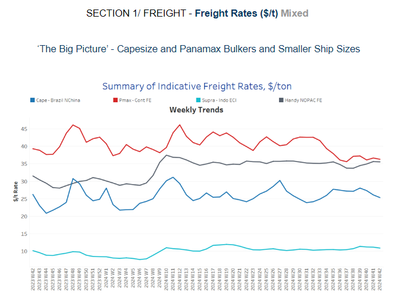
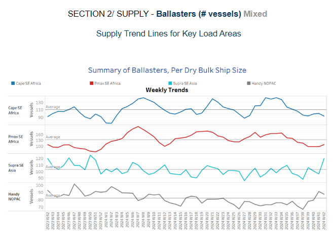
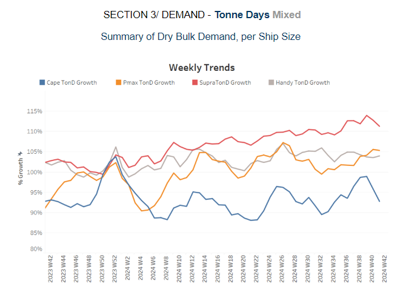
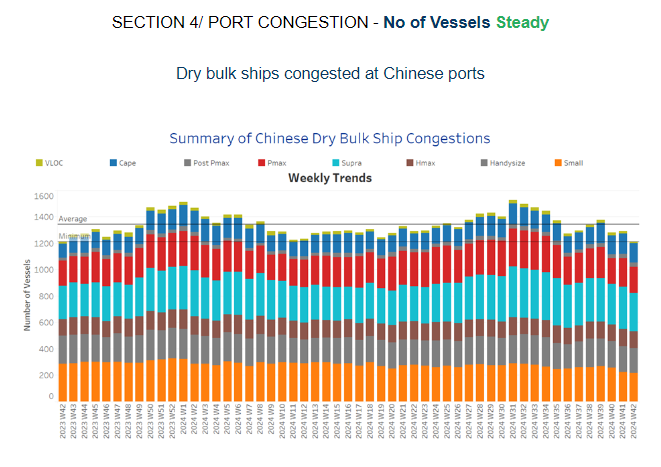

# Iron Ore Flows

**Date:** October 17, 2024  
**Publisher:** Breakwave Advisors | **Category:** Market Insights  
**Original URL:** [https://www.breakwaveadvisors.com/insights/2024/10/17/iron-ore-flows](https://www.breakwaveadvisors.com/insights/2024/10/17/iron-ore-flows)  

---

**Dry Weekly Market Monitor - Week 42.2024**
Snapshot of Spot Freight Rates, Supply-Demand Trends, Port Congestions
October 16, 2024

## Chart of the Week: Dry Bulk Iron Ore Flows, Brazil Port Congestion, Market Rates

*The Capesize market rates for the Brazil to North China route have softened, yet rising iron ore exports from Brazil, particularly after a strong third quarter, and increasing port congestion suggest potential upward pressure on rates. September saw a 12% year-on-year rise in iron ore shipments to China, signalling a recovery from earlier declines, and this trend is supported by increased output from Rio Tinto and Vale despite challenges in China’s demand. If congestion and iron ore volumes continue to rise, the Capesize market could see rate increases in the coming weeks.*

> **Figure 1: Στιγμιότυπο Οθόνης 2024 10 17 103544**  
> **Interactive Data & Source:** [Signal Ocean Platform](https://go.signalocean.com/e/983831/se-output-even-as-china-slows-/2qmrnb/442077924/h/F7k8XZt1CdG08Afa3uHcXGhXFuCy33Dt73St-N4hF90) | [Local Asset](file:///C:/Users/Dell/Github/Shipping/corpus/03-breakwave/insights/2024/assets/2024-10-17_iron-ore-flows_img_cea3cf84ceb9ceb3cebcceb9cf8ccf84cf85_10ae929ac86e.png)

This week's focus highlights the softening trend observed in Capesize market rates for the Brazil to North China route, coinciding with a steady increase in the number of ballasters throughout October. Despite the current rate decline, the iron ore flows from Brazil to China present a compelling narrative. On a quarterly basis, the third quarter of 2024 saw the highest volume of iron ore shipments to China, surpassing 40 million tons for the first time since 2021. This notable milestone underlines the strengthening iron ore export activity from Brazil. In September alone, the monthly volume of iron ore exported from Brazil to China recorded a 12% year-on-year increase compared to September 2023, marking a solid recovery from earlier in the year.

The contrast is stark when looking at April 2024, which saw a 28% annual decline in iron ore shipments compared to the same month in the previous year. This sharp rebound demonstrates the renewed vitality in iron ore exports, with Brazil playing a central role in China’s steel making supply chain. The increase in shipments also correlates with recent news from major iron ore producers,[Rio Tinto Group and Vale SA](https://go.signalocean.com/e/983831/se-output-even-as-china-slows-/2qmrnb/442077924/h/F7k8XZt1CdG08Afa3uHcXGhXFuCy33Dt73St-N4hF90), both of which ramped up production in the last quarter. This rise comes despite ongoing challenges in China's domestic demand, particularly due to the nation’s ongoing property crisis, which has tempered some market expectations.

If the current momentum in iron ore exports from Brazil persists, it could lead to higher levels of Capesize vessel congestion at Brazilian ports, particularly for those loading iron ore. This increase in port congestion, already on the rise since early October, may soon translate into upward pressure on C3 market rates. According to the latest insights from[Signal Ocean](https://go.signalocean.com/e/983831/congestion-report-dry-download/2qmrnf/442077924/h/F7k8XZt1CdG08Afa3uHcXGhXFuCy33Dt73St-N4hF90), vessel congestion at Brazilian ports has nearly doubled since the end of September. The first half of October has already recorded an uptick in iron ore shipments moving from Brazil to China, further supporting the potential for a rate rebound as market fundamentals strengthen.

This dynamic interplay between vessel availability, congestion levels, and commodity flows will be key to watch in the coming weeks as the Capesize market adjusts to these evolving factors.

> **Figure 2: Στιγμιότυπο Οθόνης 2024 10 17 103648**  
> **Interactive Data & Source:** [Signal Ocean Platform](https://www.thesignalgroup.com/signal-ocean-platform) | [Local Asset](file:///C:/Users/Dell/Github/Shipping/corpus/03-breakwave/insights/2024/assets/2024-10-17_iron-ore-flows_img_cea3cf84ceb9ceb3cebcceb9cf8ccf84cf85_b1d1c1ae02c7.png)

The dry bulk freight market showed mixed sentiment in the third week of October. A softening trend was confirmed on the Capesize Brazil–North China route, while early signs of an upward trend on the Panamax Continent–Far East route have now reversed, stabilising near last week's levels.

- **Capesize**vessel freight rates for shipments from Brazil to North China settled at $25 per ton, reflecting a 7% decline week-over-week.
- **Panamax**vessel freight rates from the Continent to the Far East remained steady at approximately $35 per ton, defying expectations of a downward trend in the first half of October. However, there was a slight monthly decline of 2%.
- **Supramax**vessel freight rates on the Indo-ECI route remain around $11 per ton, reflecting a 3% increase compared to the previous month.
- **Handysize**freight rates for the NOPAC Far East route have remained steady at $35 per ton since April, marking a 12% increase compared to the same period last year.

> **Figure 3: Στιγμιότυπο Οθόνης 2024 10 17 103745**  
> **Interactive Data & Source:** [Signal Ocean Platform](https://www.thesignalgroup.com/signal-ocean-platform) | [Local Asset](file:///C:/Users/Dell/Github/Shipping/corpus/03-breakwave/insights/2024/assets/2024-10-17_iron-ore-flows_img_cea3cf84ceb9ceb3cebcceb9cf8ccf84cf85_e60938ecd9db.png)

The third week of October appears to show a downward trend for the larger vessel size categories, while sharp increases have been recorded in the Supramax markets in Southeast Asia and the Handy sector in the North Pacific.

- **Capesize SE Africa**: The number of vessels has dropped to lower than 95, now 17 vessels below the annual average.
- **Panamax SE Africa**: Although the current number of vessels remains below the annual average of 130 since the end of week 36, there appears to be an upward trend for the coming days.
- **Supramax SE Asia**: The number of ballast ships surged to 120, marking a notable increase from the lows observed in the previous week. However, it remains uncertain whether this spike will be sustained through the end of the month.
- **Handysize NOPAC**: Following the year's peak of 97 ballasters recorded last week, the number now appears to be on a downward trend. However, it still remains 5 above the annual average.

> **Figure 4: Στιγμιότυπο Οθόνης 2024 10 17 103841**  
> **Interactive Data & Source:** [Signal Ocean Platform](https://www.thesignalgroup.com/signal-ocean-platform) | [Local Asset](file:///C:/Users/Dell/Github/Shipping/corpus/03-breakwave/insights/2024/assets/2024-10-17_iron-ore-flows_img_cea3cf84ceb9ceb3cebcceb9cf8ccf84cf85_cafee1780fe4.png)

In the third week of October, dry tonne-days for the Capesize and Supramax segments continued to decline sharply, maintaining a downward trend. Meanwhile, the upward revisions seen in the Panamax segment during the previous weeks appeared to be solidifying into a confirmed trend for October.

- **Capesize**: The current trend confirms a downward revision for October, which is now showing a significantly weaker performance compared to the peak observed in week 38.
- **Panamax**: Weekly percentage growth has continued to rise but remains below the highs reached in week 26. However, recent levels show a stronger recovery compared to the low point in week 30.
- **Supramax**: The growth rate has continued on a downward trend, signalling weaker overall growth for October.
- **Handysize**: The Handysize vessel segment maintained a steady growth pace throughout the first half of October. However, it remains to be seen if this momentum will translate into a stronger weekly percentage increase in the coming days.

> **Figure 5: Στιγμιότυπο Οθόνης 2024 10 17 103933**  
> **Interactive Data & Source:** [Signal Ocean Platform](https://www.thesignalgroup.com/signal-ocean-platform) | [Local Asset](file:///C:/Users/Dell/Github/Shipping/corpus/03-breakwave/insights/2024/assets/2024-10-17_iron-ore-flows_img_cea3cf84ceb9ceb3cebcceb9cf8ccf84cf85_3f60352f12b2.png)

Congestion at Chinese dry bulk ports showed a decline in the third week of October, with a downward trend observed across all vessel size segments.

- **Capesize**: Capesize vessel congestion hovered below 150 ships, down by 12 vessels compared to the previous week.
- **Panamax**: The number of Panamax vessels has yet to surpass the 200 mark, reflecting an increase of 14 compared to the previous week.
- **Supramax**: Congestion levels dropped below 300 vessels, a decrease of 40 compared to the levels recorded in week 39.
- **Handysize**: Congestion levels hovered below 190 vessels, nearly 10 fewer than two weeks ago, while four weeks prior, they exceeded the 200 mark.

Data Source:[Signal Ocean Platform](https://www.thesignalgroup.com/signal-ocean-platform)

---

**Tags:** Drybulk, Capesize, Shipping  
