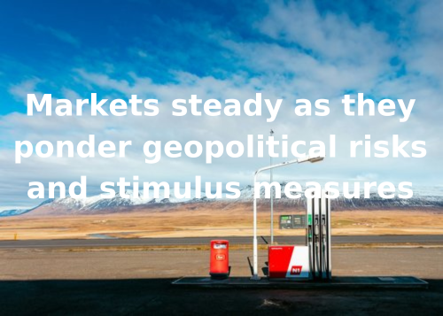
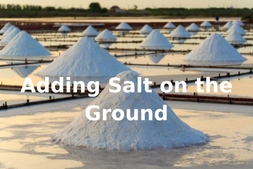

# Breakwave Weekend Read

**Date:** October 18, 2024  
**Publisher:** Breakwave Advisors | **Category:** Market Insights  
**Original URL:** [https://www.breakwaveadvisors.com/insights/2024/9/20/breakwave-weekend-read-4cn8n-a7kaz](https://www.breakwaveadvisors.com/insights/2024/9/20/breakwave-weekend-read-4cn8n-a7kaz)  

---

## Welcome Tobreakwave Advisorsweekend Read

As we conclude the workweek and head into the weekend, take a moment to review the key articles from this week, including those you've highlighted.[Is a world gone mad still investible? Absolutely.](https://www.breakwaveadvisors.com/insights/2024/10/15/is-a-world-gone-mad-still-investible-absolutely),[The weakening of corn exports from Brazil](https://www.breakwaveadvisors.com/insights/2024/10/16/xd0hszrlqqd9t2h47ahawopwfmn204),[Adding Salt on the Ground](https://www.breakwaveadvisors.com/insights/2024/10/16/adding-salt-on-the-ground),[Iron Ore Flows](https://www.breakwaveadvisors.com/insights/2024/10/17/iron-ore-flows)
and more.

## Breakwave Dry Bulk Report

**Sentiment Turns Sour as Capesize Futures Drop**– Following a long period of stability,**volatility**in the dry bulk market**jumped**last week as freight futures dropped to**eight-month lows**, a rather unexpected development succeeding a long period of rangebound pricing.

[Read More](https://www.breakwaveadvisors.com/insights/20241015dry-87w325)

> **Figure 1: Στιγμιότυπο Οθόνης 2024 10 15 121630**  
> **Interactive Data & Source:** [Breakwave Advisors Market Insights](https://www.breakwaveadvisors.com/insights/2024/10/14/o67sbsngroi41qutut6agkmbks43ys) | [Local Asset](file:///C:/Users/Dell/Github/Shipping/corpus/03-breakwave/insights/2024/assets/2024-10-18_breakwave-weekend-read-4cn8n-a7kaz_img_cea3cf84ceb9ceb3cebcceb9cf8ccf84cf85_0e5eab9272ea.png)

## "Golden Week," Experienced a Notable Resurgence in Tourism Activity

> **Figure 2: Ανώνυμο Σχέδιο**  
> **Interactive Data & Source:** [Breakwave Advisors Market Insights](https://www.breakwaveadvisors.com/insights/2024/10/14/o67sbsngroi41qutut6agkmbks43ys) | [Local Asset](file:///C:/Users/Dell/Github/Shipping/corpus/03-breakwave/insights/2024/assets/2024-10-18_breakwave-weekend-read-4cn8n-a7kaz_img_ce91cebdcf8ecebdcf85cebccebfcf83cf87_42b334291463.png)

China's National Day holiday, commonly known as "Golden Week," experienced a notable resurgence in tourism activity..

[Read More](https://www.breakwaveadvisors.com/insights/2024/10/14/o67sbsngroi41qutut6agkmbks43ys)

Doric Weekly Market Insight

## Markets Steady As They Ponder Geopolitical Risks and Stimulus Measures

> **Figure 3: Markets Steady As They Ponder Geopolitical Risks and Stimulus Measures**  
> **Interactive Data & Source:** [Breakwave Advisors Market Insights](https://www.breakwaveadvisors.com/insights/2024/10/14/markets-steady-as-they-ponder-geopolitical-risks-and-stimulus-measures) | [Local Asset](file:///C:/Users/Dell/Github/Shipping/corpus/03-breakwave/insights/2024/assets/2024-10-18_breakwave-weekend-read-4cn8n-a7kaz_img_marketssteadyastheypondergeopolitica_d0bb5b753f3d.png)

Rising tensions in the Middle East continue to hang over energy markets. Metals gained amid hopes of further stimulus measures in China.

[Read More](https://www.breakwaveadvisors.com/insights/2024/10/14/markets-steady-as-they-ponder-geopolitical-risks-and-stimulus-measures)

Commodities Wrap

## Is a World Gone Mad Still Investible? Absolutely.

> **Figure 4: Προσθέστε Επικεφαλίδα**  
> **Interactive Data & Source:** [Breakwave Advisors Market Insights](https://www.breakwaveadvisors.com/insights/2024/10/15/is-a-world-gone-mad-still-investible-absolutely) | [Local Asset](file:///C:/Users/Dell/Github/Shipping/corpus/03-breakwave/insights/2024/assets/2024-10-18_breakwave-weekend-read-4cn8n-a7kaz_img_cea0cf81cebfcf83ceb8ceadcf83cf84ceb5_e814483544b9.png)

TIt’s hard to invest sometimes. Even to get out of bed for that matter.

[Read More](https://www.breakwaveadvisors.com/insights/2024/10/15/is-a-world-gone-mad-still-investible-absolutely)

Forvis Mazars Weekly Note

## The Weakening of Corn Exports From Brazil

> **Figure 5: Ανώνυμο Σχέδιο (1)**  
> **Interactive Data & Source:** [Breakwave Advisors Market Insights](https://www.breakwaveadvisors.com/insights/2024/10/16/xd0hszrlqqd9t2h47ahawopwfmn204) | [Local Asset](file:///C:/Users/Dell/Github/Shipping/corpus/03-breakwave/insights/2024/assets/2024-10-18_breakwave-weekend-read-4cn8n-a7kaz_img_ce91cebdcf8ecebdcf85cebccebfcf83cf87_6d9d9efb6d64.png)

In examining global bulk shipments, what stands out is the weakening of corn exports from Brazil..

[Read More](https://www.breakwaveadvisors.com/insights/2024/10/16/xd0hszrlqqd9t2h47ahawopwfmn204)

Intermodal Weekly Market Report

## Ιron Ore Faced Headwinds

> **Figure 6: Ανώνυμο Σχέδιο (3)**  
> **Interactive Data & Source:** [Breakwave Advisors Market Insights](https://www.breakwaveadvisors.com/insights/2024/10/16/1yxg1obpduxpc4uvy3mjegj7qjk35l) | [Local Asset](file:///C:/Users/Dell/Github/Shipping/corpus/03-breakwave/insights/2024/assets/2024-10-18_breakwave-weekend-read-4cn8n-a7kaz_img_ce91cebdcf8ecebdcf85cebccebfcf83cf87_8a7504eb2dad.png)

The Baltic Dry index retreated on Tuesday, following two sessions of gains.

[Read More](https://www.breakwaveadvisors.com/insights/2024/10/16/1yxg1obpduxpc4uvy3mjegj7qjk35l)

The Fix - Global Market Update

## Adding Salt on the Ground

> **Figure 7: Ανώνυμο Σχέδιο (2)**  
> **Interactive Data & Source:** [Breakwave Advisors Market Insights](https://www.breakwaveadvisors.com/insights/2024/10/16/adding-salt-on-the-ground) | [Local Asset](file:///C:/Users/Dell/Github/Shipping/corpus/03-breakwave/insights/2024/assets/2024-10-18_breakwave-weekend-read-4cn8n-a7kaz_img_ce91cebdcf8ecebdcf85cebccebfcf83cf87_3a8905479912.png)

Several bright spots are appearing on the horizon as global economies advance with their new climate goals and transitions.

BRS Weekly Dry Bulk Newsletter

## As Middle Distillate Growth Wanes, Lrs Find Support in Naphtha Trade

> **Figure 8: Ανώνυμο Σχέδιο (4)**  
> **Interactive Data & Source:** [Breakwave Advisors Market Insights](https://www.breakwaveadvisors.com/insights/2024/10/17/as-middle-distillate-growth-wanes-lrs-find-support-in-naphtha-trade) | [Local Asset](file:///C:/Users/Dell/Github/Shipping/corpus/03-breakwave/insights/2024/assets/2024-10-18_breakwave-weekend-read-4cn8n-a7kaz_img_ce91cebdcf8ecebdcf85cebccebfcf83cf87_2aaaa69bc319.png)

Dirty – East of Suez: Russian DPP tonne-miles rise on increasing Cape of Good Hope transits

Vortexa - Global Freight Snapshot

## Iron Ore Flows

> **Figure 9: Προσθέστε Επικεφαλίδα (1)**  
> **Interactive Data & Source:** [Breakwave Advisors Market Insights](https://www.breakwaveadvisors.com/insights/2024/10/17/iron-ore-flows) | [Local Asset](file:///C:/Users/Dell/Github/Shipping/corpus/03-breakwave/insights/2024/assets/2024-10-18_breakwave-weekend-read-4cn8n-a7kaz_img_cea0cf81cebfcf83ceb8ceadcf83cf84ceb5_5efe442cae8f.png)

The Capesize market rates for the Brazil to North China route have softened, yet rising iron ore exports from Brazil..

Signal Ocean - Dry Weekly Market Monitor

## Crude Oil Flows AG - China

> **Figure 10: Ανώνυμο Σχέδιο (5)**  
> **Interactive Data & Source:** [Breakwave Advisors Market Insights](https://www.breakwaveadvisors.com/insights/2024/10/18/crude-oil-flows-ag-china) | [Local Asset](file:///C:/Users/Dell/Github/Shipping/corpus/03-breakwave/insights/2024/assets/2024-10-18_breakwave-weekend-read-4cn8n-a7kaz_img_ce91cebdcf8ecebdcf85cebccebfcf83cf87_f5deb9cf09ae.png)

This week’s focus underscores a rise in the number of crude oil barrels transported from the Arabian Gulf countries to the Far East..

Signal Ocean - Tanker Weekly Market Monitor

## Metals Fall As Beijing Efforts to Boost Economic Growth Disappoint

> **Figure 11: Προσθέστε Επικεφαλίδα (2)**  
> **Interactive Data & Source:** [Breakwave Advisors Market Insights](https://www.breakwaveadvisors.com/insights/2024/10/18/metals-fall-as-beijing-efforts-to-boost-economic-growth-disappoint) | [Local Asset](file:///C:/Users/Dell/Github/Shipping/corpus/03-breakwave/insights/2024/assets/2024-10-18_breakwave-weekend-read-4cn8n-a7kaz_img_cea0cf81cebfcf83ceb8ceadcf83cf84ceb5_5c4895425451.png)

Disappointment over China’s stimulus measures weighed on sentiment in metal markets. Strong haven demand continues to support precious metals.

Commodities Wrap

---

**Tags:** Shipping, Tankers, Drybulk  
